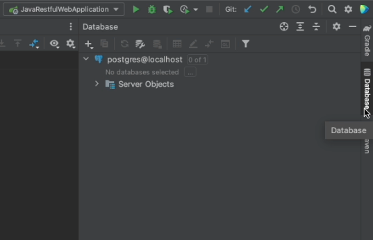

Use **⇧⇧** (macOS), or **Shift+Shift** (Windows/Linux), to bring up the Search Everywhere dialog. You can now search for _Database_ to open the **Database** tool window which helps you to connect to multiple databases and DDL data sources.

You click on the _+_ (_New_) button. Select _Data Source_ then _Postgres_ as the data source type. Customize the name of the data source, connection details, then click on the _Test_ link to ensure everything is ok.

Once everything is done, a _Console_ tab will appear and you can now query the database from the IDE. You can also explore it from the _Database_ tool window, and select which parts to hide or show from it.

**Note:** You may need to download a database driver for the IDE first. If you see a _Download driver_ link, you'll need to click on that before you can connect to the database.

Alternately, you can open **Database** tool window from the Sidebar of the IDE:

