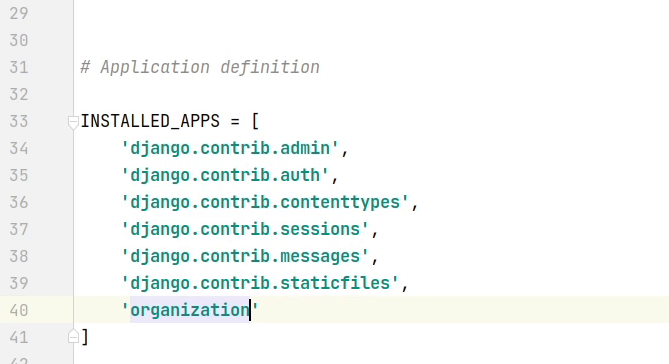
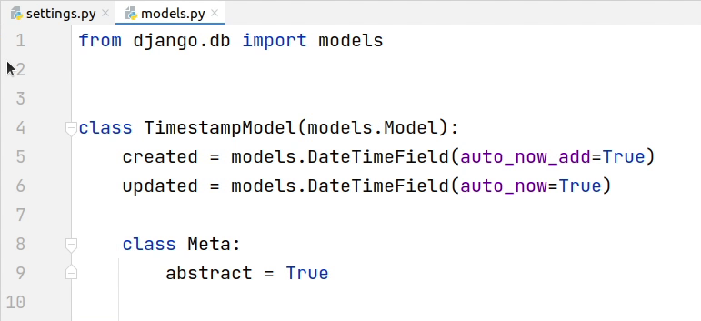
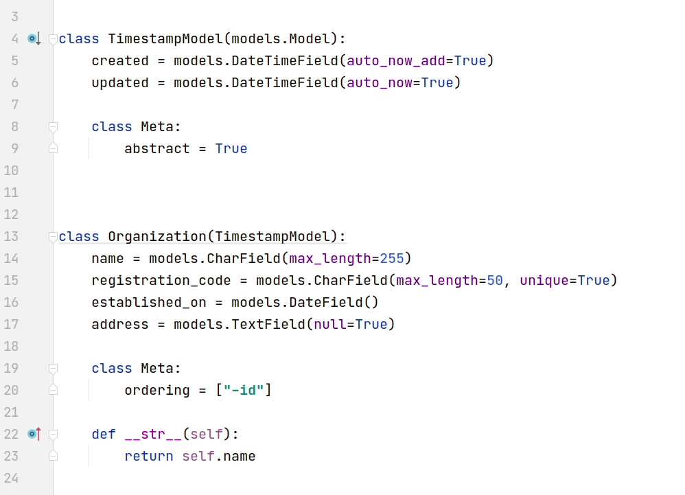
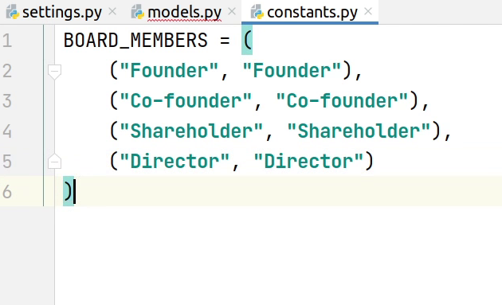
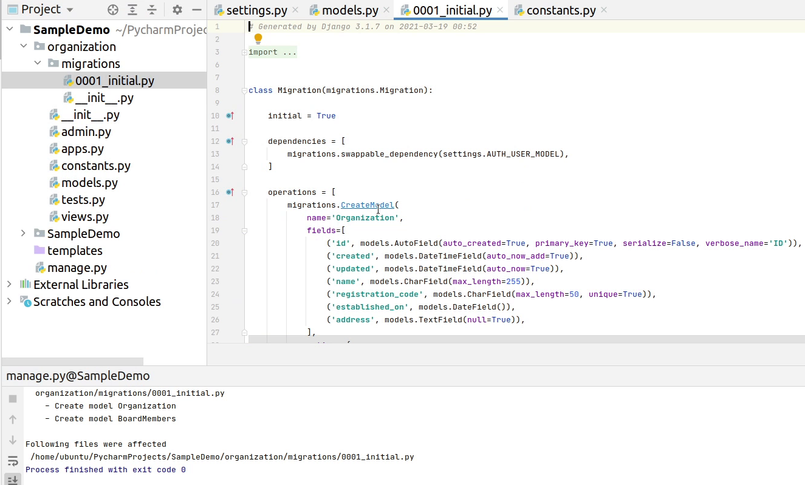
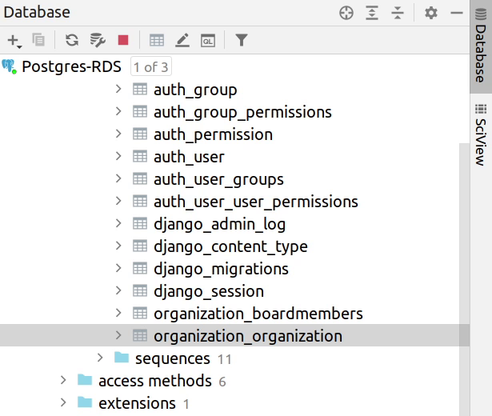

Hello everyone, welcome to the Django tutorial series. In this tutorial step, we are going to create a new app called _organization_ and explore the project structure.

## Project Directory

Let me first explain about the project files, which consist of:

The outer \_SampleDemo/ root directory is a container for your project.

`manage.py`: A command-line utility that lets you interact with this Django project in various ways. You can read all the details about manage.py in django-admin and manage.py.

The inner _SampleDemo/_ directory is the actual Python package for your project. Its name is the Python package name you’ll need to use to import anything inside it (e.g. SampleDemo.urls).

`SampleDemo/init.py`: An empty file that tells Python that this directory should be considered a Python package. If you’re a Python beginner, read more about packages in the official Python docs.

`SampleDemo/settings.py`: Settings/configuration for this Django project.

`SampleDemo/urls.py`: The URL declarations for this Django project; a “table of contents” of your Django-powered site. You can read more about URLs in URL dispatcher.

`SampleDemo/asgi.py`: An entry-point for ASGI-compatible web servers to serve your project.

`SampleDemo/wsgi.py`: An entry-point for WSGI-compatible web servers to serve your project.

Let’s begin by creating our first app. I will click on **Tools** and then **Run manage.py Task**.

I will type _startapp_ followed by app name.

You can see that there is a new directory called _organization_ which is appearing in the project.

We need to register this module in the _INSTALLED_APPS_ which you will find in the`settings.py` file. Django uses installed apps to look for models, management commands, tests, and other utilities.

Let me explain first about the app structure.

The _migrations_ folder is where Django stores migrations, or changes to your database.

`init.py` tells python that your organization app is a package.

`admin.py` is where you register your app’s models with the Django admin application.

`apps.py` is a configuration file common to all Django apps.

`models.py` is the module containing the models for your app basically ORM modelling.

`tests.py` contains test procedures which run when testing your app.

`views.py` is the module containing the views for your app or where we write our business logic.

I hope you got a basic understanding about the project and the app layout. If not, I would recommend reading the official Django [documentation](https://docs.djangoproject.com/en/3.2/) where you will have tons of resources with examples.

Let’s begin by creating our new models. I will open `models.py` where I will be defining my new models.

As you can see, I have created a _TimestampModel_ which is a common requirement in all the models to have created and updated fields. This is an [abstract model](https://docs.djangoproject.com/en/3.1/topics/db/models/#abstract-base-classes).
Abstract models are base classes in which you define fields which you want to include in all child models. Django doesn't create any database tables for abstract models.

Now, I am going to create our _Organization_ model which will inherit the timestamp model. I will define basic fields along with their types like CharField, TextField etc.

[class Meta](https://docs.djangoproject.com/en/3.1/topics/db/models/#meta-options): This is just a class container with some options (metadata) attached to the model. It defines such things as available permissions, associated database table name, whether the model is abstract or not, singular and plural versions of the name, etc.

We have defined _ordering_ in the class Meta, basically calling objects _order_by_ id descending.

The `str` method in Python represents the class objects as a string.

Next, I will create a new model called _BoardMember_ which keeps a list of users who are part of the organization like director, shareholder etc.

Observe at line number _28_ and _29_, the model has foreign key relationships with the user and organization model. If you have knowledge about database systems then you must have heard about foreign keys. A [foreign key](https://en.wikipedia.org/wiki/Foreign_key) is a key used to link two tables together.

Observe at line _30_ in `models.py` file where we are importing our tuple _BOARD_MEMBERS_ from `constants.py` file.

We are done with the models, let's generate the migration file. I will follow the same process as before.

I will click on Tools and then **Run manage.py Task**, and then I will type _makemigrations_ and press <kbd>⏎</kbd> (macOS) / <kbd>Enter</kbd> (Windows/Linux). This is going to create the migrations file under the _organization/migrations_ folder.

You will see a new file has been generated under the name `0001_initial.py`.

Whenever you run the _makemigrations_ command, Django is going to look in all your apps which are there: models that have been added, modified or deleted. Based on the changes, it will create a migration file under the _migrations_ directory. After that, I am going to type a _migrate_ command to reflect these changes into our database tables.

Yes, the migration has been successfully applied, the new tables will be reflected in our database.

We have completed implementing our models. In the upcoming tutorial step, I will be writing REST APIs which store, retrieve & delete information from our models.
