Hello everyone, welcome to the Django tutorial series. In this tutorial step, we are going to connect Django with our Postgres RDS instance in PyCharm.

## DataGrip

DataGrip is a database management environment for developers. It is designed to query, create and manage databases. Databases can work locally, on a server, or in the cloud. DataGrip MySQL, PostgreSQL, Microsoft SQL Server, Oracle, and more. If you have a JDBC driver, add it to DataGrip, connect to your DBMS, and start working.

All of DataGrip’s features are also available in many other IDEs from JetBrains like IntelliJ IDEA, PhpStorm, PyCharm, RubyMine, Rider and GoLand.

I will goto the **database** section. Click on the **plus (+)** button then hover to **Data Source** and **PostgreSQL**.

If you receive any message like **“Download missing driver files”** then make sure to download it.

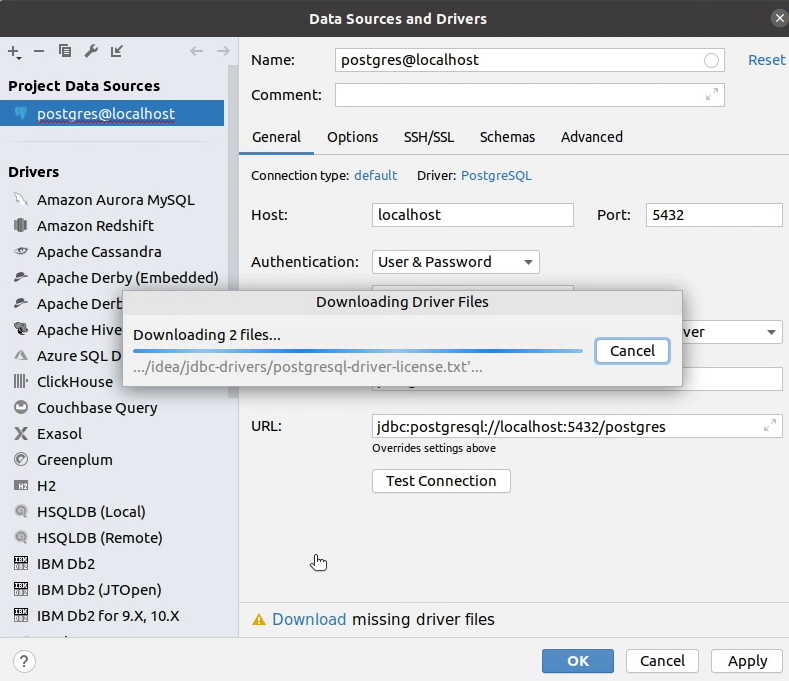

I will provide a name in the data source which will act as an identifier. Make sure to fill in all the necessary information like the host, username, password and the database name.

After filling in all the necessary information, click on **Test Connection**.

As you can see in the following image, we received a success response: the connection has been successfully established.

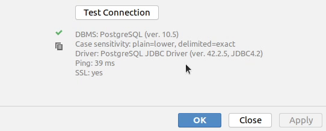

This is optional, as we are currently connecting to our Postgres RDS instance _directly_ inside an Ubuntu server because we have allowed ec2 security group to connect with the database. If we want to connect through our local development machine, then we need to perform SSH tunneling to securely connect with the database.

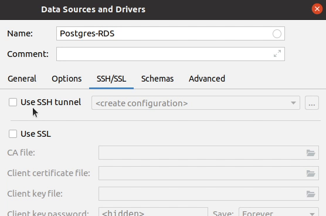

After the configuration has been setup, I will click on **Apply** and then **OK**.

As of now, there are no tables. I will connect the PostgreSQL database with our application, then perform migration.

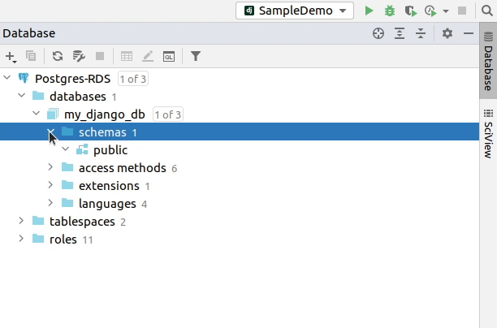

I will remove the **db.sqlite3** file, as we don’t require it now.

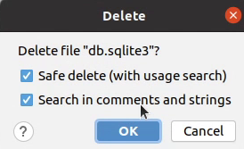

Next, I will move to the **settings.py** file where I will change the **DATABASES** settings and provide the required information.

We will be passing our information through environment variables: much better than plain text. From a security standpoint, I would recommend to
use [AWS Secrets Manager](https://aws.amazon.com/secrets-manager/) or
[SSM Parameter Store](https://docs.aws.amazon.com/systems-manager/latest/userguide/systems-manager-parameter-store.html).

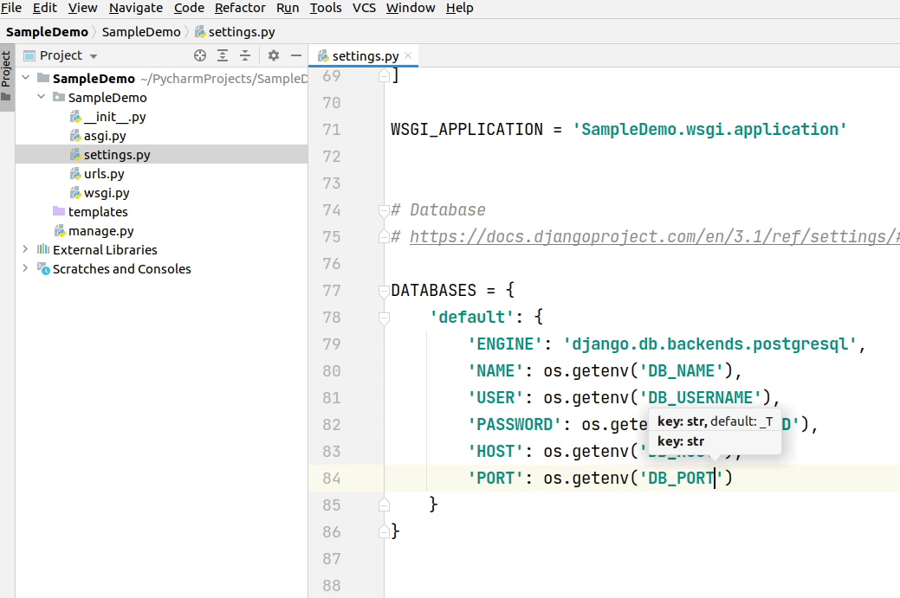

I will also pass the **DEBUG** and **SECRET_KEY** information from the environment variable. Make sure to set **DEBUG** to **False** when you are running a Django application in a production server. I have seen many people make these common mistakes, and they don’t even rotate their Django secret keys.

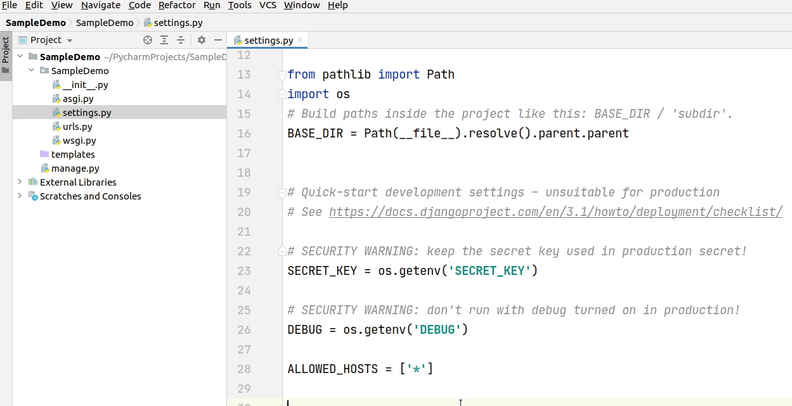

I can even pass **ALLOWED_HOSTS** in the environment variable. It's fine to use it directly. You can see I am passing an **asterisk(\*)** which means my application can be accessed from anywhere. It’s completely fine during development but definitely not a good practice when you are running an application in a production server. Make sure to provide permitted domains which can access your backend apps.

Before deploying your application on the production server, make sure you follow the deployment checklist as provided in the Django documentation.

Reference:

- [Deployment checklist](https://docs.djangoproject.com/en/3.1/howto/deployment/checklist/)
- [Security in Django](https://docs.djangoproject.com/en/3.1/topics/security/)

I have successfully modified the changes in **settings.py** file. I will replicate the same changes by adding the environment variables in my PyCharm IDE.

Don't forget to install PostgreSQL the database adapter by running the command `pip install psycopg2`

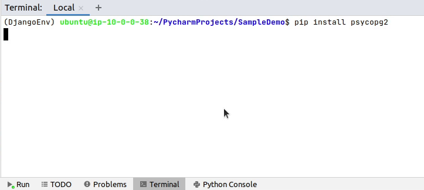

Okay, we are now successfully connected with our Postgres database.

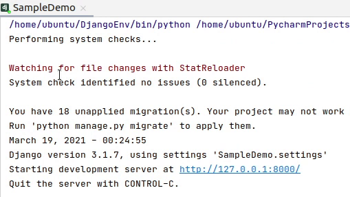

Now, I will copy the environment variables and will paste in
different places of our IDE.

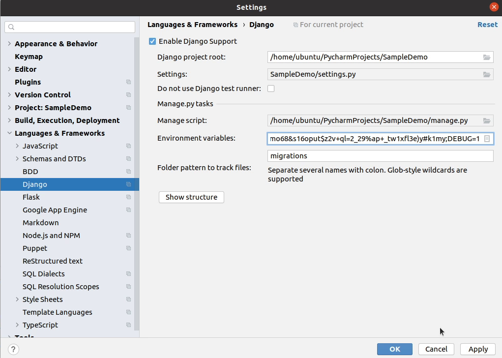

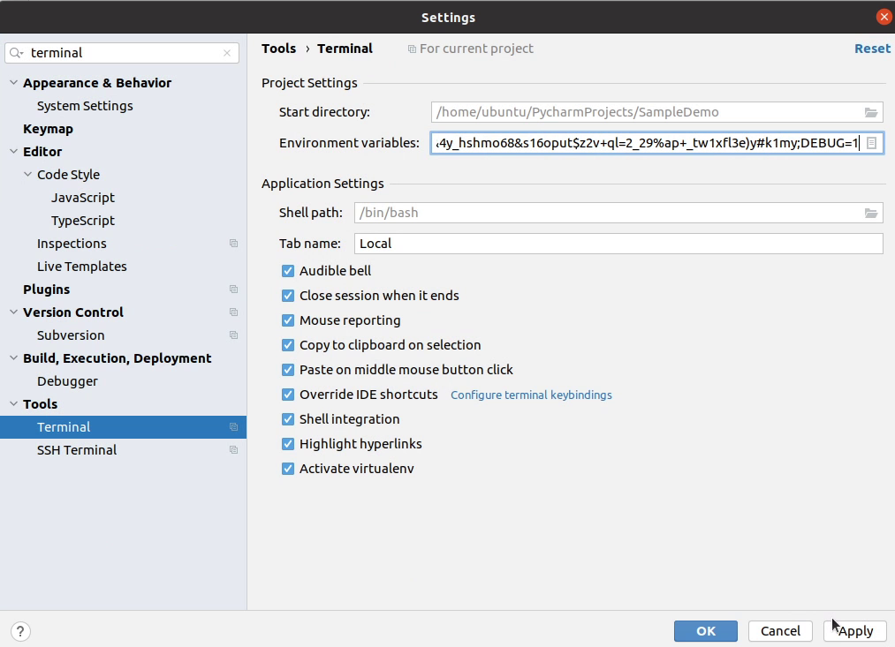

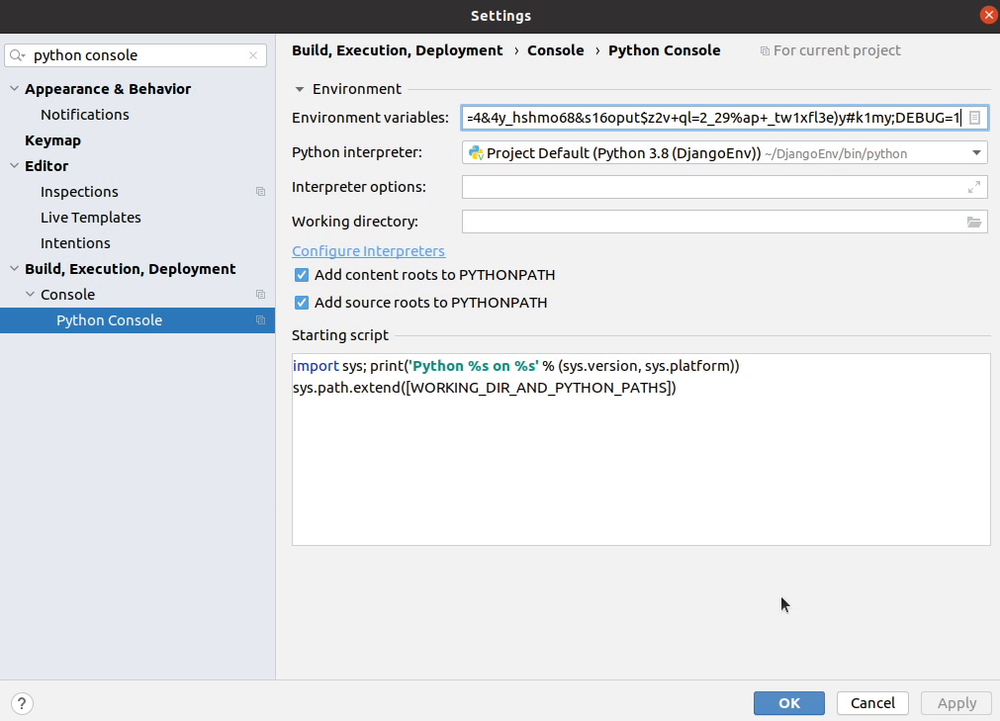

We are done with setting up the environment variables. Next, I will be migrating the database changes.

I will click on **Tools** and then **Run manage.py Task**

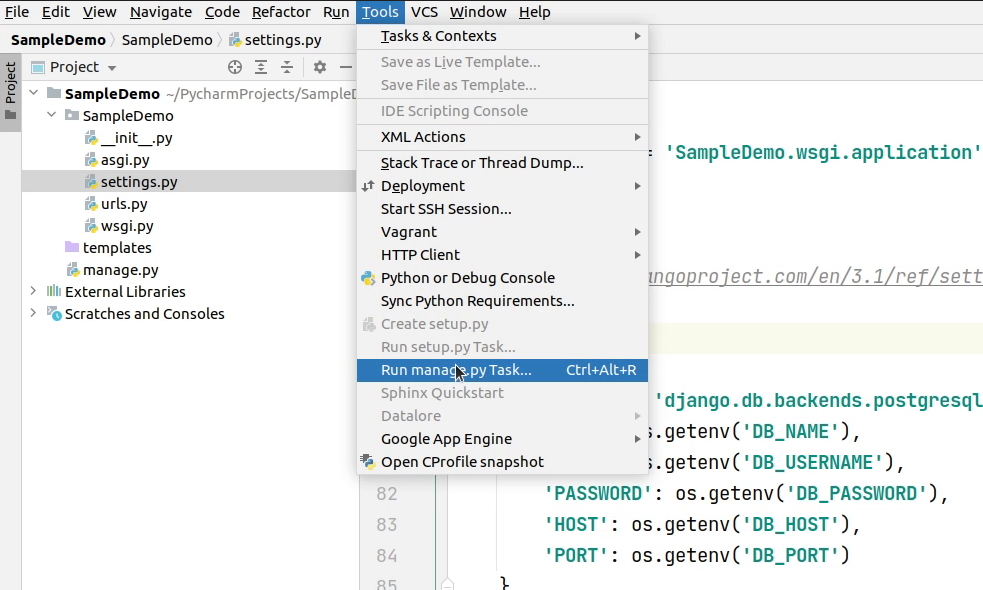

I will type **migrate** command and press enter and all the new tables will be successfully created in our database.

The migration is successful: let me verify it in our database.

Yes, the tables are successfully getting reflected in our database.

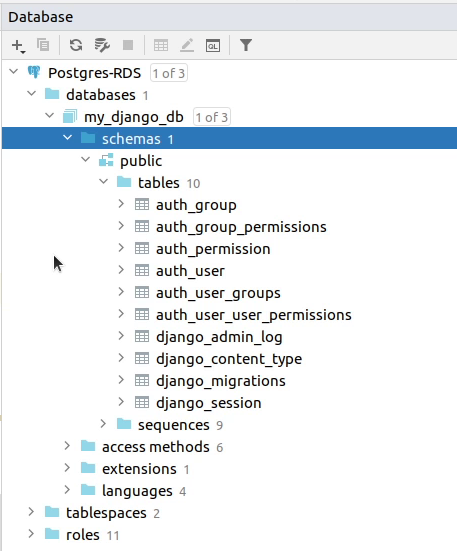

In the upcoming tutorial step, I will be setting up a new app in our project.
