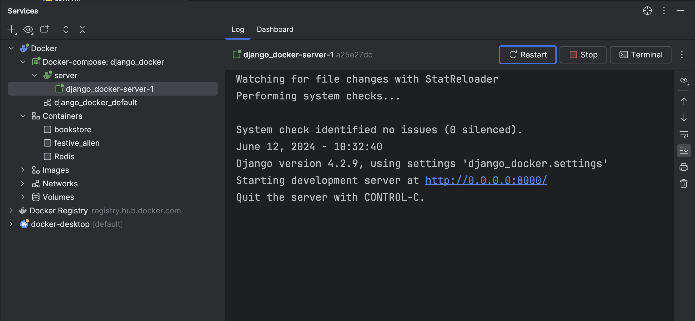
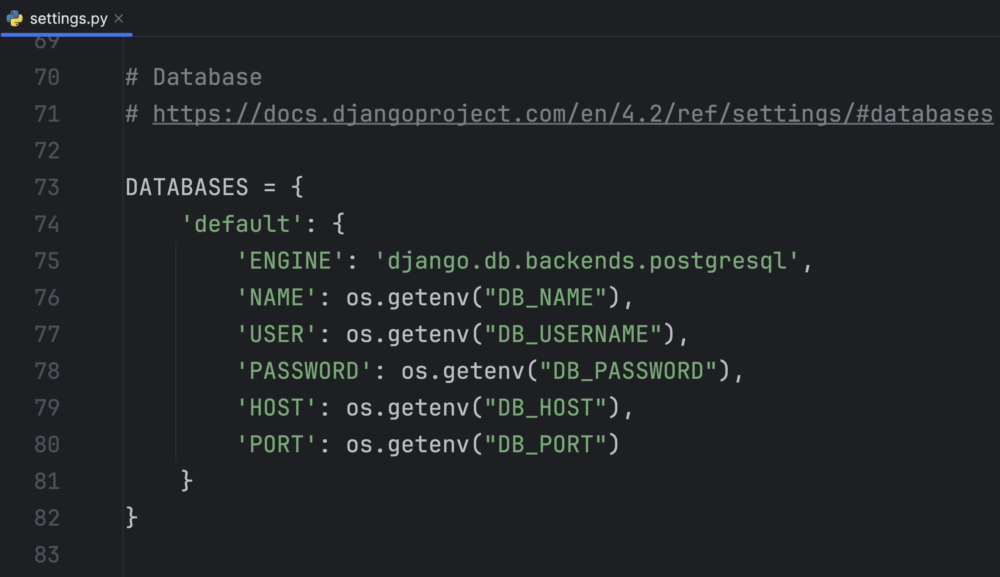

> From this section onwards, the code is pushed into the production [branch](https://github.com/mukulmantosh/dockerizing_django/tree/production).

## Gunicorn

For a production environment, it's advisable to use a production-grade WSGI server like [Gunicorn](https://gunicorn.org/), as Django's default server is not suitable for production settings.

Moreover, it's advisable to integrate Nginx as a reverse proxy for Gunicorn, which will also manage the serving of static files.

Open _Python Packages Tool → Window View | Tool Windows | Python Packages_ and install “gunicorn”


Make sure to add gunicorn to requirements.txt

## Environment Variables

Ensure that secret information is passed via environment variables rather than hardcoding it, to avoid compromising security.


Create a `.env` file and add the following information, make sure you don’t commit this file into git.


Next, update the docker compose file and run it to check everything is working fine as expected.


Cool! Everything seems to be working fine, without any hiccups.



## PostgreSQL

Install psycopg2 binary. After installation make sure to update the `requirements.txt` file

Before proceeding, make sure you have installed the `libpq` driver in your machine.

References:

- [https://formulae.brew.sh/formula/libpq](https://formulae.brew.sh/formula/libpq)
- [https://www.postgresql.org/docs/16/libpq.html](https://www.postgresql.org/docs/16/libpq.html)

```bash
pip install psycopg2-binary
```

Next, navigate to the `DATABASES` section in `settings.py` and modify the configuration to receive data from environment variables.



Next, create a `db.env` file which contains environment variables for the postgres container.


Update the `.env` file with postgres environment variables.


Update the compose.yaml file with the postgres configuration.


Also, make sure to add this line in your Dockerfile

```bash
RUN apt-get update && apt-get install -y libpq-dev
```


Once done, run the docker compose.
