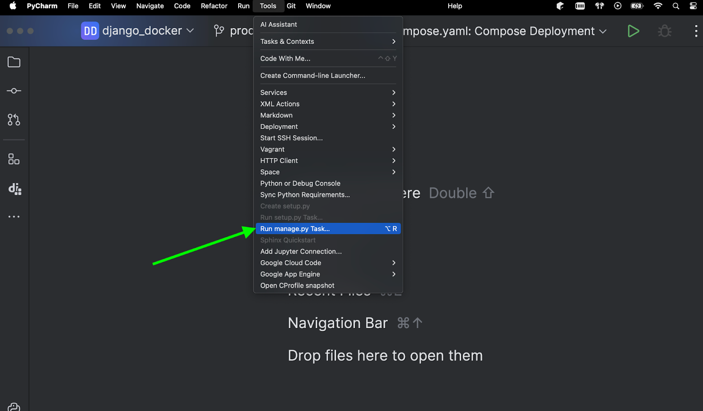
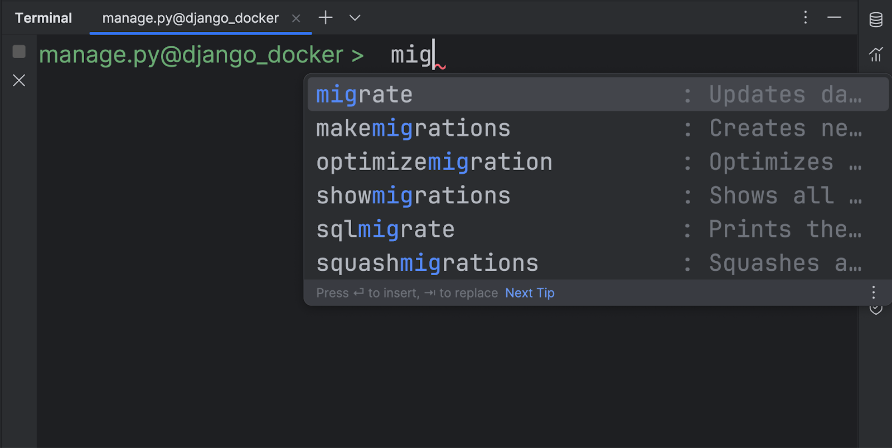
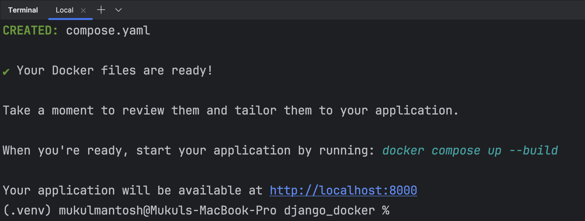

## Creating a Django App

For this tutorial, we are going to create a basic bare-bones Django Application.

> **Note**: You can find the entire source code in [GitHub](https://github.com/mukulmantosh/dockerizing_django).

Let’s begin by creating a new Django Application in PyCharm.

Select "Django" and then give your project a name. I'll be using "**django_docker**" as the name, but feel free to choose this or come up with your own unique name.

Once done, click **Create**.


Appreciation goes to PyCharm for facilitating a smooth transition in project creation, eliminating the need to use the CLI and remember various commands.


Before proceeding, ensure that you export the Python dependencies into a `requirements.txt` file using this command:

```bash
pip freeze > requirements.txt
```

Additionally, execute the command below to create a `db.sqlite3` file, which we will later transfer into the container.

```bash
python manage.py migrate
```

There's an alternative approach to do it in PyCharm, which is rather straightforward.





> **Note**: db.sqlite3 won’t be part of the production setup. Make sure to exclude it in the `.dockerignore` file.

In this tutorial, we are using [Docker Desktop](https://www.docker.com/products/docker-desktop/) on Mac. However, it also has support for Linux and Windows.


It's important to use the most recent version of Docker Desktop; for reference, I am using version 4.25.2

## Docker

### docker init

We are going to leverage the [docker init](https://docs.docker.com/reference/cli/docker/init/) plugin which will generate necessary starter files, gone are the days when you used to write them manually.

Starting from Docker Desktop version 4.18, the Docker Init plugin is available, which includes the `docker init` CLI command. By running `docker init` in your project directory, you'll be guided through the process of creating the following files, each with practical default settings tailored for your project:

- `.dockerignore`
- `Dockerfile`
- `compose.yaml`

Run the following command in the terminal.

**docker init**


Notice that the tool has automatically identified Python in the project. However, it also supports templates for other programming languages and frameworks, including Go, Node, PHP, Rust, .NET, and more.

Next, provide the necessary information

- Python version : `3.11.6`
- Running port : `8000`
- Command to run : `python manage.py runserver 0.0.0.0:8000`


Once done, press enter, and it’s going to generate the necessary files for you.




The `Dockerfile` and `compose.yaml` will appear significantly more verbose than if they were typed manually. However, for beginners, it's advisable to simplify these files as they contain more information than necessary for initial stages.

### Dockerfile


```dockerfile
# syntax=docker/dockerfile:1

# Comments are provided throughout this file to help you get started.
# If you need more help, visit the Dockerfile reference guide at
# https://docs.docker.com/engine/reference/builder/

ARG PYTHON_VERSION=3.11.6
FROM python:${PYTHON_VERSION}-slim as base

# Prevents Python from writing pyc files.
ENV PYTHONDONTWRITEBYTECODE=1

# Keeps Python from buffering stdout and stderr to avoid situations where
# the application crashes without emitting any logs due to buffering.
ENV PYTHONUNBUFFERED=1

WORKDIR /app

# Create a non-privileged user that the app will run under.
# See https://docs.docker.com/go/dockerfile-user-best-practices/
ARG UID=10001
RUN adduser \
    --disabled-password \
    --gecos "" \
    --home "/nonexistent" \
    --shell "/sbin/nologin" \
    --no-create-home \
    --uid "${UID}" \
    appuser

# Download dependencies as a separate step to take advantage of Docker's caching.
# Leverage a cache mount to /root/.cache/pip to speed up subsequent builds.
# Leverage a bind mount to requirements.txt to avoid having to copy them into
# into this layer.
RUN --mount=type=cache,target=/root/.cache/pip \
    --mount=type=bind,source=requirements.txt,target=requirements.txt \
    python -m pip install -r requirements.txt

# Switch to the non-privileged user to run the application.
USER appuser

# Copy the source code into the container.
COPY . .

# Expose the port that the application listens on.
EXPOSE 8000

# Run the application.
CMD python manage.py runserver 0.0.0.0:8000

```

> By default, the Django development server only listens on the localhost (127.0.0.1), which means it's only accessible from the same machine it's running on. To make it accessible from outside, you need to tell it to listen on all available network interfaces.
>
> The command `python manage.py runserver 0.0.0.0:8000` tells Django to listen on all available network interfaces (0.0.0.0) on port 8000.

### compose.yaml


```dockerfile
# Comments are provided throughout this file to help you get started.
# If you need more help, visit the Docker compose reference guide at
# https://docs.docker.com/compose/compose-file/

# Here the instructions define your application as a service called "server".
# This service is built from the Dockerfile in the current directory.
# You can add other services your application may depend on here, such as a
# database or a cache. For examples, see the Awesome Compose repository:
# https://github.com/docker/awesome-compose
services:
  server:
    build:
      context: .
    ports:
      - 8000:8000

# The commented out section below is an example of how to define a PostgreSQL
# database that your application can use. `depends_on` tells Docker Compose to
# start the database before your application. The `db-data` volume persists the
# database data between container restarts. The `db-password` secret is used
# to set the database password. You must create `db/password.txt` and add
# a password of your choosing to it before running `docker compose up`.
#     depends_on:
#       db:
#         condition: service_healthy
#   db:
#     image: postgres
#     restart: always
#     user: postgres
#     secrets:
#       - db-password
#     volumes:
#       - db-data:/var/lib/postgresql/data
#     environment:
#       - POSTGRES_DB=example
#       - POSTGRES_PASSWORD_FILE=/run/secrets/db-password
#     expose:
#       - 5432
#     healthcheck:
#       test: [ "CMD", "pg_isready" ]
#       interval: 10s
#       timeout: 5s
#       retries: 5
# volumes:
#   db-data:
# secrets:
#   db-password:
#     file: db/password.txt


```

In the next section, we will be focusing on running the Docker-based application from inside the IDE.
