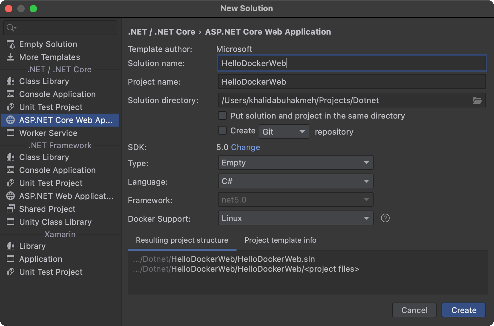
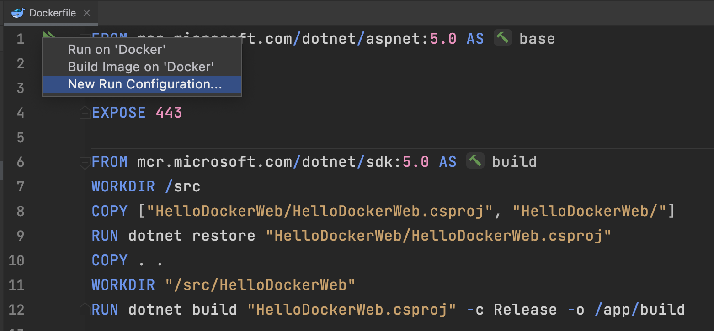
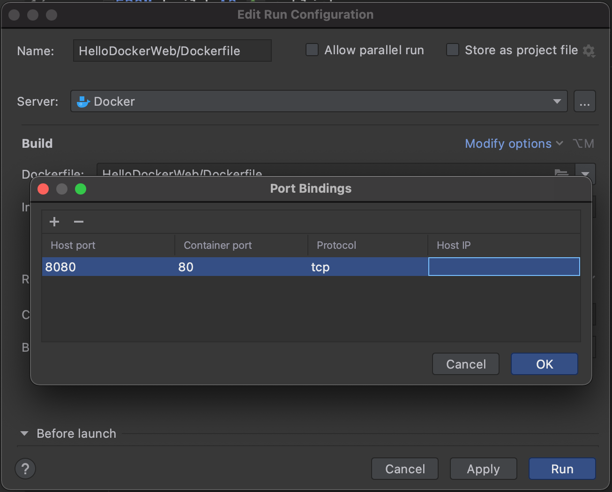
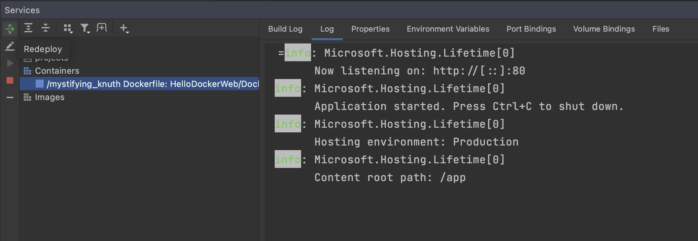
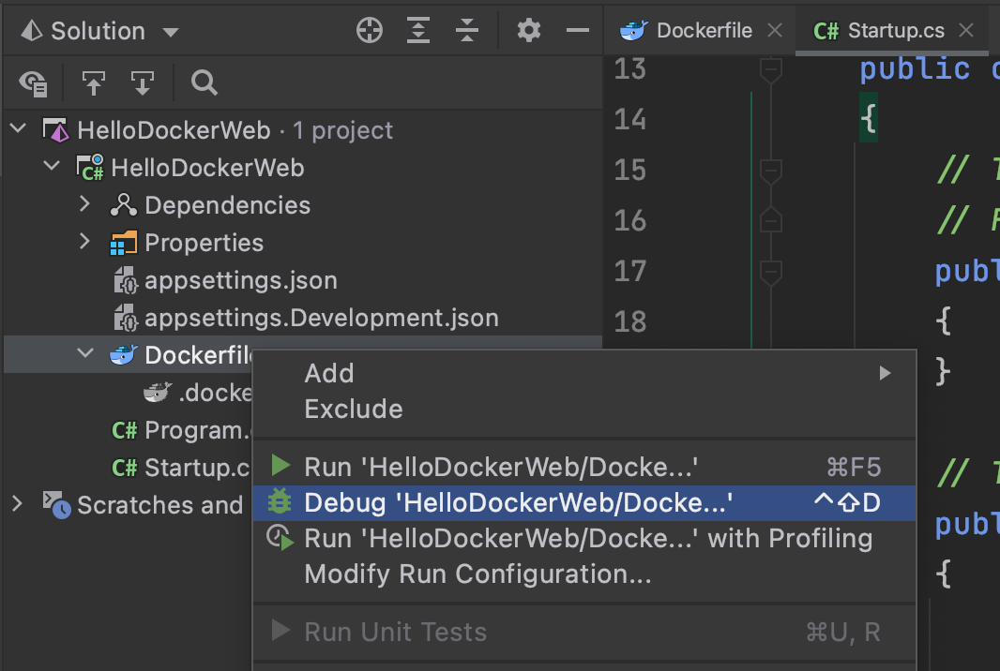

In a previous step, we built a console application that runs within a Docker container. We covered many of the basics of containerization, but admittedly it's also a dull example. Let's spice things up by building an ASP.NET Core application hosted within a Docker container.

We can use all the features found in the **Services** tab described in the previous section to explore our container during this tutorial.

Let's start by creating a new **Empty** ASP.NET Core application from the **New Solution** dialog, ensuring that the **Docker Support** option has `Linux` selected.



Once we load our ASP.NET Core application in the IDE, open the `Dockerfile` file. Notice it is very similar to the console application we've built previously except for two lines exposing the HTTP/HTTPS ports of `80` and `443`.

```
FROM mcr.microsoft.com/dotnet/aspnet:5.0 AS base
WORKDIR /app
EXPOSE 80
EXPOSE 443

FROM mcr.microsoft.com/dotnet/sdk:5.0 AS build
WORKDIR /src
COPY ["HelloDockerWeb/HelloDockerWeb.csproj", "HelloDockerWeb/"]
RUN dotnet restore "HelloDockerWeb/HelloDockerWeb.csproj"
COPY . .
WORKDIR "/src/HelloDockerWeb"
RUN dotnet build "HelloDockerWeb.csproj" -c Release -o /app/build

FROM build AS publish
RUN dotnet publish "HelloDockerWeb.csproj" -c Release -o /app/publish

FROM base AS final
WORKDIR /app
COPY --from=publish /app/publish .
ENTRYPOINT ["dotnet", "HelloDockerWeb.dll"]
```

Let's build our image and run the container, but before doing that, map the HTTP port to a host port and set the **Context folder**. Click the chevrons in the editor and select the **Edit** option.



From the **Edit Run Configuration** dialog, Under the **Build** section, we'll locate the **Modify Options** dropdown, select run options, and select **Context Folder**, and set the value to `.` in the following textbox.


Next, under the **Run** section, we'll select **Modify | Bind Ports** In the newly visible textbox, we'll bind the host port of `8080` to our container port of `80`.



The resulting value in the textbox should be `8080:80`.


We can now press the **Run** button on the dialog. If all the settings were correct, we should see our containerized ASP.NET Core application running in our **Services** window.



Opening a browser and navigating to `http://localhost:8080` will also access our root endpoint.


Let's try debugging our Docker container. First, let's change our response message. In our ` Startup.cs` file, let's change the message from `Hello World!` to `Hello Docker!`.

```csharp
endpoints.MapGet("/", async context =>
{
    await context.Response.WriteAsync("Hello Docker!");
});
```

Next, let's add a breakpoint, like we usually would, on the same line.


In the solution explorer pane, we can right-click the `Dockerfile` and choose the **Debug** option. Selecting the option will allow Rider to run our Docker container and attach a remote debugging session.

Navigating to `http://localhost:8080`, we'll see that our application will stop at our breakpoint. Debugging and running a containerized application in Rider is a seamless experience.



Continuing the execution of our ASP.NET Core application, we'll see our new and improved HTTP response.


### Where's the HTTPS?

Some security-conscious developers might have noticed we didn't bind the HTTPS ports. Well, this is a complicated subject, but we'll try to distill it into its simplest parts.

When we develop an ASP.NET Core application locally, we are utilizing the ASP.NET Core development certificates. For Windows and macOS, the process of trusting and installing the development certificates is straightforward. Trusting certificates on a Linux host is a bit more involved. Additionally, since Docker is about building releasable artifacts, development certificates are likely not a great idea.

Secondly, most ecosystems outside .NET don't usually use HTTPS on each web application instance but instead use a proxy that will terminate HTTPS and then pass along the message to the container. Reverse proxies like Nginx and, more recently, Microsoft's YARP is ideal for this kind of scenario.

Lastly, for folks who still want to use HTTPS within the container, it is possible. It requires managing a certificate deployed with the image and setting a container's environment variables. Check out the guidance found on the [Official Microsoft Documentation site.](https://docs.microsoft.com/en-us/dotnet/core/additional-tools/self-signed-certificates-guide#with-openssl).

### See Also

- [Docker Docs](https://docs.docker.com/)
- [.NET](https://dot.net)
- [JetBrains Rider](https://jetbrains.com/rider)
- [Rider Services Tool Window](https://www.jetbrains.com/help/rider/Services_Tool_Window.html)
