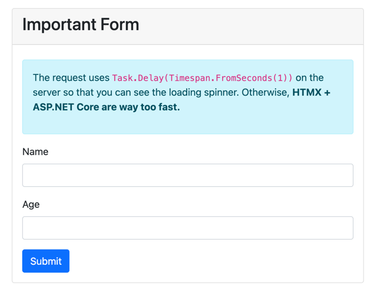
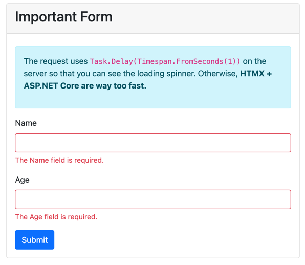

Client-side validation can help users fix problems before making a request, but client-side validation is often insufficient to do complete state validation. What do I mean by "insufficient"? By design, clients rarely have all information necessary to determine if a user's input will pass server-side validation. A typical example is a user registration form. While a username may follow the client-side criteria for a valid username, newcomers won't know whether their registration will be successful until the server performs checks determining the uniqueness of the username against all existing users.

Generally, forms have input validation and state validation. State validation requires a combination of inputs and external data to determine validity. In these more complex scenarios, you can use HTMX to submit the form and leverage ASP.NET Core's sever-side validation mechanisms to highlight and display problems. The approach also means we can avoid creating incomplete client-side validation experiences that can quickly get out of sync with our server-side counterparts.

I acknowledge this may be one of the more controversial ideas in this series. The idea of "no client-side validation" may be scary to many, but hopefully by the end of this section you may consider this approach an option. Let's have a look at how we can accomplish server-side form validation with a client-side feel.

The first step is to use a validation library. In this sample, we'll use [Data Annotations](https://docs.microsoft.com/en-us/aspnet/mvc/overview/older-versions-1/models-data/validation-with-the-data-annotation-validators-cs), the built-in validation library for ASP.NET Core. We need to decorate the parameters in our `PageModel` with the necessary validation attributes.

```csharp
public class FormValidation : PageModel
{
    [BindProperty, Required]
    public string? Name { get; init; } = string.Empty;

    [BindProperty, Required]
    public int Age { get; init; }

    public async Task<IActionResult> OnPost()
    {
        // see the loading spinner (remove for production)
        await Task.Delay(TimeSpan.FromSeconds(1));
        // handle Htmx request
        return Request.IsHtmx()
            ? Partial("_Form", this)
            : Page();
    }
}
```

We're using the `Required` attribute, but we can use any validation provided by the Data Annotation library. Looking at the `OnPost` method, we see the ternary approach to rendering our page. It's important to limit the scope of our HTML responses to what is only necessary, so in this case,  we have refactored our `_Form` into a partial view. Let's see how we've implemented the form.

```html
<form hx-post="@Url.Page("09_FormValidation")"
      hx-swap="outerHTML"
      class="form-horizontal needs-validation"
      _="on htmx:beforeSend set #submitButton.disabled to 'disabled'">

    <!-- Text input-->
    <div class="mb-3">
        <label class="form-label" asp-for="Name"></label>
        <input type="text" class="form-control" asp-for="Name">
        <div class="invalid-feedback">
            <span asp-validation-for="Name"></span>
        </div>
    </div>

    <!-- Text input-->
    <div class="mb-3">
        <label class="form-label" asp-for="Age"></label>
        <input type="text" class="form-control" asp-for="Age">
        <div class="invalid-feedback">
            <span asp-validation-for="Age"></span>
        </div>
    </div>

    <div class="control">
        <button id="submitButton" type="submit" class="btn btn-primary">
            <span class="htmx-indicator">
                <span class="spinner-border spinner-border-sm" role="status" aria-hidden="true"></span>
                <span class="visually-hidden">Loading...</span>
            </span>
            Submit
        </button>

        @Html.AntiForgeryToken()
    </div>

</form>
```

We have our form that uses `hx-post` to submit user input. Here we see our first use of **[Hyperscript](https://hyperscript.org/)**, an expressive language that allows us to describe behaviors that should occur on a particular event. In this case, we'll disable the submit button to prevent duplicate submissions. Beyond the few HTMX attributes, it is all standard ASP.NET Core validation, with the use of `asp-validation-for` attributes on our message span elements.



Let's try out the form. Submitting an empty form will enable the HTMX indicator and then display the validation messages. You'll notice that the page still has a client-side feel but with no need to sync serverside and client-side validation.  



Of course, if you still want to perform client-side validation, you can do so. HTML 5 attributes such as `required` will still be respected by the client. As expected, adding more-complex client-side validation will need more effort and a lot more JavaScript. That said, server-side validation is a must, so why not just leverage it to its fullest? Hopefully this HTMX approach to validation has you thinking about your past validation experiences and potentially future implementations.

In the following video, we'll see how to use long polling to create a near real-time experience for users of your applications.
