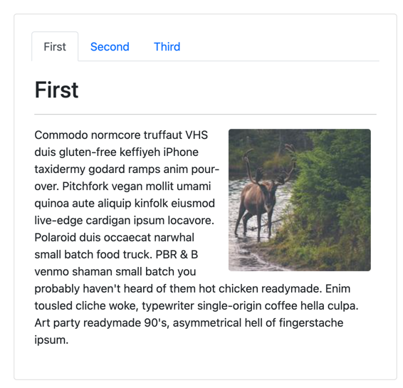

Tabs are commonplace in most user interfaces, and you can indeed implement the pattern without HTMX. However, there are circumstances where it makes sense to reconsider implementing the UI pattern with HTMX. One instance is when each tab can have an enormous amount of information that your users do not always access. Hypothetically, why slow down the initial page load for 100% of users, by including a tab that only 1% of users access?

In this sample, you'll use HTMX to render only the tab the user has selected. Here we leverage the ideas of Hypermedia as the Engine of Application State, better known as HATEOAS. For those unsure of the acronym, HATEOAS is not a breakfast cereal, but a concept where the response contains the necessary information to convey state. In this particular example, the state of the selected tab is already in the HTML response. The selection is conveyed from the client to the server and used in the final response. Therefore, there is no need for any client-side code to determine the current active tab.



Our view looks like a typical tabbed UI, but let's take a look at the partial view implementation to see how it works.

```html
<ul class="nav nav-tabs">
    @foreach (var tab in Model.Items)
    {
        <li class="nav-item">
            <a hx-get="@Url.Page("07_Tabs", new {tab})"
               href="#"
               class="nav-link @Model.IsSelectedCss(tab, "active")"
               aria-current="@Model.IsSelectedCss(tab, "page")"
               hx-target="#tabbed-content">
                @tab
            </a>
        </li>
    }
</ul>
```

You'll notice that each tab utilizes `hx-get` and passes the `tab` parameter to the ASP.NET Core endpoint. Upon receiving the request, we render the appropriate HTML. This technique is beneficial for a few reasons:

1. Initial page loads are much smaller since we only render one tab and its contents at a time.
1. Requests can load new tabs that were not available at first request.
1. Changing tabs can rerender content updates (live tabs).

Let's have a look at the `PageModel` implementation.

```csharp
public class Tabs : PageModel
{
    public IEnumerable<string> Items { get; }
        = new[] {"First", "Second", "Third"};

    [BindProperty(Name = "tab", SupportsGet = true)]
    public string? Tab { get; set; }

    public bool IsSelected(string name) =>
        name.Equals(Tab?.Trim(), StringComparison.OrdinalIgnoreCase);

    public IActionResult OnGet()
    {
        // make sure we have a tab
        Tab = Items.Any(IsSelected) ? Tab : Items.First();

        return Request.IsHtmx()
            ? Partial("_Tabs", this)
            : Page();
    }

    public string? IsSelectedCss(string tab, string? cssClass)
        => IsSelected(tab) ? cssClass : null;
}
```

You could imagine calling a database or third-party service to retrieve information. And again, we see the ternary approach used to handle initial page loads and HTMX requests. At this point, you're likely sensing a pattern. As always, consider your use case and whether it would be more beneficial to separate the tabs into different endpoints. It's worth repeating, HTMX is a tool and how you utilize it is up to you and your creativity. You can choose when and where to apply HTMX. You may find in your development, it's easier to start with HTMX up front, or to develop a fully functional app then layer in HTMX functionality later. Each approach is equally valid and encouraged.

In the following video, we'll see how to give our apps the "desktop app" feeling and handle keyboard shortcuts.
