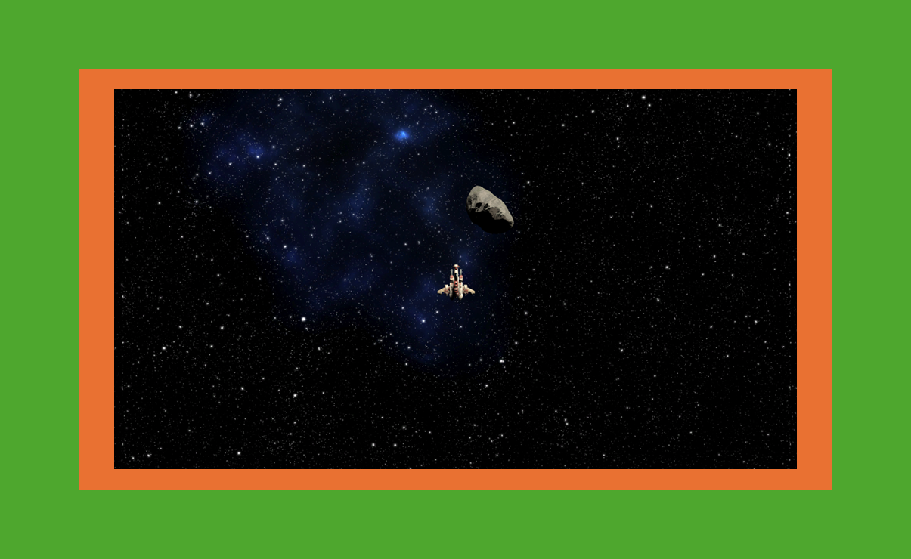
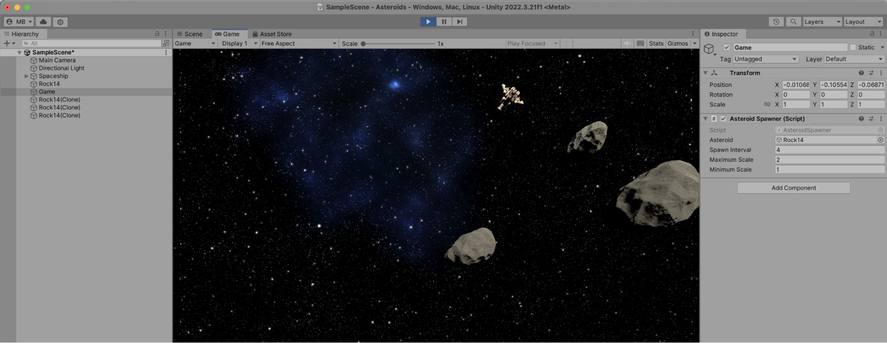
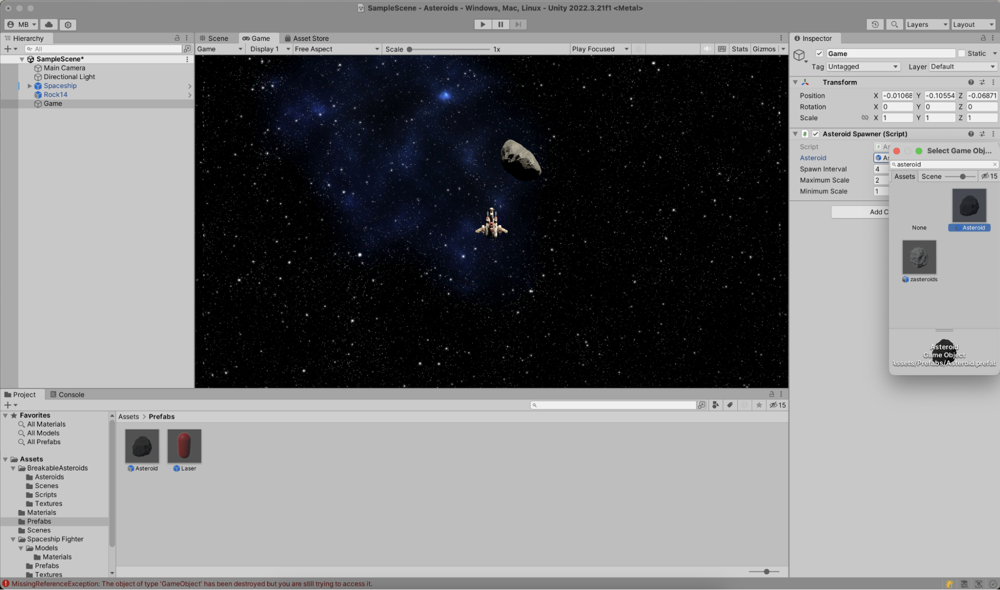

So far, the game scene only contains one lonely asteroid. In a game like this, asteroids should pop into existence every few seconds to keep the gameplay interesting. Let's see how this can be done!

In the Unity Editor, open the game scene and add an empty _GameObject_. You can do this in the **Hierarchy** tool window and use the **Create Empty** context menu. In the **Inspector** tool window, click **Add Component** and add a new script to the GameObject. Name it `AsteroidSpawner`, and open it in JetBrains Rider.

The `AsteroidSpawner` will have 4 public fields that can be configured in the Unity Editor:

- Asteroid – a reference to the asteroid that will be cloned into a new asteroid
- Spawn interval – how often new asteroids will be created
- Minimum and maximum scale – to control the size of asteroids

You will also need some private fields to keep track of the camera's bounds, so spawning asteroids can be done outside the visible part of the scene. Combining all those, here's the `AsteroidSpawner` you want to add:

```csharp
public class AsteroidSpawner : MonoBehaviour
{
   [SerializeField] private GameObject asteroid;
   [SerializeField] private float spawnInterval = 4f;
   [SerializeField] private float maximumScale = 10f;
   [SerializeField] private float minimumScale = 5f;

   private Vector3 screenCenter;

   private float minimumY;
   private float maximumY;
   private float minimumX;
   private float maximumX;

   private void Start()
   {
       // Grab main camera properties
       var mainCamera = Camera.main!;
       var mainCameraTransformPosition = mainCamera.transform.position;
       screenCenter = mainCamera.ScreenToWorldPoint(new Vector3(Screen.width / 2, Screen.height / 2, 0));

       // Store screen boundaries
       minimumY = mainCamera.ScreenToWorldPoint(new Vector3(0, 0, -mainCameraTransformPosition.z)).y;
       maximumY = mainCamera.ScreenToWorldPoint(new Vector3(0, Screen.height, -mainCameraTransformPosition.z)).y;
       minimumX = mainCamera.ScreenToWorldPoint(new Vector3(0, 0, -mainCameraTransformPosition.z)).x;
       maximumX = mainCamera.ScreenToWorldPoint(new Vector3(Screen.width, 0, -mainCameraTransformPosition.z)).x;

       // Spawn asteroids
       StartCoroutine(SpawnAsteroids());
   }

   private IEnumerator SpawnAsteroids()
   {
       // to be added
   }
}
```

The spawning of asteroids will be done in the `SpawnAsteroids` coroutine. Coroutines are methods in Unity that can perform operations over time instead of instantly. Because there's an interval defined for spawning asteroids, a coroutine works well to pause for several seconds between asteroids being created:

```csharp
private IEnumerator SpawnAsteroids()
{
    while (true)
    {
        yield return new WaitForSeconds(spawnInterval);
        InstantiateRandomAsteroid();
    }
}
```

Next, implement the `InstantiateRandomAsteroid` method to create new asteroids. Asteroids will be spawned just outside the visible part of the scene, and ideally not exactly on the edge to avoid asteroids popping into existence out of nowhere. The green zone in the next screenshot is where we want asteroids to be created. There will also have to be some logic to ensure asteroids aren't spawned on top of each other.



The `InstantiateRandomAsteroid` method could look like this:

```csharp
private void InstantiateRandomAsteroid()
{
    var asteroidsOverlap = true;

    float spawnX = 0;
    float spawnY = 0;

    var scale = UnityEngine.Random.Range(minimumScale, maximumScale);
    do
    {
        var randomValue = UnityEngine.Random.value;
        if (randomValue > 0.75f)
        {
            spawnX = UnityEngine.Random.Range(minimumX - maximumScale - scale, minimumX - minimumScale - scale);
            spawnY = UnityEngine.Random.Range(minimumY, maximumY);
        }
        else if (randomValue > 0.5f)
        {
            spawnX = UnityEngine.Random.Range(maximumX + minimumScale + scale, maximumX + maximumScale + scale);
            spawnY = UnityEngine.Random.Range(minimumY, maximumY);
        }
        else if (randomValue > 0.25f)
        {
            spawnX = UnityEngine.Random.Range(minimumX, maximumX);
            spawnY = UnityEngine.Random.Range(minimumY - maximumScale - scale, minimumY - minimumScale - scale);
        }
        else
        {
            spawnX = UnityEngine.Random.Range(minimumX, maximumX);
            spawnY = UnityEngine.Random.Range(maximumY + minimumScale + scale, maximumY + maximumScale + scale);
        }

        // Avoiding spawning 2 asteroids on top of each other
        var collidersBuffer = new Collider[16];
        var size = Physics.OverlapBoxNonAlloc(
            new Vector3(spawnX, spawnY, 0), new Vector3(1, 1, 1), collidersBuffer);
        asteroidsOverlap = size > 0;
    } while (asteroidsOverlap);

    var asteroidObject = Instantiate(asteroid, new Vector3(spawnX, spawnY, 0), Quaternion.Euler(0, 0, 0));
    asteroidObject.transform.LookAt(screenCenter);
    asteroidObject.transform.localScale = new Vector3(scale, scale, scale);
}
```

Determining the spawn position is done based on an initial random value. Depending on its value, the X and Y coordinates for the spawn point are randomized on the X or Y axis.

Before instantiating a new asteroid, Unity's `Physics.OverlapBoxNonAlloc` method is used to confirm asteroids don't overlap. The asteroid is then instantiated, scaled between the minimum and maximum you can specify in the **Inspector** tool window in the Unity Editor, and then oriented towards the center of the screen so the asteroid flies into that direction.

Here's the full `AsteroidSpawner` code:

```csharp
public class AsteroidSpawner : MonoBehaviour
{
   [SerializeField] private GameObject asteroid;
   [SerializeField] private float spawnInterval = 4f;
   [SerializeField] private float maximumScale = 10f;
   [SerializeField] private float minimumScale = 5f;

   private Vector3 screenCenter;

   private float minimumY;
   private float maximumY;
   private float minimumX;
   private float maximumX;

   private void Start()
   {
       // Grab main camera properties
       var mainCamera = Camera.main!;
       var mainCameraTransformPosition = mainCamera.transform.position;
       screenCenter = mainCamera.ScreenToWorldPoint(new Vector3(Screen.width / 2, Screen.height / 2, 0));

       // Store screen boundaries
       minimumY = mainCamera.ScreenToWorldPoint(new Vector3(0, 0, -mainCameraTransformPosition.z)).y;
       maximumY = mainCamera.ScreenToWorldPoint(new Vector3(0, Screen.height, -mainCameraTransformPosition.z)).y;
       minimumX = mainCamera.ScreenToWorldPoint(new Vector3(0, 0, -mainCameraTransformPosition.z)).x;
       maximumX = mainCamera.ScreenToWorldPoint(new Vector3(Screen.width, 0, -mainCameraTransformPosition.z)).x;

       // Spawn asteroids
       StartCoroutine(SpawnAsteroids());
   }

   private IEnumerator SpawnAsteroids()
   {
       while (true)
       {
           yield return new WaitForSeconds(spawnInterval);
           InstantiateRandomAsteroid();
       }
   }

   private void InstantiateRandomAsteroid()
   {
       var asteroidsOverlap = true;

       float spawnX = 0;
       float spawnY = 0;

       var scale = UnityEngine.Random.Range(minimumScale, maximumScale);
       do
       {
           var randomValue = UnityEngine.Random.value;
           if (randomValue > 0.75f)
           {
               spawnX = UnityEngine.Random.Range(minimumX - maximumScale - scale, minimumX - minimumScale - scale);
               spawnY = UnityEngine.Random.Range(minimumY, maximumY);
           }
           else if (randomValue > 0.5f)
           {
               spawnX = UnityEngine.Random.Range(maximumX + minimumScale + scale, maximumX + maximumScale + scale);
               spawnY = UnityEngine.Random.Range(minimumY, maximumY);
           }
           else if (randomValue > 0.25f)
           {
               spawnX = UnityEngine.Random.Range(minimumX, maximumX);
               spawnY = UnityEngine.Random.Range(minimumY - maximumScale - scale, minimumY - minimumScale - scale);
           }
           else
           {
               spawnX = UnityEngine.Random.Range(minimumX, maximumX);
               spawnY = UnityEngine.Random.Range(maximumY + minimumScale + scale, maximumY + maximumScale + scale);
           }

           // Avoiding spawning 2 asteroids on top of each other
           var collidersBuffer = new Collider[16];
           var size = Physics.OverlapBoxNonAlloc(
               new Vector3(spawnX, spawnY, 0), new Vector3(1, 1, 1), collidersBuffer);
           asteroidsOverlap = size > 0;
       } while (asteroidsOverlap);

       var asteroidObject = Instantiate(asteroid, new Vector3(spawnX, spawnY, 0), Quaternion.Euler(0, 0, 0));
       asteroidObject.transform.LookAt(screenCenter);
       asteroidObject.transform.localScale = new Vector3(scale, scale, scale);
   }
}
```

Back in the Unity Editor, make sure the asteroid is selected, and in the **Inspector** tool window, specify the asteroid object that can be cloned and its minimum and maximum scale. If you enter **Play** mode, you'll see asteroids fly in from the edges of the screen!



After a while though, you'll see errors appear. More specifically, when the original rock becomes invisible, it is destroyed in the `AsteroidController`'s `OnBecameInvisible` method. After the asteroid is destroyed, there's no way to clone it into new asteroids anymore, and you will see errors being printed to the **Console** tool window.

To solve this issue, you can use the trick we applied to the laser earlier. From the **Hierarchy** tool window, drag the asteroid into the **Project** tool window to create an asteroid prefab. You can then use this prefab instead of the asteroid that is on the scene. If you want to, you can even remove the asteroid from the scene: the `AsteroidSpawner` will take care of creating asteroids when the game is running.



At this point, you can go back in **Play** mode, fly around, and keep firing at asteroids for as long as your heart pleases. Congratulations on your game so far!

Let's add one more thing in the next step: basic user interface elements to show the player score.
