In this section, we'll set up our game's **Scene Tree**, which holds all its elements. As we go through each element, we'll discuss each **Node** and why we decided to use it. We'll also explore some optional tips to make your game development more enjoyable. We'll be staying in Godot for a bit to keep from context-switching and keep things clearer.

### The 2D Scene

Godot has many concepts, and an integral one is that of the **Scene**. Scenes are logical groupings of nodes and can encompass everything from an entire game to smaller reusable prefabrications. For this tutorial, we'll work with a single **2D Scene** to help simplify the process.

From the Godot Editor, select **2D Scene** in the **Scene** tool window.

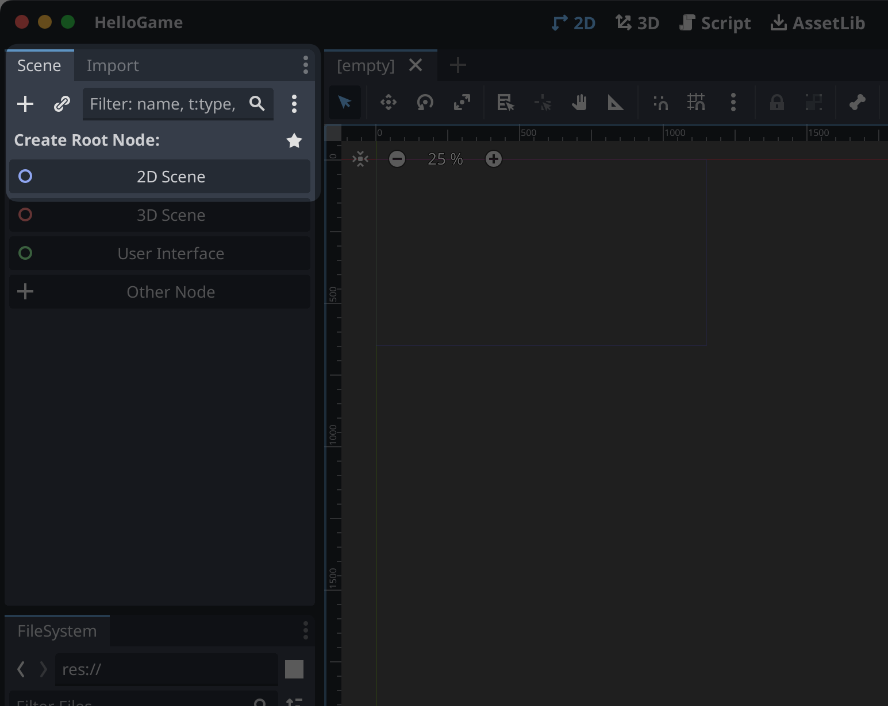

Immediately after creating the scene, we'll want to save it as `main.tscn`.

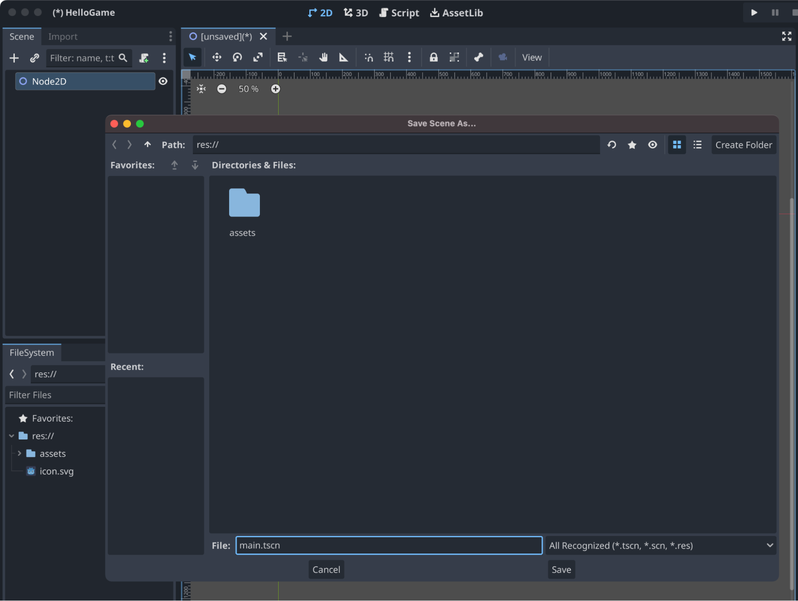

This is now our working area. We will add all of our game elements to this root node. Naming nodes isn't necessary, but it can help keep your **Scene Tree** organized as you add more elements. You can rename the root to something meaningful like "Pong" or "Game".

Now that we have a scene, we can add a camera.

### Camera2D—Seeing Your World

Cameras are an essential part of video game development. They are the lens through which you frame the game world and how the player sees it. Since we're working with a two-dimensional game, we will use the **Camera2D** node.

Right-click your root node and select **Add Child Node**


At this point, you'll find **Camera2D** in the selection box and add it to the scene by clicking the **Create** button at the bottom of the dialog.

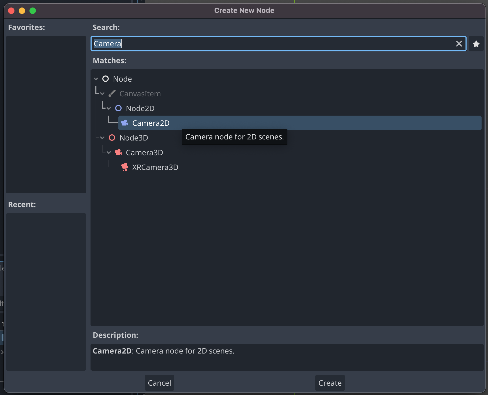

Once added, we must go to the **Inspector** tool window (on the right) and change the **Anchor Mode** value to **Fixed TopLeft**. Changing this value ensures that our camera sees our `1280 x 720px` playing field. If you don't see the options for this node, be sure it's selected in the scene.

Let's add our playing field next.

### Sprite2D—The Field of Battle

Let's add the background to our game, the playing field. This is for aesthetics, but who doesn't love playing a game that looks and plays equally good?

Right-click the root node again, but add a **Sprite2D** node this time. Sprites are a particular node used to display a 2D graphic. In our case, this will display our **Court** assets. It's also worth renaming the node to **Court**, so it's easy to find in our scene.

In the Inspector for our new node, click the **Texture** dropdown and select **Quick Load**. From here, you'll be able to select `Court.png`.

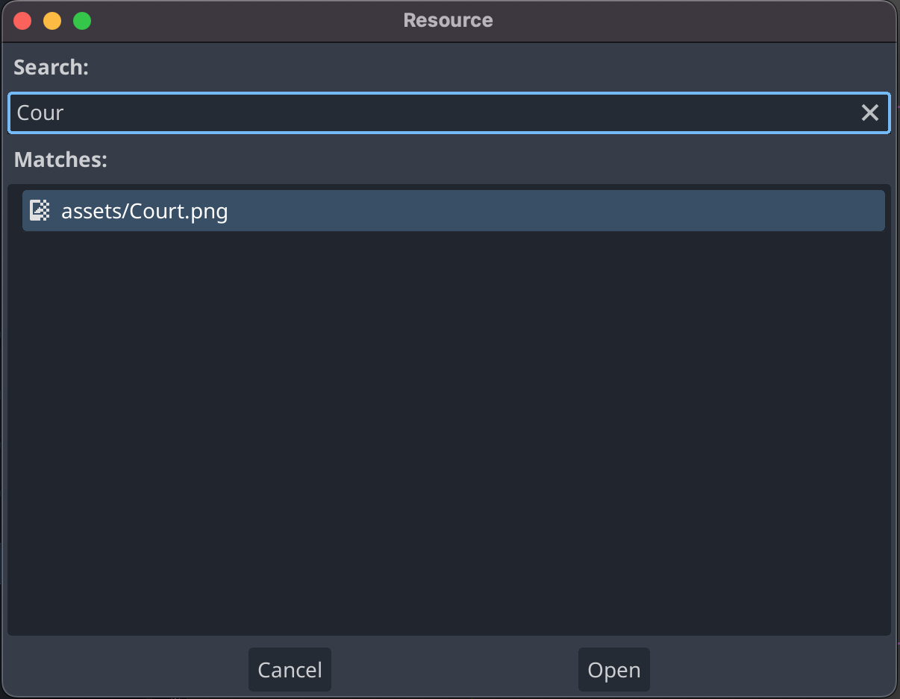

You'll want to offset the center of our new sprite to center the court in the middle of our Camera's view. Set the **Offset** values to `(x:640px, y:360px)`.

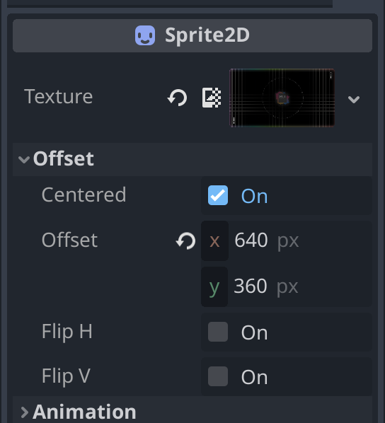

Hit the play button at the top of the Godot Editor now, and you'll be asked to set the main scene. Choose **Select Current**. You can change the main scene in project settings at any time.


You should now have a running game.

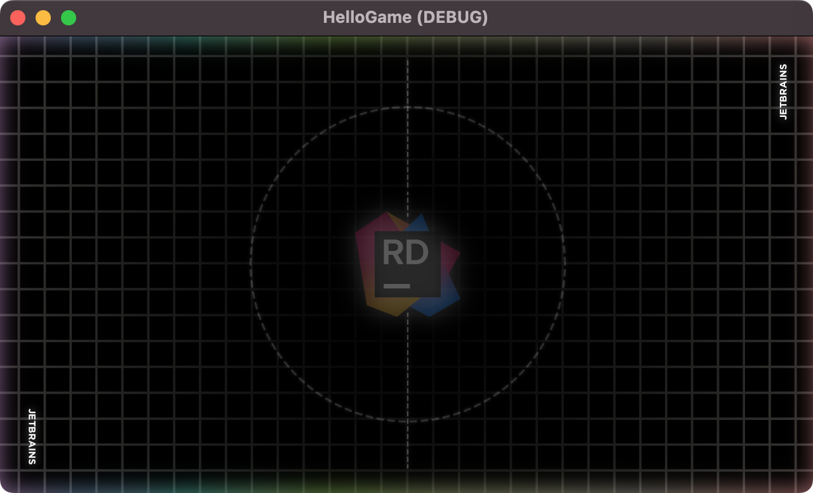

Next, we'll add the paddles, the ball, the goals, and the top and bottom walls.

### Area2D and Collisions

Our paddles and balls need to handle collision, so we need to use a node that understands when elements collide. For that, we'll use a top-level **Area2D** node, which requires child nodes of **Sprite2D** and **CollisionShape2D**. Let's create our **Ball**, which we can use as an example for our other game elements.

Right-click the root node again, add an **Area2D** node, and rename it **Ball** in the scene tree. You'll notice we have a warning in the editor now.


Don't panic. We're going to fix this now. Right-click **Ball** and add a new child node of **CollisionShape2D**. Another warning?!


Before we fix this, let's add another child node to our **Ball** of **Sprite2D** and "quick load" the `Ball.png` texture as its image texture. Your scene tree and editor should look like the following.

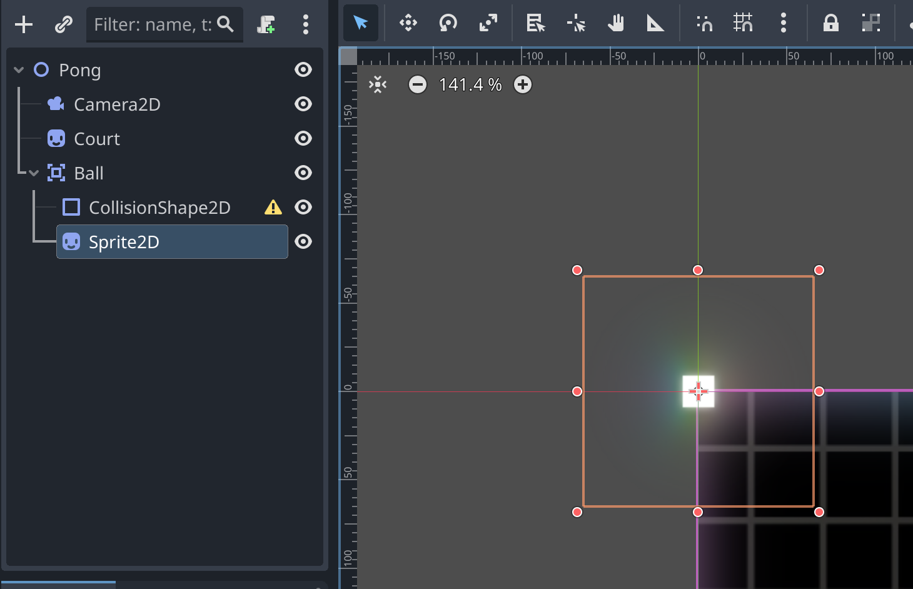

Now we can update the **CollisionShape2D**, and you'll see why we did it in this order soon. In the Inspector for **CollisionShape2D** find the Shape dropdown and select **New RectangleShape2D**.

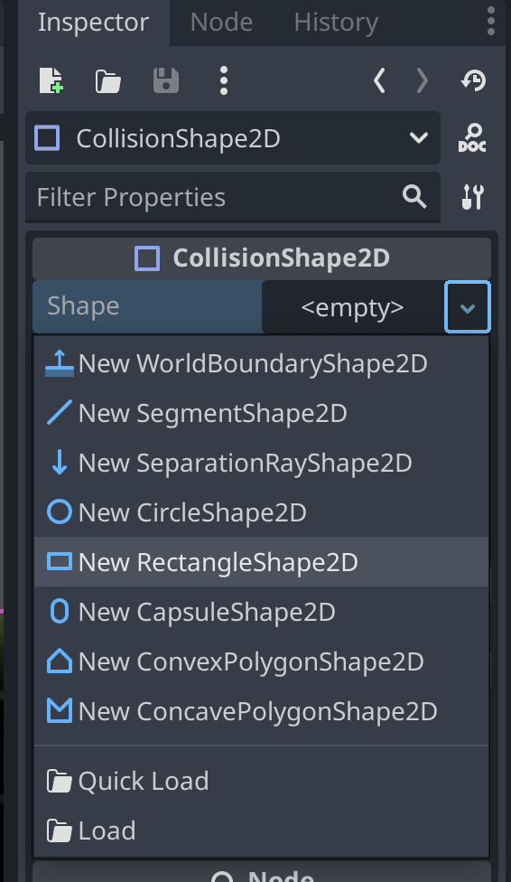

Selecting the **CollisionShape2D** node in the scene tree will highlight the rectangle surrounding our ball. A blue hue, known as the **Debug Color**, now shows where the collision areas are on our **Area2D** node. These colors are configurable, to help with visibility in the editor and do not appear in the final game. You can adjust the size of the rectangle by pulling on the circular indicators on the edges.

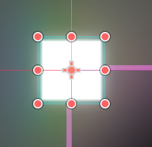

**Area2D** nodes look within their children to find the collision boundaries we set using a rectangle. The sprite is only for the player's benefit so that they can see the ball, but you'll see later that visuals are optional for **Area2D** elements.

We've created a logical group of **Ball** now, and we should tell Godot to group them. Click the **Group Selected Nodes** button in the toolbar. This is highly recommended, as you don't want to move any children away from the parent's origin accidentally. Things will get weird and fast.

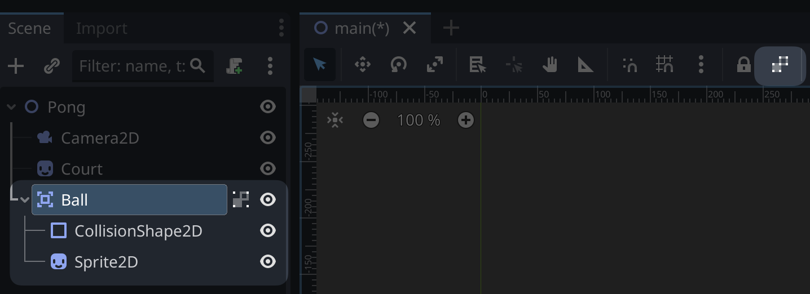

Let's position the **Ball** in the center of the screen by setting the **Transform | Position** to `(x:640px, y:360px)`.

Now, repeat the steps for Player and Enemy using the Paddle.png asset. You'll need to readjust the collision rectangle to wrap around the entire paddle. You can do that by dragging the orange indicators in the editor.

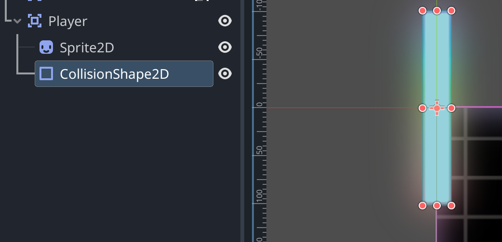

Remember to create logical groups before moving these elements. You can freely position the **Player** and **Enemy** on the play field, but if you want exact numbers for the position, you can use the following values for **Transform | Position**.

- **Player**: `(x: 80, y: 360px)`
- **Enemy**: `(x: 1200, y: 360px)`

Your scene should look like this so far. Now is a good time to save your progress.

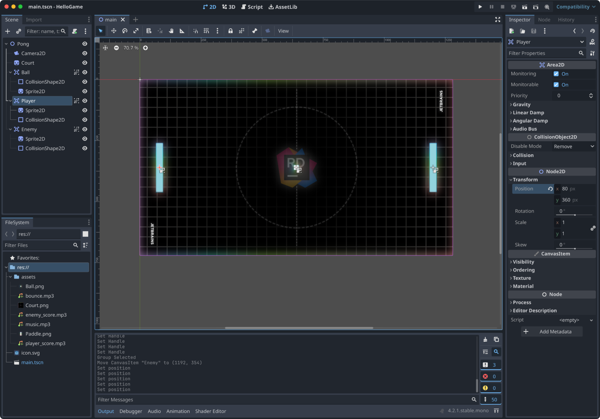

Next, we'll create goals and walls. These will be **Area2D** nodes with **CollisionShape2D** elements, but sprites are unnecessary here.

Let's build the **Top** wall. Add an **Area2D** and **CollisionShape2D** with a **RectangleShape2D**. This time, we'll set the size of our collision shape to the length of our game, `1280px`, and a height of `50px`. You can expand the shape by clicking on **Rectangle** in the inspector.

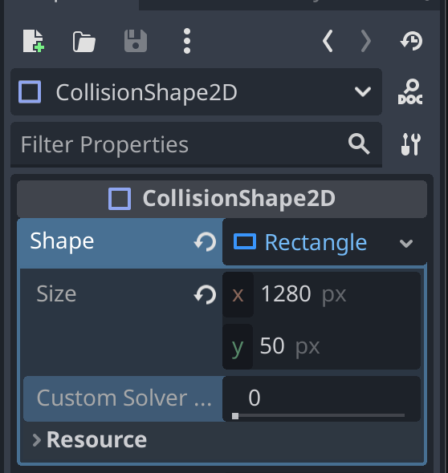

Now group the **Top** node and its children and set its position to `(x:640px, y:-25px)`. Next, do the same for the **Bottom**. The only difference will be **Bottom**'s position of `(x:64px, y:755px)`.

Let's also do Left and Right--the same process but with different settings.

- **Left**
  - **CollisionShape | Size**: `(x:50, y: 720px)`
  - **Position**: `(x:0px, y:360px)`
- **Right**
  - **CollisionShape** | Size: `(x:50, y: 720px)`
  - **Position**: `(x:1280px, y: 360px)`

The scene should now look like this in the editor.


We're getting close to having all of our elements in the game. Let's add the scoreboard next.

### Scores and UI Labels

Godot offers many visual graphical user interface (GUI) elements to help display numbers and text. For this tutorial, we'll use a Label node, which is enough to show numeric values for the current score.

Add two new **Label** nodes to the root node of our scene.

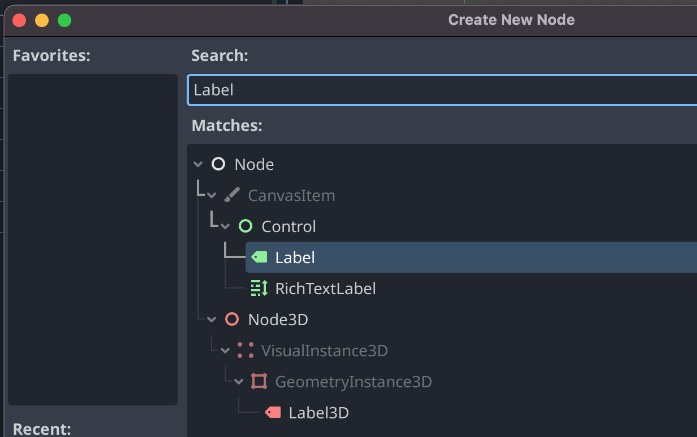

Call one **Player Score** and the other **Enemy Score**.

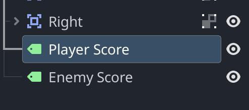

In the **Inspector** of each node, set the **Text** to `0`, and then under **Theme Overrides | Font Sizes** set the **Font Size** to `64`.

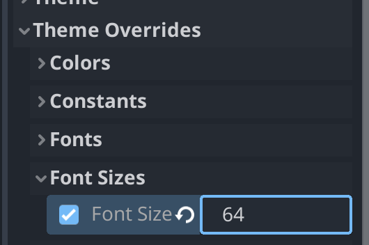

Set the following positions for the **Label** nodes under **Layout | Transform | Position**.

- **Player Score**: `(x:570px, y: 0px)`
- **Enemy Score**: `(x:680px, 0px)`

Feel free to play around with the positioning of these elements.

Since we're doing UI elements, let's add another element, a **Pause Screen**. Add a new **RichTextlabel** to our root node.

The **RichTextLabel** supports [BBCode](https://www.bbcode.org), a syntax that allows for some interesting text effects, and we'll be using them in this tutorial.

First, let's override the font size under **Theme Overrides | Font Sizes | Normal Font Size** and set the value to `200px`. Be sure to check the box next to this value.

You'll next want to set the size of our **RichTextLabel**. Set the values for **Transform | Size** to `(x:1280px, y:360px)` and **Transform | Position** to `(x:0, y: 180px)`.

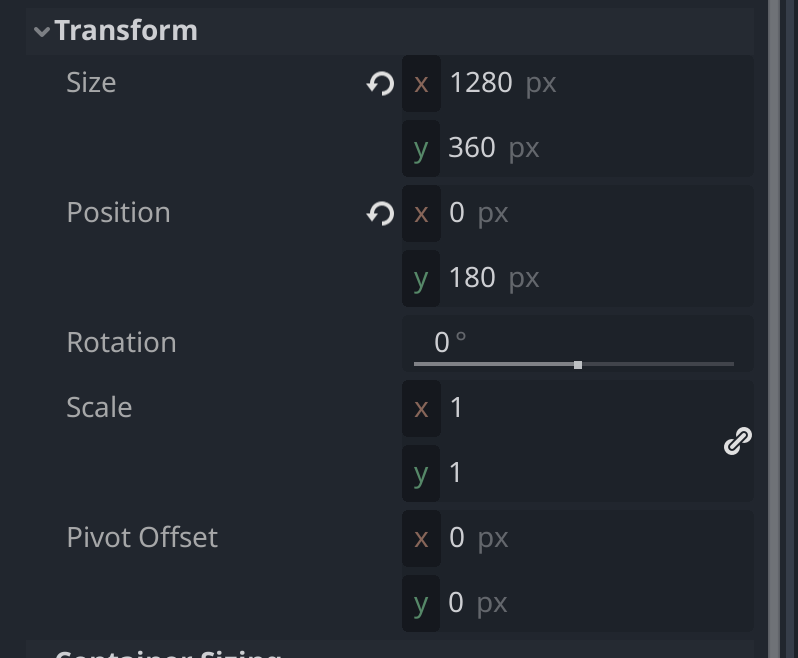

Next, scroll back up to the **Text** field and paste the following value.

```text
[center][rainbow][wave amp=50 freq=3]PAUSED[/wave][/rainbow][/center]
```

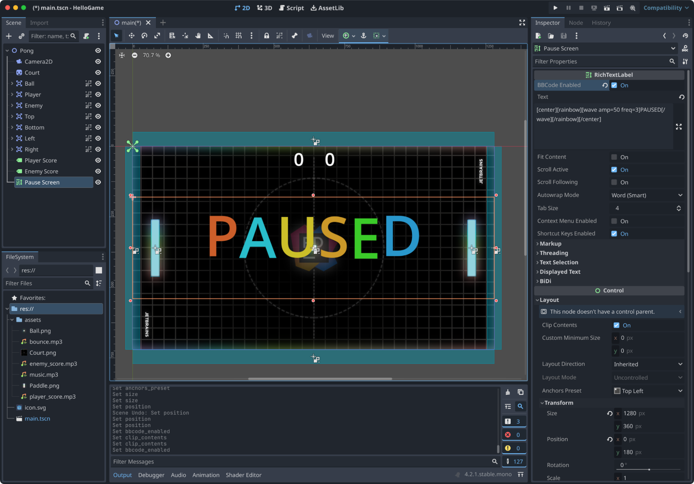

You'll now see a floating and pulsating "PAUSED" label in the middle of the playfield. There are many BBCode options to choose from, so play around here.

Since this should only appear when the game is paused, click the eyeball next to the node to hide it. Don't worry, we'll show it later with some code.


Let's add some musical elements next, and then we'll be ready to wire up some code.

### Beeps, Boops, and Music Players

Sound is integral to video games; things can feel lifeless without it. The next node we'll be adding to our game is the **AudioStreamPlayer**. It allows us to play music and side effects non-positionally. That means the music is everywhere, unlike a noise coming from a particular direction.

Right-click the root node and add **AudioStreamPlayer**.

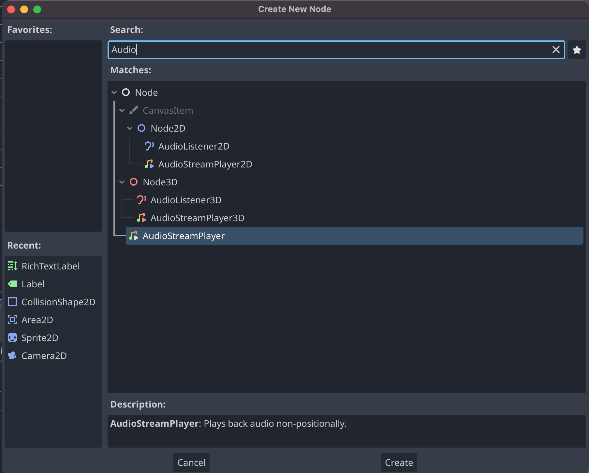

Once added, use the quick load feature to add `music.mp3`. Check the **Autoplay** checkbox to start the music as soon as the game starts. Try running your game, and you'll hear a neat retro tune.

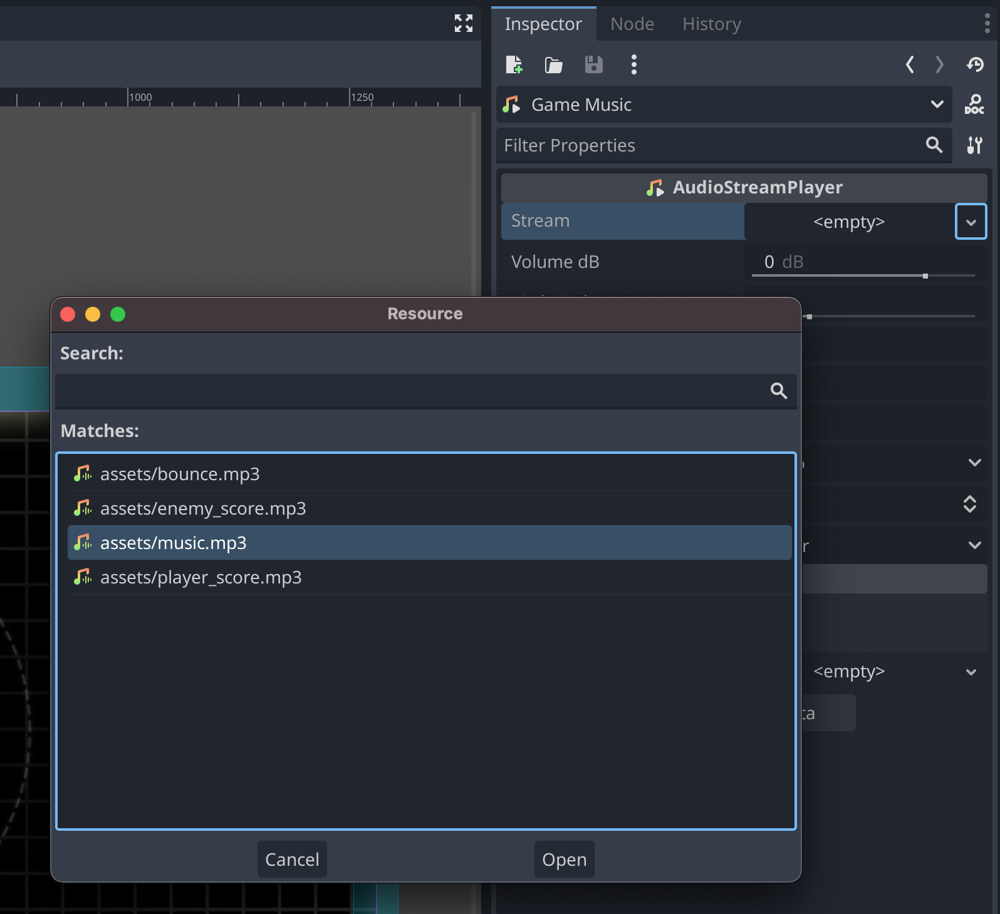

Next, we'll add **AudioStreamPlayer** nodes under the following parents: **Ball**, **Player**, and **Enemy**. You'll see why these are nested when we get to the coding part of this tutorial. Set the streams of each **AudioStreamPlayer** according to their parent.

- **Player**: `player_score.mp3`
- **Enemy**: `enemy_score.mp3`
- **Ball**: `bounce.mp3`

Your scene tree should have this structure.

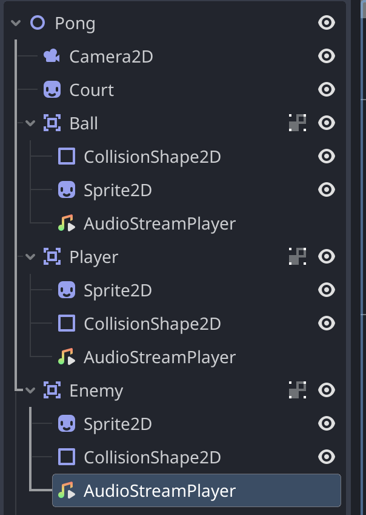

So now we've gone through building our entire **Scene Tree** and set ourselves up for success. This approach of focusing on game structure can help us stay focused on game elements and reduce context-switching between the Godot Editor and code.

Speaking of code, in the next section, we'll begin adding interactive elements to our game using C# code and JetBrains Rider.
