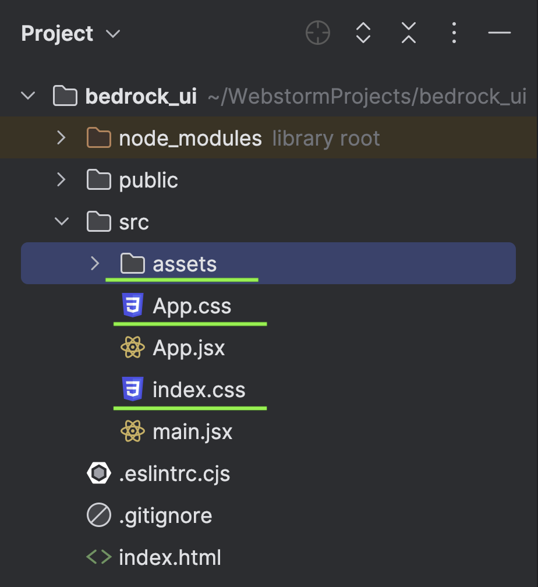
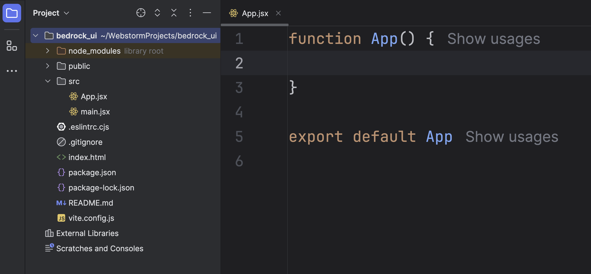
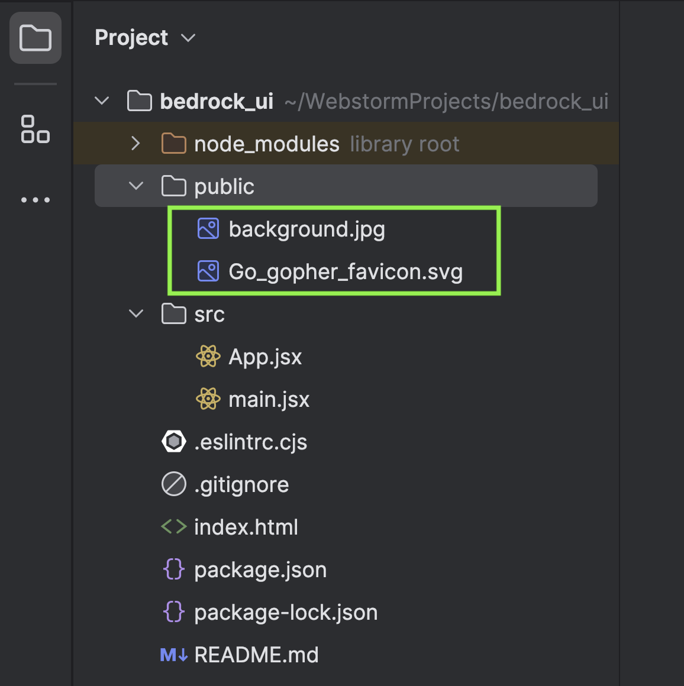
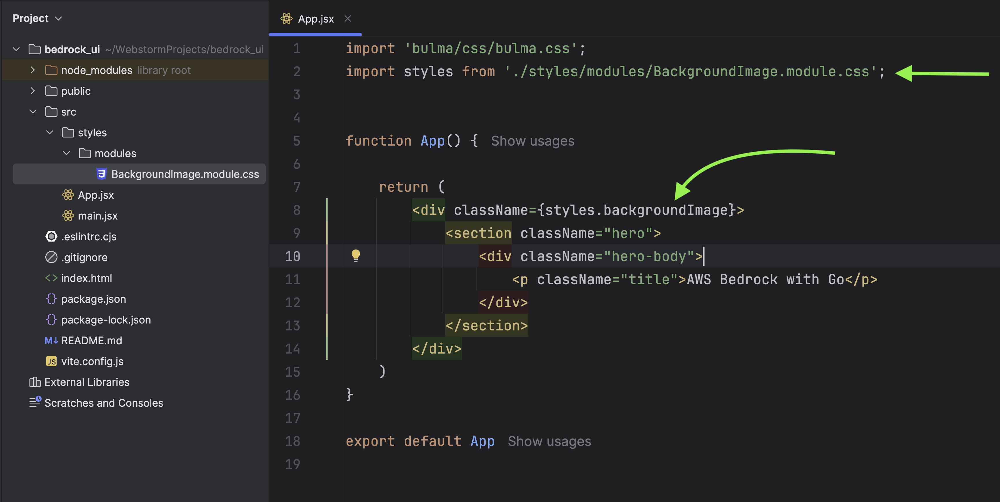
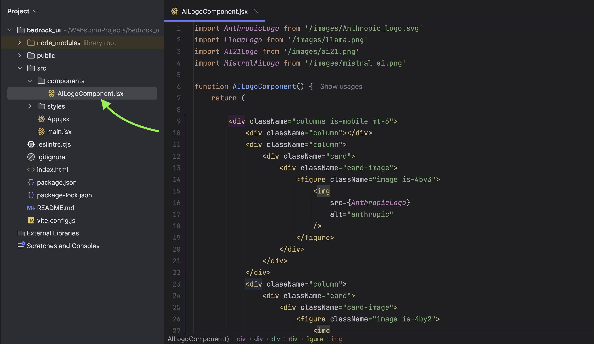
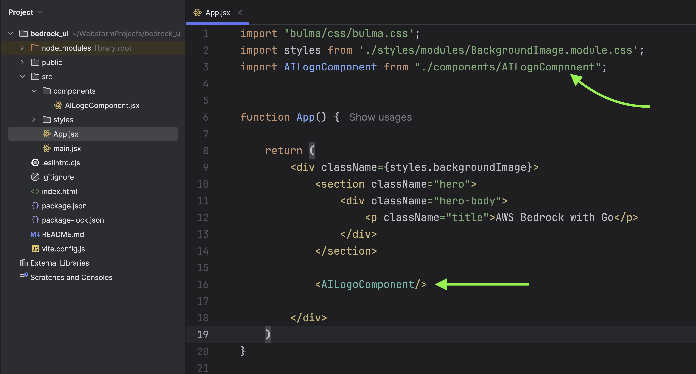

## Cleaning Stuff

First, let's remove the changes which we are not going to use in our application.

Remove `assets`, `App.css` and `index.css`.



Clean everything from `App.jsx`. Check the image below, you will get the idea.



Remove `index.css` from `main.jsx`.


Add these two logos in your `public` directory. You can download them from my [repo](https://github.com/mukulmantosh/bedrock_ui/tree/master/public).



Update `index.html` with your new favicon and title.


Now, we are good to go ahead.

## Development Time

Let's begin first by opening `App.jsx`.

The `App` is a functional React component. It returns some JSX, a syntax similar to HTML, used to define UI structures in React. When rendered, `App` displays a section with a title "AWS Bedrock with Go" inside a div. The `hero`, `hero-body`, and `title` are CSS class names used to style these elements, and these are actually coming from [Bulma](https://bulma.io/). So, make sure to import bulma at the top.


Next, we are going to set a new background image.

Create a new file `BackgroundImage.module.css` under `src/styles/modules`.

> When CSS files end with `.module.css`, they're using a feature called [CSS Modules](https://github.com/css-modules/css-modules). CSS Modules use local scope to avoid style conflicts across different project parts, allowing component-scoped styling.


Update `App.jsx` with the new styling to apply the background.



### Creating Components

We will be creating multiple components. Let's start first with showing AI-related logos in our UI.

You need to place new images under `public/images`. Download these images from my [repo](https://github.com/mukulmantosh/bedrock_ui/tree/master/public/images).


Next, create a new directory called `components` under `src`, followed up with a new file `AILogoComponent.jsx`.



In this component we are displaying a layout containing four logos.

```jsx
import AnthropicLogo from "/images/Anthropic_logo.svg";
import LlamaLogo from "/images/llama.png";
import AI21Logo from "/images/ai21.png";
import MistralAiLogo from "/images/mistral_ai.png";

function AILogoComponent() {
	return (
		<div className="columns is-mobile mt-6">
			<div className="column"></div>
			<div className="column">
				<div className="card">
					<div className="card-image">
						<figure className="image is-4by3">
							
						</figure>
					</div>
				</div>
			</div>
			<div className="column">
				<div className="card">
					<div className="card-image">
						<figure className="image is-4by2">
							
						</figure>
					</div>
				</div>
				<div className="card">
					<div className="card-image">
						<figure className="image is-4by2">
							
						</figure>
					</div>
				</div>
				<div className="card">
					<div className="card-image">
						<figure className="image is-4by2">
							
						</figure>
					</div>
				</div>
			</div>
			<div className="column"></div>
		</div>
	);
}

export default AILogoComponent;
```

We need to import the above component in our `App` component.



This is the current state of our UI. Well, you can play around and come up with your own creativity.


