## Enable Foundational Models

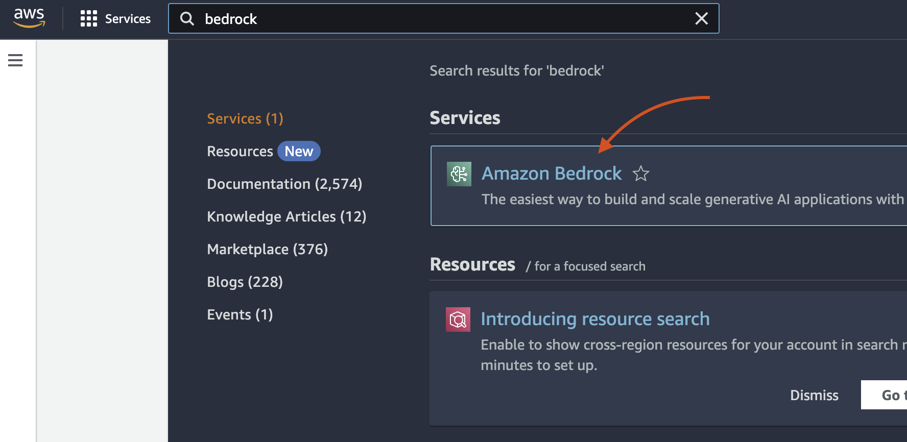

Click the hamburger menu.

Click **Model access**.

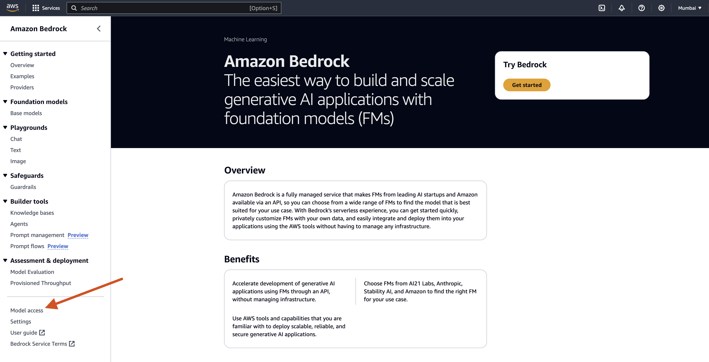

Click **Modify model access**.

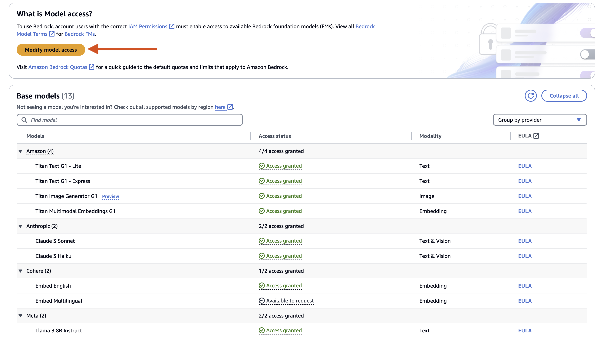

Next, choose the model which you want to enable. As you can see that our models are already enabled, and I am running them in **ap-south-1** region.

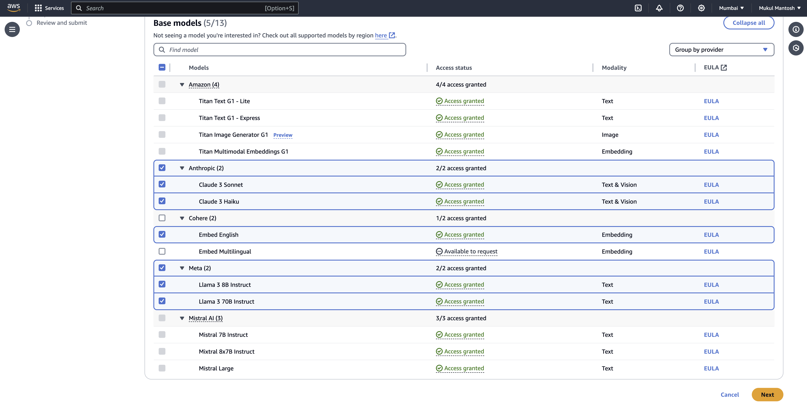

I will show you an example of enabling models in a different region like North Virginia.

I will choose Anthropic as my model and then click **Next**.

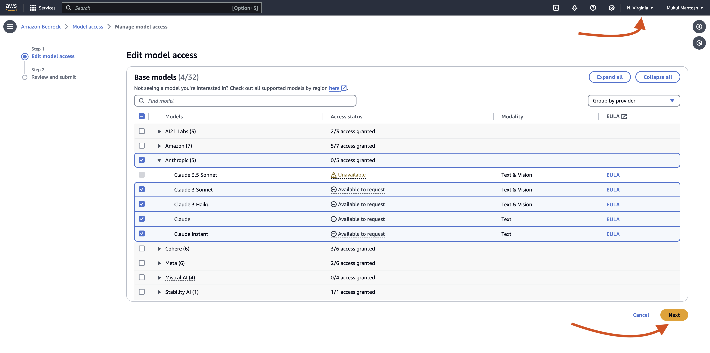

Review the specific models you want to enable/disable and finally click **Submit**.

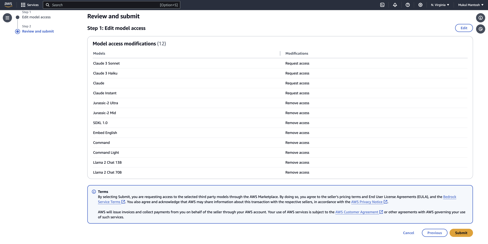

It usually takes a couple of seconds and the models will be enabled.

The availability of models is region-specific. Below the list of models is specific to North Virginia, which changes from time to time.

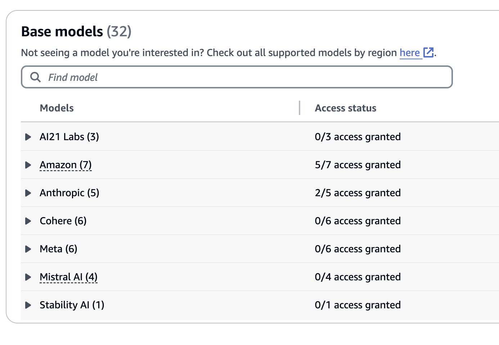

This is the example from the ap-south-1 (Mumbai) region. As you can see few models are not available in this region.

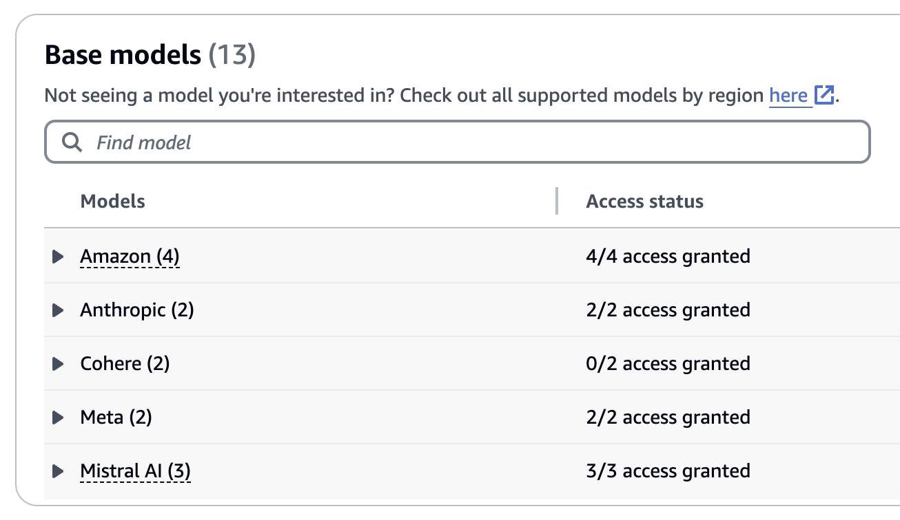

Once your model has been enabled, you can play around with **Chat/Text/Image** to test the interactivity.

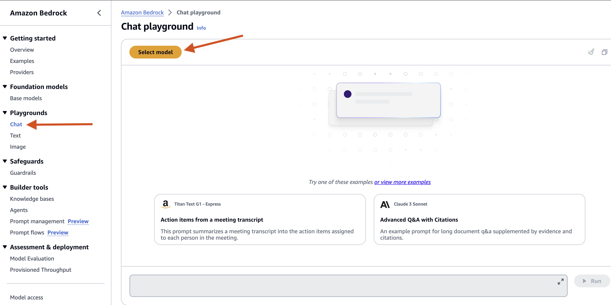

Select the specific model which you would like to explore and then click **Apply**.

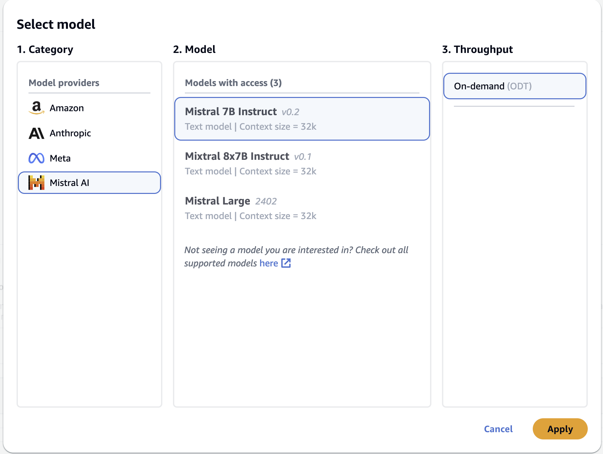

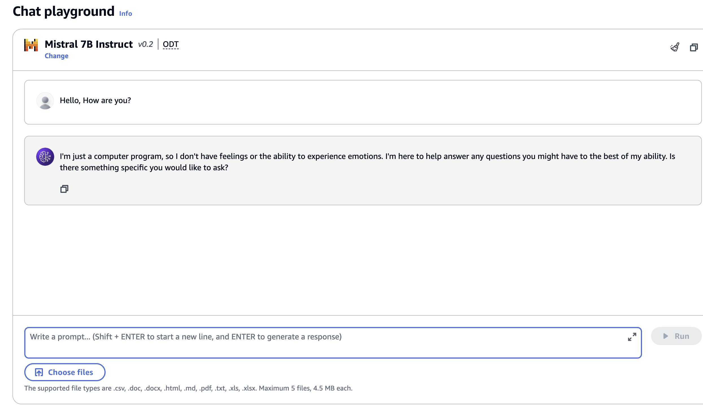

Cool! Our model is working, and now it's time to start setting up our application in Go and interact with AWS Bedrock SDK.
