In this section we will be working with Anthropic. This section is quite similar to the previous one, implementing streaming and non-streaming features.

Anthropic has multiple types of models supported like Claude 3 Sonnet, 3.5 Sonnet, Opus and Haiku. You can check [the inference parameters and code examples](https://docs.aws.amazon.com/bedrock/latest/userguide/model-parameters-claude.html).

## Anthropic Haiku

For this tutorial, we will be using Anthropic Haiku.

> _Haiku is the fastest and most cost-effective model on the market for its intelligence category. It can read an information and data dense research paper on arXiv (~10k tokens) with charts and graphs in less than three seconds._


Read more: [Claude 3 Haiku: our fastest model yet](https://www.anthropic.com/news/claude-3-haiku)

Claude consists of a family of large language models that enable you to balance intelligence, speed, and cost.

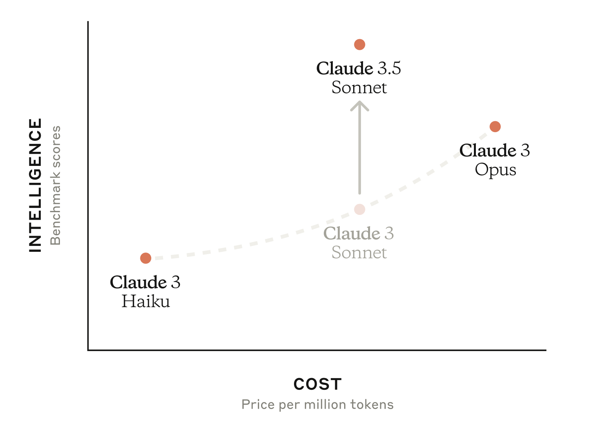

## Non-Streaming

Let's first begin by implementing the non-streaming way to interact with Anthropic.

First thing is to create a file under `models` and name it `anthropic.go`.

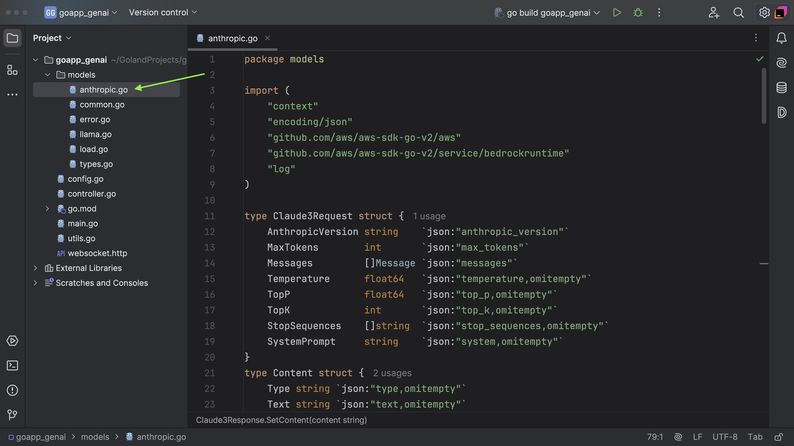

```go
package models

type Claude3Request struct {
	AnthropicVersion string    `json:"anthropic_version"`
	MaxTokens        int       `json:"max_tokens"`
	Messages         []Message `json:"messages"`
	Temperature      float64   `json:"temperature,omitempty"`
	TopP             float64   `json:"top_p,omitempty"`
	TopK             int       `json:"top_k,omitempty"`
	StopSequences    []string  `json:"stop_sequences,omitempty"`
	SystemPrompt     string    `json:"system,omitempty"`
}
type Content struct {
	Type string `json:"type,omitempty"`
	Text string `json:"text,omitempty"`
}
type Message struct {
	Role    string    `json:"role,omitempty"`
	Content []Content `json:"content,omitempty"`
}

type Claude3Response struct {
	ID              string            `json:"id,omitempty"`
	Model           string            `json:"model,omitempty"`
	Type            string            `json:"type,omitempty"`
	Role            string            `json:"role,omitempty"`
	ResponseContent []ResponseContent `json:"content,omitempty"`
	StopReason      string            `json:"stop_reason,omitempty"`
	StopSequence    string            `json:"stop_sequence,omitempty"`
	Usage           Usage             `json:"usage,omitempty"`
}
type ResponseContent struct {
	Type string `json:"type,omitempty"`
	Text string `json:"text,omitempty"`
}
type Usage struct {
	InputTokens  int `json:"input_tokens,omitempty"`
	OutputTokens int `json:"output_tokens,omitempty"`
}

type PartialResponse struct {
	Type    string                 `json:"type"`
	Message PartialResponseMessage `json:"message,omitempty"`
	Index   int                    `json:"index,omitempty"`
	Delta   Delta                  `json:"delta,omitempty"`
	Usage   PartialResponseUsage   `json:"usage,omitempty"`
}

type PartialResponseMessage struct {
	ID           string               `json:"id,omitempty"`
	Type         string               `json:"type,omitempty"`
	Role         string               `json:"role,omitempty"`
	Content      []interface{}        `json:"content,omitempty"`
	Model        string               `json:"model,omitempty"`
	StopReason   string               `json:"stop_reason,omitempty"`
	StopSequence interface{}          `json:"stop_sequence,omitempty"`
	Usage        PartialResponseUsage `json:"usage,omitempty"`
}

type PartialResponseUsage struct {
	InputTokens  int `json:"input_tokens,omitempty"`
	OutputTokens int `json:"output_tokens,omitempty"`
}

type Delta struct {
	Type       string `json:"type,omitempty"`
	Text       string `json:"text,omitempty"`
	StopReason string `json:"stop_reason,omitempty"`
}

func (r Claude3Response) SetContent(content string) {
	r.ResponseContent[0].Text = content
}
func (r Claude3Response) GetContent() string {
	return r.ResponseContent[0].Text
}

```

Let's break it down.

The `Claude3Request` struct is used to send request to Claude Haiku API.

- **AnthropicVersion** — A string indicating the version of the Anthropic API. The value must be `bedrock-2023-05-31`.
- **MaxTokens** — The maximum number of tokens to generate before stopping.
- **Messages** — An array of input messages.
- **Temperature** — The amount of randomness injected into the response.
- **TopP** — In nucleus sampling, Anthropic Claude computes the cumulative distribution over all the options for each subsequent token in decreasing probability order and cuts it off once it reaches a particular probability specified by `top_p`. You should alter either `temperature` or `top_p`, but not both.
- **TopK** — Only sample from the top K options for each subsequent token.
- **StopSequences** — Custom text sequences that cause the model to stop generating.
- **SystemPrompt** — A system prompt is a way of providing context and instructions to Anthropic Claude, such as specifying a particular goal or role.

I won't go into more details as everything is mentioned in the official documentation.

For reference, you can check out the [Claude Messages API](https://docs.aws.amazon.com/bedrock/latest/userguide/model-parameters-anthropic-claude-messages.html) and Anthropic API [Docs](https://docs.anthropic.com/en/api/getting-started).

Invoking from the CLI.

```bash
aws bedrock-runtime invoke-model \
--model-id anthropic.claude-3-haiku-20240307-v1:0 \
--body "{\"messages\":[{\"role\":\"user\",\"content\":[{\"type\":\"text\",\"text\":\"Hello\\nHello! How can I assist you today?\"}]}],\"anthropic_version\":\"bedrock-2023-05-31\",\"max_tokens\":2000,\"temperature\":1,\"top_k\":250,\"top_p\":0.999,\"stop_sequences\":[\"\\n\\nHuman:\"]}" \
--cli-binary-format raw-in-base64-out \
--region ap-south-1 \
invoke-model-output.txt
```

The sample payload will give you clarity about the above Go structs which we created.

```json
{
	"messages": [
		{
			"role": "user",
			"content": [
				{
					"type": "text",
					"text": "Hello Hello! How can I assist you today?"
				}
			]
		}
	],
	"anthropic_version": "bedrock-2023-05-31",
	"max_tokens": 2000,
	"temperature": 1,
	"top_k": 250,
	"top_p": 0.999,
	"stop_sequences": ["Human:"]
}
```

Moving ahead, we need to create a new function named `AnthropicBody`. I believe now you can relate this function with the above JSON.

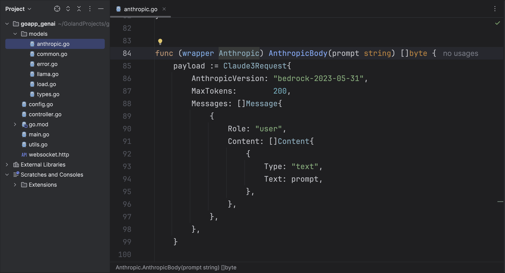

This function accepts user-provided prompt and followed up with creating a new `Claude3Request` and framing the payload based on API specification and finally returning JSON byte slice.

```go
func (wrapper Anthropic) AnthropicBody(prompt string) []byte {
	payload := Claude3Request{
		AnthropicVersion: "bedrock-2023-05-31",
		MaxTokens:        200,
		Messages: []Message{
			{
				Role: "user",
				Content: []Content{
					{
						Type: "text",
						Text: prompt,
					},
				},
			},
		},
	}

	body, err := json.Marshal(payload)
	if err != nil {
		log.Fatal(err)
	}
	return body
}

```

Moving forward, lets implemented the `Invoke` method, which is similar to the `llama3`.

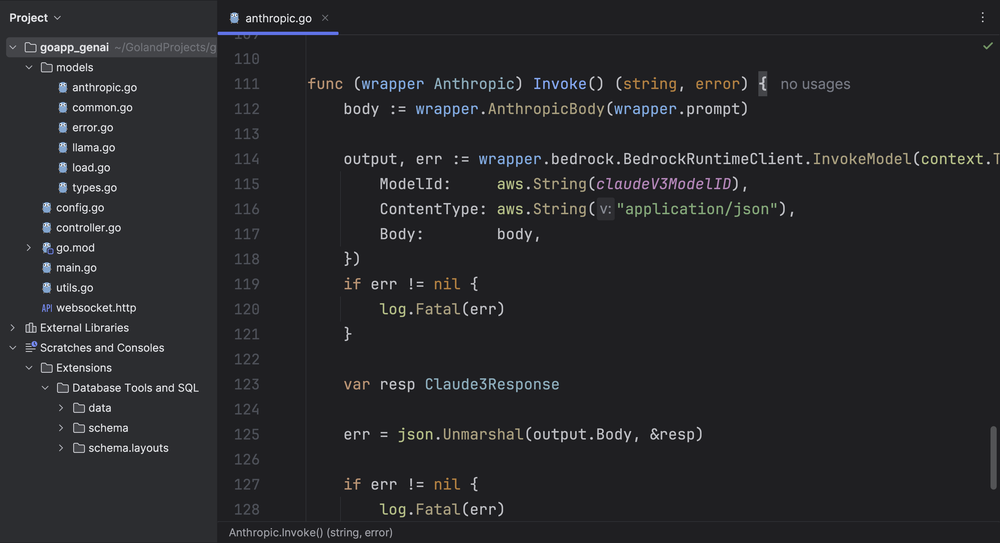

This function wraps the behavior of invoking a model using `BedrockRuntimeClient`. First, it calls `AnthropicBody` to prepare the input body. The model is then invoked using the AWS client with a `ModelId` and `ContentType` specified within `InvokeModelInput`. If the model invocation fails, a fatal error will be logged.

```go
func (wrapper Anthropic) Invoke() (string, error) {
	body := wrapper.AnthropicBody(wrapper.prompt)

	output, err := wrapper.bedrock.BedrockRuntimeClient.InvokeModel(context.TODO(), &bedrockruntime.InvokeModelInput{
		ModelId:     aws.String(claudeV3ModelID),
		ContentType: aws.String("application/json"),
		Body:        body,
	})
	if err != nil {
		log.Fatal(err)
	}

	var resp Claude3Response

	err = json.Unmarshal(output.Body, &resp)

	if err != nil {
		log.Fatal(err)
	}

	return resp.ResponseContent[0].Text, nil
}

```

Now, we will move on to add the missing logic. Earlier we handled the `llama3` - now it's time for Anthropic.

Move to `load.go` file and look for the switch case in the `LoadModel` function.

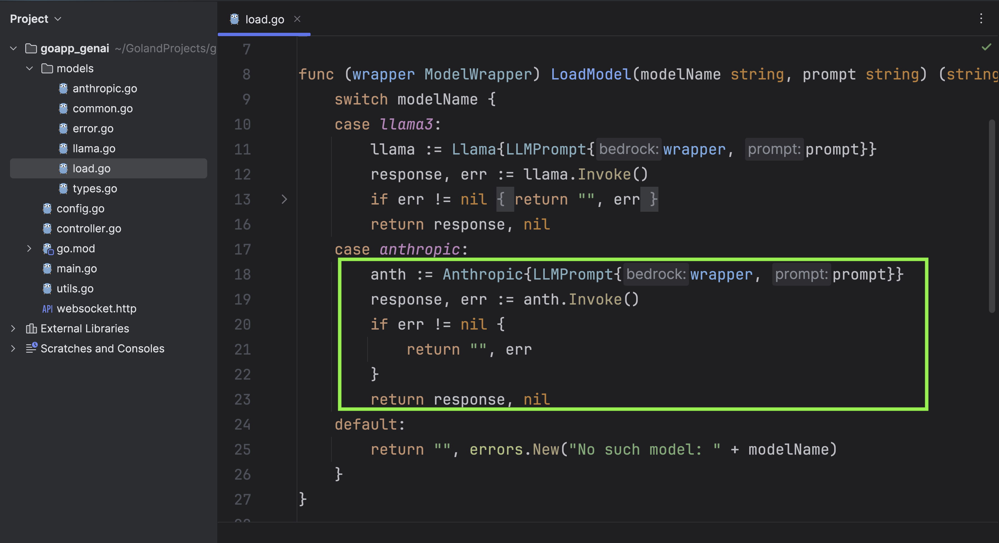

It is quite similar to what we did before. If we receive the model name as anthropic from WebSocket, then we invoke the respective model.

```go
	case anthropic:
		anth := Anthropic{LLMPrompt{wrapper, prompt}}
		response, err := anth.Invoke()
		if err != nil {
			return "", err
		}
		return response, nil
```

Well, we are all set. As you know, in the previous we have already generalized our `controller` which can invoke the model dynamically, as we pass the model name through query params.

Now, go ahead and start your server.

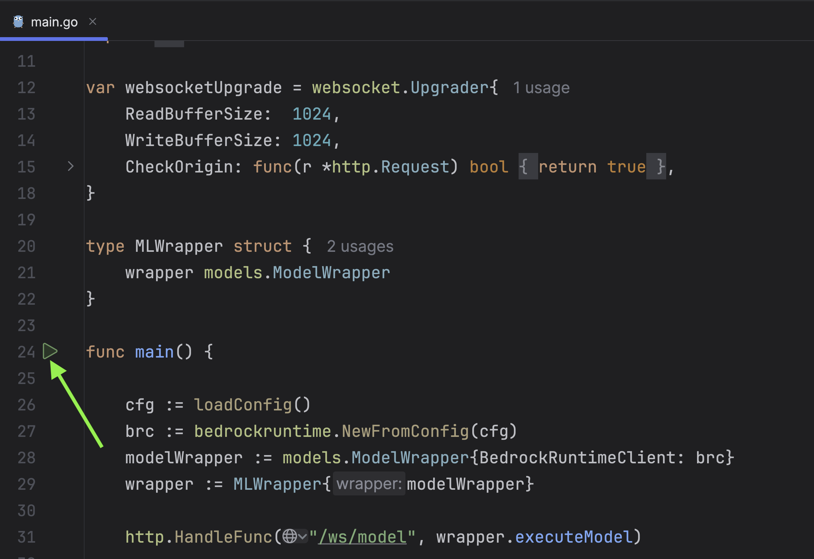

Next, open the `websocket.http` file which we created earlier and pass `model=anthropic` and `streaming=0` because we are working on the non-streaming part.

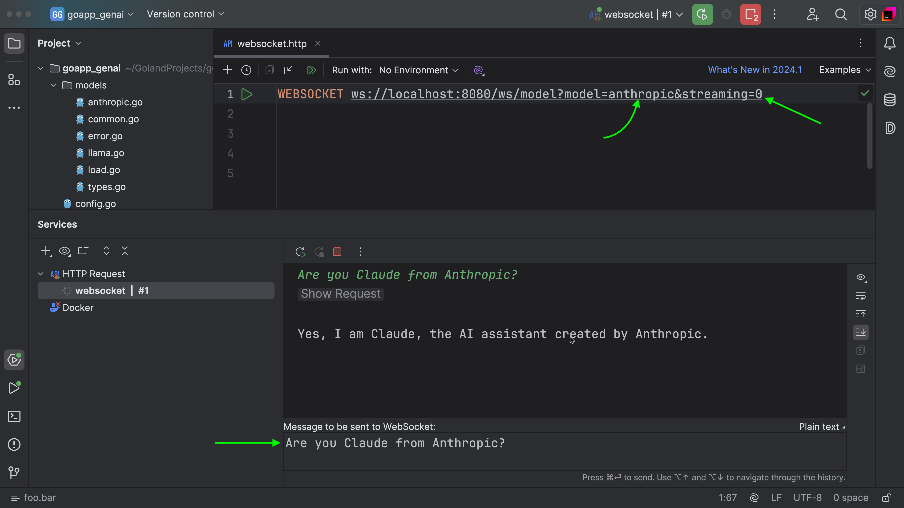

WooHoo! It worked. You will observe the response time is faster compared to `llama3`. But we can observe more speed once we implement the streaming part. Let's go ahead.

## Streaming

Open `anthropic.go` and create a new function called `Stream()`.

This is similar to what we did for `llama3`.


This function is attached to the `Anthropic` struct. It prepares a JSON payload with the `AnthropicBody()` function and sends a request to `BedrockRuntimeClient.InvokeModelWithResponseStream`. If any errors occur during the model invocation, they're processed for more meaningful error messages with the `ProcessError()` function and if everything is working as per expectation, then it returns the response stream.

```go
func (wrapper Anthropic) Stream() (*bedrockruntime.InvokeModelWithResponseStreamOutput, error) {
	body := wrapper.AnthropicBody(wrapper.prompt)

	output, err := wrapper.bedrock.BedrockRuntimeClient.InvokeModelWithResponseStream(context.TODO(), &bedrockruntime.InvokeModelWithResponseStreamInput{
		ModelId:     aws.String(claudeV3ModelID),
		ContentType: aws.String("application/json"),
		Body:        body,
	})

	if err != nil {
		ProcessError(err, claudeV3ModelID)
	}
	return output, nil

}

```

Moving forward, update the `LoadStreamingModel` function in `load.go`.

As you can see we have already handled the `llama3`. Now the switch condition will tackle anthropic as well.

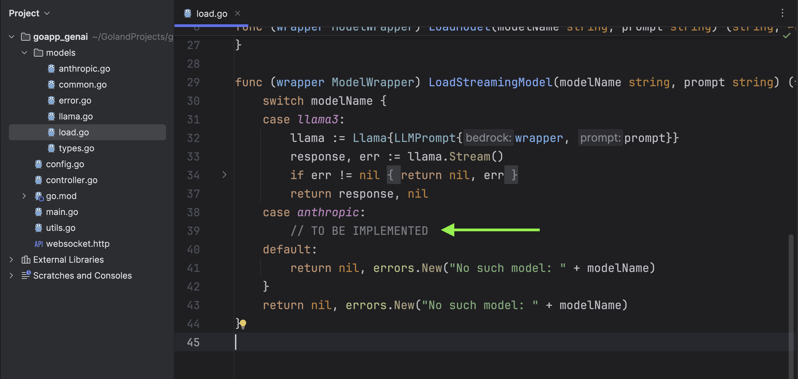

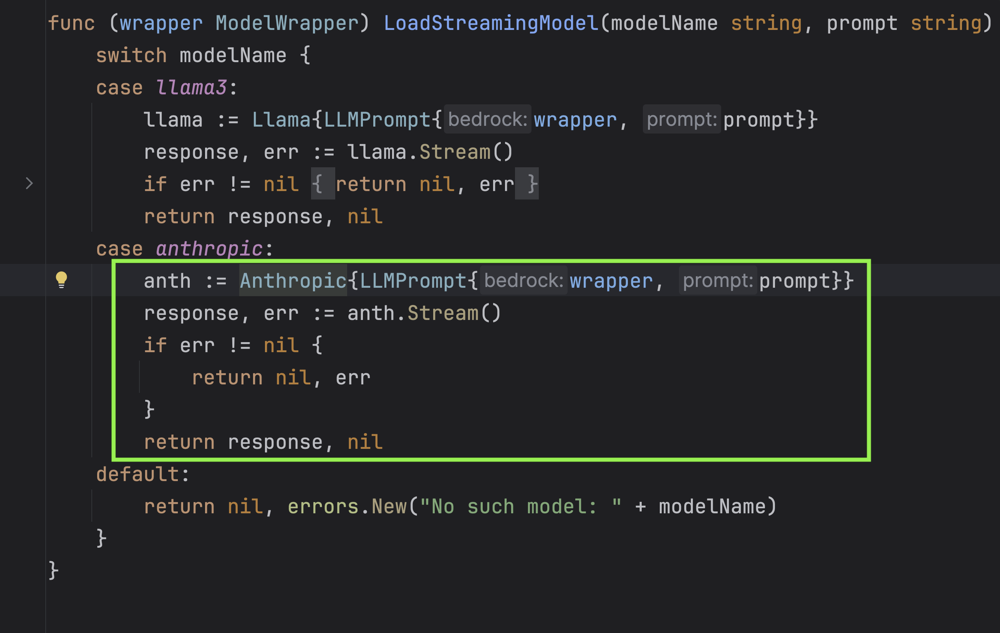

The code snippet is part of a function that handles loading and calling different models based on their names. In this specific case, when the model name is `anthropic`, an `Anthropic` object is created, and its `Stream` method is called, which tries to invoke the model and returns a streamed response.

```go
		anth := Anthropic{LLMPrompt{wrapper, prompt}}
		response, err := anth.Stream()
		if err != nil {
			return nil, err
		}
		return response, nil
```

Moving further, we need to create a new function `ProcessAnthropicStreamingOutput` in `anthropic.go`.

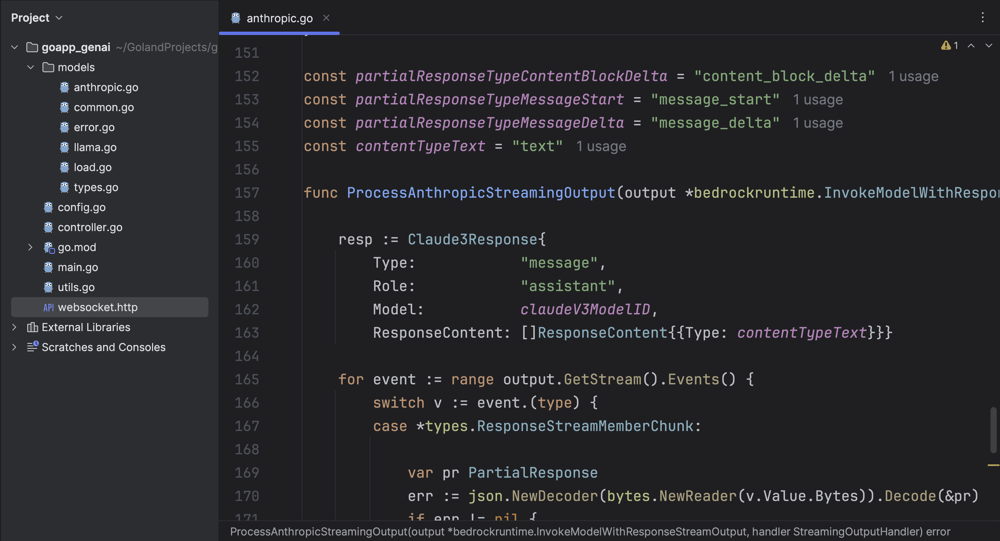

This function processes a continuous stream of data output (`output`) from an invoked model with response stream (response from `Stream()` function), and handles it using a `StreamingOutputHandler` named handler.

- The function starts by creating a `Claude3Response` struct with some preset values. This struct is designed to handle a specific type of response.

- Next, the function enters a loop where it processes each event from the streaming output. These events are expected to be of different types, hence a switch statement is used to handle different cases.

- If an event is of type `ResponseStreamMemberChunk`, it is processed, and a JSON decoder is used to decode the event value into a `PartialResponse` struct.

- The system then checks the Type of the `PartialResponse`. Depending on its value, one of the following actions could be performed:

  - If the type is `partialResponseTypeContentBlockDelta`, the handler function is called with the `pr.Delta.Text`.
  - If it's `partialResponseTypeMessageStart`, several fields in the initial response are updated with values from this partial response.
  - If it's `partialResponseTypeMessageDelta`, again some fields in the response are updated.

- If the event is of type `UnknownUnionMember`, an error is returned stating that an unknown tag was found.

- If the event doesn't match any of the expected types, falling under the default case, an error is returned noting that the `union` is `nil` or is of an unknown type.

Once all the events from the stream have been processed, the function ends and returns `nil`, indicating that there were no errors.

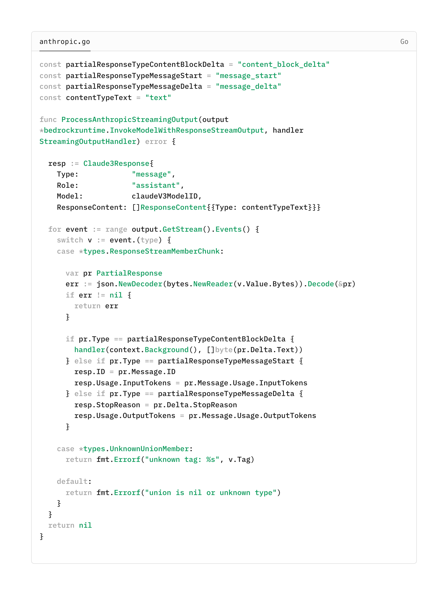

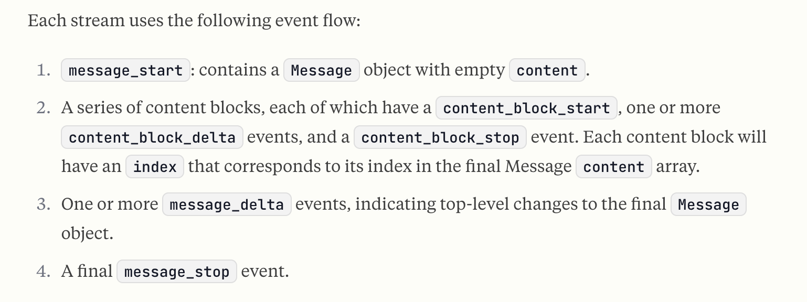

> Interested to know more on streaming, then check the following [Anthropic API Reference - Streaming Messages](https://docs.anthropic.com/en/api/messages-streaming)

Coming to the final part, where we need to update the switch case to handle streaming functionality for anthropic.

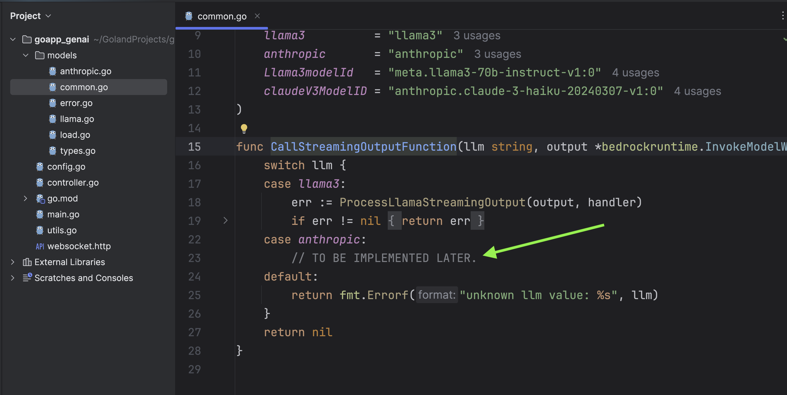

Update `CallStreamingOutputFunction` under `common.go`.

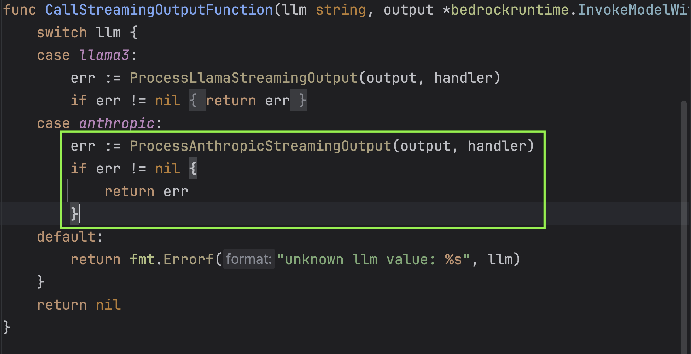

```go
func CallStreamingOutputFunction(llm string, output *bedrockruntime.InvokeModelWithResponseStreamOutput, handler StreamingOutputHandler) error {
	switch llm {
	case llama3:
		err := ProcessLlamaStreamingOutput(output, handler)
		if err != nil {
			return err
		}
	case anthropic:
		err := ProcessAnthropicStreamingOutput(output, handler)
		if err != nil {
			return err
		}
	default:
		return fmt.Errorf("unknown llm value: %s", llm)
	}
	return nil
}
```

Well, we are all set to launch. Make sure to start your server and head over to the `websocket.http` file.

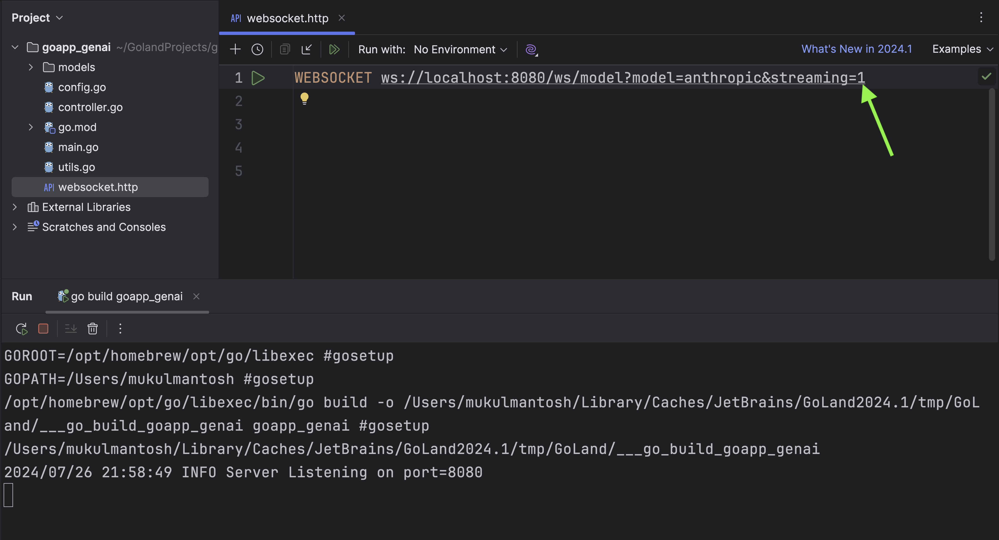

<video width="1366" height="768" controls>
  <source src="./images/anthropic_streaming.webm" type="video/webm">
  Your browser does not support the video tag.
</video>

Yes! We did it. You can play around and see what kind of response you get from these LLM models.😉

In the following section, we’ll build a frontend app using React and integrate it with our Go application.
