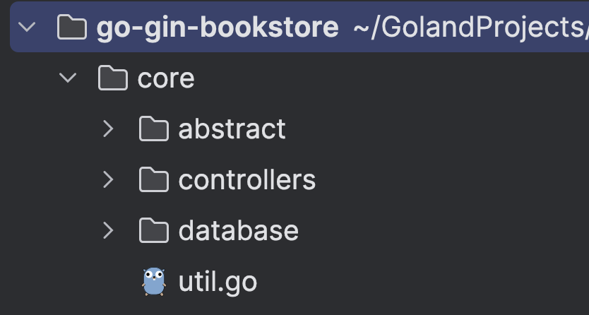
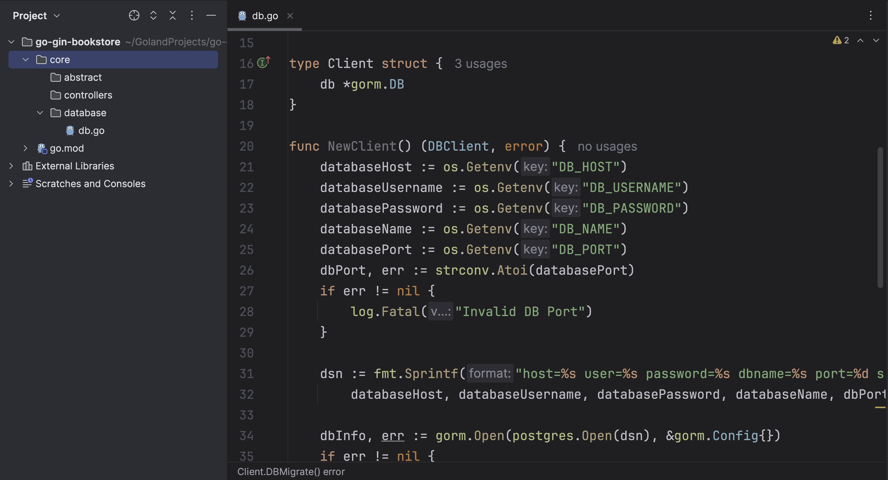
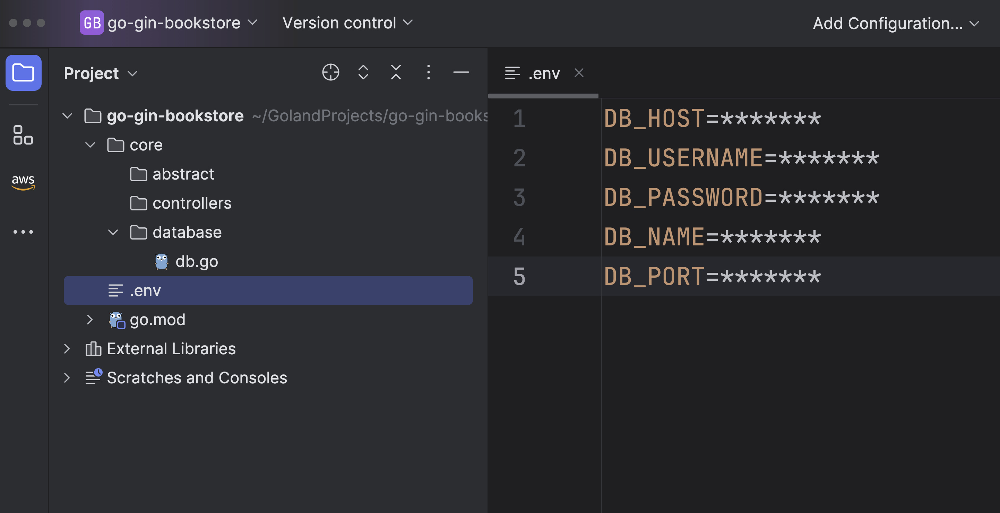
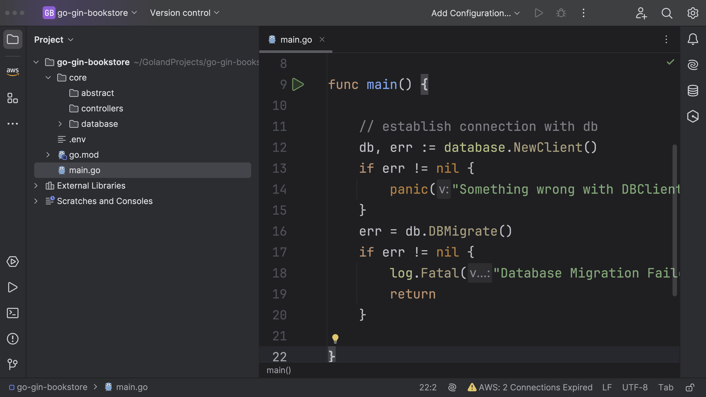

This section holds significant importance as we'll be implementing major components such as database connections and creating new GORM models.

## Database Connection

Let's first create a database connection.
But before that you need to create
additional directories under the `core`.



- `abstract` - Contains interface, part of the interaction layer in a database-oriented application,
  often in combination with an ORM library like gorm.
- `controllers` - Stores all the HTTP handlers and routes.
- `database` - Initializing db connection and GORM models.
- `util.go` - re-usable code shared across the application.

Create `db.go` file under `database` directory.



_db.go_

```go
package database

import (
	"fmt"
	"gorm.io/driver/postgres"
	"gorm.io/gorm"
	"log"
	"os"
	"strconv"
)

type DBClient interface {
	DBMigrate() error
}

type Client struct {
	db *gorm.DB
}

func NewClient() (DBClient, error) {
	databaseHost := os.Getenv("DB_HOST")
	databaseUsername := os.Getenv("DB_USERNAME")
	databasePassword := os.Getenv("DB_PASSWORD")
	databaseName := os.Getenv("DB_NAME")
	databasePort := os.Getenv("DB_PORT")
	dbPort, err := strconv.Atoi(databasePort)
	if err != nil {
		log.Fatal("Invalid DB Port")
	}

	dsn := fmt.Sprintf("host=%s user=%s password=%s dbname=%s port=%d sslmode=%s",
		databaseHost, databaseUsername, databasePassword, databaseName, dbPort, "disable")

	dbInfo, err := gorm.Open(postgres.Open(dsn), &gorm.Config{})
	if err != nil {
		return nil, err
	}

	client := Client{db: dbInfo}
	return client, nil
}

func (c Client) DBMigrate() error {
	return nil

}

func (c Client) CloseDBConnection() {
	db, err := c.db.DB()
	if err != nil {
		panic("Failed to close connection from database")
	}
	db.Close()
}

```

1. `type DBClient` interface - This interface defines what methods a `DBClient` should have. In this case, it is `DBMigrate()` error, which is a method for migrating the database. The exact implementation of `DBMigrate()` is left to the structs that implement the `DBClient` interface.
   <br><br>
2. `type Client` struct - This struct contains a pointer to a GORM DB object. This is the main object that the application will use to interact with the database.
   <br><br>
3. `func NewClient() (DBClient, error)` - This function initializes a new Client object. It reads environment variables to get the database connection details (host, username, password, database name, and port). It then uses these details to open a new connection to the postgres database. If successful, it returns a client that implements the `DBClient` interface (since Client struct implements `DBMigrate()` method from DBClient interface). If not successful, it returns an error.
   <br><br>
4. `func (c Client) DBMigrate() error` - This is a "placeholder" method for the database migration operation. In this structure, it just returns nil signifying no error. However, in a real application, you would put the code to migrate your database here. We will be covering migration in HTTP Handler section.
   <br><br>
5. `func (c Client) CloseDBConnection()` - This method is used to close the db connection.

Next, make sure to update the environment variables.

```go
databaseHost := os.Getenv("DB_HOST")
databaseUsername := os.Getenv("DB_USERNAME")
databasePassword := os.Getenv("DB_PASSWORD")
databaseName := os.Getenv("DB_NAME")
databasePort := os.Getenv("DB_PORT")
```



Now, create `main.go` under project root.



The `main()` function is the program entry point. We are going to initialize the database, migrate db tables etc.

```go
package main

import (
	_ "github.com/joho/godotenv/autoload"
	"go-gin-bookstore/core/database"
	"log"
)

func main() {

	// establish connection with db
	db, err := database.NewClient()
	if err != nil {
		panic("Something wrong with DBClient")
	}
	err = db.DBMigrate()
	if err != nil {
		log.Fatal("Database Migration Failed!")
		return
	}

}
```

Once our models are prepared, we'll proceed to implement `db.DBMigrate()`. This will occur in HTTP Handler section.

## Defining Models

### Book Model

Let's begin by creating our `Book` model.


_models/book.go_

```go
package models

import (
	"gorm.io/gorm"
	"time"
)

// DateParser interface wraps the ParsePublicationDate method
type DateParser interface {
	ParsePublicationDate() (time.Time, error)
}

type Book struct {
	gorm.Model
	Id              int64     `json:"ID" gorm:"primaryKey"`
	Title           string    `json:"title" binding:"required"`
	ISBN            string    `json:"isbn" binding:"required"`
	Image           string    `json:"image,omitempty"`
	PublicationDate time.Time `json:"publication_date" binding:"required"`
}

type BookParams struct {
	Id              int64  `json:"id"`
	Title           string `json:"title"`
	ISBN            string `json:"isbn"`
	PublicationDate string `json:"publication_date"`
}

// ParsePublicationDate Implementing the DateParser interface
func (params BookParams) ParsePublicationDate() (time.Time, error) {
	return ValidateDate(params.PublicationDate)
}

type UpdateBookParams struct {
	Title           string `json:"title" binding:"required"`
	ISBN            string `json:"isbn" binding:"required"`
	PublicationDate string `json:"publication_date" binding:"required"`
}

// ParsePublicationDate Implementing the DateParser interface
func (params UpdateBookParams) ParsePublicationDate() (time.Time, error) {
	return ValidateDate(params.PublicationDate)
}

func ValidateDate(pubDate string) (time.Time, error) {
	standardFormat := "2006-01-02" // This layout represents the date format "YYYY-MM-DD"
	date, err := time.Parse(standardFormat, pubDate)
	if err != nil {
		return time.Time{}, err
	}
	return date, nil
}

```

In this Go struct, we have the following fields:

- `gorm.Model` - this is an embedded field. It means that the Book struct includes all the fields defined in gorm.
- `Id` - This is an integer (int64) field that represents the unique identifier of a book.
- `Title` - This is a string field representing the title of a book.
- `ISBN` - This is another string field which stands for International Standard Book Number.
- `Image` - This is a string that might contain a link or path to the image of the book cover.
- `PublicationDate` - This is of type `time.Time`, storing the book's publication date.

```go
type BookParams struct {
	Id              int64  `json:"id"`
	Title           string `json:"title"`
	ISBN            string `json:"isbn"`
	PublicationDate string `json:"publication_date"`
}
```

The following structs will be used specifically for creating/updating book.

```go
type BookParams struct {
	Id              int64  `json:"id"`
	Title           string `json:"title"`
	ISBN            string `json:"isbn"`
	PublicationDate string `json:"publication_date"`
}
```

```go
type UpdateBookParams struct {
	Title           string `json:"title" binding:"required"`
	ISBN            string `json:"isbn" binding:"required"`
	PublicationDate string `json:"publication_date" binding:"required"`
}
```

This is an interface that declares the `ParsePublicationDate` method. Any type that defines
this method is said to satisfy the `DateParser` interface. This method returns a `time.Time` type and an error.

```go
type DateParser interface {
	ParsePublicationDate() (time.Time, error)
}
```

- `ParsePublicationDate`: This function, defined for both `BookParams` and `UpdateBookParams`,
  uses the `ValidateDate` function to attempt to parse the `PublicationDate` string
  property and convert it to a `time.Time` type.
  <br><br>
- `ValidateDate`: This function takes a string argument representing a date and attempts
  to parse it into a `time.Time` type using the standard date format "2006-01-02"
  (which represents "YYYY-MM-DD"). If successful, the parsed date and a nil error are
  returned; if unsuccessful, the zero value for `time.Time` and the error are returned.

```go
// ParsePublicationDate Implementing the DateParser interface
func (params UpdateBookParams) ParsePublicationDate() (time.Time, error) {
	return ValidateDate(params.PublicationDate)
}

func ValidateDate(pubDate string) (time.Time, error) {
	standardFormat := "2006-01-02" // This layout represents the date format "YYYY-MM-DD"
	date, err := time.Parse(standardFormat, pubDate)
	if err != nil {
		return time.Time{}, err
	}
	return date, nil
}
```

### Author Model

- The `Author` struct: The `Id` and `Name` fields represent the unique identifier and name of an author, respectively.
  <br>
  The Books field is of type `[]Book`, which suggests that an author can have multiple books associated with them. The tag `gorm:"many2many:author_books;"` specifies a many-to-many relationship between books and authors.
  <br><br>
- The `AuthorBook` struct: This is used to model the many-to-many relationship between authors and books. It includes fields AuthorID and BookID, and the `binding:"required"` tag indicates that these fields are mandatory.


```go
package models

import "gorm.io/gorm"

type Author struct {
	gorm.Model
	Id    int64  `json:"ID" gorm:"primaryKey"`
	Name  string `json:"name" binding:"required"`
	Books []Book `gorm:"many2many:author_books;"`
}

type AuthorBook struct {
	AuthorID int64 `json:"author_id" binding:"required"`
	BookID   int64 `json:"book_id" binding:"required"`
}
```

### Customer & Review Model


- **Customer**: Represents a Customer with ID, FirstName, LastName, Email, PhoneNumber, and Address as properties. The struct tag `binding:"required"` indicates that these fields must be provided.
- **Review**: Represents a review completed by a customer on a book. It includes the ID of the customer and the book, a rating, and a comment. There are also references to the `Customer` and `Book` structures, creating a one-to-many relationship through the keys CustomerID and BookID.
- **ReviewParams**: A helper struct to validate incoming requests data when creating a book review. It has CustomerID, BookID, Rating, and Comment fields, all of which are required except Comment.
- **CustomerParams**: A helper struct to validate incoming requests data when creating a new customer.
- **ReviewList**: A simplified version of review probably used while sending reviews info in responses.

The `gorm:"foreignKey:CustomerID"` and `gorm:"foreignKey:BookID"` tags in review struct inform the ORM about the relational mapping between the models. The `json:"-"` tag means this field won't be serialized when the struct is converted to JSON.

```go
package models

import "gorm.io/gorm"

type Customer struct {
	gorm.Model
	Id          int64  `json:"ID" gorm:"primaryKey"`
	FirstName   string `json:"first_name" binding:"required"`
	LastName    string `json:"last_name" binding:"required"`
	Email       string `json:"email" binding:"required"`
	PhoneNumber string `json:"phone_number" binding:"required"`
	Address     string `json:"address" binding:"required"`
}

type Review struct {
	gorm.Model
	CustomerID int64    `json:"customer_id" binding:"required"`
	BookID     int64    `json:"book_id" binding:"required"`
	Rating     int      `json:"rating" binding:"required"`
	Comment    string   `json:"comment,omitempty"`
	Customer   Customer `gorm:"foreignKey:CustomerID" json:"-"`
	Book       Book     `gorm:"foreignKey:BookID" json:"-"`
}

type ReviewParams struct {
	CustomerID int64  `json:"customer_id" binding:"required"`
	BookID     int64  `json:"book_id" binding:"required"`
	Rating     int    `json:"rating" binding:"required" validate:"min=1,max=5"`
	Comment    string `json:"comment,omitempty" binding:"required"`
}

type CustomerParams struct {
	FirstName string `json:"first_name" binding:"required"`
	LastName  string `json:"last_name" binding:"required"`
	Address   string `json:"address" binding:"required"`
}

type ReviewList struct {
	Id      int64  `json:"id"`
	Rating  int    `json:"rating"`
	Comment string `json:"comment"`
}

```
