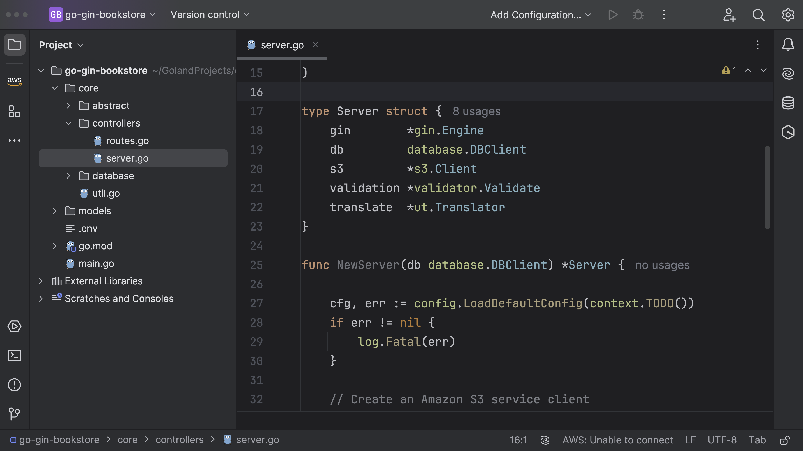
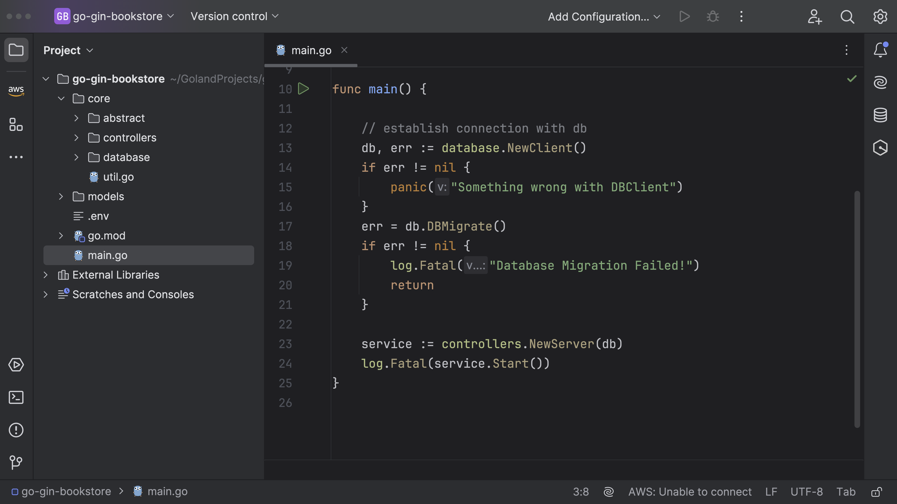

## Creating Server

We will be creating a new server.



```go


type Server struct {
	gin        *gin.Engine
	db         database.DBClient
	s3         *s3.Client
	validation *validator.Validate
	translate  *ut.Translator
}

func NewServer(db database.DBClient) *Server {

	cfg, err := config.LoadDefaultConfig(context.TODO())
	if err != nil {
		log.Fatal(err)
	}

	// Create an Amazon S3 service client
	client := s3.NewFromConfig(cfg)
	newValidator := validator.New()
	server := &Server{
		gin:        gin.Default(),
		db:         db,
		s3:         client,
		validation: newValidator,
		translate:  registerTranslation(newValidator),
	}
	server.endpoints()
	return server
}

func (s *Server) Start() error {
	slog.Info("serving at port 8080")
	err := s.gin.Run(":8080")
	if err != nil {
		log.Fatalf("Server Issue: %s", err)
		return err
	}
	return nil
}

func registerTranslation(validation *validator.Validate) *ut.Translator {
	// Create a new instance of the universal translator
	uni := ut.New(en.New())
	trans, _ := uni.GetTranslator("en")
	// Register translations for English
	if err := entranslations.RegisterDefaultTranslations(validation, trans); err != nil {
		panic(err)
	}
	return &trans
}

```

Let me first breakdown the `Server` struct.

- gin for HTTP services.
- db package for handling database operations.
- s3 which is a client for interacting with Amazon S3.
- validator for data validation tasks.
- ut (which seems to be universal-translator package) for localization.

Firstly, a `Server` struct is defined that encapsulates services and clients needed by the server.

Then, a `NewServer` function is provided to bootstrap a new instance of Server.
It loads default configuration, creates an S3 client, sets a default gin engine,
and a new validator. It also registers translations and attaches endpoints to the server.
`Start` method on the server is for starting the gin server at specified port
(8080 in this case). If there is an error when running the server, it will log
the error and return it.

`registerTranslation` function generates a translator for a given validator. Here, english translations are registered.

`endpoints` is a method on server which calls helper functions (`bookRoute`, `authorRoute`, `customerRoute`, `reviewRoute`) to attach various routes (endpoints) to the server.
Each of these routing functions likely configures a series of HTTP endpoints
pertaining to individual topics (like books, authors, customers, reviews). For example,
bookRoute might configure endpoints for creating, listing, updating, and deleting
books as well as uploading book cover.

## Routes


Next, we will create a common route, and name it _routes.go_.

```go
package controllers

func (s *Server) endpoints() {
	bookRoute(s)
	authorRoute(s)
	customerRoute(s)
	reviewRoute(s)
}
func bookRoute(s *Server) {

}
func authorRoute(s *Server) {

}
func customerRoute(s *Server) {

}
func reviewRoute(s *Server) {

}

```

This function is method of `Server` type that seemingly initialize the
HTTP routes or endpoints for the web server. Each function (bookRoute,
authorRoute, etc.) is passed a pointer to the Server instance and presumably
sets up routes related to a specific entity (e.g., books, authors, customers,
reviews). Currently, the function is empty, we will come back to this later to
update it. Once we start working on the controllers.

## Update main.go

Lets comeback to `main.go` and update the functionality.


Within the main function, the initial lines are creating a new connection
to a database using a function `NewClient()` that belongs to a package named database.
The `NewClient()` function returns two values, db which is the initialized database
client, and err which is an error object in case any error occurs during the execution
of the `NewClient()` function.

```go
db, err := database.NewClient()
	if err != nil {
		panic("Something wrong with DBClient")
	}
```

Next, the script tries to perform a database migration using a method
called `DBMigrate()`. If you remember, we haven't implemented this function. Let's do it.

```go
err = db.DBMigrate()
	if err != nil {
		log.Fatal("Database Migration Failed!")
		return
	}
```

Post migration, the code sets up a new server (presumably with some form of routing, etc., defined within controllers.NewServer(db)), passing our database client db to this new server.

```go
service := controllers.NewServer(db)
log.Fatal(service.Start())
```

Finally, it attempts to start this server with service.Start(). If there's an error in starting the service, it logs a fatal error, indicating service start failure.
