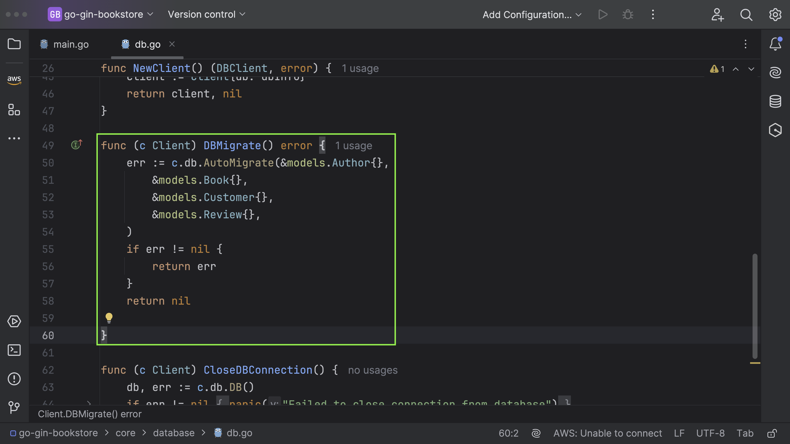
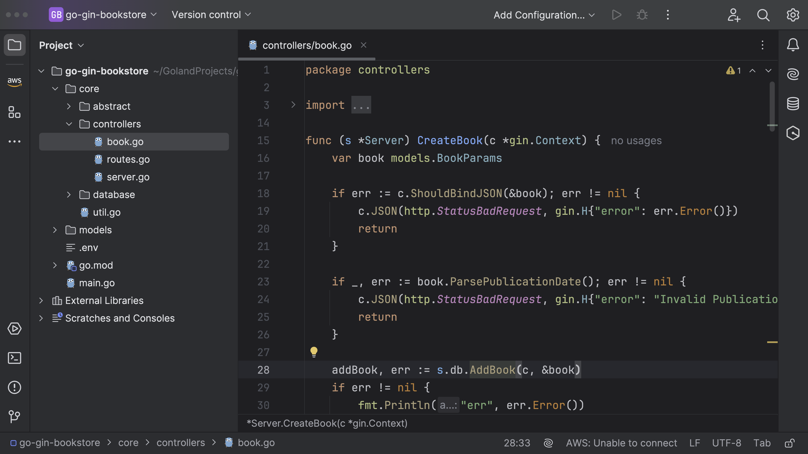
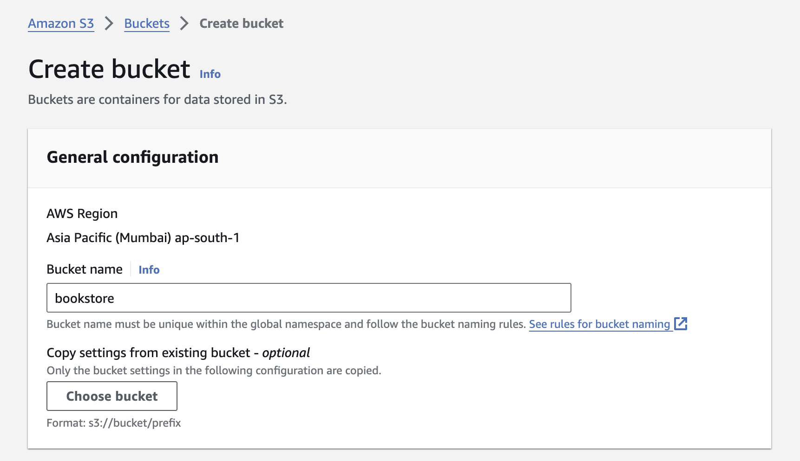
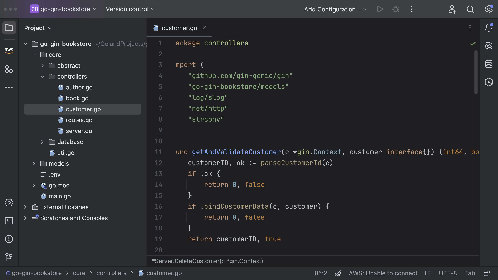
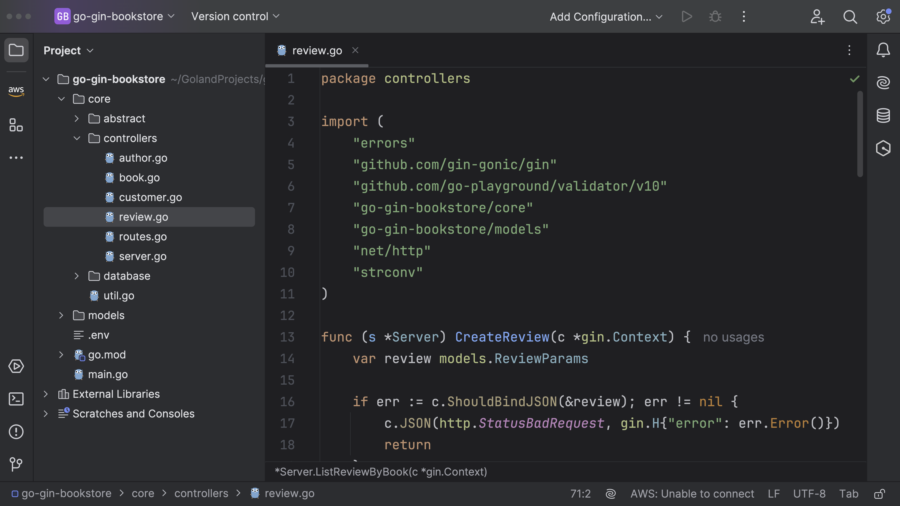

## Creating Server

We will be creating a new server.


```go


type Server struct {
	gin        *gin.Engine
	db         database.DBClient
	s3         *s3.Client
	validation *validator.Validate
	translate  *ut.Translator
}

func NewServer(db database.DBClient) *Server {

	cfg, err := config.LoadDefaultConfig(context.TODO())
	if err != nil {
		log.Fatal(err)
	}

	// Create an Amazon S3 service client
	client := s3.NewFromConfig(cfg)
	newValidator := validator.New()
	server := &Server{
		gin:        gin.Default(),
		db:         db,
		s3:         client,
		validation: newValidator,
		translate:  registerTranslation(newValidator),
	}
	server.endpoints()
	return server
}

func (s *Server) Start() error {
	slog.Info("serving at port 8080")
	err := s.gin.Run(":8080")
	if err != nil {
		log.Fatalf("Server Issue: %s", err)
		return err
	}
	return nil
}

func registerTranslation(validation *validator.Validate) *ut.Translator {
	// Create a new instance of the universal translator
	uni := ut.New(en.New())
	trans, _ := uni.GetTranslator("en")
	// Register translations for English
	if err := entranslations.RegisterDefaultTranslations(validation, trans); err != nil {
		panic(err)
	}
	return &trans
}

```

Let me first breakdown the `Server` struct.

- gin for HTTP services.
- db package for handling database operations.
- s3 which is a client for interacting with Amazon S3.
- validator for data validation tasks.
- ut (which seems to be universal-translator package) for localization.

Firstly, a `Server` struct is defined that encapsulates services and clients needed by the server.

Then, a `NewServer` function is provided to bootstrap a new instance of Server.
It loads default configuration, creates an S3 client, sets a default gin engine,
and a new validator. It also registers translations and attaches endpoints to the server.
`Start` method on the server is for starting the gin server at specified port
(8080 in this case). If there is an error when running the server, it will log
the error and return it.

`registerTranslation` function generates a translator for a given validator. Here, english translations are registered.

`endpoints` is a method on server which calls helper functions (`bookRoute`, `authorRoute`, `customerRoute`, `reviewRoute`) to attach various routes (endpoints) to the server.
Each of these routing functions likely configures a series of HTTP endpoints
pertaining to individual topics (like books, authors, customers, reviews). For example,
bookRoute might configure endpoints for creating, listing, updating, and deleting
books as well as uploading book cover.

## Routes


Next, we will create a common route, and name it _routes.go_.

```go
package controllers

func (s *Server) endpoints() {
	bookRoute(s)
	authorRoute(s)
	customerRoute(s)
	reviewRoute(s)
}
func bookRoute(s *Server) {

}
func authorRoute(s *Server) {

}
func customerRoute(s *Server) {

}
func reviewRoute(s *Server) {

}

```

This function is method of `Server` type that seemingly initialize the
HTTP routes or endpoints for the web server. Each function (bookRoute,
authorRoute, etc.) is passed a pointer to the Server instance and presumably
sets up routes related to a specific entity (e.g., books, authors, customers,
reviews). Currently, the function is empty, we will come back to this later to
update it. Once we start working on the controllers.

## Update main.go

Lets comeback to `main.go` and update the functionality.


Within the main function, the initial lines are creating a new connection
to a database using a function `NewClient()` that belongs to a package named database.
The `NewClient()` function returns two values, db which is the initialized database
client, and err which is an error object in case any error occurs during the execution
of the `NewClient()` function.

```go
db, err := database.NewClient()
	if err != nil {
		panic("Something wrong with DBClient")
	}
```

Next, the script tries to perform a database migration using a method
called `DBMigrate()`. If you remember, we haven't implemented this function. Let's do it.

```go
err = db.DBMigrate()
	if err != nil {
		log.Fatal("Database Migration Failed!")
		return
	}
```

Move to _database/db.go_

Update the function.



```go
func (c Client) DBMigrate() error {
	err := c.db.AutoMigrate(&models.Author{},
		&models.Book{},
		&models.Customer{},
		&models.Review{},
	)
	if err != nil {
		return err
	}
	return nil

}
```

The `AutoMigrate` function takes pointers to model structures as parameters. In this case, pointers to Author, Book, Customer and Review are passed.

It updates the database schema automatically with matching the tables to the provided models (Author, Book, Customer, Review). This is typically used when models are added or modified in the program, to keep the database in synchronization.
This function utilizes the AutoMigrate method from the gorm library which is a popular ORM (Object-Relational Mapper) tool in Go.

Post migration, the code sets up a new server (presumably with some form of routing, etc., defined within controllers.NewServer(db)), passing our database client db to this new server.

```go
service := controllers.NewServer(db)
log.Fatal(service.Start())
```

Finally, it attempts to start this server with `service.Start()`. If there's an error in starting the service, it logs a fatal error, indicating service start failure.

## Controllers

### Book



```go
package database

import (
	"context"
	"errors"
	"fmt"
	"go-gin-bookstore/models"
	"gorm.io/gorm"
	"log/slog"
)

func (c Client) AddBook(ctx context.Context, bookParams models.DateParser) (*models.BookParams, error) {
	var maxID int
	if result := c.db.Model(&models.Book{}).Select("COALESCE(MAX(id), 0)").Scan(&maxID); result.Error != nil {
		return nil, errors.New("something went wrong")
	}
	var Book models.Book
	switch params := bookParams.(type) {
	case *models.BookParams:
		Book.ID = uint(maxID) + 1
		Book.Title = params.Title
		Book.ISBN = params.ISBN
		Book.PublicationDate, _ = bookParams.ParsePublicationDate()

		params.Id = int64(Book.ID)
		result := c.db.WithContext(ctx).Create(&Book)
		if result.Error != nil {
			slog.Error(result.Error.Error())
			return nil, errors.New("unable to register book")
		}
		return params, nil
	default:
		fmt.Printf("Type of bookParams: %T\n", bookParams)
		return nil, errors.New("unsupported Type")

	}
}

func (c Client) ListBooks(ctx context.Context) ([]models.Book, error) {
	var books []models.Book
	result := c.db.WithContext(ctx).Find(&books)
	return books, result.Error
}

func (c Client) UpdateBook(_ context.Context, updateBookParams models.DateParser, bookId int64) (bool, error) {
	var bookInfo = models.Book{Id: bookId}
	if err := c.db.First(&bookInfo).Error; err != nil {
		if errors.Is(err, gorm.ErrRecordNotFound) {
			return false, errors.New("there is no book associated with this ID")
		}
	}
	switch params := updateBookParams.(type) {
	case models.UpdateBookParams:
		parsedDate, _ := params.ParsePublicationDate()
		c.db.Save(&models.Book{Id: bookId, Title: params.Title, ISBN: params.ISBN, PublicationDate: parsedDate})
	}
	return true, nil
}

func (c Client) DeleteBook(_ context.Context, bookId int64) error {
	var bookInfo = models.Book{Id: bookId}
	if err := c.db.First(&bookInfo).Error; err != nil {
		if errors.Is(err, gorm.ErrRecordNotFound) {
			return errors.New("there is no book associated with this ID")
		}
	}
	// Delete Book (Hard delete)
	c.db.Unscoped().Delete(&bookInfo)
	return nil
}

func (c Client) UpdateBookCover(_ context.Context, bookId int64, bookImageURL string) (bool, error) {
	var bookInfo = models.Book{Id: bookId}
	if err := c.db.First(&bookInfo).Error; err != nil {
		if errors.Is(err, gorm.ErrRecordNotFound) {
			return false, errors.New("there is no book associated with this ID")
		}
	}
	//Update ImageURL
	c.db.Model(&bookInfo).Updates(models.Book{Image: bookImageURL})
	return true, nil

}
```

Let's break it down.

**Create a new book**

The `CreateBook` function is an HTTP handler that creates a new book record in a database. It uses the Gin web framework for handling HTTP requests.

Briefly, it works as follows:

- CreateBook attempts to parse incoming JSON data into a BookParams structure. If it fails, an HTTP 400 (Bad Request) error is returned, identifying an error in request format.
  <br><br>
- The function then validates whether the PublicationDate inside the BookParams can be parsed without error. If there is an error, it responds with a HTTP 400 error, indicating that the provided PublicationDate is invalid.
  <br><br>
- Assuming that all information is valid, it attempts to add the new book record to the database using the AddBook method. If a problem arises during this process, it triggers a panic, effectively halting the server.
  <br><br>
- On successful creation of the book record, the function responds with a HTTP 200 status code and the newly created book record in JSON format.

```go
func (s *Server) CreateBook(c *gin.Context) {
	var book models.BookParams

	if err := c.ShouldBindJSON(&book); err != nil {
		c.JSON(http.StatusBadRequest, gin.H{"error": err.Error()})
		return
	}

	if _, err := book.ParsePublicationDate(); err != nil {
		c.JSON(http.StatusBadRequest, gin.H{"error": "Invalid PublicationDate"})
		return
	}

	addBook, err := s.db.AddBook(c, &book)
	if err != nil {
		fmt.Println("err", err.Error())
	}
	c.JSON(http.StatusOK, addBook)
}
```

**Listing books**

This function tries to list all the books and if successful,
it returns the list as JSON in the response, otherwise it returns
an error in JSON format with HTTP status 400.

```go
func (s *Server) ListBook(c *gin.Context) {
	listBooks, err := s.db.ListBooks(c)
	if err != nil {
		c.JSON(http.StatusBadRequest, gin.H{"error": err.Error()})
		return
	}
	c.JSON(http.StatusOK, listBooks)
}
```

**Updating a book**

The `UpdateBook` function is used to update a particular book based on book id. It performs several operations
including retrieving the book's id from the URL parameters, parsing and validating
the JSON body of the incoming request, checking the validity of the publication date,
and updating the book's details in the database.

```go
func (s *Server) UpdateBook(c *gin.Context) {
	var book models.UpdateBookParams
	bookId := c.Param("id")
	parseBookId, err := strconv.ParseInt(bookId, 10, 64)
	if err != nil {
		c.JSON(http.StatusBadRequest, gin.H{"error": "bookId is invalid"})
		return
	}

	if err := c.ShouldBindJSON(&book); err != nil {
		c.AbortWithStatusJSON(http.StatusBadRequest, gin.H{"error": "Check the data you are passing."})
		return
	}

	if _, err := book.ParsePublicationDate(); err != nil {
		c.AbortWithStatusJSON(http.StatusBadRequest, gin.H{"error": "Invalid PublicationDate"})
		return
	}

	updateBook, err := s.db.UpdateBook(c, book, parseBookId)
	if err != nil {
		c.AbortWithStatusJSON(http.StatusBadRequest, gin.H{"error": err.Error()})
		return
	}
	if updateBook {
		c.JSON(http.StatusOK, gin.H{"status": true, "message": "Book Updated!"})
		return
	}
	c.AbortWithStatusJSON(http.StatusInternalServerError, gin.H{"status": false, "message": "Something went wrong."})
}
```

**Deleting a book**

The `DeleteBook` function is going to delete a book from the database. It fetches
the `id` parameter from the URL, and attempts to delete the corresponding book. Depending
on the success of these operations, it sends appropriate HTTP responses.

```go
func (s *Server) DeleteBook(c *gin.Context) {
	bookId := c.Param("id")
	parseBookId, err := strconv.ParseInt(bookId, 10, 64)
	if err != nil {
		c.JSON(http.StatusBadRequest, gin.H{"error": "bookId is invalid"})
		return
	}

	if err = s.db.DeleteBook(c, parseBookId); err != nil {
		c.AbortWithStatusJSON(http.StatusBadRequest, gin.H{"error": err.Error()})
		return

	}

	c.JSON(http.StatusOK, gin.H{"status": true, "message": "book deleted"})
}
```

**Updating Book Cover**

This function `UploadBookCover` is responsible for uploading the cover image of the book and updating
its reference URL in the database.

```go
func (s *Server) UploadBookCover(c *gin.Context) {
	bookId := c.Param("id")
	parseBookId, err := strconv.ParseInt(bookId, 10, 64)
	if err != nil {
		c.AbortWithStatusJSON(http.StatusBadRequest, gin.H{"error": "bookId is invalid"})
		return
	}

	fileHeader, err := c.FormFile("file")
	if err != nil {
		c.String(http.StatusBadRequest, fmt.Sprintf("Error while getting file: %s", err.Error()))
		return
	}

	file, err := fileHeader.Open()
	if err != nil {
		c.AbortWithStatusJSON(http.StatusBadRequest, fmt.Sprintf("Error opening file: %s", err.Error()))
		return
	}
	defer file.Close()
	// Create an uploader passing it the client
	uploader := manager.NewUploader(s.s3)

	uploadResult, err := uploader.Upload(c, &s3.PutObjectInput{
		Bucket: aws.String(os.Getenv("S3_BUCKET")),
		Key:    aws.String(fileHeader.Filename),
		Body:   file,
		//ACL:    "public-read",
	})

	if err != nil {
		c.AbortWithStatusJSON(http.StatusInternalServerError, gin.H{"error": err.Error()})
		return
	}

	//Update URL in DB
	_, err = s.db.UpdateBookCover(c, parseBookId, uploadResult.Location)
	if err != nil {
		c.AbortWithStatusJSON(http.StatusInternalServerError, gin.H{"error": "Something went wrong."})
	}

	c.JSON(200, gin.H{"status": true, "message": "Image Updated Successfully!"})
}
```

NOTE: Make sure you have an AWS account. Make sure to
update **access key ID** and **secret access key**.



You need to create an S3 Bucket in AWS and make sure to update
`S3_BUCKET` environment variable in `.env` file.

### Author


```go
package controllers

import (
	"github.com/gin-gonic/gin"
	"go-gin-bookstore/models"
	"net/http"
)

func (s *Server) CreateAuthor(c *gin.Context) {
	var author models.Author

	if err := c.ShouldBindJSON(&author); err != nil {
		c.AbortWithStatusJSON(http.StatusBadRequest, gin.H{"error": err.Error()})
		return
	}

	addAuthor, err := s.db.AddAuthor(c, author)
	if err != nil {
		panic("err")
	}
	c.JSON(http.StatusOK, addAuthor)
}

func (s *Server) LinkBook(c *gin.Context) {

	var authorBook models.AuthorBook

	if err := c.ShouldBindJSON(&authorBook); err != nil {
		c.AbortWithStatusJSON(http.StatusBadRequest, gin.H{"error": err.Error()})
		return
	}

	linkBook, err := s.db.LinkAuthorBook(c, authorBook)
	if err != nil {
		c.AbortWithStatusJSON(http.StatusBadRequest, gin.H{"error": err.Error()})
	}
	if linkBook {
		c.JSON(http.StatusOK, gin.H{"status": true, "message": "Book has been successfully linked!"})
		return
	} else {
		c.AbortWithStatusJSON(http.StatusInternalServerError, gin.H{"status": false, "message": "Something went wrong."})
	}

}

func (s *Server) ListAuthors(c *gin.Context) {
	listAuthors, err := s.db.ListAuthors(c)
	if err != nil {
		c.JSON(http.StatusBadRequest, gin.H{"error": err.Error()})
		return
	}
	c.JSON(http.StatusOK, listAuthors)
}

```

Let's break it down.

**Create Author**

The `CreateAuthor` function is an HTTP handler that creates a new author in the database.

```go
func (s *Server) CreateAuthor(c *gin.Context) {
	var author models.Author

	if err := c.ShouldBindJSON(&author); err != nil {
		c.AbortWithStatusJSON(http.StatusBadRequest, gin.H{"error": err.Error()})
		return
	}

	addAuthor, err := s.db.AddAuthor(c, author)
	if err != nil {
		panic("err")
	}
	c.JSON(http.StatusOK, addAuthor)
}
```

**Linking Book**

This function is trying to create relationship between Author and Book.

```go
func (s *Server) LinkBook(c *gin.Context) {

	var authorBook models.AuthorBook

	if err := c.ShouldBindJSON(&authorBook); err != nil {
		c.AbortWithStatusJSON(http.StatusBadRequest, gin.H{"error": err.Error()})
		return
	}

	linkBook, err := s.db.LinkAuthorBook(c, authorBook)
	if err != nil {
		c.AbortWithStatusJSON(http.StatusBadRequest, gin.H{"error": err.Error()})
	}
	if linkBook {
		c.JSON(http.StatusOK, gin.H{"status": true, "message": "Book has been successfully linked!"})
		return
	} else {
		c.AbortWithStatusJSON(http.StatusInternalServerError, gin.H{"status": false, "message": "Something went wrong."})
	}

}
```

**Listing Authors**

In this function we are trying to list down all the authors present in the database.

```go
func (s *Server) ListAuthors(c *gin.Context) {
	listAuthors, err := s.db.ListAuthors(c)
	if err != nil {
		c.JSON(http.StatusBadRequest, gin.H{"error": err.Error()})
		return
	}
	c.JSON(http.StatusOK, listAuthors)
}

```

### Customer



```go
package controllers

import (
	"github.com/gin-gonic/gin"
	"go-gin-bookstore/models"
	"log/slog"
	"net/http"
	"strconv"
)

func getAndValidateCustomer(c *gin.Context, customer interface{}) (int64, bool) {
	customerID, ok := parseCustomerId(c)
	if !ok {
		return 0, false
	}
	if !bindCustomerData(c, customer) {
		return 0, false
	}
	return customerID, true
}

func parseCustomerId(c *gin.Context) (int64, bool) {
	customerId := c.Param("id")
	parseCusId, err := strconv.ParseInt(customerId, 10, 64)
	if err != nil {
		c.JSON(http.StatusBadRequest, gin.H{"error": "customerId is invalid"})
	}
	return parseCusId, err == nil
}

func bindCustomerData(c *gin.Context, customer interface{}) bool {
	if err := c.ShouldBindJSON(customer); err != nil {
		c.AbortWithStatusJSON(http.StatusBadRequest, gin.H{"error": "Check the data you are passing."})
		return false
	}
	return true
}

func (s *Server) CreateCustomer(c *gin.Context) {
	customer := models.Customer{}

	if !bindCustomerData(c, &customer) {
		return
	}
	addCustomer, err := s.db.AddCustomer(c, customer)
	if err != nil {
		slog.Error(err.Error())
		c.AbortWithStatusJSON(http.StatusInternalServerError, gin.H{"error": "Something went wrong"})
	}
	c.JSON(http.StatusOK, addCustomer)
}

func (s *Server) UpdateCustomer(c *gin.Context) {
	customer := models.CustomerParams{}
	customerID, ok := getAndValidateCustomer(c, &customer)
	if !ok {
		return
	}

	updateCustomer, err := s.db.UpdateCustomer(c, customer, customerID)
	if err != nil {
		c.AbortWithStatusJSON(http.StatusBadRequest, gin.H{"error": err.Error()})
		return
	}
	if updateCustomer {
		c.JSON(http.StatusOK, gin.H{"status": true, "message": "Customer Information Updated!"})
		return
	}
	c.AbortWithStatusJSON(http.StatusInternalServerError, gin.H{"status": false, "message": "Something went wrong."})
}

func (s *Server) DeleteCustomer(c *gin.Context) {
	customerID, ok := parseCustomerId(c)
	if !ok {
		return
	}

	if err := s.db.DeleteCustomer(c, customerID); err != nil {
		c.AbortWithStatusJSON(http.StatusBadRequest, gin.H{"error": err.Error()})
		return

	}

	c.JSON(http.StatusOK, gin.H{"status": true, "message": "customer deleted"})
}

```

**Add Customer**

In this function we are trying to create a new customer. It uses the
`bindCustomerData` function to parse the customer data from the JSON provided.
If `bindCustomerData` returns `false`, it will exit the function. After that, it
tries to add the customer using `s.db.AddCustomer(c, customer)` and checks for errors. If an
error occurs, logs the error and responds with an HTTP 500 error status code and a
JSON message to the client. If there are no errors, it will respond with an
HTTP 200 status code and the added customer in JSON format.

```go
func bindCustomerData(c *gin.Context, customer interface{}) bool {
	if err := c.ShouldBindJSON(customer); err != nil {
		c.AbortWithStatusJSON(http.StatusBadRequest, gin.H{"error": "Check the data you are passing."})
		return false
	}
	return true
}

func (s *Server) CreateCustomer(c *gin.Context) {
	customer := models.Customer{}

	if !bindCustomerData(c, &customer) {
		return
	}
	addCustomer, err := s.db.AddCustomer(c, customer)
	if err != nil {
		slog.Error(err.Error())
		c.AbortWithStatusJSON(http.StatusInternalServerError, gin.H{"error": "Something went wrong"})
	}
	c.JSON(http.StatusOK, addCustomer)
}

```

**Update Customer**

This function is responsible for updating the details of the customer. At the start,
it creates an instance of `CustomerParams` model, which is then filled by the
`getAndValidateCustomer` function. If the validation fails to get the customer details,
the function ends immediately. If the validation is successful, the function attempts to update the customer's data
in the database using the `UpdateCustomer` method. If an error is encountered while
updating the customer information, the function responds with an
HTTP status 400 (Bad Request) and sends a JSON object containing the error details.

On successful update, it sends an HTTP status 200 (OK) and sends a JSON message
indicating the success of the operation. However, if the update isn't successful
for some other reason, the function aborts the process and sends
an HTTP status 500 (Internal Server Error) along with a JSON indicating
that an error occurred.

```go
func getAndValidateCustomer(c *gin.Context, customer interface{}) (int64, bool) {
	customerID, ok := parseCustomerId(c)
	if !ok {
		return 0, false
	}
	if !bindCustomerData(c, customer) {
		return 0, false
	}
	return customerID, true
}

func (s *Server) UpdateCustomer(c *gin.Context) {
	customer := models.CustomerParams{}
	customerID, ok := getAndValidateCustomer(c, &customer)
	if !ok {
		return
	}

	updateCustomer, err := s.db.UpdateCustomer(c, customer, customerID)
	if err != nil {
		c.AbortWithStatusJSON(http.StatusBadRequest, gin.H{"error": err.Error()})
		return
	}
	if updateCustomer {
		c.JSON(http.StatusOK, gin.H{"status": true, "message": "Customer Information Updated!"})
		return
	}
	c.AbortWithStatusJSON(http.StatusInternalServerError, gin.H{"status": false, "message": "Something went wrong."})
}
```

**Delete Customer**

This method is designed to delete a customer's record from a database.
It begins by trying to parse a customer ID from the context. If it can't parse the ID,
the operation halts and returns. If the ID is parsed successfully,
the function then attempts to delete that customer from the database.

```go
func (s *Server) DeleteCustomer(c *gin.Context) {
	customerID, ok := parseCustomerId(c)
	if !ok {
		return
	}

	if err := s.db.DeleteCustomer(c, customerID); err != nil {
		c.AbortWithStatusJSON(http.StatusBadRequest, gin.H{"error": err.Error()})
		return

	}

	c.JSON(http.StatusOK, gin.H{"status": true, "message": "customer deleted"})
}
```

### Review



```go
package controllers

import (
	"errors"
	"github.com/gin-gonic/gin"
	"github.com/go-playground/validator/v10"
	"go-gin-bookstore/core"
	"go-gin-bookstore/models"
	"net/http"
	"strconv"
)

func (s *Server) CreateReview(c *gin.Context) {
	var review models.ReviewParams

	if err := c.ShouldBindJSON(&review); err != nil {
		c.JSON(http.StatusBadRequest, gin.H{"error": err.Error()})
		return
	}

	// Validate the struct
	if err := s.validation.Struct(&review); err != nil {
		// Collect validation errors
		var errs []string
		for _, err := range err.(validator.ValidationErrors) {
			// Translate validation error messages using the default translator
			errs = append(errs, err.Translate(*s.translate))
		}

		// Prepare JSON response
		jsonResponse := map[string]interface{}{
			"success": false,
			"errors":  errs,
		}

		c.AbortWithStatusJSON(http.StatusInternalServerError, jsonResponse)

		return
	}

	_, err := s.db.AddReview(c, review)

	if err != nil {
		// Check if the error is of type notFoundError
		var notFoundErr *core.NotFoundError
		if errors.As(err, &notFoundErr) {
			c.AbortWithStatusJSON(http.StatusNotFound,
				gin.H{"status": notFoundErr.Code, "message": notFoundErr.Message})
			return
		} else {
			c.AbortWithStatusJSON(http.StatusInternalServerError, gin.H{"error": "Something went wrong"})
			return
		}
	}
	c.JSON(http.StatusOK, map[string]string{"message": "Review successfully added."})
}

func (s *Server) ListReviewByBook(c *gin.Context) {
	bookId := c.Param("id")
	parseBookId, err := strconv.ParseInt(bookId, 10, 64)
	if err != nil {
		c.JSON(http.StatusBadRequest, gin.H{"error": "bookId is invalid"})
		return
	}

	bookReviews, err := s.db.ListReview(c, parseBookId)
	if err != nil {
		c.AbortWithStatusJSON(http.StatusInternalServerError, gin.H{"error": "Something went wrong"})
	}
	c.JSON(http.StatusOK, bookReviews)
}

```

Let's break it down.

**Create Review**

It is intended to create a review information based on the incoming request. First,
it attempts to bind the incoming request JSON data to the `ReviewParams` model.

The `ReviewParams` struct is capturing CustomerID, BookID, Rating and Comment.

```go
func (s *Server) CreateReview(c *gin.Context) {
	var review models.ReviewParams

	if err := c.ShouldBindJSON(&review); err != nil {
		c.JSON(http.StatusBadRequest, gin.H{"error": err.Error()})
		return
	}

	// Validate the struct
	if err := s.validation.Struct(&review); err != nil {
		// Collect validation errors
		var errs []string
		for _, err := range err.(validator.ValidationErrors) {
			// Translate validation error messages using the default translator
			errs = append(errs, err.Translate(*s.translate))
		}

		// Prepare JSON response
		jsonResponse := map[string]interface{}{
			"success": false,
			"errors":  errs,
		}

		c.AbortWithStatusJSON(http.StatusInternalServerError, jsonResponse)

		return
	}

	_, err := s.db.AddReview(c, review)

	if err != nil {
		// Check if the error is of type notFoundError
		var notFoundErr *core.NotFoundError
		if errors.As(err, &notFoundErr) {
			c.AbortWithStatusJSON(http.StatusNotFound,
				gin.H{"status": notFoundErr.Code, "message": notFoundErr.Message})
			return
		} else {
			c.AbortWithStatusJSON(http.StatusInternalServerError, gin.H{"error": "Something went wrong"})
			return
		}
	}
	c.JSON(http.StatusOK, map[string]string{"message": "Review successfully added."})
}
```

**Listing all reviews**

In the function we are trying to get all the book reviews based on book id.

```go
func (s *Server) ListReviewByBook(c *gin.Context) {
	bookId := c.Param("id")
	parseBookId, err := strconv.ParseInt(bookId, 10, 64)
	if err != nil {
		c.JSON(http.StatusBadRequest, gin.H{"error": "bookId is invalid"})
		return
	}

	bookReviews, err := s.db.ListReview(c, parseBookId)
	if err != nil {
		c.AbortWithStatusJSON(http.StatusInternalServerError, gin.H{"error": "Something went wrong"})
	}
	c.JSON(http.StatusOK, bookReviews)
}
```
