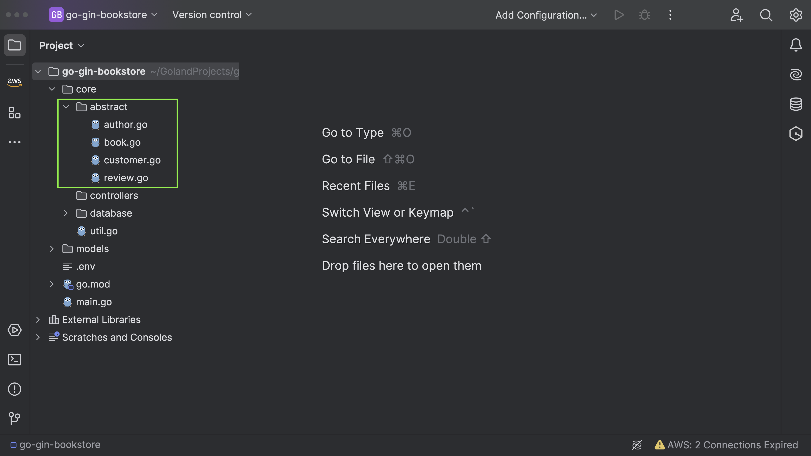
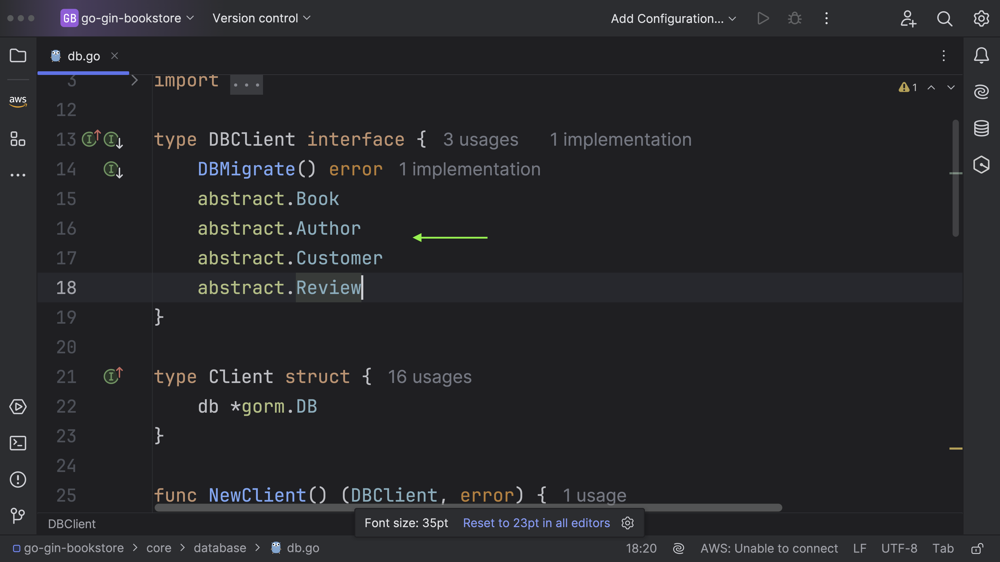
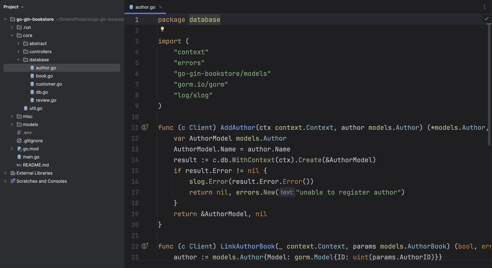
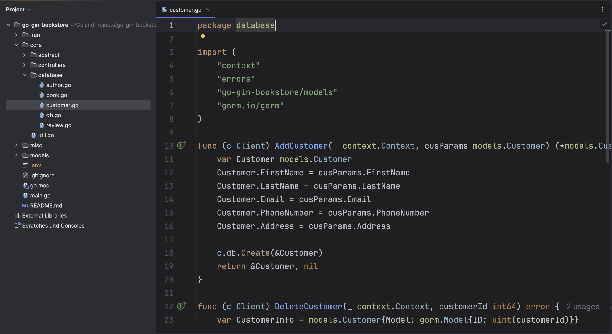
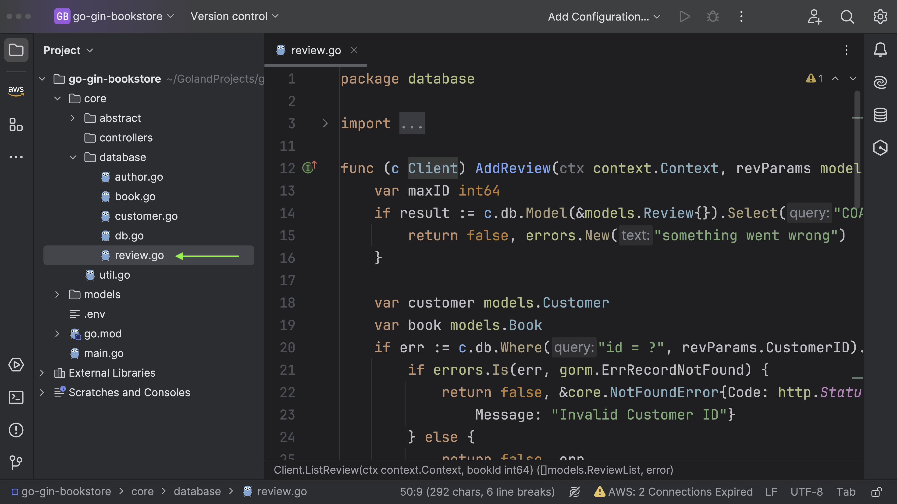

This section primarily focuses on implementing interfaces and CRUD operations.

## Interfaces

Following this, we are going to establish several interfaces that define method signatures.



We will be working with author interface supporting methods for adding an author, linking an author and a book,
and listing all authors.

`abstract/author.go`

```go
package abstract

import (
	"context"
	"go-gin-bookstore/models"
)

type Author interface {
	AddAuthor(ctx context.Context, author models.Author) (*models.Author, error)
	LinkAuthorBook(ctx context.Context, params models.AuthorBook) (bool, error)
	ListAuthors(_ context.Context) ([]models.Author, error)
}

```

The Book interface provides an abstraction for operations on a book database,
which includes adding, listing, updating, and deleting books.

`abstract/book.go`

```go
package abstract

import (
	"context"
	"go-gin-bookstore/models"
)

type Book interface {
	AddBook(ctx context.Context, bookParams models.DateParser) (*models.BookParams, error)
	ListBooks(ctx context.Context) ([]models.Book, error)
	UpdateBook(ctx context.Context, updateBookParams models.DateParser, bookId int64) (bool, error)
	DeleteBook(ctx context.Context, bookId int64) error
	UpdateBookCover(ctx context.Context, bookId int64, bookImageURL string) (bool, error)
}

```

`abstract/customer.go`

The `Customer` interface defines three methods for adding, updating, and deleting customers. These methods are expected to be implemented by any structs that satisfy this interface.

```go
package abstract

import (
	"context"
	"go-gin-bookstore/models"
)

type Customer interface {
	AddCustomer(ctx context.Context, cusParams models.Customer) (*models.Customer, error)
	UpdateCustomer(ctx context.Context, updateCusParams models.CustomerParams, customerId int64) (bool, error)
	DeleteCustomer(ctx context.Context, customerId int64) error
}

```

`abstract/review.go`

- `AddReview`: Takes a context and `ReviewParams` (with `customer ID`, `book ID`, `rating`, and `comment`). It returns a boolean and an error. This method will be used to add a review.
- `ListReview`: Takes a context and a book ID, and returns a list of `ReviewList` (with `review ID`, `rating`, `comment`) and an error. This method could list all reviews for a specific book.

```go
package abstract

import (
	"context"
	"go-gin-bookstore/models"
)

type Review interface {
	AddReview(ctx context.Context, revParams models.ReviewParams) (bool, error)
	ListReview(ctx context.Context, bookId int64) ([]models.ReviewList, error)
}

```

Before going ahead make sure to update the `DBClient` interface under `database/db.go`.



This means that the `DBClient` interface includes all the methods declared in these four interfaces. In other words, a struct that intends to implement `DBClient` should also implement all the methods of book, author,customer, and review interfaces.

## CRUD(Create, Read, Update, Delete) Operations

Now, let's begin implementing the interfaces.

### Book


`database/book.go`

```go
package database

import (
	"context"
	"errors"
	"fmt"
	"go-gin-bookstore/models"
	"gorm.io/gorm"
	"log/slog"
)

func (c Client) AddBook(ctx context.Context, bookParams models.DateParser) (*models.BookParams, error) {
	var Book models.Book
	switch params := bookParams.(type) {
	case *models.BookParams:
		Book.Title = params.Title
		Book.ISBN = params.ISBN
		Book.PublicationDate, _ = bookParams.ParsePublicationDate()

		result := c.db.WithContext(ctx).Create(&Book)

		if result.Error != nil {
			slog.Error(result.Error.Error())
			return nil, errors.New("unable to register book")
		}
		params.Id = int64(Book.ID)

		return params, nil
	default:
		fmt.Printf("Type of bookParams: %T\n", bookParams)
		return nil, errors.New("unsupported Type")

	}
}

func (c Client) ListBooks(ctx context.Context) ([]models.Book, error) {
	var books []models.Book
	result := c.db.WithContext(ctx).Find(&books)
	return books, result.Error
}

func (c Client) UpdateBook(_ context.Context, updateBookParams models.DateParser, bookId int64) (bool, error) {
	var bookInfo = models.Book{Model: gorm.Model{ID: uint(bookId)}}
	if err := c.db.First(&bookInfo).Error; err != nil {
		if errors.Is(err, gorm.ErrRecordNotFound) {
			return false, errors.New("there is no book associated with this ID")
		}
	}
	switch params := updateBookParams.(type) {
	case models.UpdateBookParams:
		parsedDate, _ := params.ParsePublicationDate()
		c.db.Save(&models.Book{Model: gorm.Model{ID: uint(bookId)}, Title: params.Title, ISBN: params.ISBN, PublicationDate: parsedDate})
	}
	return true, nil
}

func (c Client) DeleteBook(_ context.Context, bookId int64) error {
	var bookInfo = models.Book{Model: gorm.Model{ID: uint(bookId)}}
	if err := c.db.First(&bookInfo).Error; err != nil {
		if errors.Is(err, gorm.ErrRecordNotFound) {
			return errors.New("there is no book associated with this ID")
		}
	}
	// Delete Book (Hard delete)
	c.db.Unscoped().Delete(&bookInfo)
	return nil
}

func (c Client) UpdateBookCover(_ context.Context, bookId int64, bookImageURL string) (bool, error) {
	var bookInfo = models.Book{Model: gorm.Model{ID: uint(bookId)}}
	if err := c.db.First(&bookInfo).Error; err != nil {
		if errors.Is(err, gorm.ErrRecordNotFound) {
			return false, errors.New("there is no book associated with this ID")
		}
	}
	//Update ImageURL
	c.db.Model(&bookInfo).Updates(models.Book{Image: bookImageURL})
	return true, nil

}

```

Let's break down the concepts.

#### Add Book

The function accepts two parameters:

1. A `context.Context`, typically employed for request-scoping, carrying deadlines, and cancellation signals.
2. An instance of the structure `models.DateParser`, assumed to contain parsing methods and properties necessary for book addition.

Upon successful execution, it yields either a pointer to a `models.BookParams` structure or an error.

It also sets the `Title` and `ISBN` from the parameters and parses the `PublicationDate` from `bookParams`.

Following this, the function endeavors to create a new record in the database using the instantiated book.

```go
func (c Client) AddBook(ctx context.Context, bookParams models.DateParser) (*models.BookParams, error) {
	var Book models.Book
	switch params := bookParams.(type) {
	case *models.BookParams:
		Book.Title = params.Title
		Book.ISBN = params.ISBN
		Book.PublicationDate, _ = bookParams.ParsePublicationDate()

		result := c.db.WithContext(ctx).Create(&Book)

		if result.Error != nil {
			slog.Error(result.Error.Error())
			return nil, errors.New("unable to register book")
		}
		params.Id = int64(Book.ID)

		return params, nil
	default:
		fmt.Printf("Type of bookParams: %T\n", bookParams)
		return nil, errors.New("unsupported Type")

	}
}

```

#### List Book

The `ListBooks` function is employed to retrieve all book entries from a database. When invoked, it gathers all book records stored in the database and places them into a slice of `models.Book`. Subsequently, it returns this slice along with any errors that may have occurred during the database operation.

```go
func (c Client) ListBooks(ctx context.Context) ([]models.Book, error) {
	var books []models.Book
	result := c.db.WithContext(ctx).Find(&books)
	return books, result.Error
}

```

#### Update Book

The function takes a `context.Context`, a `models.DateParser` interface, and a `bookId` as its arguments. Initially, it tries to find a book record in the database that matches the provided `bookId`. If no record is found, it returns false and an error message. If the book record is found, it proceeds to check the type of `updateBookParams` object. If it matches `models.UpdateBookParams` type, it parses the `PublicationDate` and updates the book record in the database using the provided new values. Finally, the function returns `true` and `nil` indicating the successful update of the book record.

```go
func (c Client) UpdateBook(_ context.Context, updateBookParams models.DateParser, bookId int64) (bool, error) {
	var bookInfo = models.Book{Id: bookId}
	if err := c.db.First(&bookInfo).Error; err != nil {
		if errors.Is(err, gorm.ErrRecordNotFound) {
			return false, errors.New("there is no book associated with this ID")
		}
	}
	switch params := updateBookParams.(type) {
	case models.UpdateBookParams:
		parsedDate, _ := params.ParsePublicationDate()
		c.db.Save(&models.Book{Id: bookId, Title: params.Title, ISBN: params.ISBN, PublicationDate: parsedDate})
	}
	return true, nil
}

```

#### Delete Book

The function takes a `context.Context` and a `bookId` as arguments. It starts by attempting to find a book record in the database associated with the given `bookId`. If no book record is found, it returns an error indicating no book is associated with the provided ID. If a book record is found, the function proceeds to delete this record using GORM Delete method. The Unscoped call ensures a hard delete, which means the record is removed from the database entirely, not just marked as deleted.

```go
func (c Client) DeleteBook(_ context.Context, bookId int64) error {
	var bookInfo = models.Book{Id: bookId}
	if err := c.db.First(&bookInfo).Error; err != nil {
		if errors.Is(err, gorm.ErrRecordNotFound) {
			return errors.New("there is no book associated with this ID")
		}
	}
	// Delete Book (Hard delete)
	c.db.Unscoped().Delete(&bookInfo)
	return nil
}

```

#### Update Book Cover

The function proceeds to update the `Image` field of the book record with the new `bookImageURL` provided. Finally, the function returns `true` and `nil`, indicating that the book's cover information was updated successfully. We are not working on the implementation. I will be covering this topic separately in the HTTP handler section.

```go
func (c Client) UpdateBookCover(_ context.Context, bookId int64, bookImageURL string) (bool, error) {
	var bookInfo = models.Book{Id: bookId}
	if err := c.db.First(&bookInfo).Error; err != nil {
		if errors.Is(err, gorm.ErrRecordNotFound) {
			return false, errors.New("there is no book associated with this ID")
		}
	}
	//Update ImageURL
	c.db.Model(&bookInfo).Updates(models.Book{Image: bookImageURL})
	return true, nil

}

```

### Author



`database/author.go`

```go
package database

import (
	"context"
	"errors"
	"go-gin-bookstore/models"
	"log/slog"
)

func (c Client) AddAuthor(ctx context.Context, author models.Author) (*models.Author, error) {
	var maxID int
	if result := c.db.Model(&models.Author{}).Select("COALESCE(MAX(id), 0)").Scan(&maxID); result.Error != nil {
		return nil, errors.New("something went wrong")
	}
	var AuthorModel models.Author
	AuthorModel.ID = uint(maxID) + 1
	AuthorModel.Name = author.Name
	result := c.db.WithContext(ctx).Create(&AuthorModel)
	if result.Error != nil {
		slog.Error(result.Error.Error())
		return nil, errors.New("unable to register author")
	}
	return &AuthorModel, nil
}

func (c Client) LinkAuthorBook(_ context.Context, params models.AuthorBook) (bool, error) {
	author := models.Author{Id: params.AuthorID}
	book := models.Book{Id: params.BookID}
	err := c.db.Model(&author).Association("Books").Append(&book)
	if err != nil {
		return false, err
	}
	return true, nil
}

func (c Client) ListAuthors(_ context.Context) ([]models.Author, error) {
	var authors []models.Author
	result := c.db.Preload("Books").Find(&authors)

	if result.Error != nil {
		return nil, result.Error
	}
	return authors, nil
}

```

#### Add Author

The function is responsible for adding a new author to the database. If there's an error during this process, it logs the error and returns a failed registration message. Otherwise, it successfully returns the newly created author.

```go
func (c Client) AddAuthor(ctx context.Context, author models.Author) (*models.Author, error) {
	var AuthorModel models.Author
	AuthorModel.Name = author.Name
	result := c.db.WithContext(ctx).Create(&AuthorModel)
	if result.Error != nil {
		slog.Error(result.Error.Error())
		return nil, errors.New("unable to register author")
	}
	return &AuthorModel, nil
}
```

#### Linking Author & Book

The `LinkAuthorBook` function is responsible for creating a relationship between a given `Author` and `Book`. It takes a `context` and a `params` object as arguments, where params is of type `AuthorBook`, which contains IDs of an author and a book. This function creates instances of author and book using the IDs from params. Then, it calls `Association("Books")` on the author model. This targets the "Books" association in the author model, which represents a relational database association (many-to-many relationship between authors and books). Using `Append(&book)`, it attempts to add the Book instance to the Author's "Books" association, effectively connecting the book to the author.

```go
func (c Client) LinkAuthorBook(_ context.Context, params models.AuthorBook) (bool, error) {
	author := models.Author{Id: params.AuthorID}
	book := models.Book{Id: params.BookID}
	err := c.db.Model(&author).Association("Books").Append(&book)
	if err != nil {
		return false, err
	}
	return true, nil
}

```

#### List Authors

The `ListAuthors` function retrieves all the authors present in the database. It uses the GORM's `Preload()` method to also load the associated books field for each author (this is eager loading). Then, it calls `Find(&authors)` to fetch all authors from the database and store them in the authors slice of `models.Author`.

```go
func (c Client) ListAuthors(_ context.Context) ([]models.Author, error) {
	var authors []models.Author
	result := c.db.Preload("Books").Find(&authors)

	if result.Error != nil {
		return nil, result.Error
	}
	return authors, nil
}

```

### Customer



`database/customer.go`

```go
package database

import (
	"context"
	"errors"
	"go-gin-bookstore/models"
	"gorm.io/gorm"
)

func (c Client) AddCustomer(_ context.Context, cusParams models.Customer) (*models.Customer, error) {
	var Customer models.Customer
	Customer.FirstName = cusParams.FirstName
	Customer.LastName = cusParams.LastName
	Customer.Email = cusParams.Email
	Customer.PhoneNumber = cusParams.PhoneNumber
	Customer.Address = cusParams.Address

	c.db.Create(&Customer)
	return &Customer, nil
}

func (c Client) DeleteCustomer(_ context.Context, customerId int64) error {
	var CustomerInfo = models.Customer{Model: gorm.Model{ID: uint(customerId)}}

	if err := c.db.First(&CustomerInfo).Error; err != nil {
		if errors.Is(err, gorm.ErrRecordNotFound) {
			return errors.New("there is no customer associated with this ID")
		}
	}
	c.db.Delete(&CustomerInfo)
	return nil
}

func (c Client) UpdateCustomer(_ context.Context, updateCusParams models.CustomerParams, customerId int64) (bool, error) {
	var cusInfo = models.Customer{Model: gorm.Model{ID: uint(customerId)}}
	if err := c.db.First(&cusInfo).Error; err != nil {
		if errors.Is(err, gorm.ErrRecordNotFound) {
			return false, errors.New("there is no customer associated with this ID")
		}
	}
	c.db.Model(&cusInfo).Updates(models.Customer{
		FirstName: updateCusParams.FirstName,
		LastName:  updateCusParams.LastName,
		Address:   updateCusParams.Address})
	return true, nil
}
```

#### Add Customer

The function is used to create a new customer in the database. It saves the new customer to the database using `db.Create()`. Finally, it returns a pointer to the new customer.

```go
func (c Client) AddCustomer(_ context.Context, cusParams models.Customer) (*models.Customer, error) {
	var Customer models.Customer
	Customer.FirstName = cusParams.FirstName
	Customer.LastName = cusParams.LastName
	Customer.Email = cusParams.Email
	Customer.PhoneNumber = cusParams.PhoneNumber
	Customer.Address = cusParams.Address

	c.db.Create(&Customer)
	return &Customer, nil
}
```

#### Update Customer

The function is used to update the information of an existing customer in a database. It takes the customer's ID as a parameter, and looks up the customer with that ID in the database using `db.First(&cusInfo)`. If no such customer exists, an error is generated and the function returns false with an error message. If the customer exists, the function updates the customer's information with values provided in `updateCusParams`.

```go
func (c Client) UpdateCustomer(_ context.Context, updateCusParams models.CustomerParams, customerId int64) (bool, error) {
	var cusInfo = models.Customer{Id: customerId}
	if err := c.db.First(&cusInfo).Error; err != nil {
		if errors.Is(err, gorm.ErrRecordNotFound) {
			return false, errors.New("there is no customer associated with this ID")
		}
	}
	c.db.Model(&cusInfo).Updates(models.Customer{
		FirstName: updateCusParams.FirstName,
		LastName:  updateCusParams.LastName,
		Address:   updateCusParams.Address})
	return true, nil
}

```

#### Delete Customer

The function is used to remove a customer from the database. The function first finds the customer with the provided `customerId` in the database using `db.First(&CustomerInfo)`.
If the customer does not exist, an error is thrown. If the customer does exist, the `Delete` function is called on `CustomerInfo`, which deletes the customer from the database.

```go
func (c Client) DeleteCustomer(_ context.Context, customerId int64) error {
	var CustomerInfo = models.Customer{Id: customerId}

	if err := c.db.First(&CustomerInfo).Error; err != nil {
		if errors.Is(err, gorm.ErrRecordNotFound) {
			return errors.New("there is no customer associated with this ID")
		}
	}
	c.db.Delete(&CustomerInfo)
	return nil
}
```

Before going ahead, we will be creating a utility file which will be used across the application.

`core/util.go`


This code defines a custom error type named `NotFoundError` in the `core` package of the project.
`NotFoundError` is a struct type that holds an integer field `Code` and a string field `Message`, presumably for an error code and error message, respectively.
A method `Error()` is defined on the `NotFoundError` struct type, making it fulfill the built-in error interface in Go.

```go
package core

import (
	"fmt"
)

type NotFoundError struct {
	Code    int
	Message string
}

func (e *NotFoundError) Error() string {
	return fmt.Sprintf("Error %d: %s", e.Code, e.Message)
}
```

### Review



`database/review.go`

```go
package database

import (
	"context"
	"errors"
	"go-gin-bookstore/core"
	"go-gin-bookstore/models"
	"gorm.io/gorm"
	"net/http"
)

func (c Client) AddReview(ctx context.Context, revParams models.ReviewParams) (bool, error) {
	var maxID int64
	if result := c.db.Model(&models.Review{}).Select("COALESCE(MAX(id), 0)").Scan(&maxID); result.Error != nil {
		return false, errors.New("something went wrong")
	}

	var customer models.Customer
	var book models.Book
	if err := c.db.Where("id = ?", revParams.CustomerID).Take(&customer).Error; err != nil {
		if errors.Is(err, gorm.ErrRecordNotFound) {
			return false, &core.NotFoundError{Code: http.StatusNotFound,
				Message: "Invalid Customer ID"}
		} else {
			return false, err
		}
	}

	if err := c.db.Where("id = ?", revParams.BookID).Take(&book).Error; err != nil {
		if errors.Is(err, gorm.ErrRecordNotFound) {
			return false, &core.NotFoundError{Code: http.StatusNotFound,
				Message: "Invalid Book ID"}
		} else {
			return false, err
		}
	}

	var Review models.Review
	Review.ID = uint(maxID + 1)
	Review.Rating = revParams.Rating
	Review.Comment = revParams.Comment
	Review.CustomerID = revParams.CustomerID
	Review.BookID = revParams.BookID

	c.db.Create(&Review)
	return true, nil

}

func (c Client) ListReview(ctx context.Context, bookId int64) ([]models.ReviewList, error) {
	var reviewList []models.ReviewList
	c.db.WithContext(ctx).Model(models.Review{}).Select("id", "rating", "comment").Where(&models.Review{BookID: bookId}).Find(&reviewList)

	return reviewList, nil
}

```

#### Add Review

This function is meant to store a new review of a book into a database. The function gets the maximum ID currently in the `Review` table in the database. If there is an issue with obtaining the maximum ID, it returns false and an error message.
Next, it fetches the `Customer` and `Book` records using the `CustomerID` and `BookID` from the `revParams` input parameter respectively. With all the pieces in place, it constructs a new review instance by incrementing the max ID for the new review's ID,
copying other review details from `revParams`, and assigns the CustomerID and BookID. Finally, it stores the new review record in the review table in the database and returns `true` to signify that the operation was successful.

```go
func (c Client) AddReview(ctx context.Context, revParams models.ReviewParams) (bool, error) {
	var maxID int64
	if result := c.db.Model(&models.Review{}).Select("COALESCE(MAX(id), 0)").Scan(&maxID); result.Error != nil {
		return false, errors.New("something went wrong")
	}

	var customer models.Customer
	var book models.Book
	if err := c.db.Where("id = ?", revParams.CustomerID).Take(&customer).Error; err != nil {
		if errors.Is(err, gorm.ErrRecordNotFound) {
			return false, &core.NotFoundError{Code: http.StatusNotFound,
				Message: "Invalid Customer ID"}
		} else {
			return false, err
		}
	}

	if err := c.db.Where("id = ?", revParams.BookID).Take(&book).Error; err != nil {
		if errors.Is(err, gorm.ErrRecordNotFound) {
			return false, &core.NotFoundError{Code: http.StatusNotFound,
				Message: "Invalid Book ID"}
		} else {
			return false, err
		}
	}

	var Review models.Review
	Review.ID = uint(maxID + 1)
	Review.Rating = revParams.Rating
	Review.Comment = revParams.Comment
	Review.CustomerID = revParams.CustomerID
	Review.BookID = revParams.BookID

	c.db.Create(&Review)
	return true, nil

}

```

#### List Review

This function is used to retrieve a list of reviews for a specific book from a database. It models the `Review` struct, selects the `"id"`, `"rating"`, and `"comment"` fields, and filters the results based on the `BookID` matching the `bookId` parameter passed to the function.

```go
func (c Client) ListReview(ctx context.Context, bookId int64) ([]models.ReviewList, error) {
	var reviewList []models.ReviewList
	c.db.WithContext(ctx).Model(models.Review{}).Select("id", "rating", "comment").Where(&models.Review{BookID: bookId}).Find(&reviewList)

	return reviewList, nil
}
```
