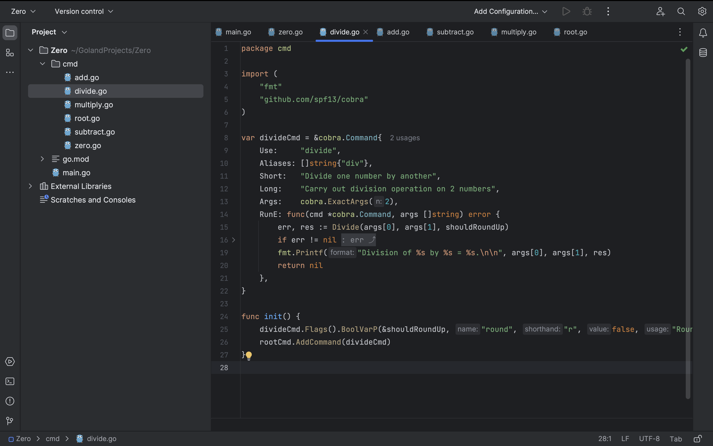
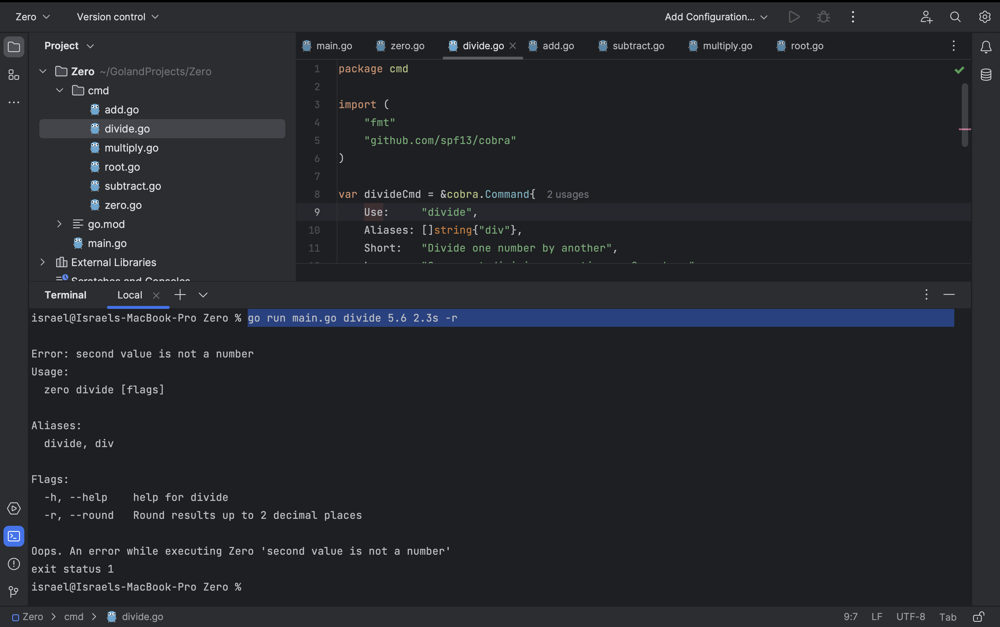

In the previous implementations of the addition, subtraction, and multiplication operations, you manually printed all errors to the terminal. You'll see how error handling works in Cobra using the division operation as a case study.

First, add the following lines of code for the function logic of the division operation to the bottom of the `zero.go` file:

```go
func Divide(divide string, by string, shouldRoundUp bool) (e error, result string) {
    num1, err := strconv.ParseFloat(divide, 64)
    if err != nil {
        return fmt.Errorf("first value is not a number"), ""
    }
    num2, err := strconv.ParseFloat(by, 64)
    if err != nil {
        return fmt.Errorf("second value is not a number"), ""
    }
    if shouldRoundUp {
        return nil, fmt.Sprintf("%.2f", num1/num2)
    }
    return nil, fmt.Sprintf("%f", num1/num2)
}
```

Unlike previous logical functions, the divide function returns an extra value that represents the error.

Proceed to implement the divide command by creating a `divide.go` file in the `cmd` folder that contains the following code:

```go
package cmd

import (
    "fmt"
    "github.com/spf13/cobra"
)

var divideCmd = &cobra.Command{
    Use:     "divide",
    Aliases: []string{"div"},
    Short:   "Divide one number by another",
    Long:    "Carry out division operation on 2 numbers",
    Args:    cobra.ExactArgs(2),
    RunE: func(cmd *cobra.Command, args []string) error {
        err, res := Divide(args[0], args[1], shouldRoundUp)
        if err != nil {
            return err
        }
        fmt.Printf("Division of %s by %s = %s.\n\n", args[0], args[1], res)
        return nil
    },
}

func init() {
    divideCmd.Flags().BoolVarP(&shouldRoundUp, "round", "r", false, "Round results up to 2 decimal places")
    rootCmd.AddCommand(divideCmd)
}
```



Here, the `RunE` property of `cobra.Command` is used to run the function and return any possible errors. You can now run the following command to test the Cobra error handling implementation:

```shell
go run main.go divide 5.6 2.3s -r
```

An error should appear as a response in your GoLand terminal, alongside the appropriate usage methods, aliases, and flags for the command:



So far, you've used the `go run` command to automatically compile the source code of your command line application and run the resulting executable. This is suitable for testing your application. However, if you are looking to distribute or deploy your application, you'll need to build your code into a [shareable binary executable](https://en.wikipedia.org/wiki/Executable).
