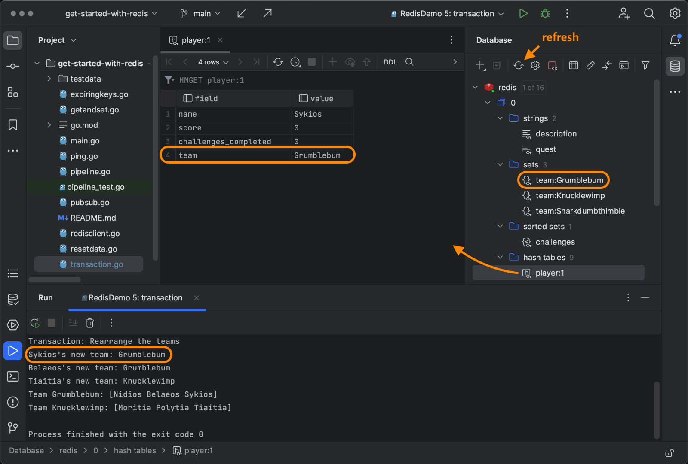

Data rarely exists as isolated bits of information. In the sample data, players have a `team` field that shows what team they're on, and the teams are lists of player names. If you want to move a player from one team to another, you need to change the player's `team` field as well as the player lists of the team they leave and the team they join. All these changes must succeed, or else the data will end up in an inconsistent state, such as having the same player on two teams or having a player's `team` point to a team that does not list that player.

For example, consider a task where you need to perform the following operations on the database:

- Create a new team called "Grumblebum"
- Move Sykios, Nidios, and Belaeos to the new team
- Move Tiaitia to team Knucklewimp
- Remove team Dorkfoot

To avoid inconsistencies, you need a way to ensure that either all or none of these operations are executed on the database. In other words, you need a transaction.

A transaction is a mechanism like a pipeline that executes multiple database operations in a single batch, but with the additional effect that all operations must succeed or else the whole transaction gets canceled. In other words, if any operation inside a transaction errors out, none of the operations are committed to the database, and no data is changed.

At the code level, a transaction does not differ much from a pipeline. All you need to change is the type of pipeline you use. Instead of `Pipelined()`, you call `TxPipelined()`, and all operations inside the pipeline are wrapped into a transaction.

Try it out! Have a look at `transaction.go` and run `RedisDemo 5: transaction`:

```go
func transaction(client *redis.Client) error {
    ctx := context.Background()

    _, err := client.TxPipelined(ctx, func(pipe redis.Pipeliner) error {
       // Move Sykios to team Grumblebum
       err := pipe.HSet(ctx, "player:1", "team", "Grumblebum").Err()
       if err != nil {
          return err
       }
       // Move Nidios to team Grumblebum
       err = pipe.HSet(ctx, "player:2", "team", "Grumblebum").Err()
       if err != nil {
          return err
       }
       // Move Belaeos to team Grumblebum
       err = pipe.HSet(ctx, "player:4", "team", "Grumblebum").Err()
       if err != nil {
          return err
       }
       // Move Tiaitia to team Knucklewimp
       err = pipe.HSet(ctx, "player:3", "team", "Knucklewimp").Err()
       if err != nil {
          return err
       }

       // Team update: remove Belaeos from team Knucklewimp
       err = pipe.SRem(ctx, "team:Knucklewimp", "Belaeos").Err()
       if err != nil {
          return err
       }

       // Team update: add Tiaitia to team Knucklewimp
       err = pipe.SAdd(ctx, "team:Knucklewimp", "Tiaitia").Err()
       if err != nil {
          return err
       }

       // Add team Grumblebum
       err = pipe.SAdd(ctx, "team:Grumblebum", "Sykios", "Nidios", "Belaeos").Err()
       if err != nil {
          return err
       }

       // Remove team Dorkfoot. A set is removed by removing all elements.
       err = pipe.SRem(ctx, "team:Dorkfoot", "Sykios", "Nidios", "Tiaitia").Err()
       if err != nil {
          return err
       }

       return nil
    })
    if err != nil {
       return fmt.Errorf("TxPipelined failed: %w", err)
    }

    fmt.Printf("Sykios's new team: %s\n", client.HGet(ctx, "player:1", "team").Val())
    fmt.Printf("Belaeos's new team: %s\n", client.HGet(ctx, "player:4", "team").Val())
    fmt.Printf("Tiaitia's new team: %s\n", client.HGet(ctx, "player:3", "team").Val())
    fmt.Printf("Team Grumblebum: %s\n", client.SMembers(ctx, "team:Grumblebum").Val())
    fmt.Printf("Team Knucklewimp: %s\n", client.SMembers(ctx, "team:Knucklewimp").Val())
    return nil
}
```

The code uses two new methods: [`SAdd()`](https://pkg.go.dev/github.com/redis/go-redis/v9#Client.SAdd) to add a field to a set and [`SRem()`](https://pkg.go.dev/github.com/redis/go-redis/v9#Client.SRem) to remove a field from a set.

If the transaction succeeds (and it should), you'll see the following output:

```
Transaction: Rearrange the teams
Sykios's new team: Grumblebum
Belaeos's new team: Grumblebum
Tiaitia's new team: Knucklewimp
Team Grumblebum: [Nidios Belaeos Sykios]
Team Knucklewimp: [Moritia Polytia Tiaitia]
```

You can also inspect the changes directly in the database. In GoLand, click the database tool icon in the right toolbar, then click the **Refresh** button to reload the data.

You can see the new team called "Grumblebum" in the list of set data, and if you double-click **`player:1`**, you can confirm that Sykios is now on team Grumblebum. You can check the other data in the same way to confirm the changes:


