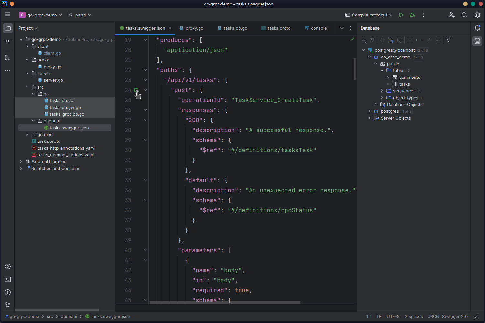
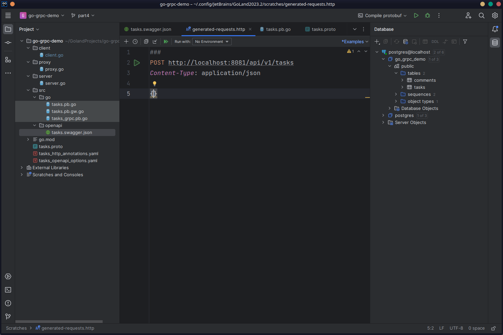
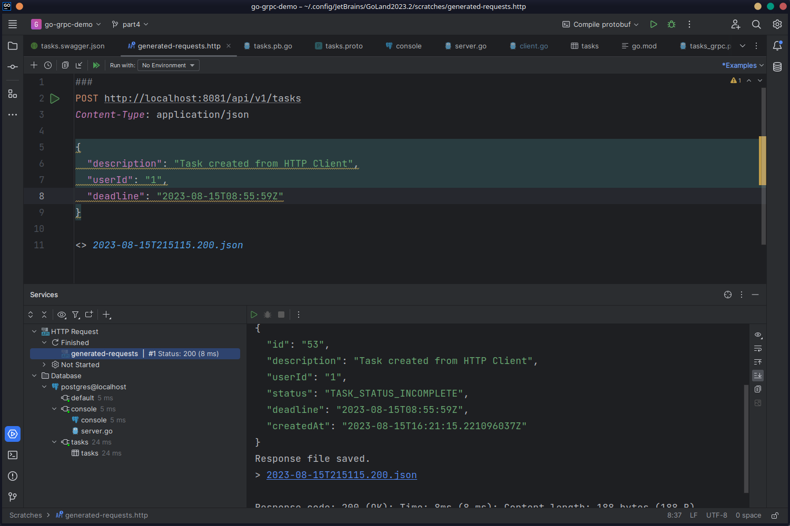
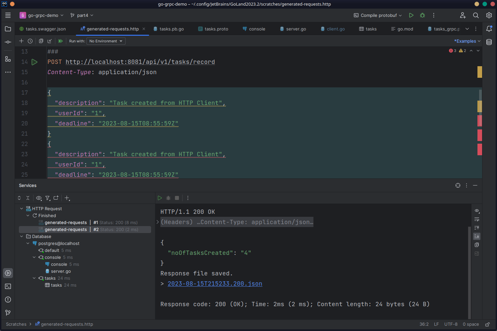
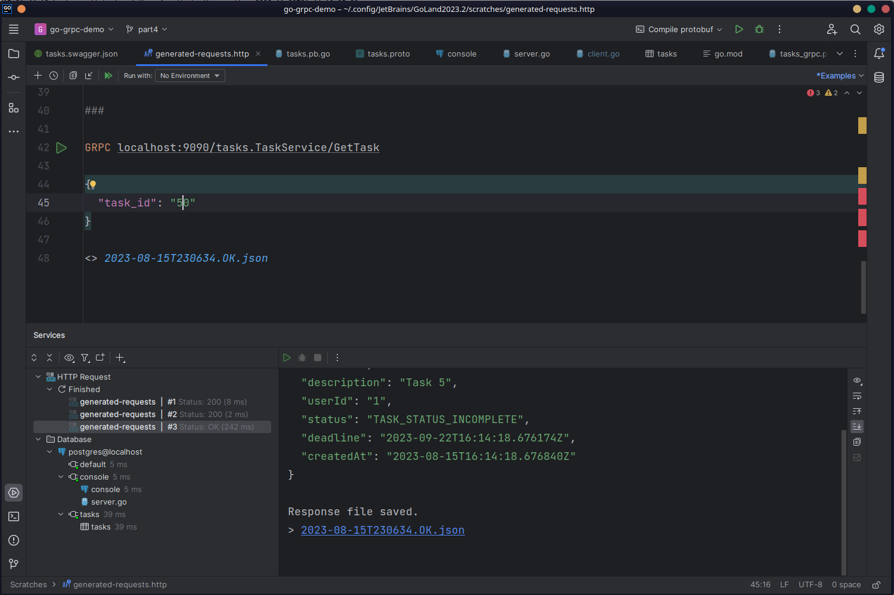

Remember the reverse proxy you created in [part one](../../grpc_part_one/)? Now it's time for it to shine. As mentioned before, you can make REST requests to the reverse proxy, and it will translate them into appropriate gRPC requests and pass them to the server. The gRPC responses from the server will be converted into JSON responses and relayed back to you. Let's test the reverse proxy with GoLand's [HTTP Client](https://www.jetbrains.com/help/go/http-client-in-product-code-editor.html).

First, make sure the server is running. If not, run `go run server/server.go` to start it. Start the proxy server in another terminal by running `go run proxy/proxy.go`.

To open the HTTP Client quickly, open `tasks.swagger.json` and click the icon next to the `/api/v1/tasks` path:



This will take you to the HTTP Client with the URL already completed for you:



You can write a JSON body, and you get free autocomplete as well! Write the following query:

```http
###
POST http://localhost:8081/api/v1/tasks
Content-Type: application/json

{
  "description": "Task created from HTTP Client",
  "userId": "1",
  "deadline": "2023-08-15T08:55:59Z"
}
```

Run this query by clicking the "play" icon next to it. It should return a successful response and print the result in the console:



For streaming APIs, the stream is replaced by newline-separated JSON inputs. Try out the `RecordTasks` endpoint with the following query (you can safely ignore the JSON validation errors thrown by GoLand):

```http
###
POST http://localhost:8081/api/v1/tasks/record
Content-Type: application/json

{
  "description": "Task created from HTTP Client",
  "userId": "1",
  "deadline": "2023-08-15T08:55:59Z"
}
{
  "description": "Task created from HTTP Client",
  "userId": "1",
  "deadline": "2023-08-15T08:55:59Z"
}
{
  "description": "Task created from HTTP Client",
  "userId": "1",
  "deadline": "2023-08-15T08:55:59Z"
}
{
  "description": "Task created from HTTP Client",
  "userId": "1",
  "deadline": "2023-08-15T08:55:59Z"
}
```



This shows that the reverse proxy is working correctly, and you now have both a REST API and a gRPC API for the price of one.

You can also make gRPC queries from GoLand's HTTP Client. However, before that, you need to locally download the [`timestamp.proto`](https://github.com/protocolbuffers/protobuf/blob/main/src/google/protobuf/timestamp.proto) file, as GoLand can't download it automatically. Download the file and put it in the `google/protobuf` directory. Then, write the following query in the HTTP Client:

```http
GRPC localhost:9090/tasks.TaskService/GetTask

{
  "task_id": "50"
}
```

Replace the `task_id` with the ID of an existing task and execute the query. You should see a successful output:



You can find the complete code in the `part4` branch of the [repo](https://github.com/heraldofsolace/go-grpc-demo/tree/part4).
