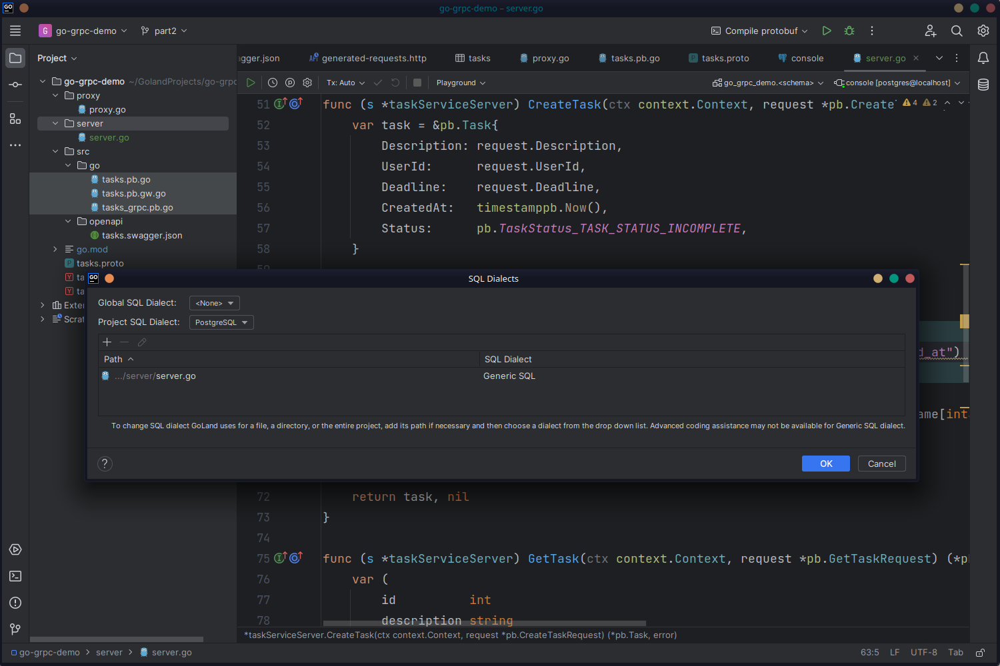
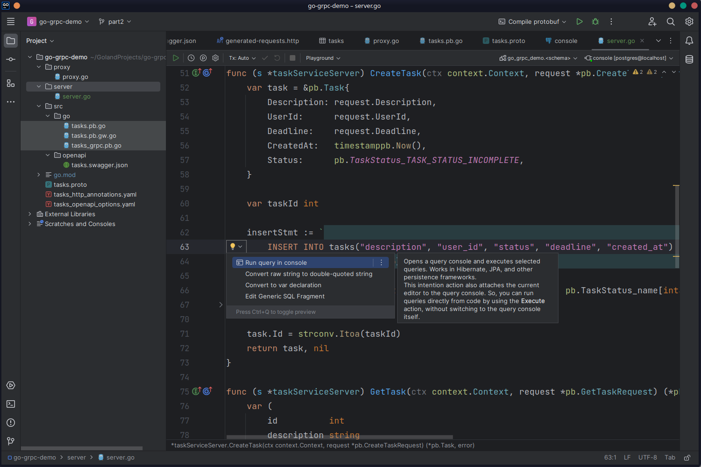
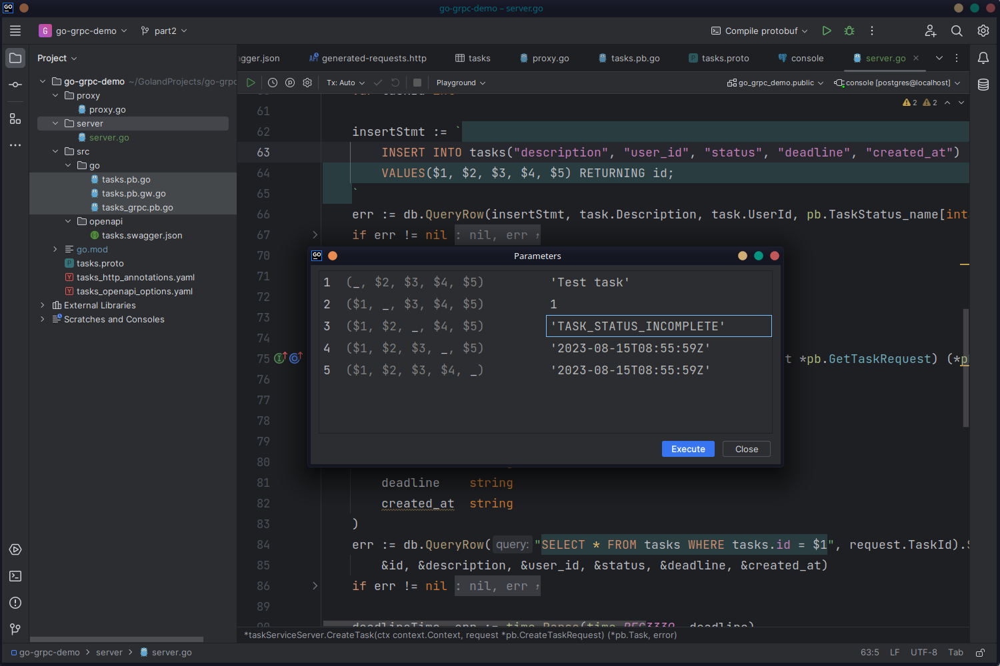
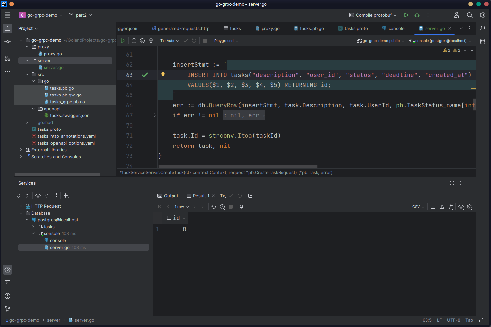
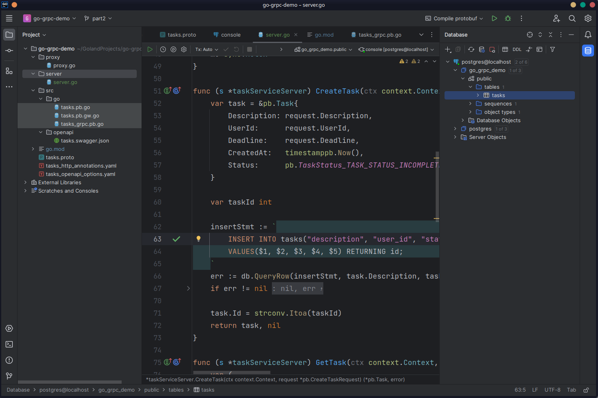
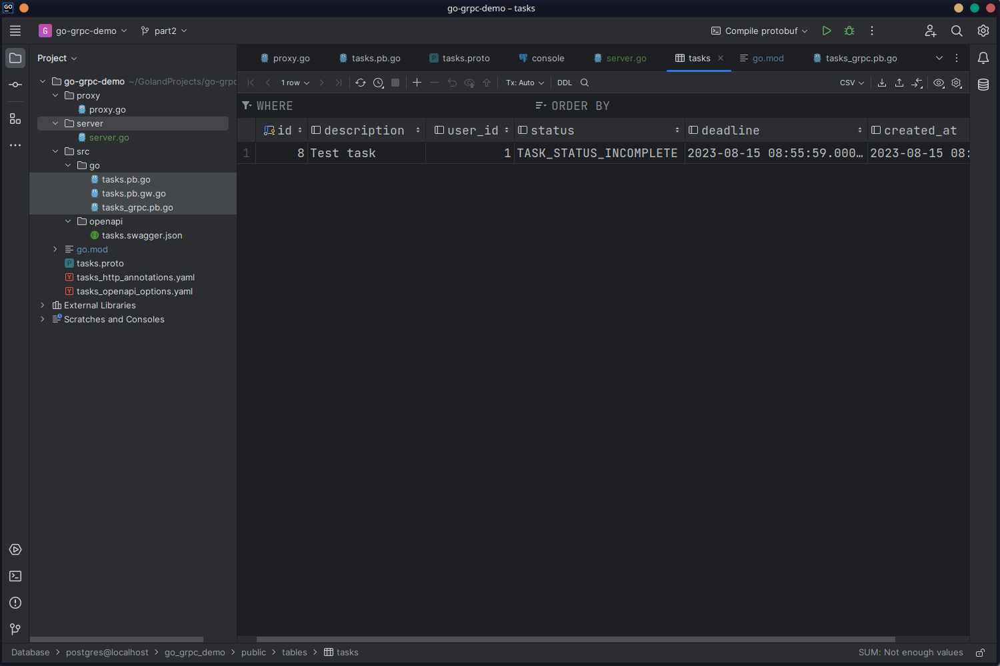

Create a `server` directory, and inside that, create a file named `server.go`. Start by importing the database packages and defining the parameters of the database connection:

```go
package main

import (
    "database/sql"
    _ "github.com/lib/pq"
)

const (
    host     = "localhost"
    port     = 5432
    user     = "postgres"
    password = ""
    dbname   = "go_grpc_demo"
)

var db *sql.DB
```

Create an `initDB` function that will initialize the database connection:

```go
func initDB() error {
    var err error

    connectionString := fmt.Sprintf("postgres://%s:%s@%s:%d/%s?sslmode=disable", user, password, host, port, dbname)

    db, err = sql.Open("postgres", connectionString)

    if err != nil {
        return err
    }

    err = db.Ping()
    if err != nil {
        return err
    }
    return nil
}
```

Now it's time to implement the endpoints. The gRPC code generator has created a `TaskServiceServer` interface for you with the endpoint methods in `tasks_grpc.pb.go`. However, to preserve forward compatibility, you'll need to define a `struct` that embeds the `UnimplementedTaskServiceServer` type from `tasks_grpc.pb.go`:

```go
import (
    ...
    pb "go-grpc-demo/src/go" // Add this import
)

type taskServiceServer struct {
    pb.UnimplementedTaskServiceServer
}
```

### The CreateTask Endpoint

You'll now implement the `CreateTask` endpoint. The function signature is almost the same as what you wrote in the `tasks.proto` file, except it takes an extra [`context.Context`](https://pkg.go.dev/context) parameter and also returns an `error`:

```go
func (s *taskServiceServer) CreateTask(ctx context.Context, request *pb.CreateTaskRequest) (*pb.Task, error) {

}
```

The `context` parameter can be used to modify the function's behavior. For example, you can provide a timeout or add the ability to cancel an invocation using appropriate `context`. The types you previously defined in `tasks.proto`, namely `Task` and `CreateTaskRequest`, are also used verbatim from `pb`.

Use the `request` parameter to construct a new `pb.Task` instance:

```go
func (s *taskServiceServer) CreateTask(ctx context.Context, request *pb.CreateTaskRequest) (*pb.Task, error) {
    var task = &pb.Task{
        Description: request.Description,
        UserId:      request.UserId,
        Deadline:    request.Deadline,
        CreatedAt:   timestamppb.Now(),
        Status:      pb.TaskStatus_TASK_STATUS_INCOMPLETE,
    }
}
```

Two important things to note in the code: first, the `timestampbb.Now()` method is used to construct an instance of `Timestamp`, and second, `TaskStatus_TASK_STATUS_INCOMPLETE` is used to set the status of the `Task`. The gRPC code generator has extracted the individual values from enum `TaskStatus`, which you can use directly to set the task status. You can find these definitions in `tasks.pb.go`:

```go
type TaskStatus int32

const (
    TaskStatus_TASK_STATUS_COMPLETED  TaskStatus = 0
    TaskStatus_TASK_STATUS_INCOMPLETE TaskStatus = 1
    TaskStatus_TASK_STATUS_STARTED    TaskStatus = 2
)
```

You'll now formulate the SQL query and insert the `Task` into the database. You need to get the ID of the newly created `Task` in the database, so you'll need to use the `RETURNING` clause in the query:

```go
func (s *taskServiceServer) CreateTask(ctx context.Context, request *pb.CreateTaskRequest) (*pb.Task, error) {
    var task = &pb.Task{
        Description: request.Description,
        UserId:      request.UserId,
        Deadline:    request.Deadline,
        CreatedAt:   timestamppb.Now(),
        Status:      pb.TaskStatus_TASK_STATUS_INCOMPLETE,
    }

    var taskId int

    insertStmt := `
        INSERT INTO "tasks"("description", "user_id", "status", "deadline", "created_at")
        VALUES($1, $2, $3, $4, $5) RETURNING id;
    `
    err := db.QueryRow(insertStmt, task.Description, task.UserId, pb.TaskStatus_name[int32(task.Status)], task.Deadline.AsTime(), task.CreatedAt.AsTime()).Scan(&taskId)
    if err != nil {
        return nil, err
    }
}
```

It's worth mentioning that `pb.TaskStatus_name` in the above code is a convenient map created by the gRPC code generator. It converts integer values (originally set using `TaskStatus_TASK_STATUS_INCOMPLETE`) of the `TaskStatus` enum into the corresponding names (which is expected by PostgreSQL). You also have a `TaskStatus_value` map defined in `tasks.pb.go` that performs the opposite conversion:

```go
// Enum value maps for TaskStatus.
var (
    TaskStatus_name = map[int32]string{
        0: "TASK_STATUS_COMPLETED",
        1: "TASK_STATUS_INCOMPLETE",
        2: "TASK_STATUS_STARTED",
    }
    TaskStatus_value = map[string]int32{
        "TASK_STATUS_COMPLETED":  0,
        "TASK_STATUS_INCOMPLETE": 1,
        "TASK_STATUS_STARTED":    2,
    }
)
```

Another important aspect of this code is the use of the `AsTime` method to convert `timestamppb` to Go's own [Time](https://pkg.go.dev/time#Time) type, which will be passed to PostgreSQL.

Finally, set the `Id` field of `task`, and off it goes to the client:

```go
func (s *taskServiceServer) CreateTask(ctx context.Context, request *pb.CreateTaskRequest) (*pb.Task, error) {
    var task = &pb.Task{
        Description: request.Description,
        UserId:      request.UserId,
        Deadline:    request.Deadline,
        CreatedAt:   timestamppb.Now(),
        Status:      pb.TaskStatus_TASK_STATUS_INCOMPLETE,
    }

    var taskId int

    insertStmt := `
        INSERT INTO "tasks"("description", "user_id", "status", "deadline", "created_at")
        VALUES($1, $2, $3, $4, $5) RETURNING id;
    `
    err := db.QueryRow(insertStmt, task.Description, task.UserId, pb.TaskStatus_name[int32(task.Status)], task.Deadline.AsTime(), task.CreatedAt.AsTime()).Scan(&taskId)
    if err != nil {
        return nil, err
    }

    task.Id = strconv.Itoa(taskId)
    return task, nil
}
```

### The GetTask Endpoint

The `GetTask` method is very similar. You'll use the `TaskStatus_value` map to convert the status names from the database into integer values. The `timestamppb.New` method can be used to convert a Golang `Time` into a `timestamppb`:

```go
func (s *taskServiceServer) GetTask(ctx context.Context, request *pb.GetTaskRequest) (*pb.Task, error) {
    var (
        id          int
        description string
        user_id     int
        status      string
        deadline    string
        created_at  string
    )
    err := db.QueryRow("SELECT * FROM tasks WHERE tasks.id = $1", request.TaskId).Scan(
        &id, &description, &user_id, &status, &deadline, &created_at)
    if err != nil {
        return nil, err
    }

    deadlineTime, err := time.Parse(time.RFC3339, deadline)
    if err != nil {
        log.Fatalf("Error: Invalid time for deadline: %v", err)
    }
    createdAtTime, err := time.Parse(time.RFC3339, created_at)
    if err != nil {
        log.Fatalf("Error: Invalid time for created_at: %v", err)
    }
    task := &pb.Task{
        Id:          strconv.Itoa(id),
        Description: description,
        UserId:      strconv.Itoa(user_id),
        Status:      pb.TaskStatus(pb.TaskStatus_value[status]),
        Deadline:    timestamppb.New(deadlineTime),
        CreatedAt:   timestamppb.New(createdAtTime),
    }
    return task, nil
}
```

Finally, in the `main` function, start the gRPC server at port `9090` using `pb.RegisterTaskServiceServer`:

```go
func main() {
    err := initDB()
    if err != nil {
        log.Fatalf("Error initiating database: %v", err)
    }

    lis, err := net.Listen("tcp", fmt.Sprintf("localhost:%d", 9090))
    if err != nil {
        log.Fatalf("failed to listen: %v", err)
    }

    grpcServer := grpc.NewServer()
    pb.RegisterTaskServiceServer(grpcServer, &taskServiceServer{})
    err = grpcServer.Serve(lis)
    if err != nil {
        log.Fatalf("Error starting gRPC server: %v", err)
    }
}
```

You won't write the gRPC clients until part three of this series, but you should take a moment to explore GoLand's database capabilities and make sure the queries are executing correctly. You may have observed that the SQL statements are underlined with squiggly yellow lines in the `GetTask` and `CreateTask` methods. That's because GoLand recognizes them as SQL statements but doesn't know the SQL dialect. Place the cursor on any statement, click the yellow bulb icon, and click the **Change dialect to…** link. In the new window, choose **PostgreSQL** in the **Project SQL Dialect** field and click **OK**. You'll now get PostgreSQL syntax highlighting and autocompletion throughout the file:



Put the cursor on the `insertStmt` SQL statement and click the yellow bulb icon. Choose **Run query in console** and choose the already opened database console from the list:



This will open a window asking you to put in the parameters for executing the query. Enter the following parameters in this order (with the quotes):

1. `'Test Task'`
2. `1`
3. `'TASK_STATUS_INCOMPLETE'`
4. `'2023-08-20T08:55:59Z'`
5. `'2023-08-15T08:55:59Z'`



Then click **Execute**. The query will be executed, and the ID of the newly created record will be shown in the console:



You can check the contents of the table by double-clicking the table name in the **Database** panel:



This will open the table in a new tab and display its contents. If the statement is executed correctly, you'll find the newly created task in the table:



With that, you've now completed part two of this series. This is the full code of `server.go`:

```go
package main

import (
    "context"
    "database/sql"
    "fmt"
    _ "github.com/lib/pq"
    pb "go-grpc-demo/src/go"
    "google.golang.org/grpc"
    "google.golang.org/protobuf/types/known/timestamppb"
    "log"
    "net"
    "strconv"
    "sync"
    "time"
)

const (
    host     = "localhost"
    port     = 5432
    user     = "postgres"
    password = ""
    dbname   = "go_grpc_demo"
)

var db *sql.DB

func initDB() error {
    var err error

    connectionString := fmt.Sprintf("postgres://%s:%s@%s:%d/%s?sslmode=disable", user, password, host, port, dbname)

    db, err = sql.Open("postgres", connectionString)

    if err != nil {
        return err
    }

    err = db.Ping()
    if err != nil {
        return err
    }
    return nil
}

type taskServiceServer struct {
    pb.UnimplementedTaskServiceServer
}

func (s *taskServiceServer) CreateTask(ctx context.Context, request *pb.CreateTaskRequest) (*pb.Task, error) {
    var task = &pb.Task{
        Description: request.Description,
        UserId:      request.UserId,
        Deadline:    request.Deadline,
        CreatedAt:   timestamppb.Now(),
        Status:      pb.TaskStatus_TASK_STATUS_INCOMPLETE,
    }

    var taskId int

    insertStmt := `
        INSERT INTO "tasks"("description", "user_id", "status", "deadline", "created_at")
        VALUES($1, $2, $3, $4, $5) RETURNING id;
    `
    err := db.QueryRow(insertStmt, task.Description, task.UserId, pb.TaskStatus_name[int32(task.Status)], task.Deadline.AsTime(), task.CreatedAt.AsTime()).Scan(&taskId)
    if err != nil {
        return nil, err
    }

    task.Id = strconv.Itoa(taskId)
    return task, nil
}

func (s *taskServiceServer) GetTask(ctx context.Context, request *pb.GetTaskRequest) (*pb.Task, error) {
    var (
        id          int
        description string
        user_id     int
        status      string
        deadline    string
        created_at  string
    )
    err := db.QueryRow("SELECT * FROM tasks WHERE tasks.id = $1", request.TaskId).Scan(
        &id, &description, &user_id, &status, &deadline, &created_at)
    if err != nil {
        return nil, err
    }

    deadlineTime, err := time.Parse(time.RFC3339, deadline)
    if err != nil {
        log.Fatalf("Error: Invalid time for deadline: %v", err)
    }
    createdAtTime, err := time.Parse(time.RFC3339, created_at)
    if err != nil {
        log.Fatalf("Error: Invalid time for created_at: %v", err)
    }
    task := &pb.Task{
        Id:          strconv.Itoa(id),
        Description: description,
        UserId:      strconv.Itoa(user_id),
        Status:      pb.TaskStatus(pb.TaskStatus_value[status]),
        Deadline:    timestamppb.New(deadlineTime),
        CreatedAt:   timestamppb.New(createdAtTime),
    }
    return task, nil
}

func main() {
    err := initDB()
    if err != nil {
        log.Fatalf("Error initiating database: %v", err)
    }

    lis, err := net.Listen("tcp", fmt.Sprintf("localhost:%d", 9090))
    if err != nil {
        log.Fatalf("failed to listen: %v", err)
    }

    grpcServer := grpc.NewServer()
    pb.RegisterTaskServiceServer(grpcServer, &taskServiceServer{})
    err = grpcServer.Serve(lis)
    if err != nil {
        log.Fatalf("Error starting gRPC server: %v", err)
    }
}
```

You can find the code for what you've done so far in the `part2` branch of [this GitHub repo](https://github.com/heraldofsolace/go-grpc-demo/tree/part2).
