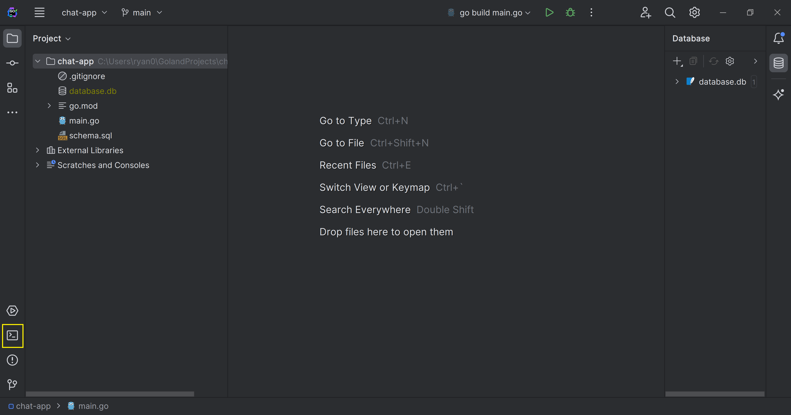
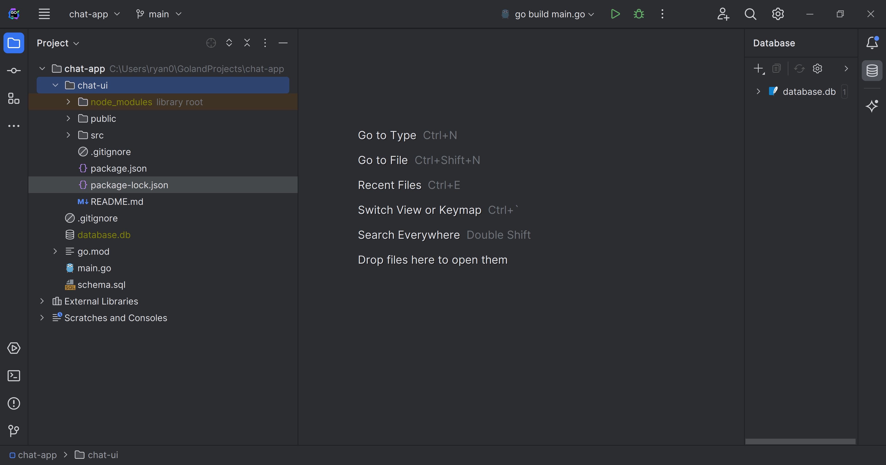

## Getting Started with Building the Frontend

Before getting started on your frontend, you need the backend from part one. You'll find a repo link at the end of the first article with the finished backend. Feel free to review part one if you need a refresher, but you can also go directly to the [repo](https://github.com/rpeden/go-gin-react-part1) for convenience.

### Install Node.js

If you don't have Node.js installed yet, download and install the latest LTS Node.js release for your operating system.

### Setting Up a New React Project

Start by setting up a new React application inside your existing project repository. You can use GoLand's integrated terminal to streamline this process. Open a terminal in your project's directory by clicking the terminal icon (highlighted in yellow below):



Next, run the following command to create a new React application in the `chat-ui` subdirectory:

```sh
npx create-react-app chat-ui
```

It will take `create-react-app` a couple of minutes to generate the React frontend and install its dependencies. When it finishes, a `chat-ui` subdirectory will appear inside the `chat-app` project in GoLand:



Your React app will use [React Router](https://reactrouter.com/) to manage page routes, so finish up by running `cd chat-ui`, and then enter the following command in the terminal to install it:

```sh
npm install react-router-dom --save-dev
```
