If the Merge Request does not have a reviewer assigned, we can assign one from the Merge Request tool window in IntelliJ IDEA. Click the three dots at the bottom left of the Merge Request details
and select the action **Request Review**. From the list that pops up, select the reviewer(s) to assign this Merge Request to.

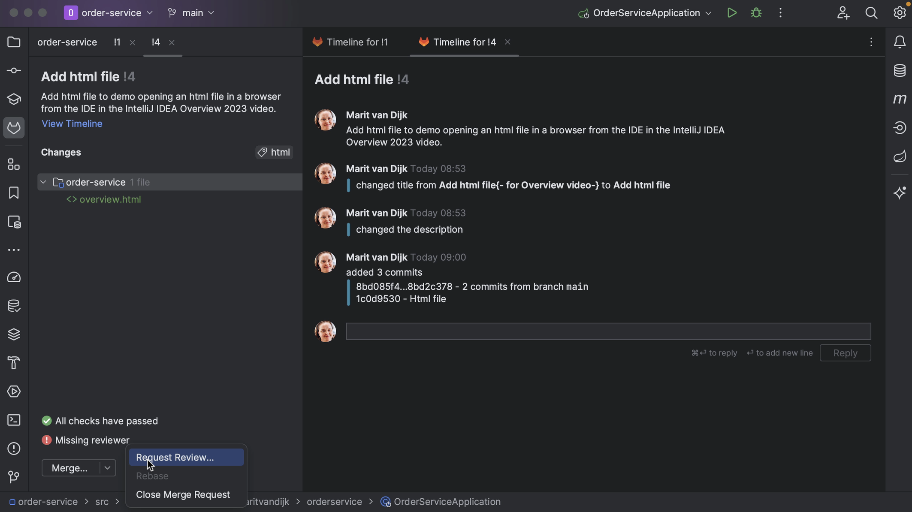

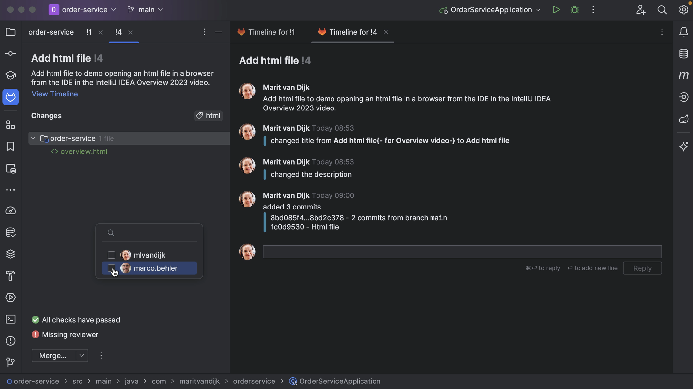

We can see the files that have been changed in the Merge Request in the bottom left window, and the timeline in the main editor pane.

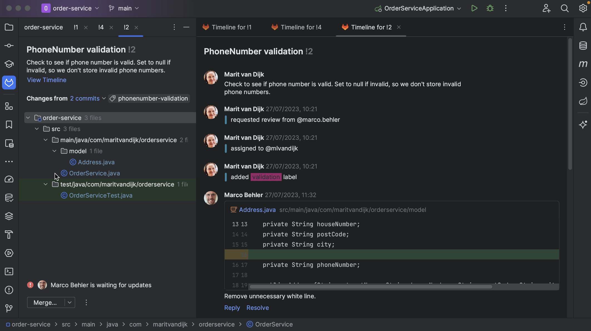

We can also select a file to see the diff as well as the comments for that file. We can go back to the timeline by clicking **View Timeline**.

The timeline shows the same information as the GitLab Merge Request activity page. The timeline shows activity on the Merge Request, including comments and other status changes in the main editor pane. If there are inline comments on the code, we can see them here.

It also shows the result of any checks that were run. We can go to the details to see which checks failed, and even click them to go straight to the failing check on GitLab, so we can look at the details.

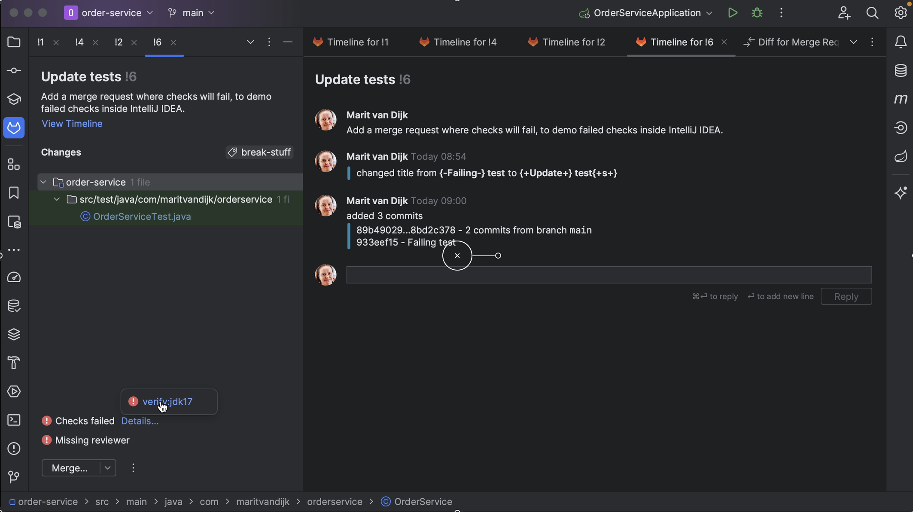

We can open the Merge Request in our browser in several ways. We can right-click the Merge Request number and select **Open in Browser**. Alternatively, we can open the Merge Request in our browser by right-clicking it, either when it’s already open, or in the list of Merge Requests and selecting **Open Merge Request in Browser**.

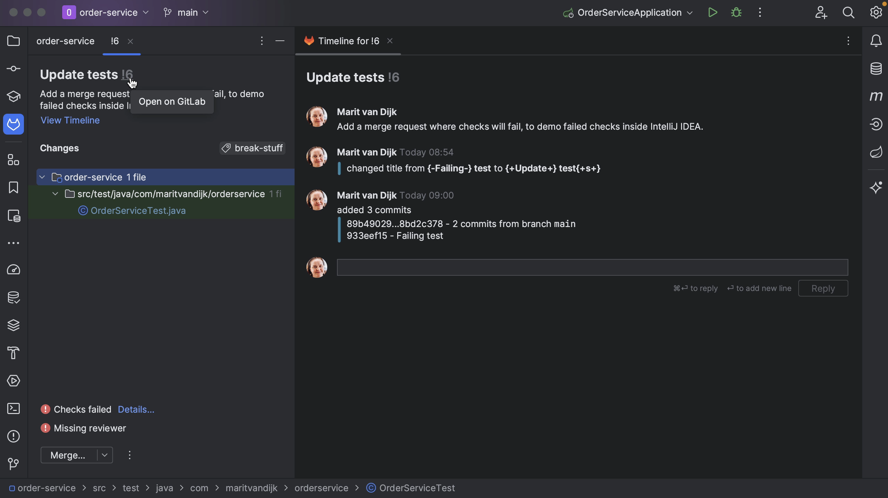

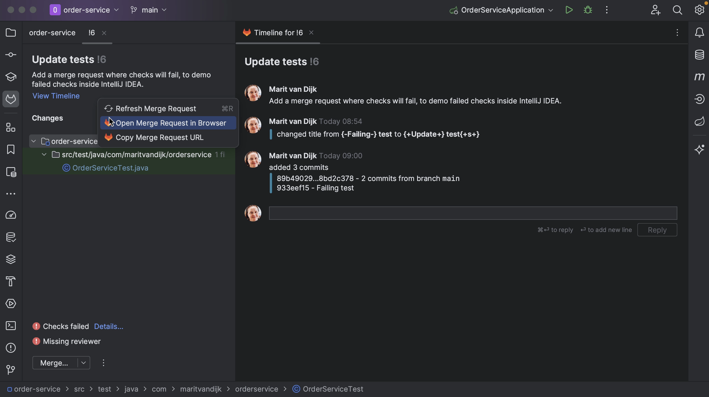

IntelliJ IDEA also shows if there are any conflicts, so we know if this request is safe to merge or not.

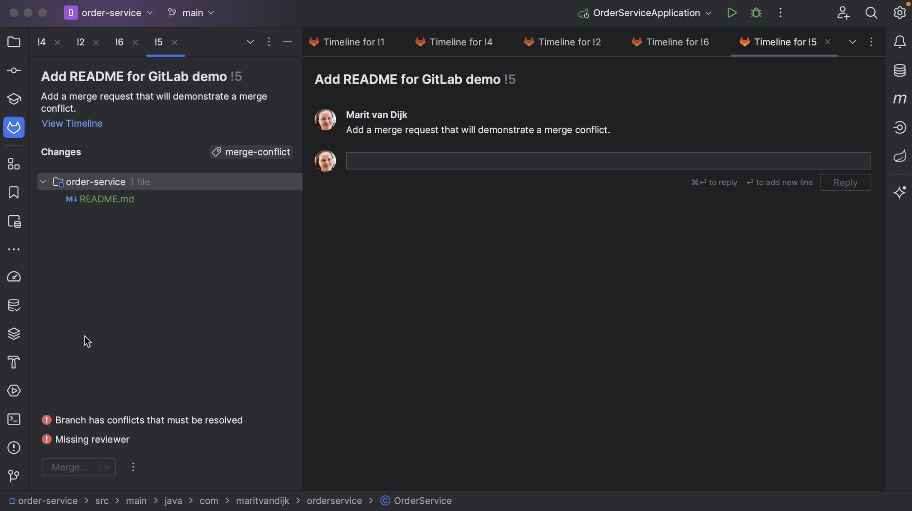

We can open any of the files that make up the Merge Request, and IntelliJ IDEA will show them in the diff viewer, so we can have a closer look at the changes that make up the Merge Request. Inline comments will be displayed in the diff view too. Alternatively, we can open the diff view by selecting the file and using the shortcut for **Show Diff** (**⌘D** on macOS | **Ctrl+D** on Windows/Linux).

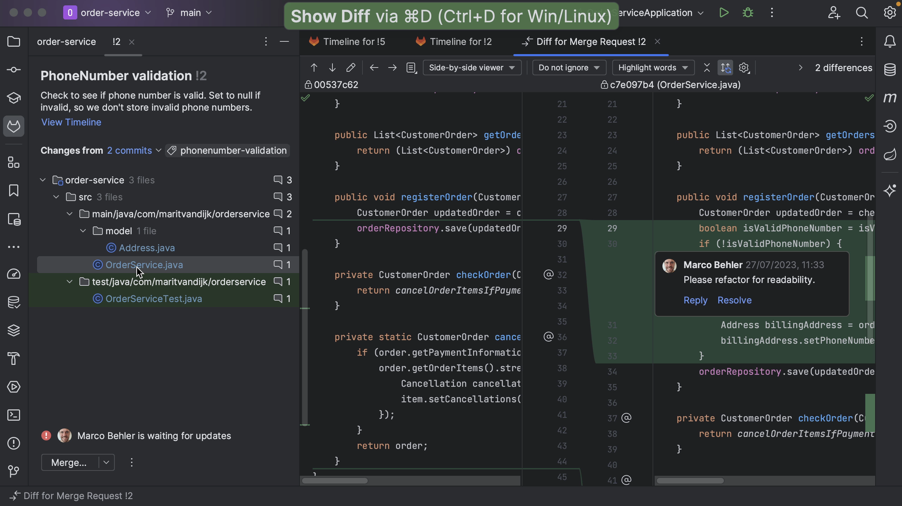

If the Merge Request contains changes to multiple files, we can navigate between those files. We can do so using the arrows at the top of the diff viewer, or using the shortcuts to **Compare Next File** (**⌃⇧→** on macOS | **Alt+→** on Windows/Linux) or **Compare Previous File** (**⌃⇧←** on macOS |**Alt+←** on Windows/Linux).

---

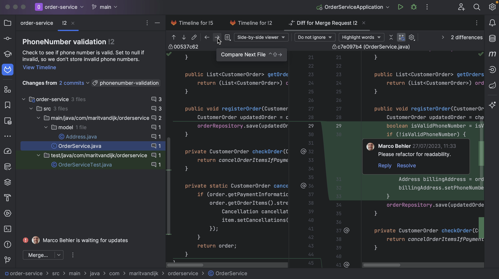

If the Merge Request consists of multiple commits, we can see the individual commits in the **Changes from** dropdown list. We can look at the changes for an individual commit if we want.

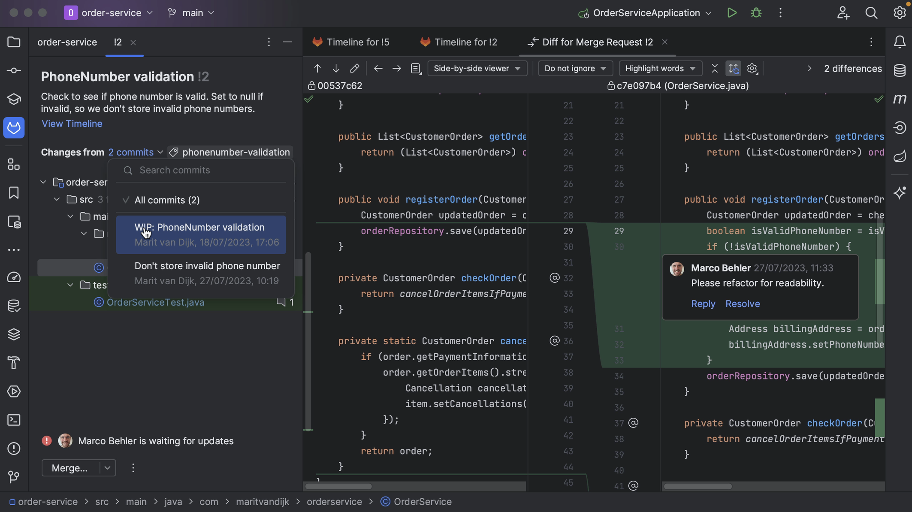

We can also see the number of comments for the Merge Request, and for each file.

We can **Hide All Windows** (**⇧⌘F12** on macOS | **Ctrl+Shift+F12** on Windows/Linux) to focus on the diff. We can **Restore Windows** using the same shortcut.

Alternatively, we can reopen the Merge Requests window by opening the Recent Files dialog (**⌘ E** on macOS | **Ctrl+E** on Windows/Linux), which also lets us open up any of the tool windows. Here we can search for “merge” to find the Merge Request tool window.

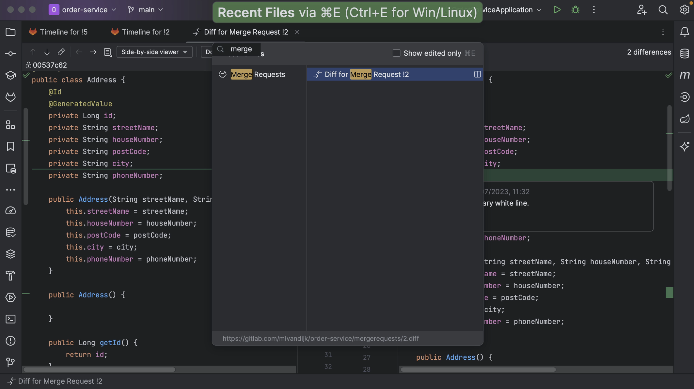
