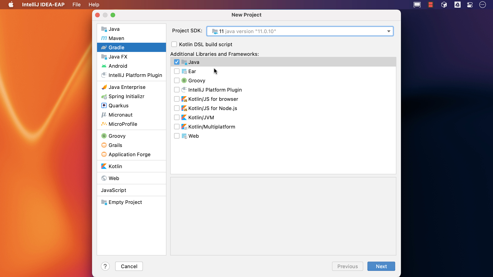
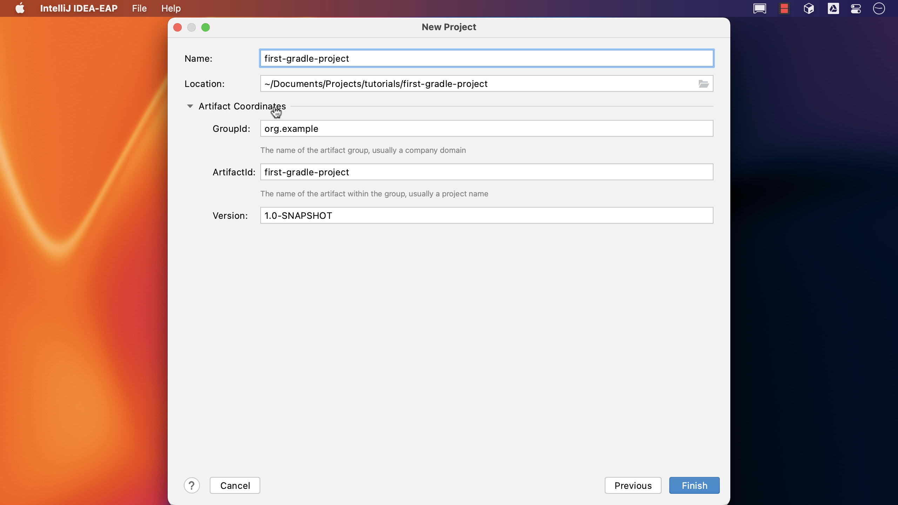

First, let's look at creating a new Gradle project. We can choose ["New Project" from the Welcome Screen](https://www.jetbrains.com/help/idea/new-project-wizard.html), or choose New Project from the File menu if we already have an IntelliJ IDEA project open, either will bring up the New Project window.

From here, we want to select "Gradle" from the options on the left-hand side. The project will need a JDK to run Gradle builds, the Project SDK dropdown shows all the JDKs that have been configured in IntelliJ IDEA, but also all the JDKs detected on this computer. We can also download a new JDK from any of a number of different vendors if we need to. For this video, I'm going to select JDK 11 as this is the current Long Term Support release.

Next we have some other options for configuring our Gradle build. We can optionally choose to create a [Kotlin DSL](https://docs.gradle.org/current/userguide/kotlin_dsl.html) build file, if we check this box. If we leave this empty, IntelliJ IDEA will create a `build.gradle` file which uses [Groovy](https://groovy-lang.org/), which is the more common choice.

We can choose extra libraries, languages or frameworks to add to our new Gradle project. If we know we're going to use any of these in our new application we could select them in the wizard, but if we leave them blank we can add them at a later date if we need them.

We're going to create a basic Java project with a Groovy `build.gradle` file, so let's move on to the next step.

Here we enter the name of the project, and we can change the location if we need to. Let's call it "first-gradle-project". If we want to keep things as simple as possible, we can just press Finish here. We can see more options if we click the "artifact coordinates" title, and make changes if we need to, but for this simple case we'll leave these as they are.

IntelliJ IDEA creates the basic project structure, with a minimal `build.gradle` file, and you'll see Gradle is building the project. Once this finishes, the project window will show the structure of the project, with the standard Gradle directory structure.

We'll look at the project in more detail in the next section.
