If you are using IntelliJ IDEA Ultimate, you can also view your dependencies as a diagram. 

## Show Diagrams
We can open diagrams either by right-clicking the project in the Project tool window and selecting **Diagrams | Show Diagrams**, or by using the shortcut **⌥ ⇧ ⌘ U** (on macOS) or **Ctrl+Alt+Shift+U** (on Windows/Linux). You'll notice this gives you several diagram options to choose from. In this case, we're interested in the **Gradle Dependencies**, so we select that one. We can hide all tool windows (**⇧⌘F12** on macOS / **Control+Shift+F12** on Windows/Linux), so we can focus on the diagram.

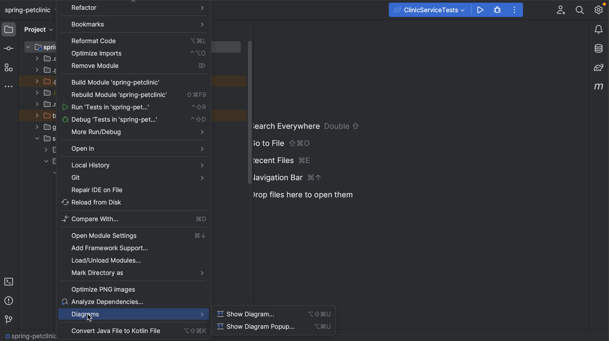

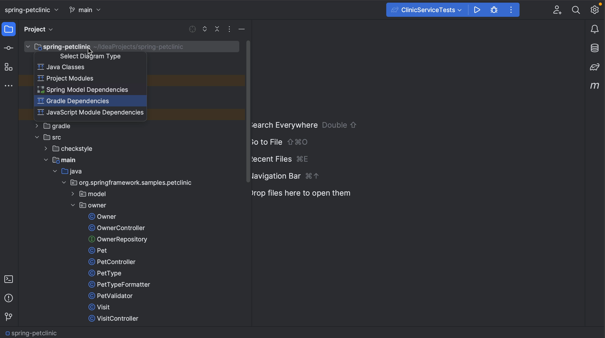

## Zoom in
If the project we're looking at pulls in a lot of transitive dependencies, like this example, the diagram can be quite large. We can zoom in and out using the + and - keys, or the + and - buttons in the diagram window.

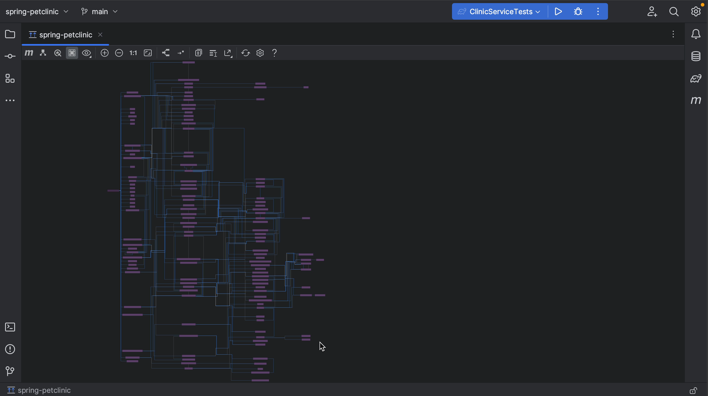

## Finding a specific dependency
To look for a specific dependency and see where we get it from, we can search for this dependency using **⌘F**(on macOS) or **Ctrl+F** (on Windows/Linux) to find it in the diagram. Using the button **Show Paths: Root -> Selection**, we can check the path for this dependency and click related dependencies to follow the path to the root.

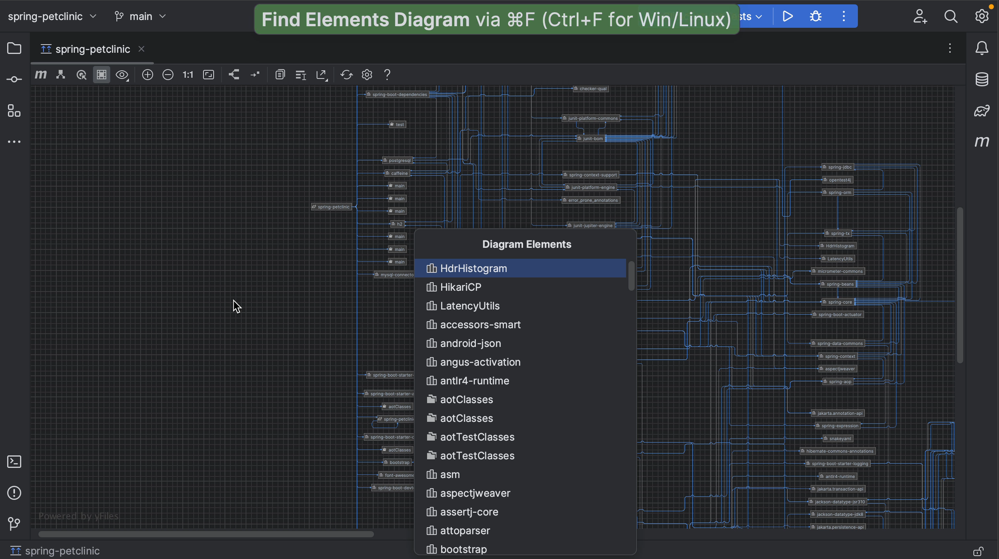

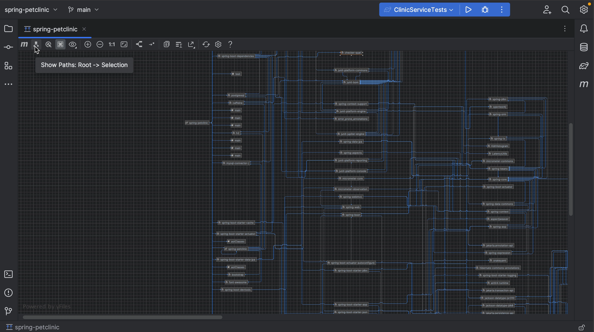

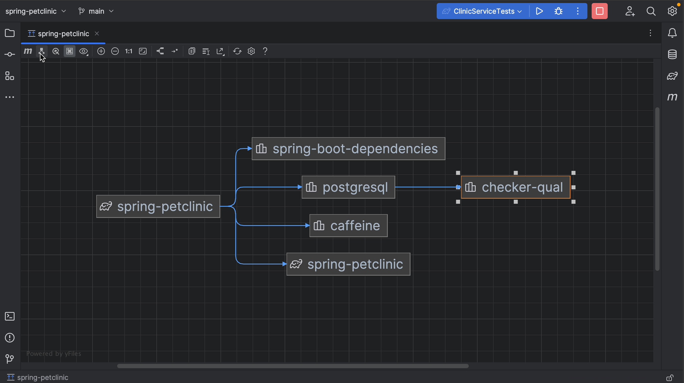

## Focus on related nodes
We have other options to look into specific dependencies. For example, we can zoom in on a specific dependency and the related nodes. Right-click the dependency you're interested in, and from the context menu, select **Analyze graph > Focus on Node Neighbourhood**. This will give you several options. In this example, we'll look at both directions. When we are done, we can reopen **Analyze graph** context menu and select **Drop focus**.

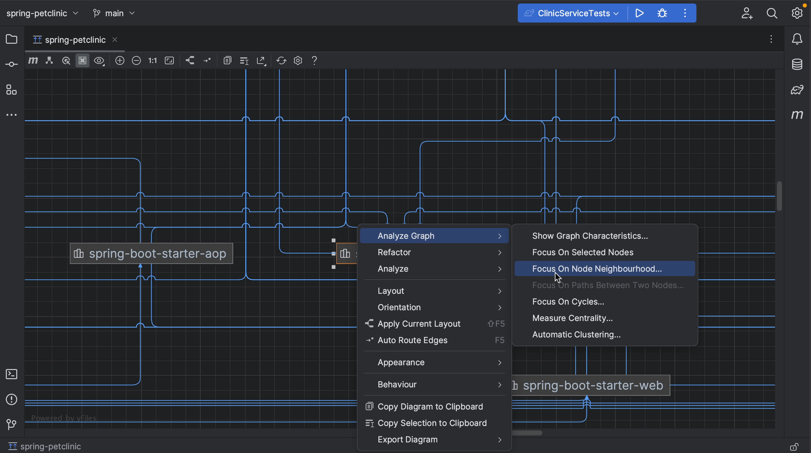

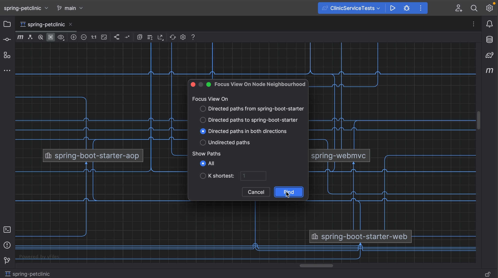

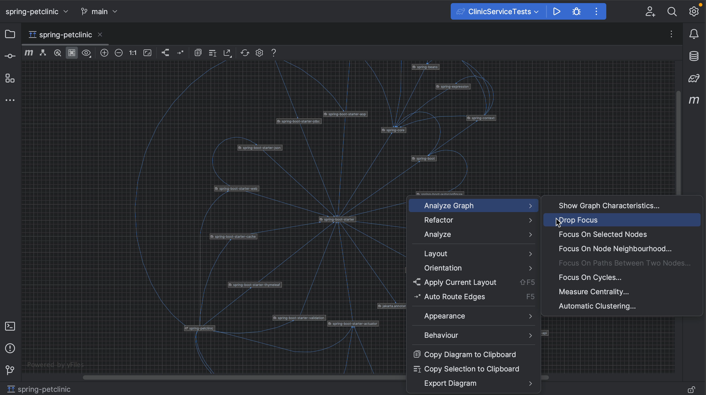

## Select scopes
We can change the visibility level, by clicking the **Change Visibility Level** button for example if we want to focus on compile or runtime dependencies only.

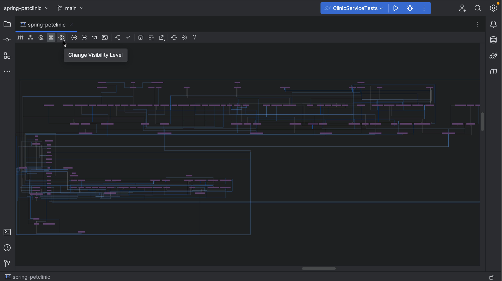

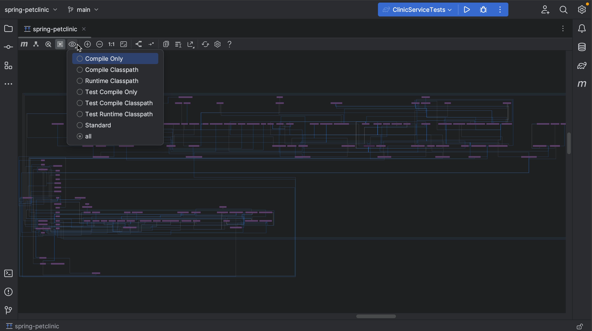
