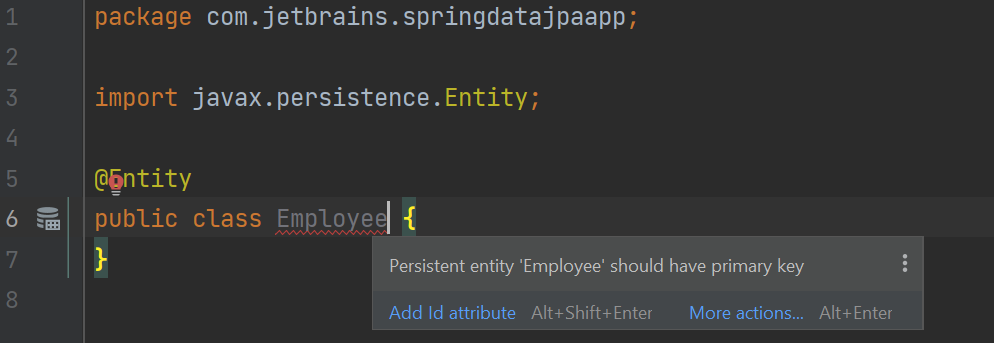
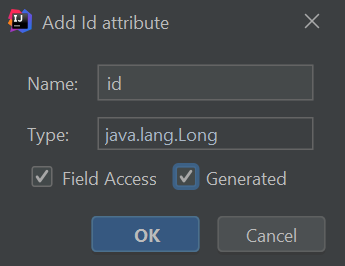
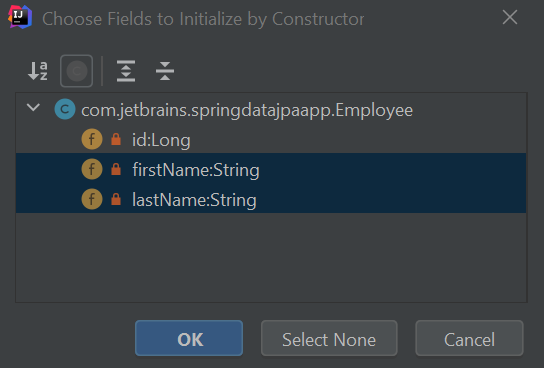

An Entity is a Java class representing data you want to insert into a database. For our application, we will create an Employee entity that we will use to insert Employee data into an Employee table in our database.

In the **Project** window, we'll navigate to our `src/main/java` directory, select the `com.jetbrains.springdatajpaapp` package and press **Alt**+**Insert** for Windows/Linux or **⌘N** for macOS. Choose **Java Class** and then type in our entity name - `Employee`. Then, press **Enter**.

In the Employee class, we'll make it an entity by adding the `@Entity` annotation to our class definition and importing the `javax.persistence.Entity` package. Once you do that, you'll notice an error in your class.



As the error message indicates, entities must have a primary key which is specified by having a field annotated by the `@Id` annotation. We'll use the **Alt**+**Shift**+**Enter** shortcut so IntelliJ IDEA can add the ID for us which will result in a prompt to enter the ID field's information. We'll take the default _Name_ and _Type_. You can select the _Field Access_ checkbox (I prefer annotations on fields instead of the setter methods because I find it more readable). You can also select the _Generated_ checkbox so you don't have to assign Employee Ids yourself.



Then, we'll click **OK**. You'll notice that IntelliJ IDEA creates an `id` field with its setters and getters.

Next, let's add a couple of String fields: `firstName` and `lastName`.

Next, we'll generate our constructors by bringing up the _Generate_ menu (**Alt**+**Insert** for Windows/Linux or **⌘N** for macOS) and select **Constructor**. We don't need the constructor to take in an `id` because ours will be generated so we'll click on **firstName** then hold down **Ctrl** (Windows) or **⌘** (macOS) and select **lastName**.



Then, we'll click **OK**.

You'll now notice that you have an error on your `Employee` class because you don't have a no-arg constructor. If you press **Alt+Enter** (Windows/Linux), or **⌥⏎** (macOS), on the error, IntelliJ IDEA offers to create it for you - let's go ahead and do that.

Next, we'll generate our field's setters and getters. We'll bring up the _Generate_ menu (**Alt**+**Insert** for Windows/Linux or **⌘N** for macOS) and select **Getter and Setter**. We'll hold down **Ctrl** (Windows) or **⌘** (macOS) and select both variables. Then, we'll click **OK**. IntelliJ IDEA generates the getters and setters for both variables.

Finally, let's generate a `toString` method by bring up the _Generate_ menu again (**Alt**+**Insert** for Windows/Linux or **⌘N** for macOS) and selecting **toString**. We'll keep all the fields selected and click **OK**.

## End Result

Your final `Employee` entity should look similar to this (formatting may vary):

```java
package com.jetbrains.springdatajpaapp;

import javax.persistence.Entity;
import javax.persistence.GeneratedValue;
import javax.persistence.Id;

@Entity
public class Employee {
    @Id
    @GeneratedValue
    private Long id;
    private String firstName;
    private String lastName;

    public Employee() {
    }

    public Employee(String firstName, String lastName) {
        this.firstName = firstName;
        this.lastName = lastName;
    }

    public void setId(Long id) {
        this.id = id;
    }

    public Long getId() {
        return id;
    }

    public String getFirstName() {
        return firstName;
    }

    public void setFirstName(String firstName) {
        this.firstName = firstName;
    }

    public String getLastName() {
        return lastName;
    }

    public void setLastName(String lastName) {
        this.lastName = lastName;
    }

    @Override
    public String toString() {
        return "Employee{" +
                "id=" + id +
                ", firstName='" + firstName + '\'' +
                ", lastName='" + lastName + '\'' +
                '}';
    }
}
```
