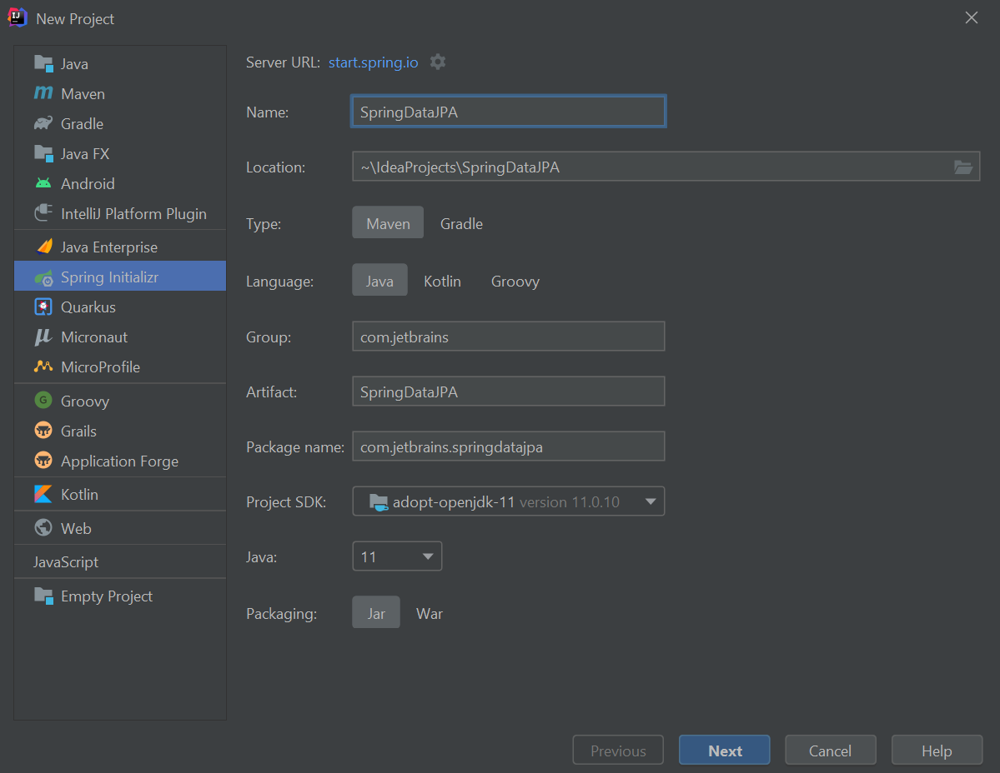
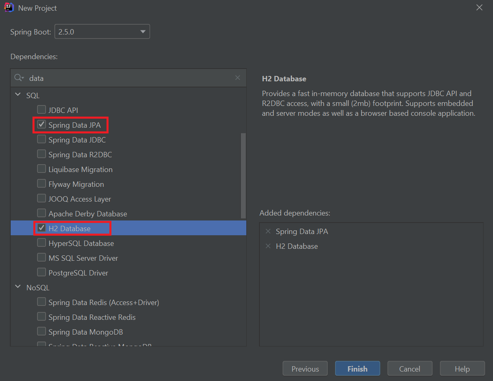

First, we'll create a new project in IntelliJ IDEA Ultimate by clicking on the **New Project** button in the Welcome Screen. We'll select **Spring Initializr** from the left menu. Then, we'll specify our project's name - you can call it `SpringDataJPA`. We can also change the **Group** field to our company name. For the rest of the fields, you can accept the defaults. Feel free to use the latest Java version for your project.

Then, we'll click **Next**.

In the next window, we'll select the latest Spring Boot version available to us. Then under _Dependencies_, we'll search for `data` in the search field. Under _SQL_, we'll select the checkboxes for **Spring Data JPA** and **H2 Database** from the list. For this tutorial, we'll be using H2 as our database because it is easy to setup. If you want to use a different database, such as MySQL or HyperSQL, feel free to select those dependencies instead or add them later to your pom.xml file.

Once we click **Finish**, IntelliJ IDEA creates a new Spring Boot project with the Spring Data JPA and database dependencies.
