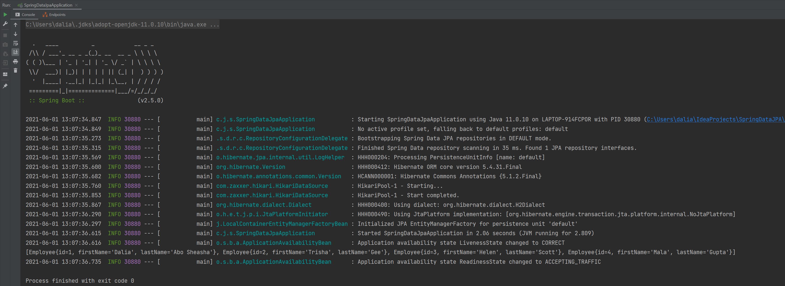

Now that we have our Employee entity, repository and database configuration, we are ready to write our application logic. Let's say we want to insert four employees to our database. We'll navigate to the `SpringDataJpaApplication` class that was created for our Spring Boot application (**Shift**+**Shift** to search for class).

**Exercise**: Take a few minutes to see if you can create a `insertFourEmployees(EmployeeRepository repository)` method that inserts employees using the `save()` method.

Done? Here is what your method would look like:
```java
private void insertFourEmployees(EmployeeRepository repository) {
    repository.save(new Employee("Dalia", "Abo Sheasha"));
    repository.save(new Employee("Trisha", "Gee"));
    repository.save(new Employee("Helen", "Scott"));
    repository.save(new Employee("Mala", "Gupta"));
}
```

Now, let's go ahead and call that method in our application. In a typical Spring Boot application, we would have a service class that contains functionality provided by the service. However, since we're doing a few one-time operations, let's keep it simple and use a bean to call our `insertFourEmployees` method. Then, let's call `repository.findAll()` to retrieve the entities that were inserted. Here is what that looks like:

```java
@Bean
public CommandLineRunner run(EmployeeRepository repository) {
    return (args) -> {
        insertFourEmployees(repository);
        System.out.println(repository.findAll());
    };
}
```

Let's run our application and see it in action. We'll press **Shift**+**F10** for Windows/Linux or **⌃R** for macOS.

## End Result
Once our application starts, we can see the Console logs showing our Spring Boot application starting. Then, we can see the result of our `findAll` call which prints all our employees from the database.


