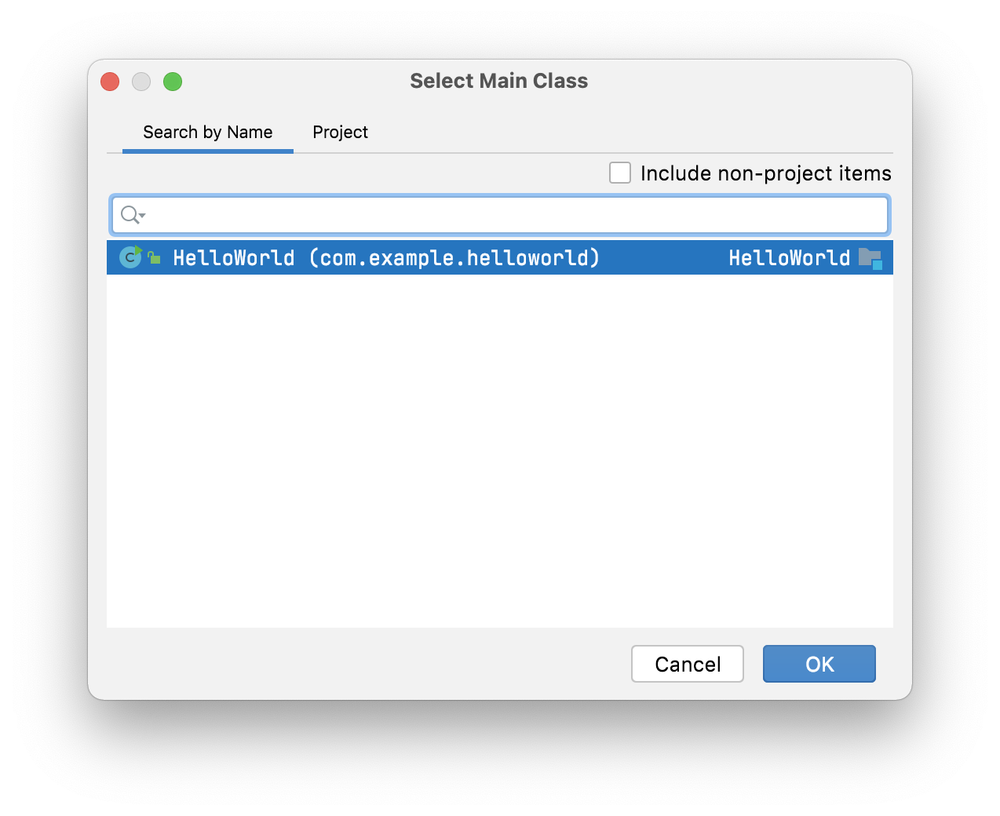
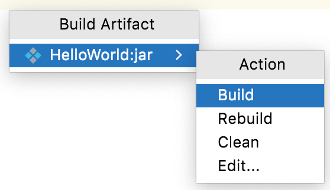
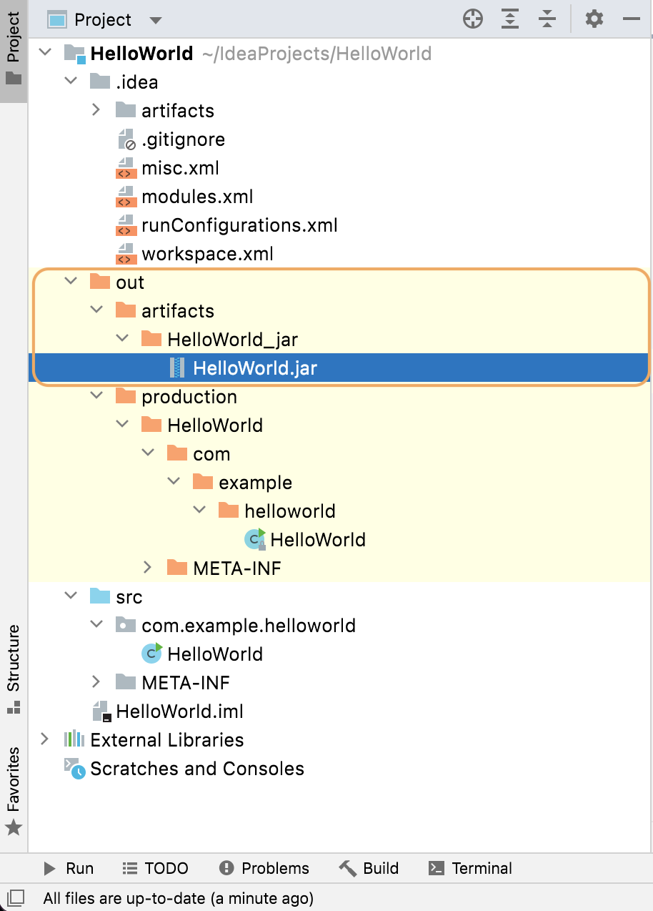

When the code is ready, we can [package our application in a JAR](https://www.jetbrains.com/help/idea/compiling-applications.html#package_into_jar). JAR files are often used to deploy an application to the production server. Once a JAR file has been built, it is called an artifact. Let's take look at how to create artifacts in IntelliJ IDEA.

### Creating an Artifact

1) Press **Cmd+;** on macOS, or **Shift+Control+Alt+S** on Windows to bring up the [Project Structure](https://www.jetbrains.com/help/idea/project-structure-dialog.html) dialog.

2) Select **Artifacts** from the left-hand menu and then press the **+** icon. Select **JAR** and then **From modules with dependencies**.

You don't need to change anything for the Module, however you do need to say which class in your project has the main method. Click the browse button to navigate to your main method. IntelliJ IDEA will show you a list of classes in your project, you only have one so select that.

3) Press **OK** to select your class. All the other defaults are fine for this tutorial, press **OK**. Now you can see your new JAR file defined in the Project Structure dialog.

4) If it matches the above screenshot, press **OK**. You have now defined how to build the JAR file, but you haven't actually built it yet. You need to build it with your build artifacts.

5) Go to **Build** > **Build Artifacts**. You will only have one to choose from which is the one that we just defined.

6) Press **Enter** to build the artifact. Your status bar at the bottom-left of the screen will show you when this has completed.

IntelliJ IDEA puts the artifact in a new folder in your `out` folder called `HelloWorld_jar`.

To make sure that this JAR file was created correctly you will want to run it. We'll do this in the next step of this tutorial by using a [run configuration](https://www.jetbrains.com/help/idea/run-debug-configuration.html).

---
