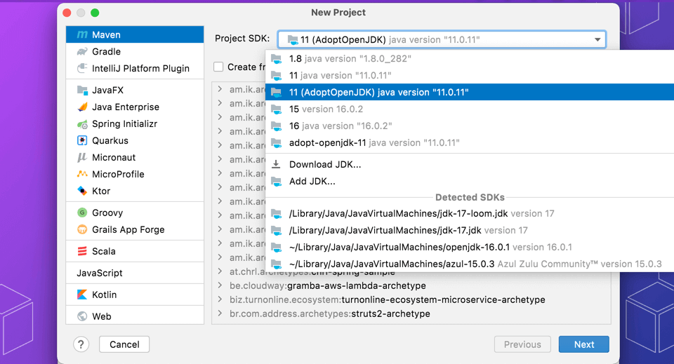

Let's create a brand new Maven project. From the Welcome Screen select New Project, or if you already have an IntelliJ IDEA project open, select File -> New -> Project...

Select Maven from the options on the left, and choose the JDK for the project.

We can optionally choose a maven archetype to use to create the project. If you're creating a simple project, you don't need to select an archetype.

Press Next.

You need to give the project a name, and you can optionally set the location. If you click on **Artifact Coordinates** you'll see more Maven settings.

You can declare a group id, and the artifact id of the application itself. 

Press **Finish**, and IntelliJ IDEA will generate the Maven pom.xml for you. 

As well as creating the basic `pom.xml`, IntelliJ IDEA has also created the default directory structure for a Maven project with the source and test folders defined.

You can use **⌘E** (macOS), or **Ctrl+E** (Windows/Linux) and then type in _Maven_ to open the Maven Projects window, where you can see the standard Maven lifecycle phases, as well as the goals defined by various Maven plugins.

