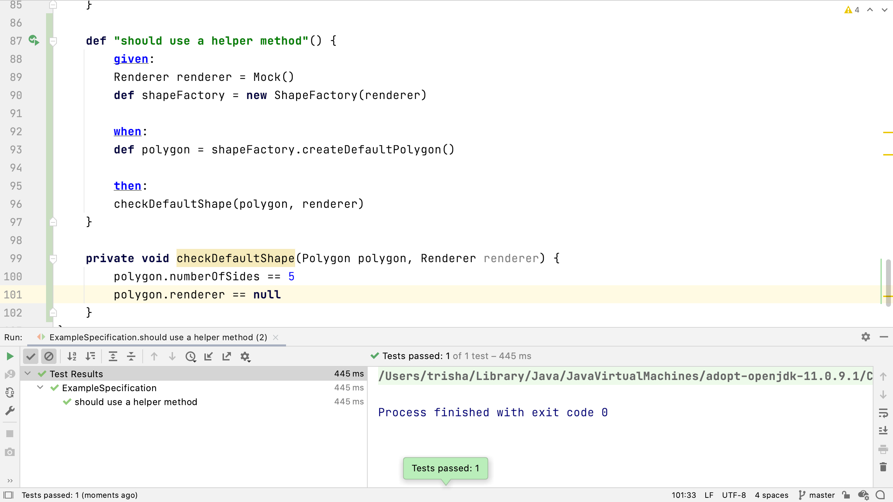

When tests get big, we may want to split out large parts of code, or common code, into [helper methods](http://spockframework.org/spock/docs/2.0/all_in_one.html#_helper_methods).

Let's say we have a test like this one.

```groovy
def "should use a helper method"() {
    given:
    Renderer renderer = Mock()
    def shapeFactory = new ShapeFactory(renderer)

    when:
    def polygon = shapeFactory.createDefaultPolygon()

    then:
    polygon.numberOfSides == 4
    polygon.renderer == renderer
    //could check lots of different values on this polygon... 
}

```

It uses a [ShapeFactory](https://github.com/trishagee/spock-testing-demo/blob/main/src/main/java/com/mechanitis/demo/spock/ShapeFactory.java) to create a default shape, and then we perform a number of checks to make sure this meets our expectations. You can imagine in real production code there might be a lot of values to check here.

We may be tempted to move all these checks into their own method, especially if they're going to be used by more than one test.

```groovy
def "should use a helper method"() {
    //given... when... code
    
    then:
    checkDefaultShape(polygon, renderer)
}

private static void checkDefaultShape(Polygon polygon, Renderer renderer) {
    polygon.numberOfSides == 4
    polygon.renderer == renderer
}
```

Run the test - it will pass. However, if we change the code so it should fail, we'll see that it still passes. This helper method is not doing what we expect.



If we move our assertions into a helper method like this, it can no longer use the comparison operators to define the expected behaviour. Instead, we need to add the `assert` keyword specifically.

```groovy
private static void checkDefaultShape(Polygon polygon, Renderer renderer) {
    assert polygon.numberOfSides == 4
    assert polygon.renderer == renderer
}
```
Now if you run the test with incorrect values in `checkDefaultShape`, it should fail.

There's something else to be aware of too - it fails on the first assertion that fails, it never runs the assertion to check the polygon's renderer. Later we'll look at how to address that.

Now we know how to split sections of our tests into separate methods. Next, let's look at one way of checking multiple values on a single object.
