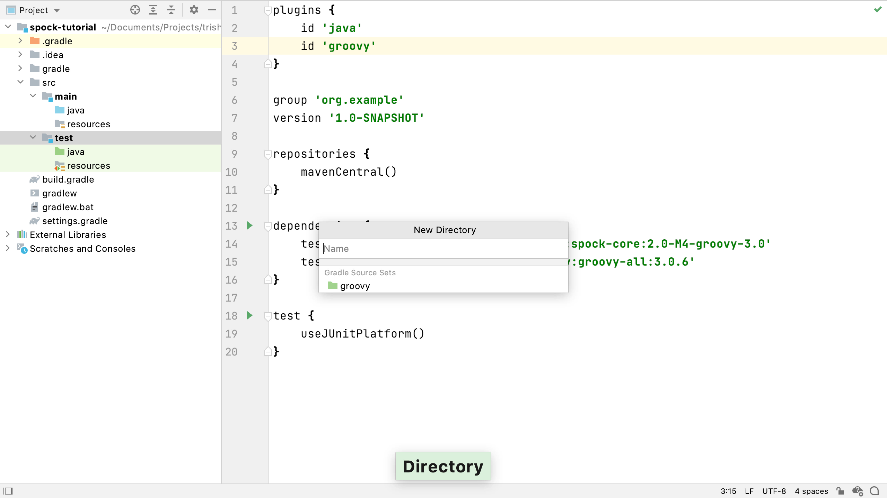

Now the basics of the project have been created, let's take a closer look and set up the dependencies we need.

IntelliJ IDEA adds JUnit 5 as the default testing framework, which is a logical choice, but we want to use Spock instead of JUnit. We can [generate a new dependency](https://www.jetbrains.com/help/idea/work-with-gradle-dependency-diagram.html#add_gradle_dependency) for the libraries we want using **⌘N** / **Alt+Insert** in the `build.gradle` file and then choosing "Add Maven artifact dependency".


We can search for "spock" in the artifact search, and add the [latest version of the spock-core library](https://github.com/spockframework/spock/releases). This is currently Spock 2.0:

- `org.spockframework:spock-core:2.0-groovy-3.0` if using Groovy 3
- `org.spockframework:spock-core:2.0-groovy-2.5` if using Groovy 2

This is a test dependency so make sure the declaration is `testImplementation`.

We also need a dependency on [Groovy](../../../../topics/groovy), since Spock tests are written in Groovy. Follow the same steps for adding a new Maven artifact dependency, search for Groovy and add a dependency on Groovy 3.0.8. For now, we're only going to use Groovy for testing, so we'll declare this as `testImplementation` too.

You can delete the other JUnit dependencies since we don't need them, your `build.gradle` dependencies should look like:

```groovy
dependencies {
  testImplementation 'org.spockframework:spock-core:2.0-groovy-3.0'
  testImplementation 'org.codehaus.groovy:groovy-all:3.0.8'
}
```

Since we're using Groovy, we need to add the [groovy plugin](https://docs.gradle.org/current/userguide/groovy_plugin.html) to Gradle. When we're using the Groovy plugin, we don't need to specifically add the Java plugin as well, since all that functionality is included in the Groovy plugin. We might want to delete `java` plugin just to keep the noise down in our build file. We can keep the plugin to be explicit, or delete it to be more succinct, it's really down to our own preferences.

```groovy
plugins {
    id 'groovy'
}
```

[Full build.gradle code](https://github.com/trishagee/spock-testing-demo/blob/1ced2b4d118a3bcb418f05c1470dbef665b8eee9/build.gradle)

Now we can load all the Gradle changes with **⇧⌘I** (macOS), or **Ctrl+Shift+O** (Windows/Linux), and IntelliJ IDEA will download any new dependencies, remove the old ones, and correctly configure the project.

With a mixed language project like this one, one way to organise the files is to keep Java code in the `java` folder and to create a `groovy` folder for Groovy code.

From the Project window, select the `test` folder and press **⌘N** (macOS) or **Alt+Insert** (Windows/Linux). Select "Directory", and start typing "groovy" in the **New Directory** dialog. IntelliJ IDEA should suggest "groovy" in the dropdown because we're using the Groovy plugin in Gradle.



Now you know how to set up your project to use Spock. Next, we're going to create our first Spock test.
