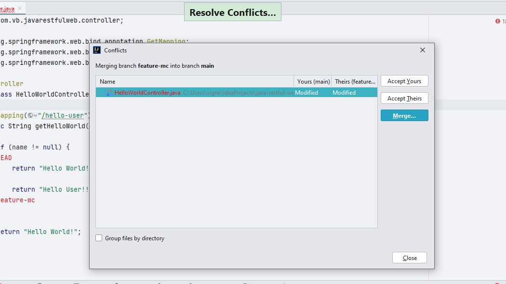

Use <kbd>⇧⇧</kbd> (macOS) / <kbd>Shift+Shift</kbd> (Windows/Linux), to bring up the Search Everywhere dialog. You can now search for _Resolve Conflicts_ to open the _Conflicts_ dialog which helps you to visually resolve merge conflicts between two different versions of the code.

- You can use the option available in the _Merge Revisions_ dialog and you should carefully review before you accept or ignore code changes as well as resolving conflicts. This dialog visually helps you to review and resolve merge conflicts.

- **Note:** The **Resolve Conflicts** option from the Search Everywhere dialog will only display the _Conflicts_ dialog when there are merge conflicts in your code, otherwise you will get an error.

## Resolving Conflicts Using Git Toolbar Options

Alternately, you can open the **Conflicts** dialog by using **Git -> Resolve Conflicts** option available from the menu.

### Conflicts Dialog

The _Conflicts_ dialog shows a list of files that have merge conflicts. You can select files and merge manually, or
you can accept either your changes or their (incoming) changes.

### Manually Resolving Conflicts using Merge

When you manually merge changes, you use the _Merge Revisions_ dialog which provides a visual view of changes and
conflicts between two different versions of the code. It has three different views:

#### Left View

The Left view shows your changes of the file.

#### Result View

The Result view is where any changes made and conflicts resolved are shown visually. You can always refer to the Result
View to keep making required changes and resolving conflicts.

#### Right View

The Right view shows the incoming file changes.

### Resolving Merge Conflicts

You should carefully review the changes _(highlighted in blue)_ and accept any one of the changes that are required.
In case of conflicts _(highlighted in red)_, you should accept the changes that you want, and ignore those that you
don't.

#### Accepting Code Changes

To accept a code change, click on the **>>** symbol in the Left View or the **<<** symbol in the Right View which is
pointing towards the Result view. This will apply the corresponding change in the Result view.

#### Ignoring Code Changes

To ignore a code change, click on **X**. This means that the change is disregarded from the selected view (Left or
Right). Ignoring code changes means that they are not applied to the Result view.

### Finish Merging

When you have successfully resolved all your merge conflicts, IntelliJ IDEA will prompt you that _All Changes have been
processed_. When you press **Apply** the conflicts in the file are all resolved.
