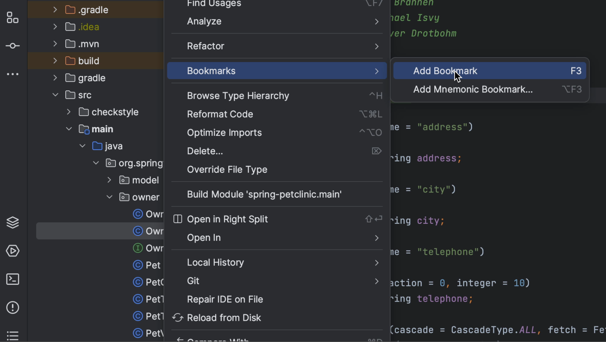

We can bookmark a line by pressing <kbd>F3<kbd/> (macOS) / <kbd>F11</kbd> (Windows/Linux). This shortcut creates an anonymous line bookmark, marked with a Bookmark icon. If we don't remember the shortcut, we can right-click the gutter next to the line of code we want to bookmark and select **Add Bookmark**.

We can also bookmark files, packages, folders, and modules. We can open the _Project_ Tool Window <kbd>⌘1</kbd> (macOS) / <kbd>Alt+1</kbd> (Windows/Linux) and add an anonymous bookmark. We can use the shortcut <kbd>F3<kbd/> (macOS) / <kbd>F11</kbd> (Windows/Linux) or we can also right-click the item we want to bookmark, and select **Bookmarks | Add Bookmark**. Note that anonymous bookmarks don't have an identifier, and we can create as many anonymous bookmarks as we like.

