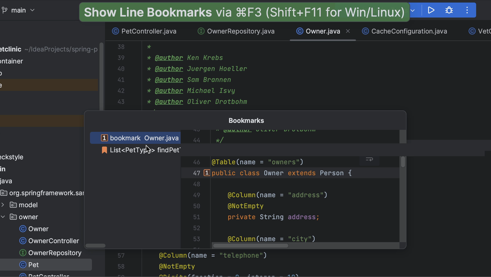
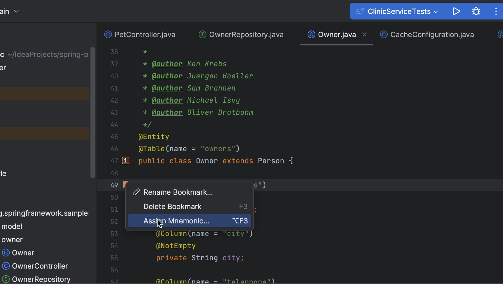
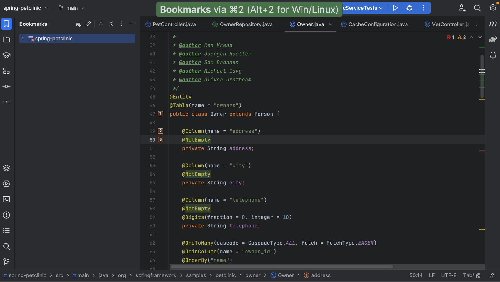
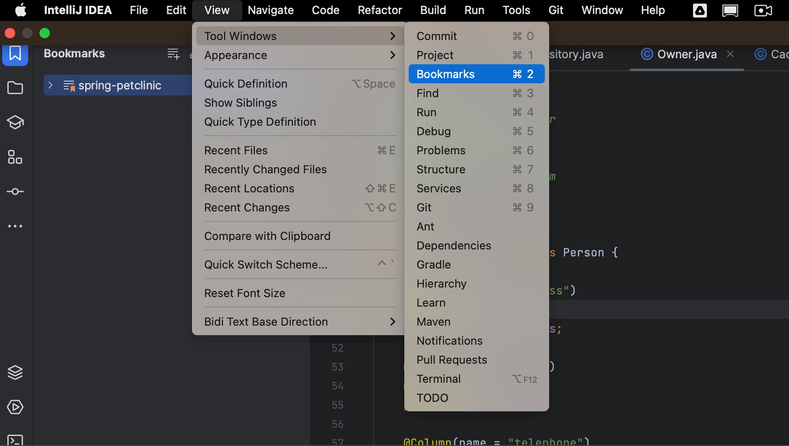
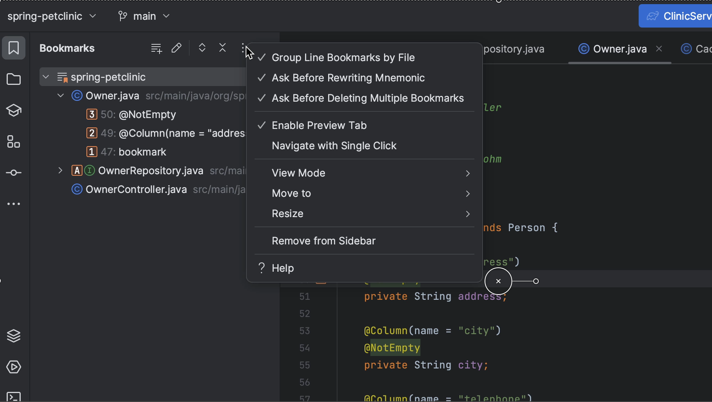
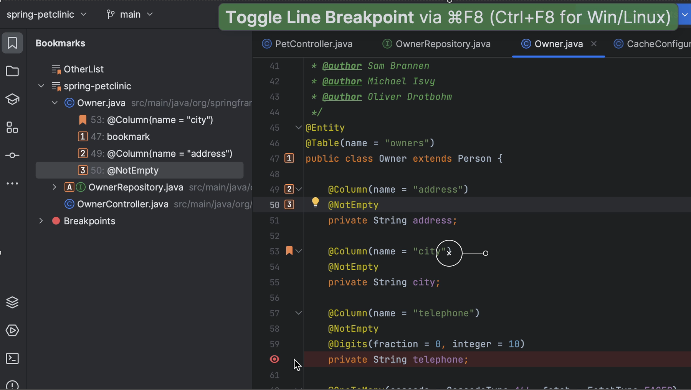
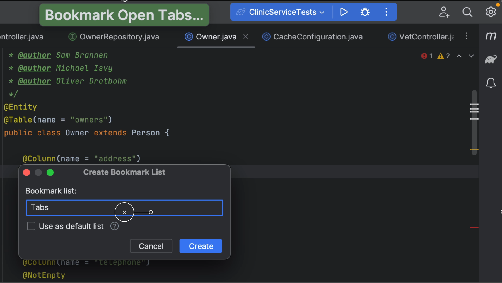

There are several options to navigate to the bookmarks we have created.

To see all **line** bookmarks that we have in the code, we can open the **Bookmarks** popup by pressing <kbd>F3<kbd/> (macOS) / <kbd>F11</kbd> (Windows/Linux) or go to **Edit | Bookmarks | Show Line Bookmarks**.

Notice that this list does not contain any project items like files or classes that we have bookmarked. We can select the bookmark we want to navigate to, either with up and down arrows and pressing <kbd>⏎</kbd> (macOS) / <kbd>Enter</kbd> (Windows/Linux), or by double-clicking it with our mouse. For mnemonic bookmarks, we can select the corresponding digit or letter.

To jump straight to a mnemonic bookmark, hold **^** (on macOS) or **Control** (on Windows/Linux) and press the mnemonic digit or letter on the keyboard. This doesn't work with anonymous bookmarks, but we can assign a mnemonic to an existing anonymous bookmark, either using the shortcut, or by clicking the bookmark in the gutter and selecting **Assign Mnemonic**. This works in the **Bookmarks** popup too!

To see all our bookmarks, we can open the **Bookmarks** tool window by pressing **⌘ 2** (on macOS) or **Alt+2** (on Windows/Linux), or by selecting **View | Tool Windows | Bookmarks** from the main menu.

IntelliJ IDEA adds your bookmarks to the predefined list in the Bookmarks tool window that is created automatically and has the same name as the project. In this example, multiple bookmarks in the same file are grouped together. We can also turn that off in the **Options** menu, by deselecting **Group Line Bookmarks by File**. As we can see, there are several other options as well. We won't dive into all of them, but be aware there are some options you can configure to your liking.

Another option we do want to show you here is that you can create more lists. We can add a new list using the shortcut <kbd>⌘N</kbd> (macOS) / <kbd>Alt+Insert</kbd> (Windows/Linux) or by clicking the **Create Bookmark List** button. We can add a name for the new list.

If there are multiple lists, and we create a new bookmark, we can select which list to add it to in the **Add Bookmark** popup. We can also select the list to use as the default by checking the option **Use as default list**.

In the Bookmarks tool window, we can move bookmarks to another list by dragging them to the other list. And we can sort bookmarks by selecting a bookmark and using Move down <kbd>⌥⌘↓</kbd> (macOS) / <kbd>Ctrl+Shift+Down Arrow</kbd> (Windows/Linux) or Move up <kbd>⌥⌘↑</kbd> (macOS) / <kbd>Ctrl+Shift+Up Arrow</kbd> (Windows/Linux).

**Fun fact:** The Bookmarks tool window also shows all breakpoints that are automatically added to the dedicated list once you place them in your code.

Finally, we can also bookmark editor tabs. Click the ellipsis button to the right of the tabs and select **Bookmark Open Tabs**. We can enter a name for this list in the **Create Bookmark List** popup.

