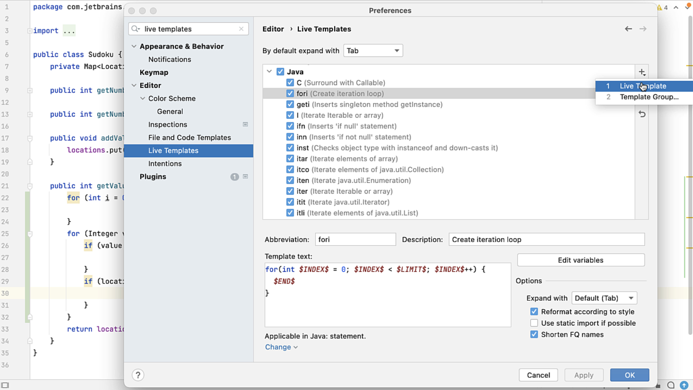
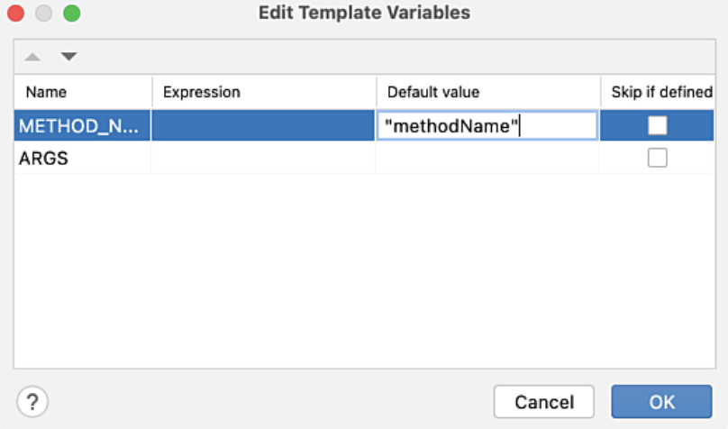
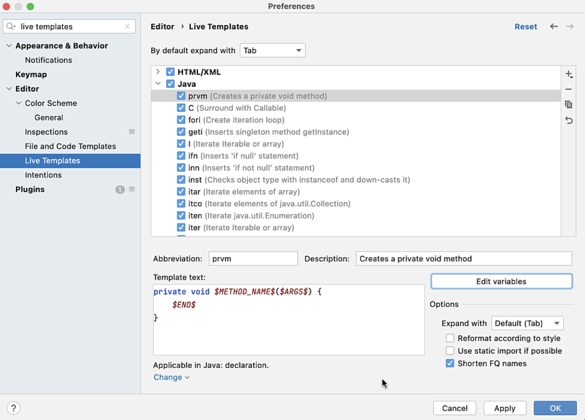

In this example, we're going to create a Live Template to insert the code construct for `private void method`:

```java
private void <methodName>(<optional arguments>) {

}
```

1. Open your Settings/Preferences <kbd>⌘,</kbd> (macOS) / <kbd>Ctrl+Alt+S</kbd> (Windows/Linux).
2. Search for "live templates":


3. The Live Templates are grouped by language. For this example, select the **Java** node.
4. Select the new icon on the right and then **1. Live Template**.



5. Enter an abbreviation of `prvm`. This is the characters that will trigger the Live Template when you type them in and press <kbd>⏎</kbd> (macOS) / <kbd>Enter</kbd> (Windows/Linux).

6. Enter a description of `Creates a new private void method`.
7. In the Template text field, enter:

```java
private void $METHOD_NAME$($ARGS$) {
  $END$
}
```

[Variables](https://www.jetbrains.com/help/idea/template-variables.html) start and end with the $ (dollar) sign and are used to capture your input when you use the Live Template. You can name your variables in any way you like, however the $END$ [variable is pre-defined](https://www.jetbrains.com/help/idea/template-variables.html#pdtv) in IntelliJ IDEA and determines where the caret lands at the end of your Live Template:

| Code          | Meaning                                |
| ------------- | -------------------------------------- |
| $METHOD_NAME$ | Variable for the name of the method    |
| $ARGS$        | Variable for method arguments          |
| $END$         | Variable for the carets final location |

6. Press **Edit variables**. Default values aren't mandatory, however they are helpful in some Live Templates to remind you what code to enter when you use the Live Template. Enter a default value for $METHOD_NAME$ of `methodName`.
7. You can enter a default value for $ARGS$ if you want to, however we're going to leave it blank. The $END$ variable doesn't appear here because you can't edit it:



8. Press **OK** and then select the **Define** link at the bottom of the dialog box to define the context in which this Live Template will be available.
9. Select **Java > Declaration**:



10. Press **OK** and go back to your Java class. Remember the context for this Live Template is declaration so inside a class type `prvm`. This is the acronym we used when we created the Live Template:


11. Press <kbd>⏎</kbd> (macOS) / <kbd>Enter</kbd> (Windows/Linux) to use the Live Template. The default value we entered for the variable $METHOD_NAME$ will be highlighted. Give your new method a name which overwrites the default value of `methodName` then press <kbd>⇥</kbd> (macOS) / <kbd>Tab</kbd> (Windows/Linux).
12. Enter any arguments you want to pass in to your method and press <kbd>⇥</kbd> (macOS) / <kbd>Tab</kbd> (Windows/Linux) again.
13. Your caret will now be in the correct location inside your new method to start typing code.


Congratulations, you've created a Live Template to insert a private void method! In the next example we will create a Live Template from an existing snippet of code and use [Functions](https://www.jetbrains.com/help/idea/template-variables.html#predefined_functions).

---
