Let’s take a look at how to interpret the Dependency Matrix.

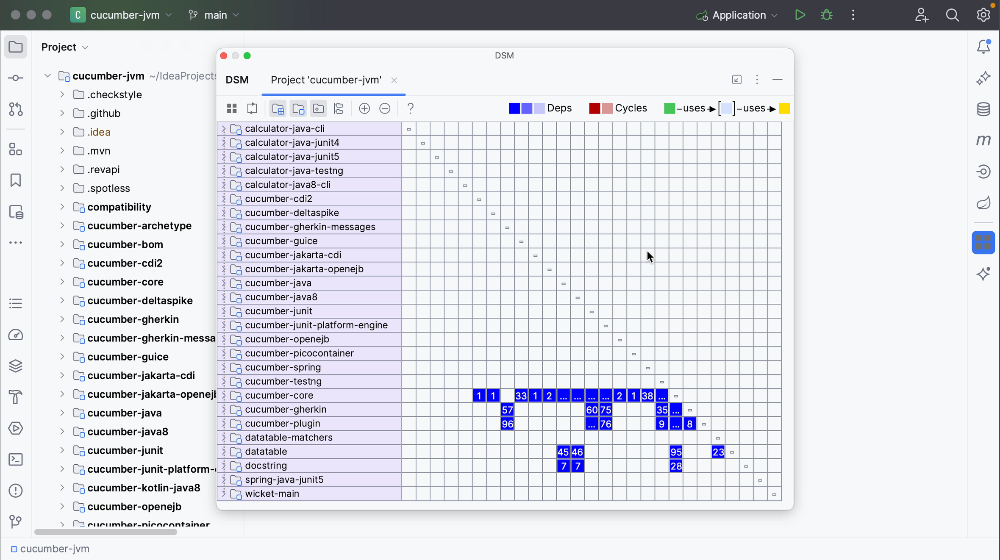

The row headers represent the program structure. In this example, the matrix contains the same modules from the _Project_ tool window as rows.

Notice that the modules are not sorted alphabetically, as they are in the _Project_ tool window. The matrix moves the components that are used the most to the bottom. This means that the components located at the top of the matrix _depend on_ the components below.

Since this is a matrix, the column headers are the same as the row headers. They are omitted to save space. The dashes on the diagonal correspond to self-dependencies, which are not shown.

As you can see in the legend at the top right of the _DSM_ tool window:

- dependencies are shown in blue
- mutual or cyclic dependencies, meaning that two components depend on each other, are shown in red
- dependencies flow from green to yellow.

## Dependencies

Dependencies are shown in blue. The numbers in the cells show the number of dependencies of the selected row on the selected column. An ellipsis (the three dots) in a cell means that there are more than 99 dependencies. Hover over the cell to get more information. In the example below, we see the tooltip "cucumber-java -> cucumber-core (209)". This means that in this project the component cucumber-java (represented in the column) depends on the component cucumber-core 209 times.

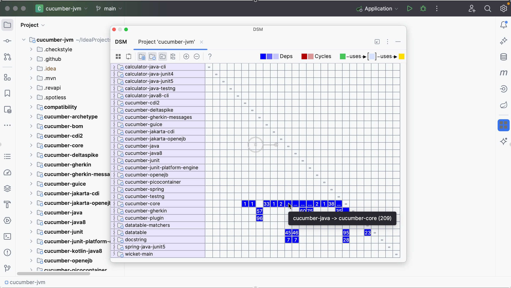

You can click rows or cells to examine the relationship between the components in more detail.

When you select a row to see the relationship between the selected component and others, the selected row and corresponding column are highlighted to visualize row dependencies.

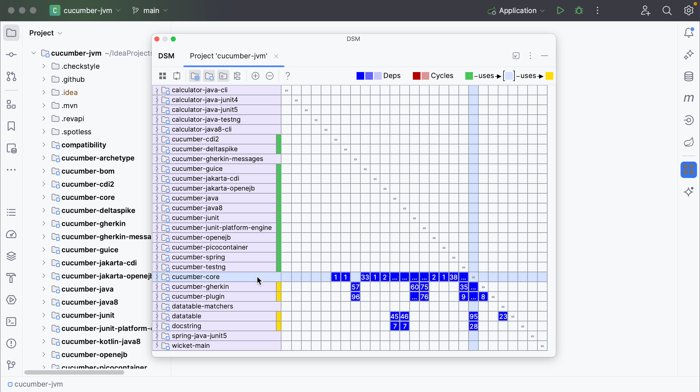

The column shows the dependencies _of_ the selected row.

The row shows the dependencies _on_ the selected row.

Remember from the legend that dependencies flow from green to yellow.

In this example, the core module is selected. You can see that this module _uses_ several other modules, marked in yellow. In turn, you see that this module _is used_ by several modules marked in green.

You can select different rows to see which components they use or are used by. You'll see that the components at the top mostly use the components at the bottom, while the components at the bottom are mostly used by components at the top and no longer using other components themselves.

You can drill down further into specific cells. When you click a cell, one component will be marked green and the other will be marked yellow. The green component _uses_ the yellow component. The corresponding cell (marked purple) will show dependencies in the other direction, in this case 0.

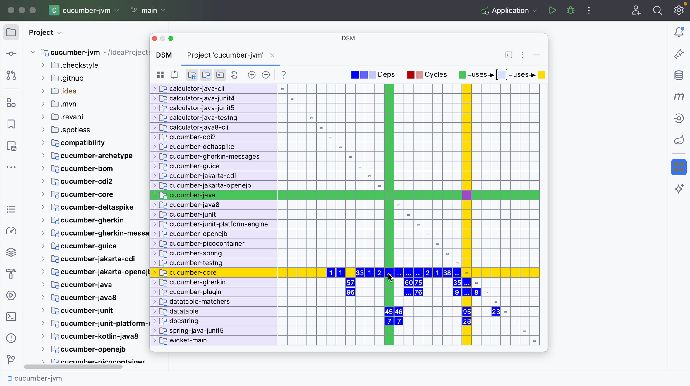

We can drill down even further.

## Expand components

Right now everything is collapsed and only the modules are shown. You can click a module to expand its packages. The module name is shown to the left, the packages are shown as rows and the dependencies between the packages are shown in the matrix inside the box marked with a black line.

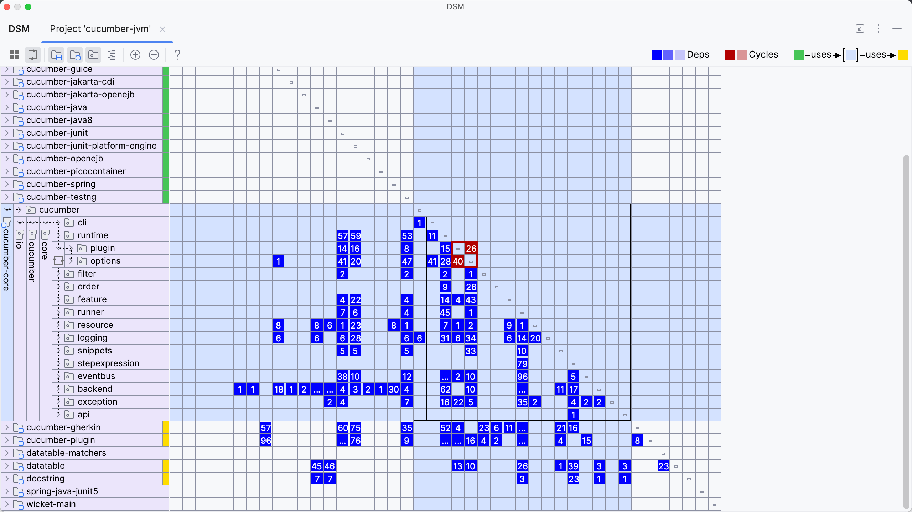

You can expand the packages further to show the classes in that package, and see the dependencies between classes inside the packages. You can expand modules and packages by clicking the arrows in the rows on the left, and collapse them again.

You can also expand the modules and packages by double-clicking a cell. We can collapse everything again by using the **Flatten Packages** button on the top left.

## Limit scope

You can limit the scope of your Dependency Matrix. Right-click the row you want to look at in more detail, and from the context menu, select **Limit Scope To Selection**.

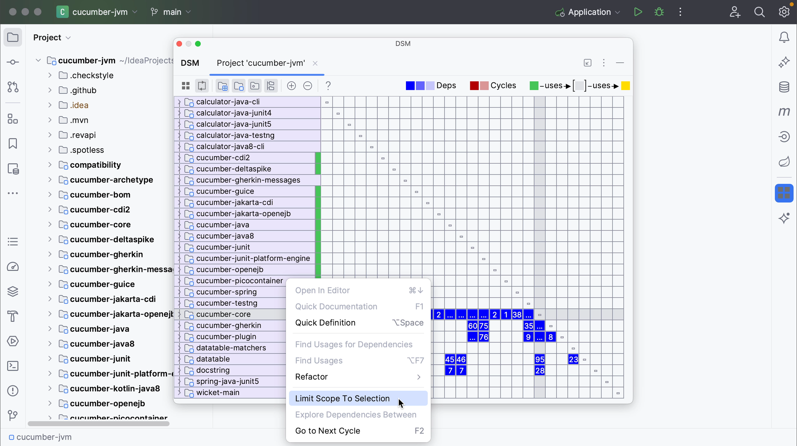

The limited scope will be opened in a new tab in the **DSM tool window**.

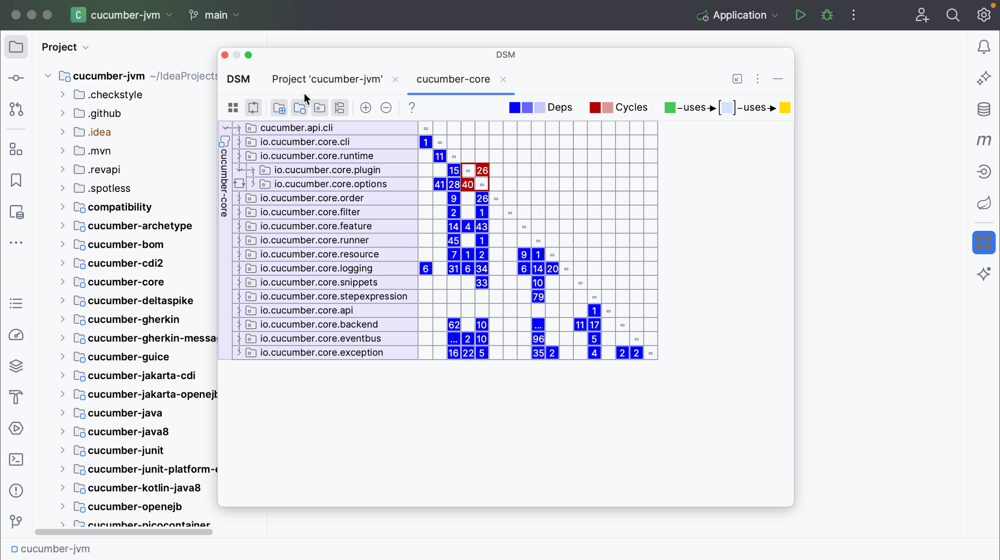

You can limit the view to see only selected dependencies. In the **DSM tool window**, right-click the cell representing the dependency you’re interested in and select **Explore Dependencies Between**.

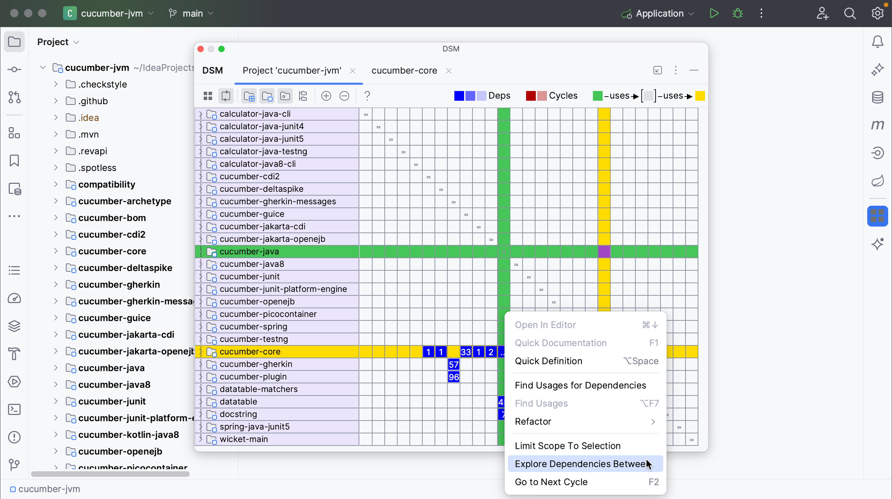

The classes that produce these dependencies will be opened in a new tab in the _DSM_ tool window. In contrast to the **Limit Scope** option, only classes which produce selected dependencies are left.

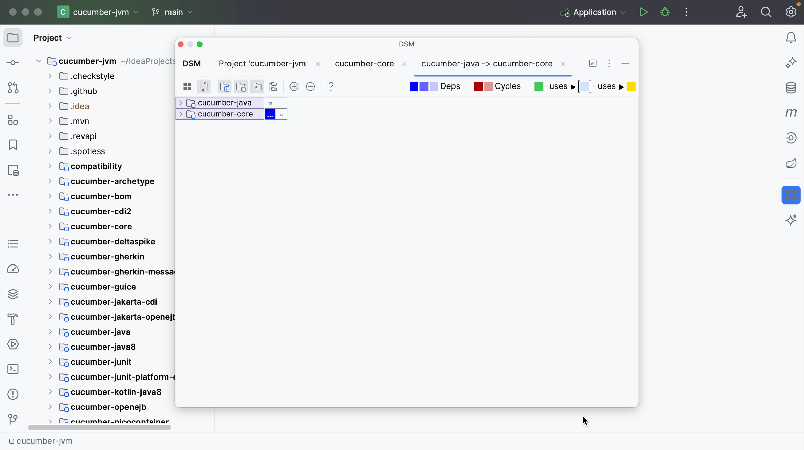

Another way to open the Dependency Matrix, with the option to select a specific scope, is from the _Project_ tool window <kbd>⌘1</kbd> (macOS) / <kbd>Alt+1</kbd> (Windows/Linux). Right-click an item in the _Project_ tool window and select **Analyze | Analyze Dependency Matrix**.

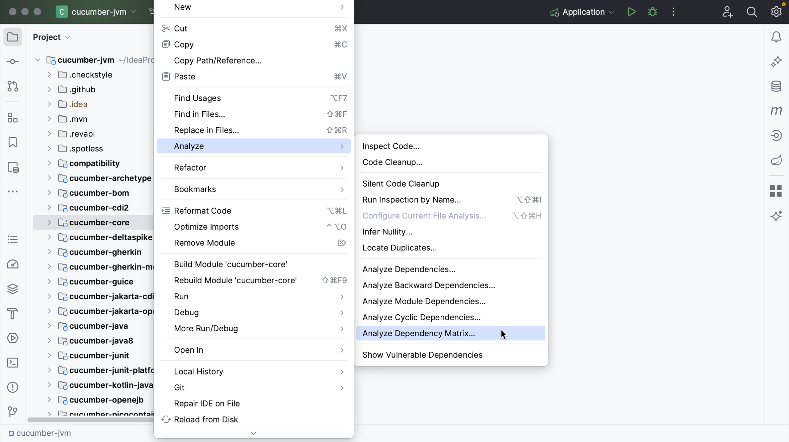

Notice how you can now select the module or directory as scope for the Dependency Matrix, in addition to the whole project or a custom scope.

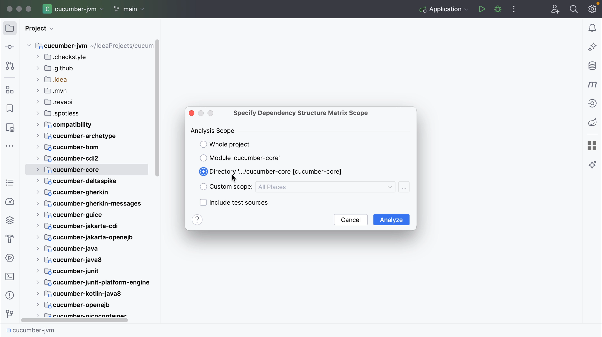

## Navigate to relevant code

We can also navigate to the relevant code from the Dependency Matrix. To select a specific dependency for further source-code analysis, right-click the dependency you are interested in in the _DSM_ tool window, and select **Find Usages for Dependencies**.

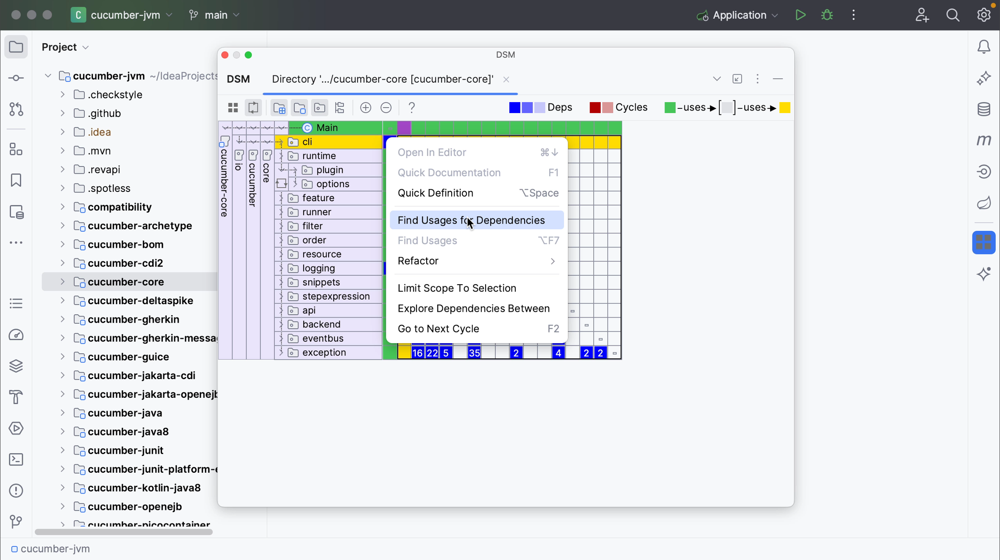

The **Find tool window** will open, showing the usages of the selected dependency. Close the _DSM_ tool window to look at the results and explore the code you’re interested in. We can open the relevant code by double-clicking it in the **Find tool window** <kbd>⌘3</kbd> (macOS) / <kbd>Alt+3</kbd> (Windows/Linux).

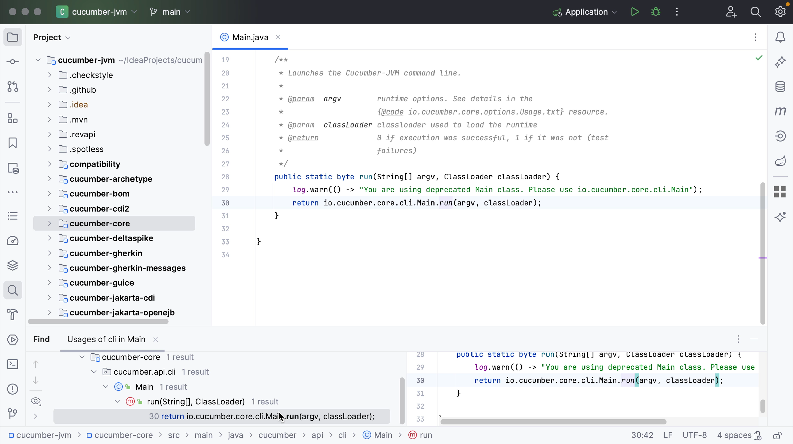

You can reopen the window again from the main menu by going to **View | Tool Windows | DSM**.

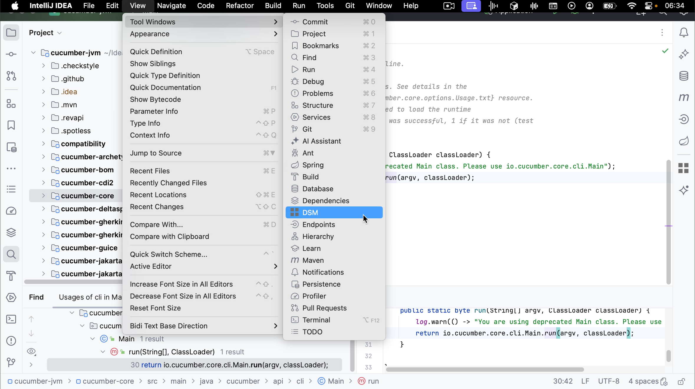

And remember that all windows can be opened from Recent Files <kbd>⌘E</kbd> (macOS) / <kbd>Ctrl+E</kbd> (Windows/Linux) as well.

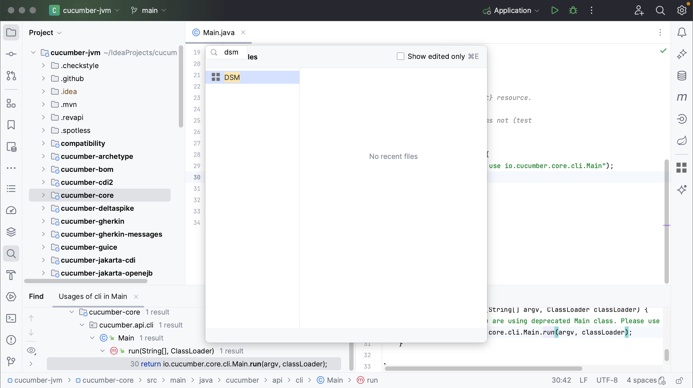

## Cyclic dependencies

Remember from the legend that mutual or cyclic dependencies are shown in red. This means that two components depend on each other.

In a large application with multiple cyclic dependencies, you don’t need to expand all the nodes one by one to find all the cyclic dependencies. You can press <kbd>⌘F2</kbd> (macOS) / <kbd>Ctrl+F2</kbd> (Windows/Linux) or select **Go to Next Cycle** from the context menu to quickly jump to the next cycle.

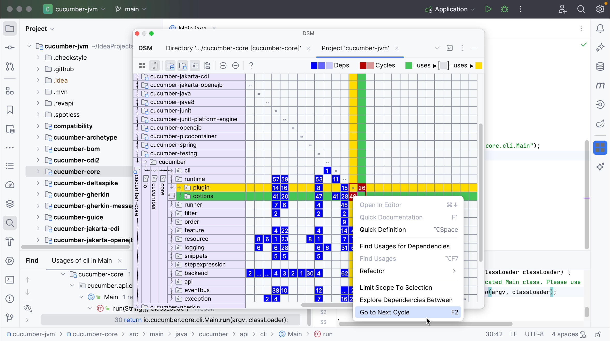
