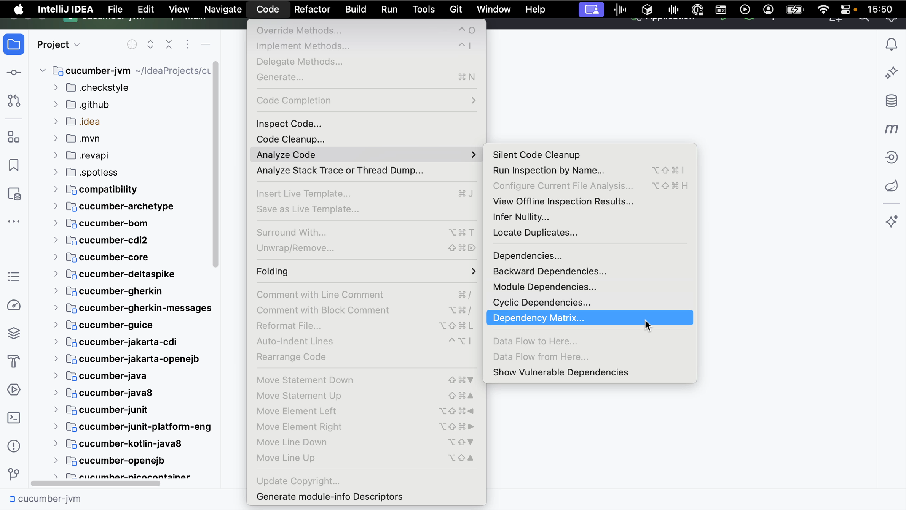
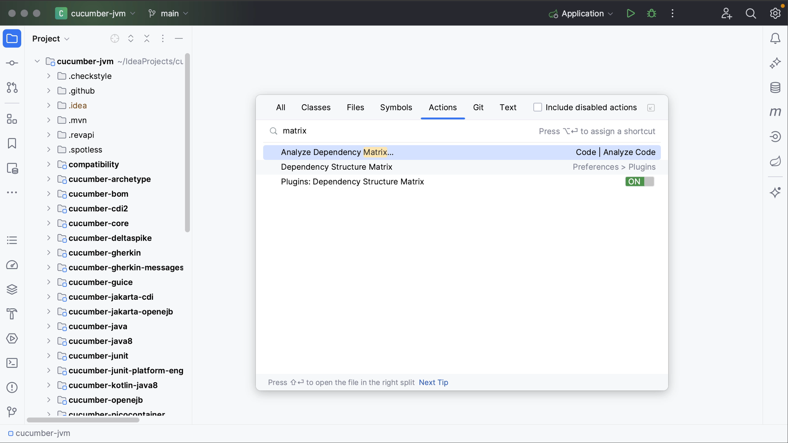
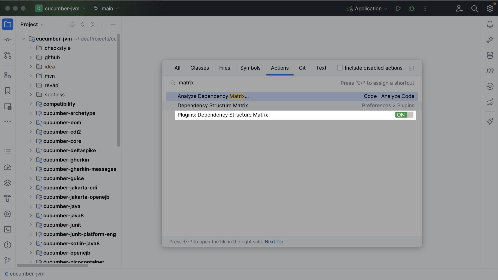
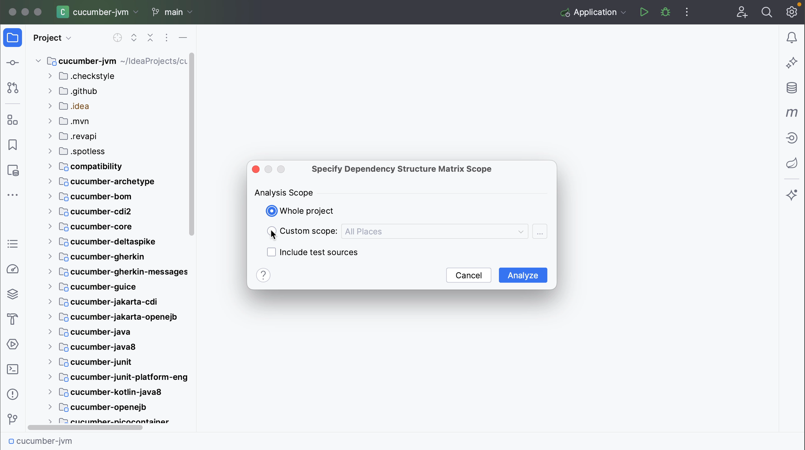

You can open the Dependency Matrix from the main menu by going to **Code | Analyze Code | Dependency Matrix**.

Alternatively, use Find Action <kbd>⌘⇧A</kbd> (macOS) / <kbd>Ctrl+Shift+A</kbd> (Windows/Linux) and search for “matrix”.

To use this feature, the _Dependency Matrix plugin_ needs to be enabled.

When opening the Dependency Matrix, specify the scope you want to analyze. You can select the _Whole project_ or specify a _Custom scope_, and whether to include test sources or not.

After defining the scope, click **Analyze**.

If the project’s class files are out of date, the analysis may result in incomplete or incorrect data. To avoid this, IntelliJ IDEA will prompt you to compile the project before continuing the DSM analysis. Click **Yes** to build the project and make sure everything is up-to-date.

The _DSM_ tool window will open in a popup, showing a matrix of your project’s components.
