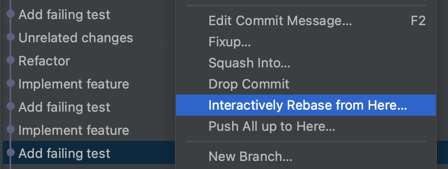
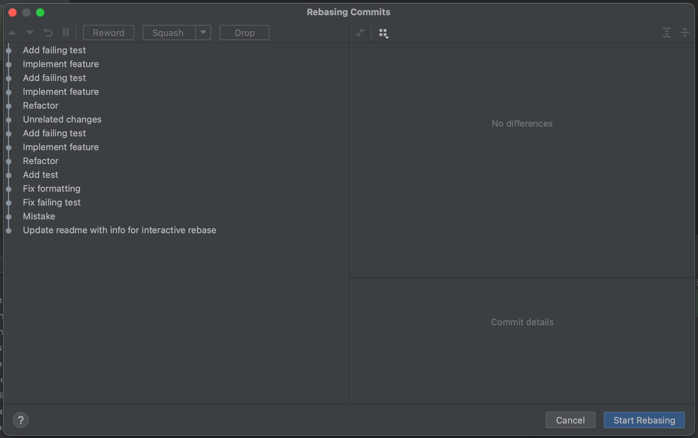
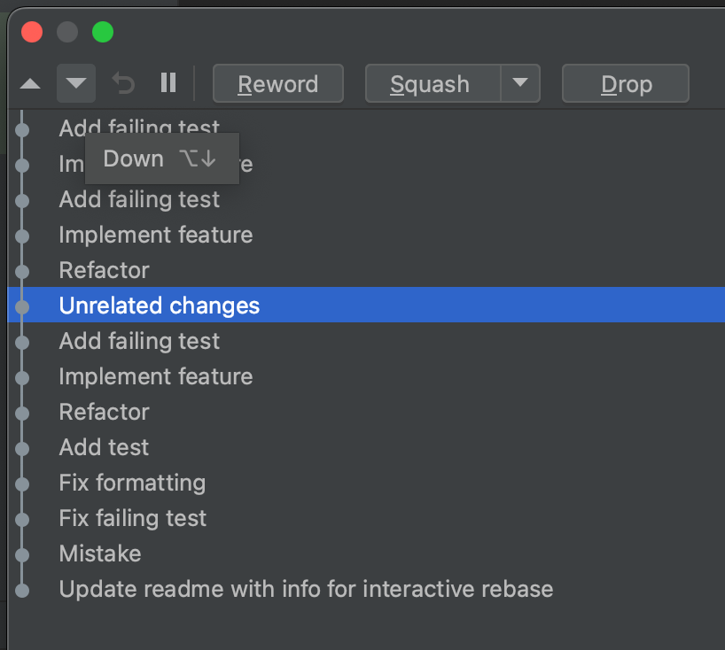
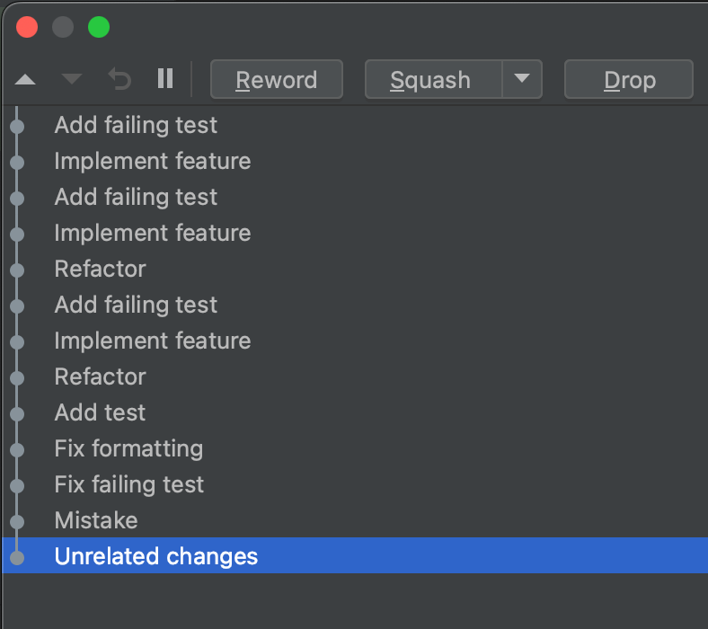
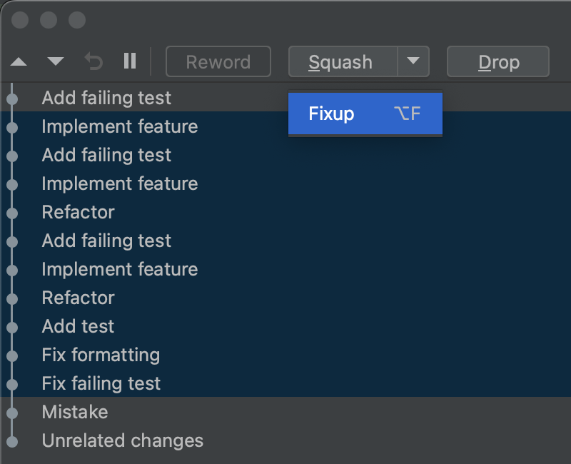
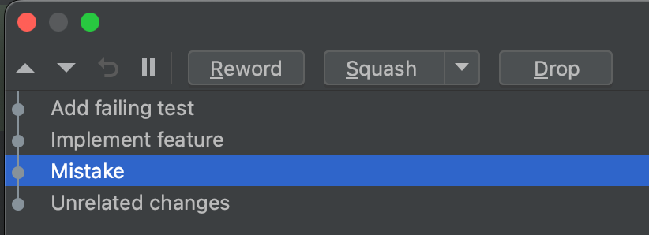
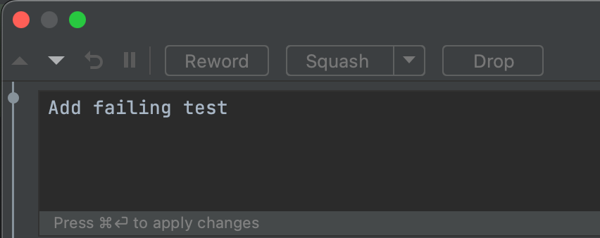
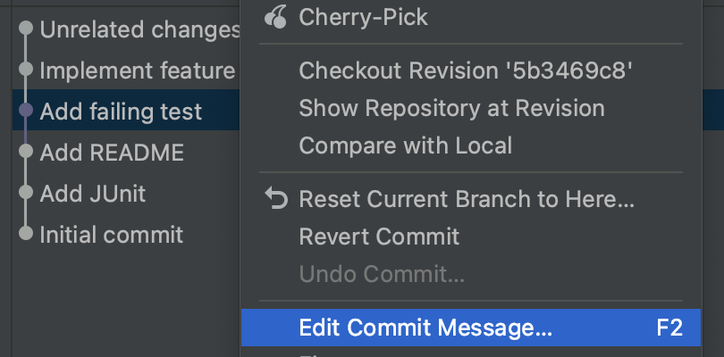
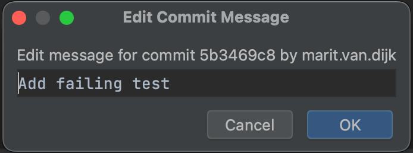

We can use Git Interactive Rebase in IntelliJ IDEA as follows:

In the Git history, identify the commit from where you want to clean up your history. That will be the oldest commit in the series of commits you want to clean up; in this example, the first failing test that we added.

Right-click on the commit from where you want to clean up your history and select "**Interactively Rebase from Here...**".

This will open the "**Rebasing Commits**" popup window with a list of the commits that were done on top of the selected commit.

Notice there are several options at the top of this popup, that become active when we select one or more of the commits:

- **Reword** allows us to change the commit message of a specific commit.
- The **Squash** button is actually a dropdown that allows us to choose between **Squash** and **Fixup**. Both options will combine the changes made in the selected commits into one commit. If we select squash, by default the individual commit messages will be combined. If we select fixup, the commit message of the fixup commit will be discarded. You can select fixup while in the "**Rebasing Commits**" popup with <kbd>⌥F</kbd> (macOS) / <kbd>Alt+F</kbd> (Windows/Linux).
- **Drop** allows us to drop one or more commits.

# Changing the order of the commits

Let's say we want to change the order of the commits; we want to keep the unrelated change, but separately from the changes for the new feature. We can select this commit and use the up and down buttons on the top left to change where in the order this commit will be.

Once we're sure about the order, select "**Start Rebasing**". We see in the Git log that the order of the commits has changed.

# Combining multiple commits into one commit

Next, we want to combine multiple commits where we added the tests and implemented the new feature. Let's reopen the "**Rebasing Commits**" window and select those commits.

Now, because we want to combine those commits into one commit with one commit message we select "**Fixup**", and then select "**Start Rebasing**".

In the Git log, we can see that multiple individual commits are now combined into one commit with one commit message.

# Drop a commit

Finally, we want to drop the commit with a mistake that we made. Let's reopen the "**Rebasing Commits**" window, select the mistaken commit, select "**Drop**" and select "**Start Rebasing**".

We see in the Git log that the commit is dropped.

# Rename a commit

Now that we have cleaned up our commit history, we might want to rename the commit where we added the new feature. We have several options to do so.

We can do so using Git interactive rebase, in the "**Rebasing Commits**" popup, by selecting the commit you want to rename and clicking the "**Reword**" button at the top of the popup. This will open a small editor pane where you can reword the commit message for this commit, apply the change to the message and select "**Start Rebasing**".

You can also edit the commit message directly in the Git log window. Right-click the commit you want to rename and select "**Edit Commit Message**" or press <kbd>F2</kbd> (macOS) / <kbd>F2</kbd> (Windows/Linux).

This will open a "**Edit Commit Message**" popup, where you can edit the commit message and click **OK** (or **Cancel**) when you are done.

# Conclusion

Now we know how to clean up our commit history with Git interactive rebase in the IntelliJ IDEA UI.

To see which Git commands IntelliJ IDEA performed, open the "Console" tab in the Git window.

Note that we can also combine several of these actions before we start rebasing. In this tutorial, we have chosen to do them one by one, for clarity.
