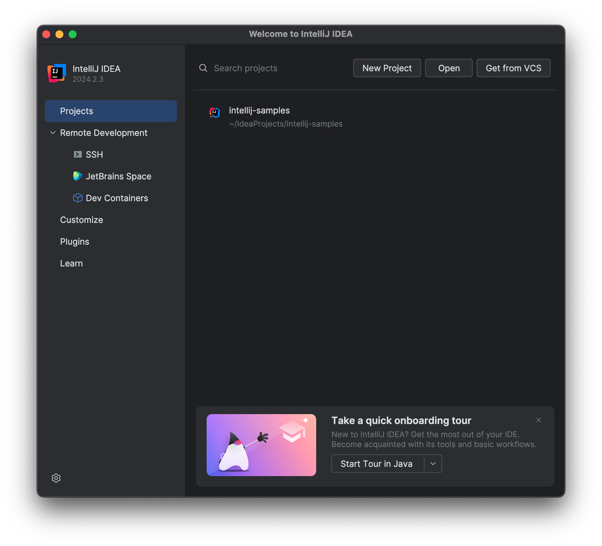
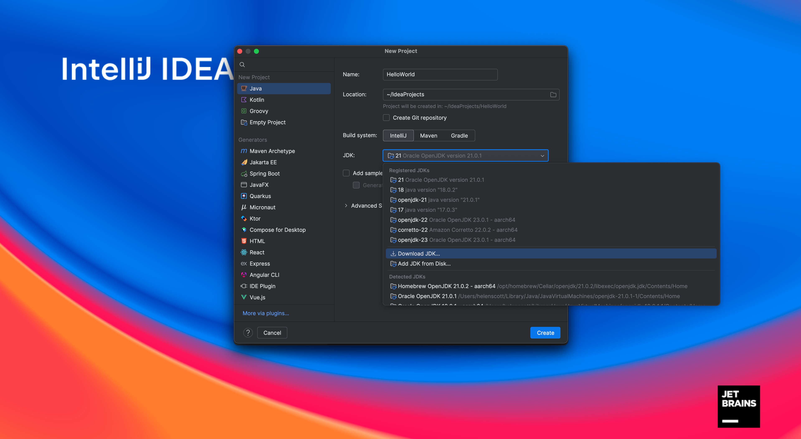

In this walk-through, you will create, run and package a simple Java application that prints "Hello World" to the system output. You will also see some IntelliJ IDEA features that can boost your productivity, for example, coding assistance and supplementary tools. All the features in this tutorial are available in both IntelliJ IDEA Community edition and IntelliJ IDEA Ultimate.

**The link to the relevant portion of the video is available in each tutorial step at the bottom.**

1. You can use the [New Project Wizard](https://www.jetbrains.com/help/idea/creating-and-running-your-first-java-application.html) to create a new Project inside IntelliJ IDEA. From the Welcome screen you can click **New Project**, or, if you're already inside a project, you can go to **File | New | Project**.

If you haven't opened a project before, the **New Project** option is in the Welcome screen:

If you have previously opened a project, the **New Project** button will be on the top bar.

2. You need to create a Java project which is selected by default. You also need to select a JDK for compiling this project from the Project SDK drop-down:

IntelliJ IDEA will show you a list of configured JDKs at the top of the list as well as a list of JDKs it's detected on your machine at the bottom of the list. You can select any of these, or you can click **Download JDK**.

Java is packaged and provided by a number of different vendors. This list shows some of the most common ones. OpenJDK is Oracle's free, open JDK build, which will always be the latest version. If you pick another vendor, for example, Adopt OpenJDK, you will see all the available versions for that vendor.

This tutorial doesn't need the latest version of Java, so feel free to select the one you're most comfortable with. Finally, if you want to use a JDK that's on your machine, but hasn't been detected by IntelliJ IDEA, you can press **Add JDK** to browse to it.

The IDE will spend a bit of time downloading and installing the Java Development Kit if you opted to download a JDK. You don't need to do any additional configuration once it's downloaded, IntelliJ IDEA handles that for you.

3. You don't need any additional libraries or frameworks for this tutorial so press **Next**

4. You could create a project from a template, but we're going to do everything from scratch for this tutorial, so press **Next**.

   

5. You need to give your project a name. We recommend _HelloWorld_. You could change the default project location if you want to, but the default is fine for this tutorial.

   

6. Press **Finish** so IntelliJ IDEA can create your project.

---
