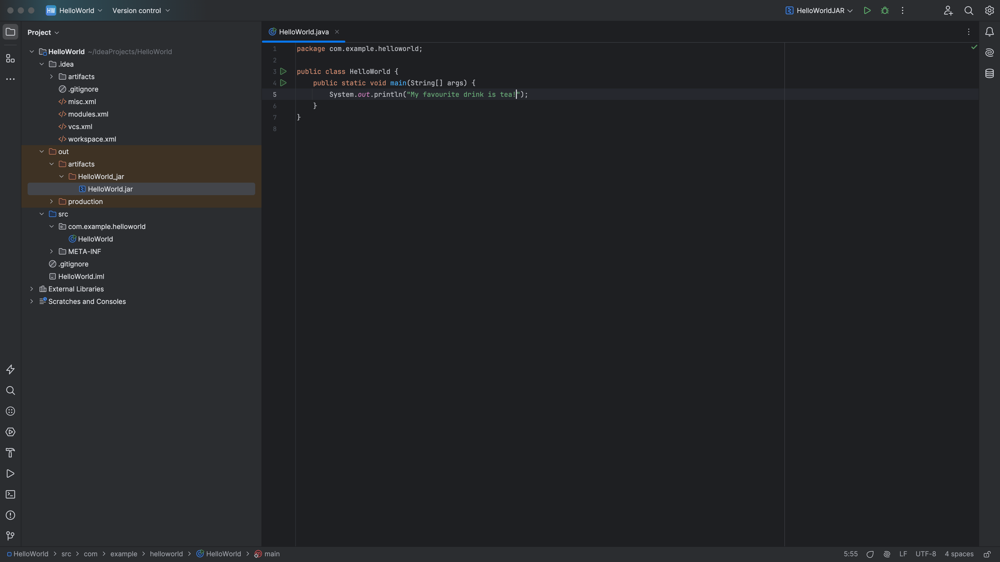
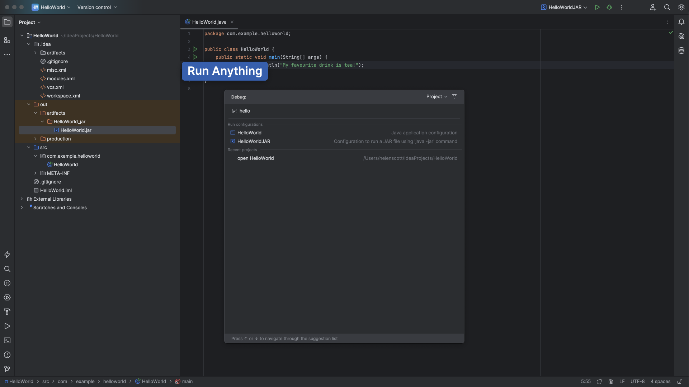
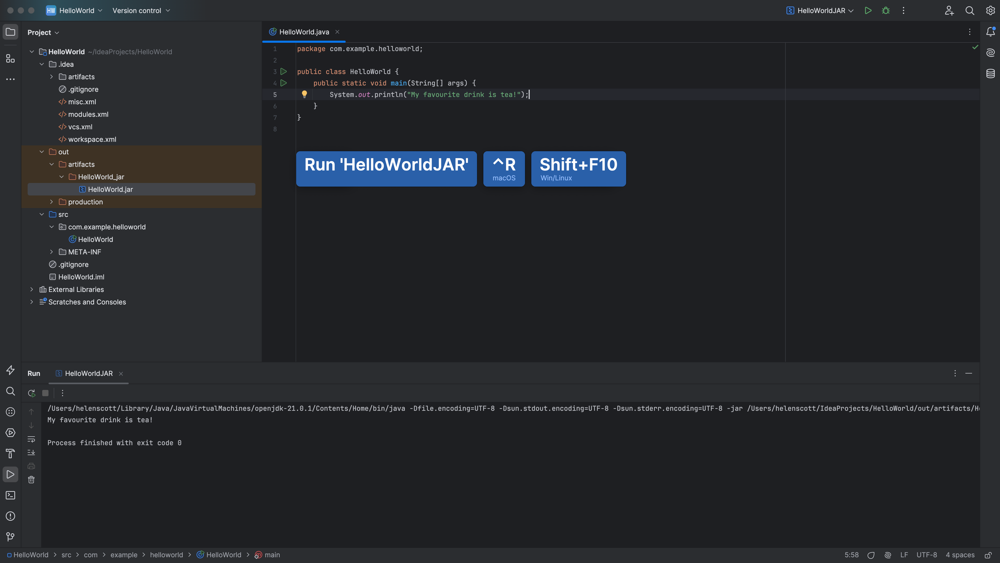

Let's go ahead and make a change to the Java file and see if you get a new message printed out when you run your _HelloWorld JAR_ configuration again.

1. In your `HelloWorld.java` class, change the string from "Hello World" to something of your choice.

2. Instead of clicking on the arrow next to the _HelloWorld JAR_ run configuration, you can press <kbd>⌃⌃</kbd> (macOS) / <kbd>Ctrl+Ctrl</kbd> (Windows/Linux) to display the [Run Anything](https://www.jetbrains.com/help/idea/running-anything.html) dialog. Start typing in _HelloWorld and you will see both your run configurations. Select_HelloWorld JAR_ and press <kbd>⏎</kbd> (macOS) / <kbd>Enter</kbd> (Windows/Linux).

3. Select your _HelloWorld JAR_ file and press <kbd>⏎</kbd> (macOS) / <kbd>Enter</kbd> (Windows/Linux). In your [Run window](https://www.jetbrains.com/help/idea/run-tool-window.html) you should see that IntelliJ IDEA has run your application and printed out your new string. This means it rebuilt the JAR file prior to running the application.

You can also scroll to the right of your run window to check which run configuration IntelliJ IDEA used if you want to. Let's summarise what we've learned in the final step of this tutorial.
