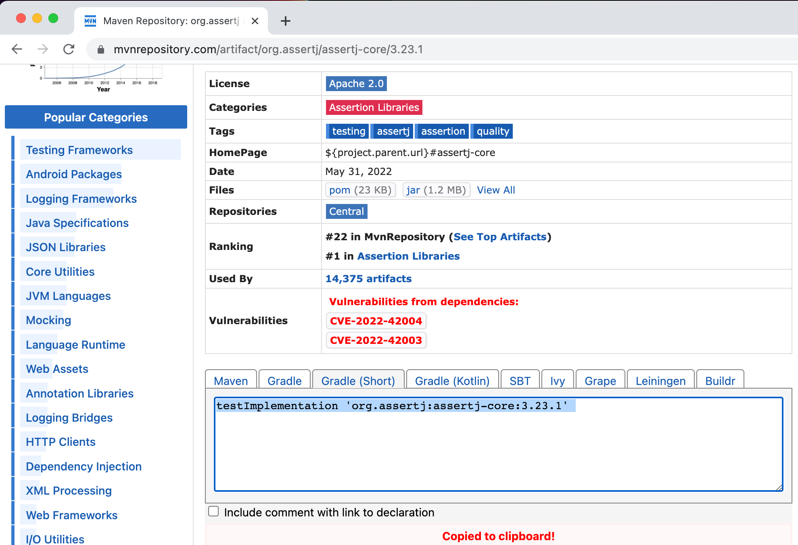
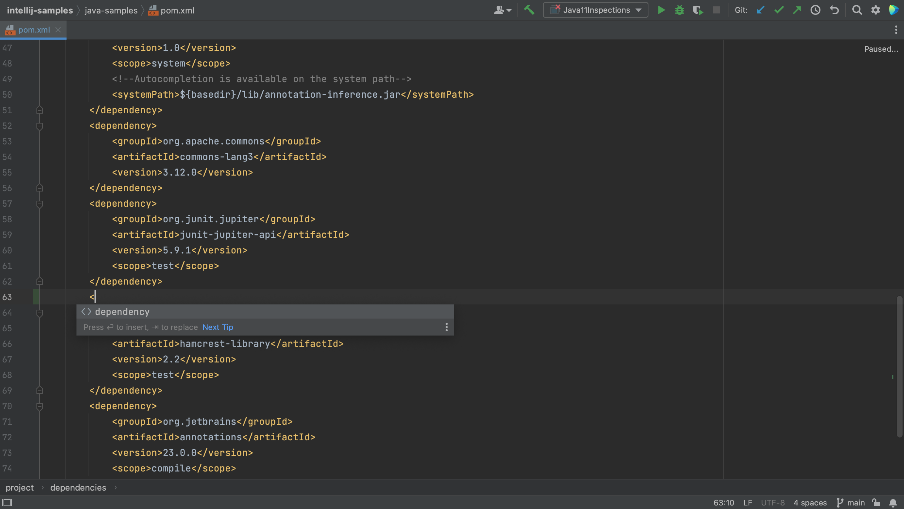

There are several ways to add new dependencies to your project.

## From the build file using copy-paste

You have probably copied a dependency from [Maven Repository](https://mvnrepository.com/) (or another website) and pasted into your build file.

For example, we can copy the Gradle format for this dependency and paste it into our build.gradle file.

Or, if we are using Maven, we can copy the Maven xml format into our pom.xml.

Did you know that if you copy-paste a Maven XML dependency into your build.gradle file, IntelliJ IDEA automatically turns it into the correct format for Gradle?

## From the build file using code completion

We can also add dependencies to our build file using code completion. For example, let's add a new dependency to our pom.xml.

We see that IntelliJ IDEA autocompletes the dependency xml, and we can search for the dependency we want, in this example AssertJ. If needed, the version number will also be added. Since this is a test dependency, we need to add the test scope, still using code completion.

Code completion works in Gradle too, as you can see below.

## From the build file using code generation

We can also use code generation from the build file to add dependencies. In the build file, the pom.xml in a Maven project, invoke Package Search using **⌘N** (on macOS) or **Alt+Insert** (on Windows & Linux) and in the menu that opens, select **Add dependency**. This will open the **Dependencies tool window**.

Note that if we are using Gradle, we can do the same in our build.gradle file.

**Note:** If you cannot invoke Package Search, make sure the [Package Search](https://plugins.jetbrains.com/plugin/12507-package-search) plugin is installed. To do so, open **Preferences**
<kbd>⌘,</kbd> (macOS) / <kbd>Ctrl+Alt+S</kbd> (Windows/Linux), go to **Plugins** and check to see whether the Package Search plugin is installed. If not, go to the **Marketplace** tab to install it.
