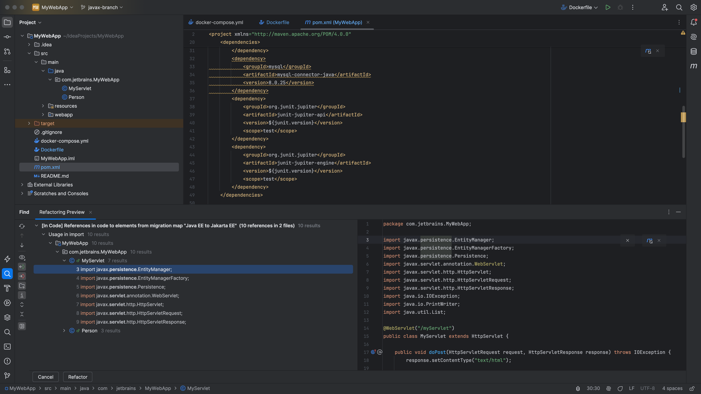

One common question you might have at this stage is "why don't I just do a find and replace for `javax` to `jakarta`?" The answer is that not all `javax` packages have been migrated to the `jakarta` namespace. For example, `javax.transaction.xa` package is not using Jakarta.

We're going to use IntelliJ IDEA's migration tool which was introduced in IntelliJ IDEA 2021.2 for the next steps. From the menu, navigate to **Refactor** > **Migrate Packages and Classes** > **Java EE to Jakarta EE.**

You can select the scope here, for example _MyWebApp_. This also allows you to go module by module if you’re working with a larger, more realistic application. Press **Run** to get a preview of the refactorings.

Press **Do Refactor**. Your Java classes should be fixed now and not showing any errors. Now let's rebuild our application with <kbd>⌘F9</kbd> (macOS) / <kbd>Ctrl+F9</kbd> (Windows/Linux) and then run it with <kbd>⌃R</kbd> (macOS) / <kbd>Shift+F10</kbd> (Windows/Linux).

Now you should be able to navigate to `localhost:8080/MyWebApp` again and see the application running once more without any errors.
