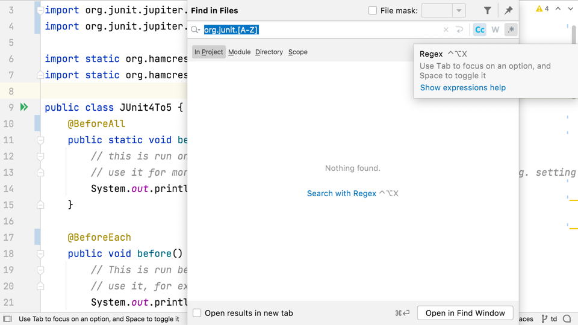
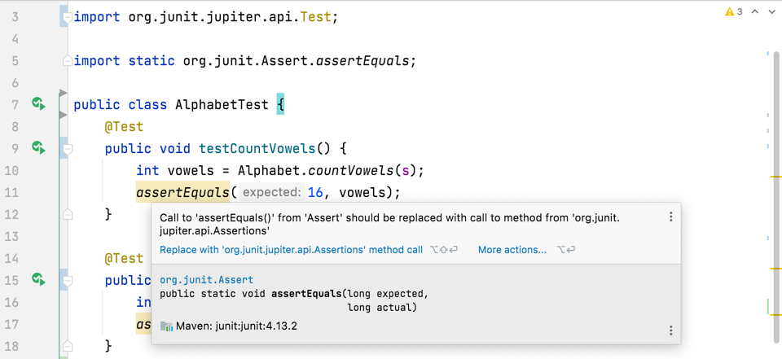

To finish removing references to JUnit 4 classes, we could do [Find in Files](https://www.jetbrains.com/help/idea/finding-and-replacing-text-in-project.html) search for `org.junit`. This will show up everything, including our new Jupiter classes. We could try an expression to capture that the next character after the dot needs to be an upper case letter: `org.JUnit.[A-Z]`. This is a regular expression, we need to toggle the case-sensitive option, and we need to make sure we specify searching [with a regular expression](https://www.jetbrains.com/help/idea/finding-and-replacing-text-in-project.html#limit_search).

Now we can see all the remaining files that import a class from `org.junit`.

There are lots of ways we could fix this, one option is to simply remove the old import, use the new JUnit 5 `Assertions` class, and add a static import for the `assertEquals` method, so it can be used by all tests in the class.

Some problems can be fixed with an inspection. If we turn on "Obsolete assertions in JUnit 5 tests" we can get IntelliJ IDEA to suggest using the new JUnit 5 assertions. When we go to the editor, we have a warning on the old assert statement, and we can get IntelliJ IDEA to automatically use the new JUnit 5 Assertions instead.

IntelliJ IDEA does have inspections and automatic fixes to help migrate code from JUnit 4 to JUnit 5, but if there isn't a specific fix, we might take another approach, like doing a find and replace, or a [Structural Search](https://www.jetbrains.com/help/idea/structural-search-and-replace.html), which might be more appropriate if there are a lot of files to change but the changes are all the same. We could use [Live Templates](https://youtu.be/ffBeoE6NBSs) for common code, and we could configure our auto import settings to make sure the new JUnit imports are suggested over the old ones. The right solution will depend upon what sort of changes need to be made and how many files are affected.
