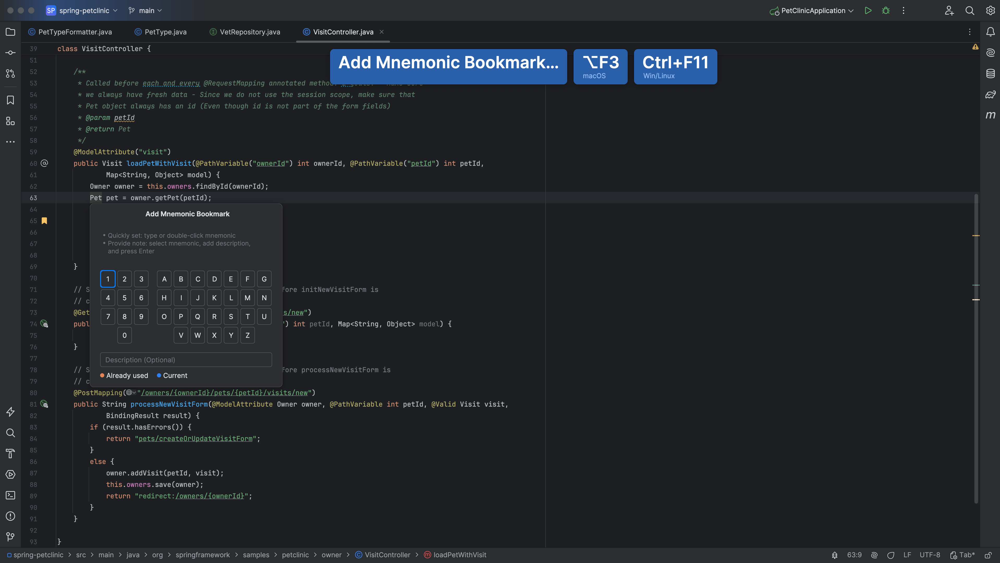
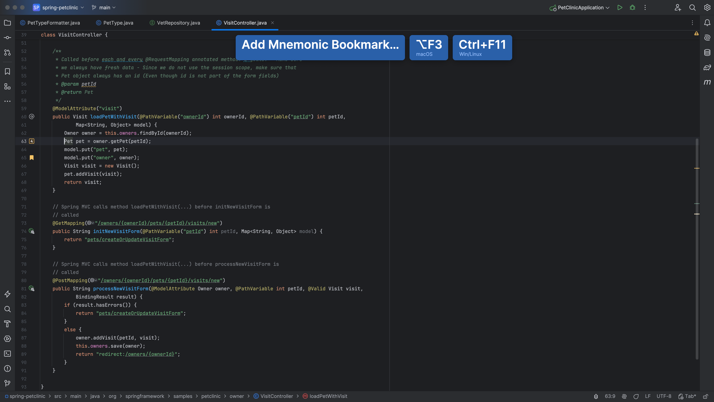
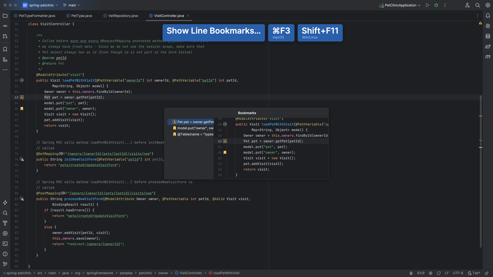

Another way to navigate through code, is to use bookmarks. Press <kbd>F3</kbd> (macOS) / <kbd>F11</kbd> (Windows/Linux) to create an anonymous line bookmark.

To add a mnemonic line bookmark, press <kbd>⌥F3</kbd> (macOS) / <kbd>Ctrl+F11</kbd> (Windows/Linux). In the popup that opens, select a number or a letter that you want to use as an identifier for this bookmark. <kbd>⏎</kbd> (macOS) / <kbd>Enter</kbd> (VS Windows/Linux) to save the bookmark. To bookmark files, packages, folders, and modules, right-click the item you want to bookmark in the _Project_ tool window, and add an anonymous bookmark <kbd>F3</kbd> (macOS) / <kbd>F11</kbd> (Windows/Linux), or a mnemonic bookmark <kbd>⌥F3</kbd> (macOS) / <kbd>Ctrl+F11</kbd> (Windows/Linux).

There are several ways to navigate between bookmarks. Press <kbd>⌘F3</kbd> (macOS) / <kbd>Ctrl+Shift+F11</kbd> (Windows/Linux) to open a popup showing bookmarks and select the desired bookmark with the keyboard and press <kbd>⏎</kbd> (macOS) / <kbd>Enter</kbd> (Windows/Linux), or select the corresponding digit or letter for a mnemonic bookmark.

To jump straight to a mnemonic bookmark, <kbd>^+mnemonic</kbd> / <kbd>Ctrl+mnemonic</kbd>.
