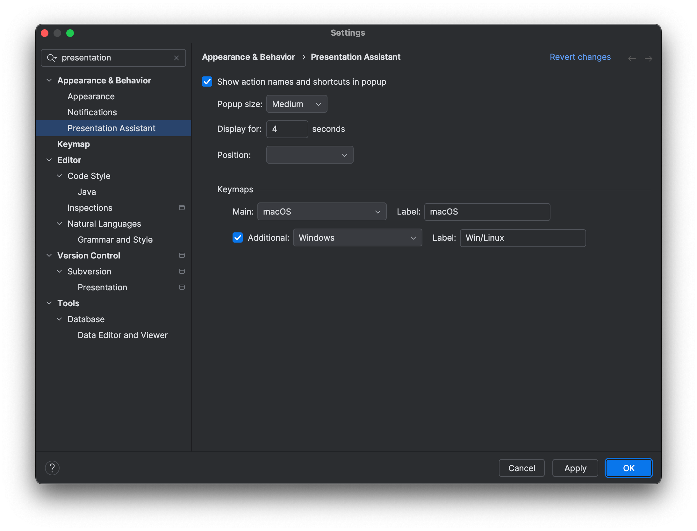

Our first tip is to use the Presentation Assistant plugin. The Presentation Assistant plugin will show which shortcuts are being used.

To install the plugin, open **Preferences** using <kbd>⌘,</kbd> (macOS) / <kbd>Ctrl+Alt+S</kbd> (Windows/Linux). Go to Plugins and search for "Presentation assistant" on the Marketplace tab. Click **Install** and when it's done, click **OK** to apply the changes and close the dialog or click **Apply** to keep the dialog open.

To configure the Presentation Assistant plugin, go back to **Preferences** and go to **Appearance & Behavior > Presentation Assistant**.

Here we can configure font size, duration, alignment, and which keymaps to show. We are using macOS, with Windows as the alternative keymap. We have also configured the Presentation Assistant plugin to show the shortcuts at the top of the screen.
