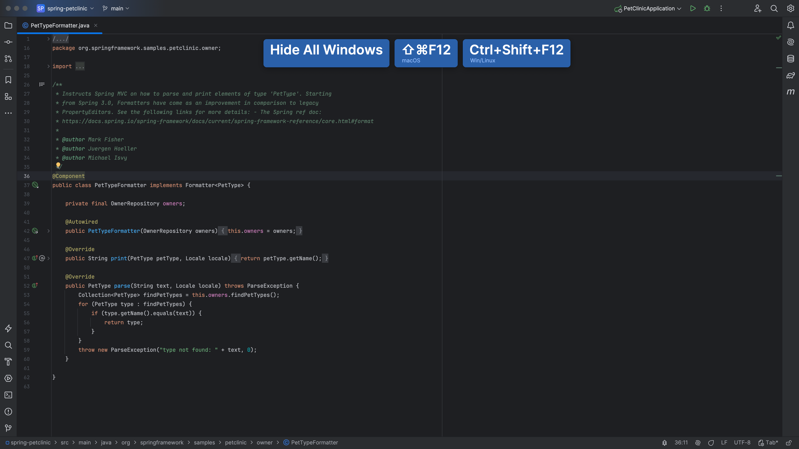

We recommend closing all unused windows so we can focus on the code we're looking at. Use **Command + Shift + F12** (on Mac) or **Control+Shift+F12** (on Windows/Linux) to hide all tool windows.

We can always reopen them using shortcuts. Here are the shortcuts to some of the most used windows:

- To open or close the **Project Tool Window** use **⌘1** (on Mac) or **Alt+1** (on Windows/Linux)
- To open or close the **Commit Tool Window** use **⌘0** (on Mac) or **Alt+0** (on Windows/Linux)
- To open or close the **Terminal Tool Window** use **Alt+F12**
- To open or close the **Git Tool Window** use **⌘9**( on Mac) or **Alt+4** (on Windows/Linux)
- To open or close the **Run Tool Window** use **⌘4**( on Mac) or **Alt+4** (on Windows/Linux)
- To open or close the **Debug Tool Window** use **⌘5**( on Mac) or **Alt+5** (on Windows/Linux)

You can also use keyboard shortcuts to stretch the active window. Go to the relevant window, and use **⌃ ⌥ ←** or **⌃ ⌥ →** (on Mac) or **Control+Alt+Shift+Left** or **Control+Alt+Shift+Right** (on Windows/Linux) to stretch the window left or right. This also works with the tool windows at the bottom, using the up or down arrows to stretch the window up or down.
