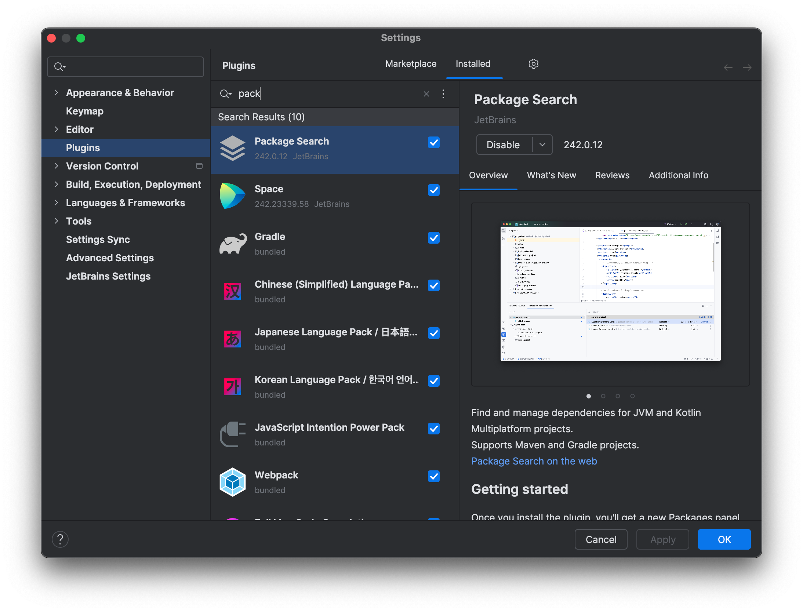
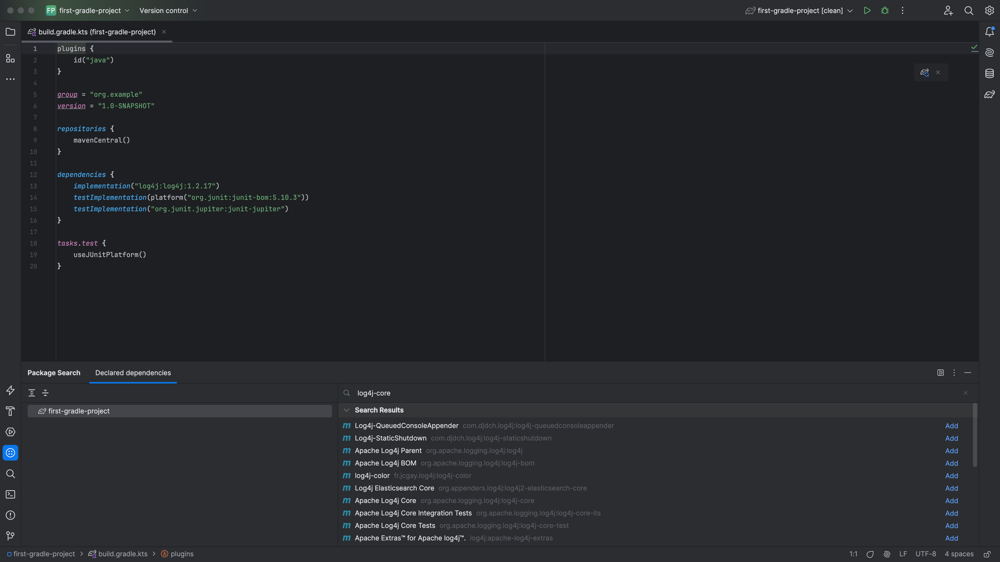
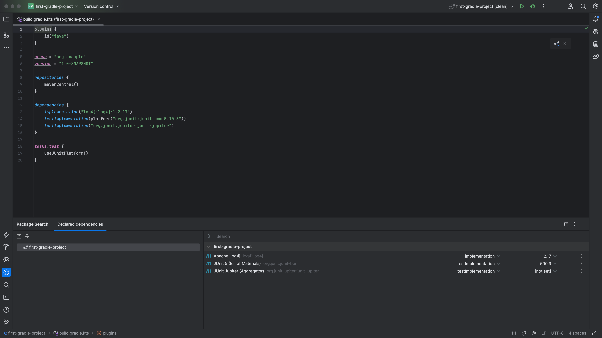
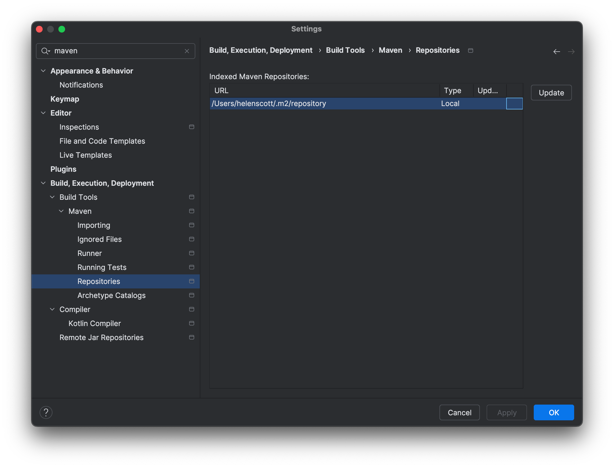

Let's look at Gradle dependencies in a bit more detail. We can add a new dependency upon an external library using the Package Search tool window. First, check that the Package Search tool window is enabled by going to your Settings with <kbd>⌘,</kbd> (macOS) / <kbd>Ctrl+Alt+S</kbd> (Windows/Linux) and then selecting Plugins from the menu on the left. Search for "package search" and if it's not already installed, install it.



Select the Package Search tool window from the toolbar windows on the left and search for your dependency. We can type the name, or full path, of the artifact we're trying to add, and IntelliJ IDEA will give a list of possible matches.



We can tab into the list of results and move down to the one we want. We can see all the versions by pressing right arrow on the artifact, although generally we're going to want to select the most recent version.

IntelliJ IDEA will insert the new dependency, usually with the `implementation` configuration:

```kotlin
dependencies {
    implementation("log4j:log4j:1.2.17")
    testImplementation(platform("org.junit:junit-bom:5.10.3"))
    testImplementation("org.junit.jupiter:junit-jupiter")
}
```

We should change this if we need to, for example if this needs to be `testImplementation`. IntelliJ IDEA tells us the build file has been changed, and that we need to reload these changes if we want the project to use them.



We can do this by:

- Selecting one of the suggestions in the message;
- Pressing on the Refresh Gradle icon in the top right,
- Using the keyboard shortcut <kbd>⌘⇧I</kbd> (macOS) / <kbd>Ctrl+Shift+O</kbd> (Windows/Linux).

Once IntelliJ IDEA has reloaded our updated build file with the new dependency, this new dependency will appear in our external libraries in the [project window](https://www.jetbrains.com/help/idea/project-tool-window.html).

Alternatively, we may want to use IntelliJ IDEA's code completion for adding a new dependency. We get code completion in the `build.gradle` file the way we would in all supported file types.

So we could add a new `testImplementation` dependency by starting to type the details. IntelliJ IDEA will even complete the group and artifact name. Try this out, by adding a new dependency on the `junit-jupiter-params` library. Once again you'll need to load these changes, e.g. with <kbd>⌘⇧I</kbd> (macOS) / <kbd>Ctrl+Shift+O</kbd> (Windows/Linux).

### Top Tip

If you find you're not getting code completion for your libraries, or the results you expect in your Maven artifact search, there's a trick to help with that. Open the [Settings/Preferences dialog](https://www.jetbrains.com/help/idea/settings-preferences-dialog.html), go to
[Build, Execution, Deployment | Build Tools | Maven | Repositories](https://www.jetbrains.com/help/idea/maven-repositories.html).



You'll see IntelliJ IDEA has a list of indexed repositories, and the date it was last indexed. Selecting one, or all, of these and pressing "Update" usually helps IntelliJ IDEA to give good suggestions for artifacts.

Next, we'll see how IntelliJ IDEA knows about Gradle source set directories, and how that helps us.
