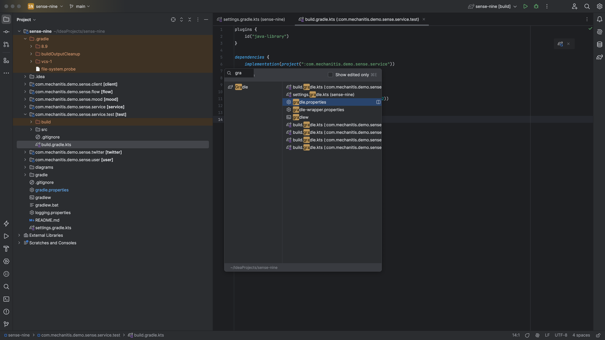
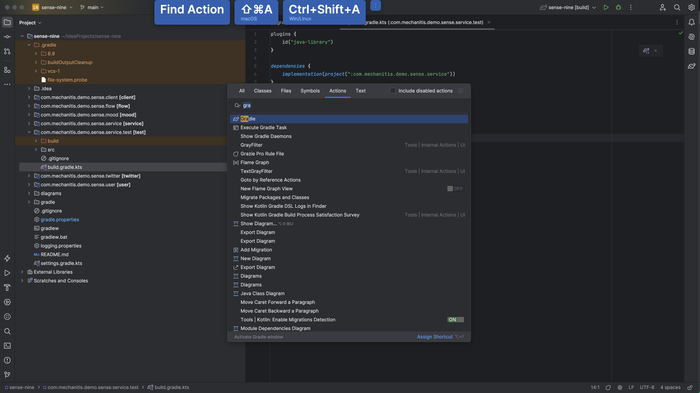
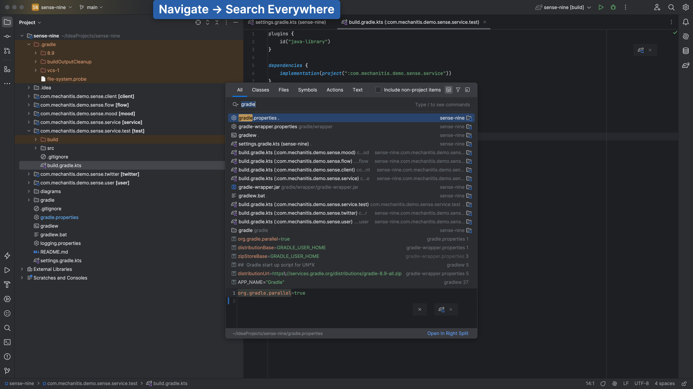

The [Gradle Tool Window](https://www.jetbrains.com/help/idea/jetgradle-tool-window.html) is a very useful way to work with Gradle in IntelliJ IDEA. Let's look at how to get to it.

IntelliJ IDEA usually provides lots of different ways to navigate to something we need. To open the Gradle tool window we can:

Click on the [quick access button](https://www.jetbrains.com/help/idea/tool-windows.html#open) in the bottom left, and click Gradle.

Or, if you have the [Tool Window Bars](https://www.jetbrains.com/help/idea/tool-windows.html#show_hide_tool_window_bars) open already, you can click on the Gradle button in the top right.

The Recent Files dialog, which we can open with <kbd>⌘E</kbd> (macOS) / <kbd>Ctrl+E</kbd> (Windows/Linux), also shows a list of all the tool windows. We can either move down to the Gradle option using the mouse or using the arrow keys, or we can start typing "Gradle" to go straight to it.

We can also use Find Action, <kbd>⌘⇧A</kbd> (macOS) / <kbd>Ctrl+Shift+A</kbd> (Windows/Linux), and type "Gradle".

If we don't like having to remember the shortcut for Find Action, we can use the more versatile [Search Everywhere](https://www.jetbrains.com/help/idea/searching-everywhere.html) by pressing Shift twice: **⇧⇧** (macOS), or **Shift+Shift** (Windows/Linux).

You may have noticed that there are a lot of results when we type "Gradle" into any of the search options. The next step walks through a tip for dealing with this.
