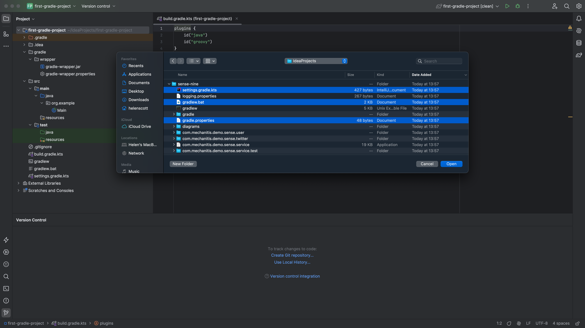
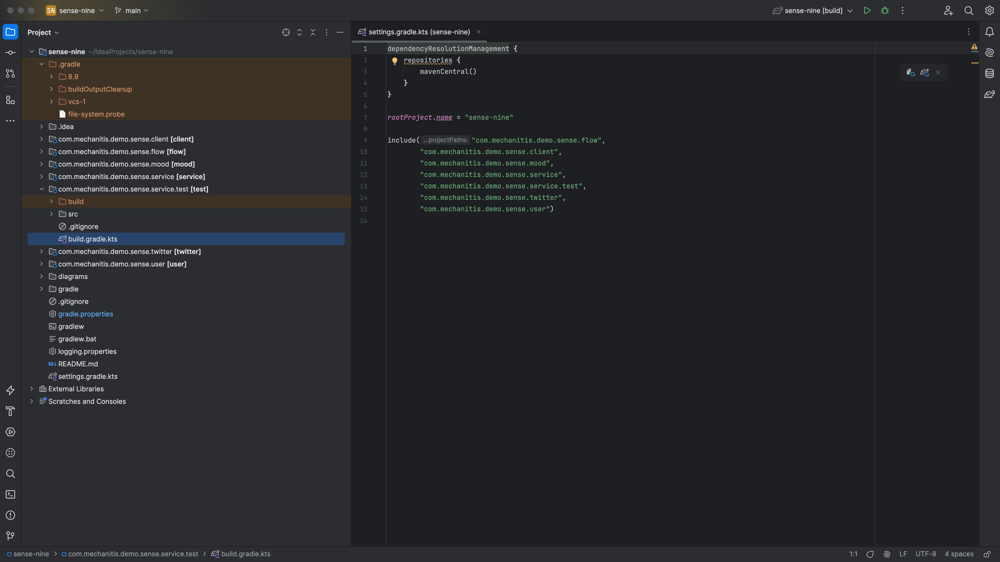
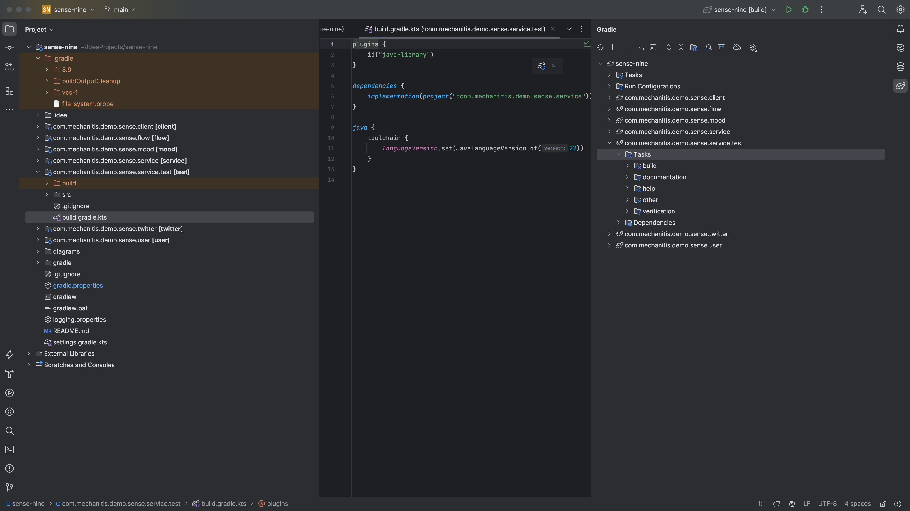
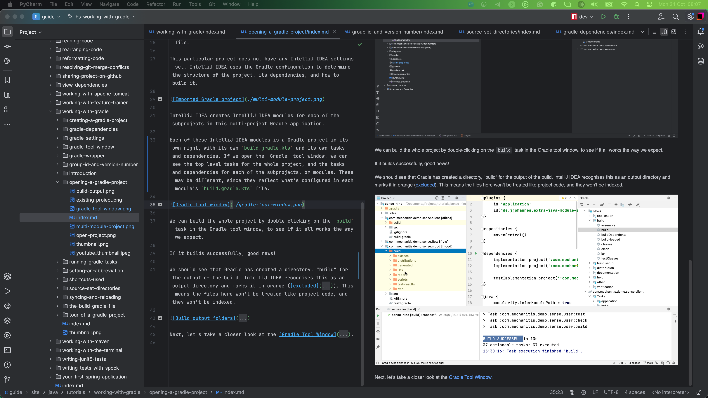

We've covered creating new Gradle projects, let's look at what's probably the more common case, importing existing Gradle projects into IntelliJ IDEA.

In this example, we're going to look at how to open a Gradle project from a local directory, but we could just as easily clone the code from a remote repository, it would work in a similar way.

In the [Welcome Screen](https://www.jetbrains.com/help/idea/new-project-wizard.html) we can select **Open**, and navigate to the location with the project code.

IntelliJ IDEA will look for known build systems in the project, for example Maven and Gradle, or IntelliJ IDEA config files.

This project that I've selected is a multi-module Gradle project, it has the [Gradle Wrapper](https://docs.gradle.org/current/userguide/gradle_wrapper.html) configured:

The `settings.gradle.kts` file states which modules make up the gradle project, and each module contains its own `build.gradle` file.

This particular project does not have any IntelliJ IDEA settings set, IntelliJ IDEA uses the Gradle configuration to determine the structure of the project, its dependencies, and how to build it.

IntelliJ IDEA creates IntelliJ IDEA modules for each of the subprojects in this multi-project Gradle application.

Each of these IntelliJ IDEA modules is a Gradle project in its own right, with its own `build.gradle` and its own tasks and dependencies. If we open the _Gradle_ tool window, we can see the top level tasks for the whole project, and the tasks and dependencies for each of the subprojects, or modules. These may be different, since they reflect what's configured in each module's `build.gradle` file.

We can build the whole project by double-clicking on the `build` task in the Gradle tool window, to see if it all works the way we expect.

If it builds successfully, good news!

We should see that Gradle has created a directory, "build" for the output of the build. IntelliJ IDEA recognises this as an output directory and marks it in orange ([excluded](https://www.jetbrains.com/help/idea/content-roots.html#folder-categories)). This means the files here won't be treated like project code, and they won't be indexed.

Next, let's take a closer look at the [Gradle Tool Window](https://www.jetbrains.com/help/idea/jetgradle-tool-window.html).
